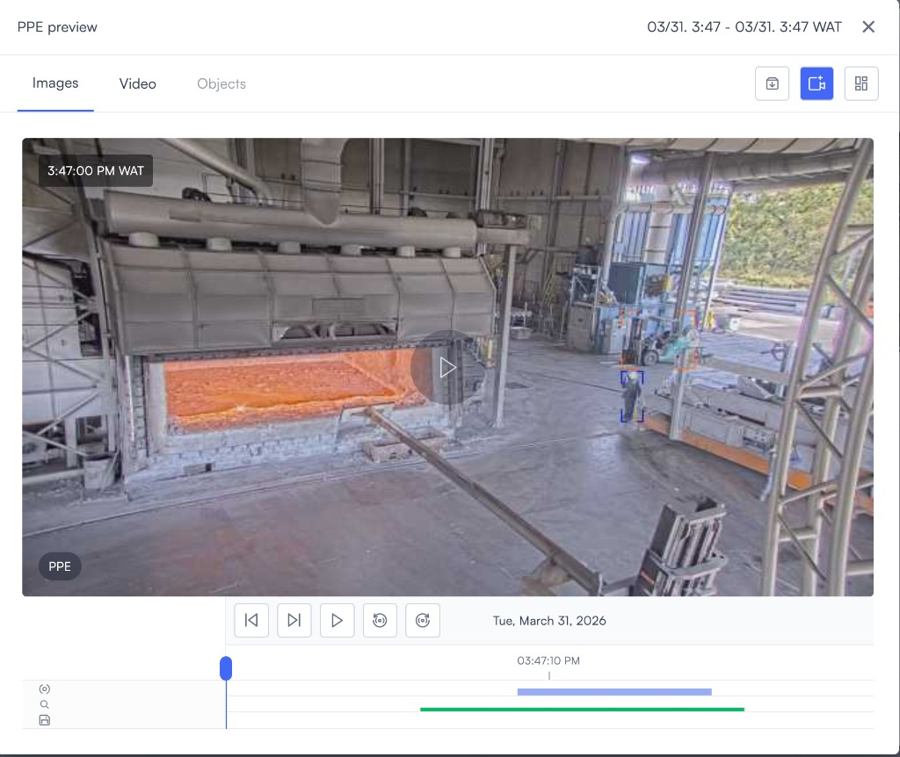
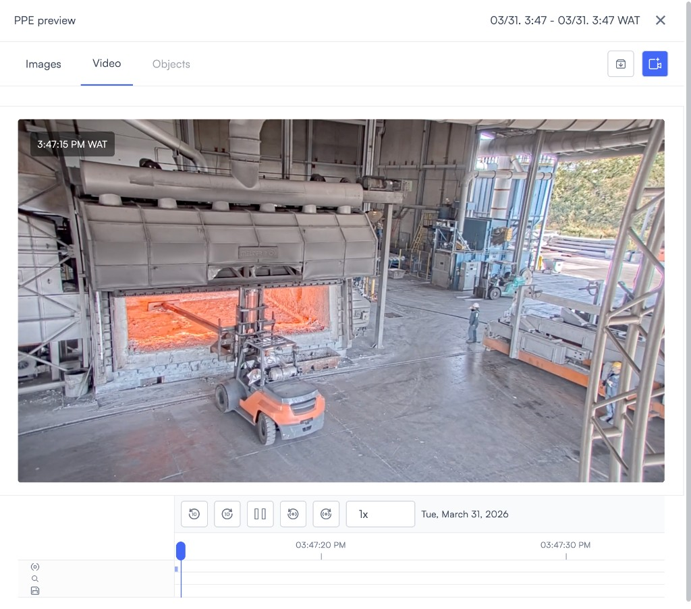
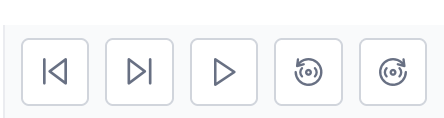
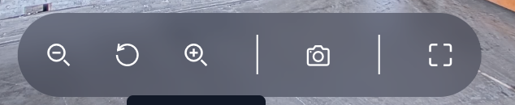
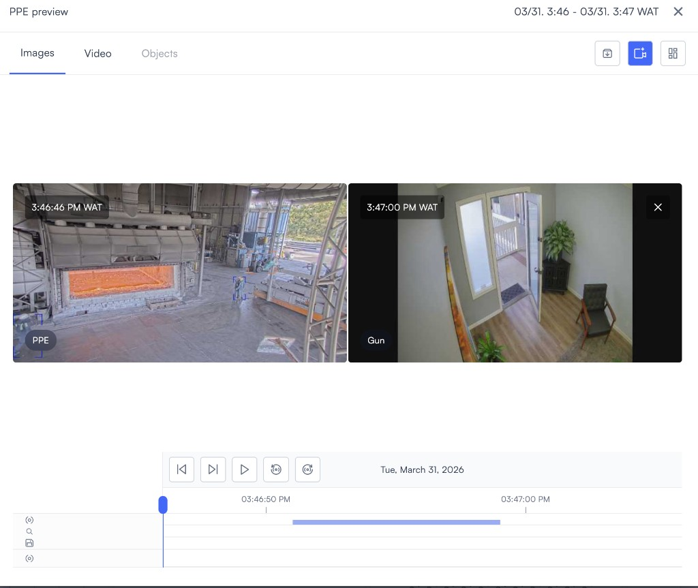
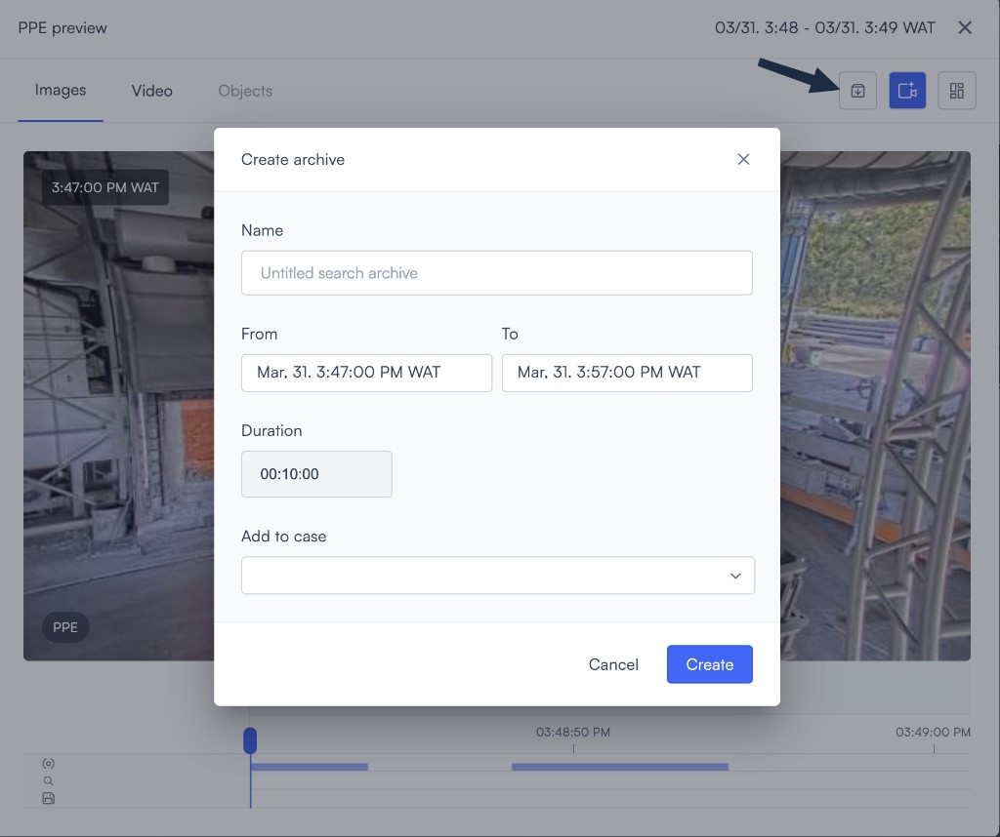
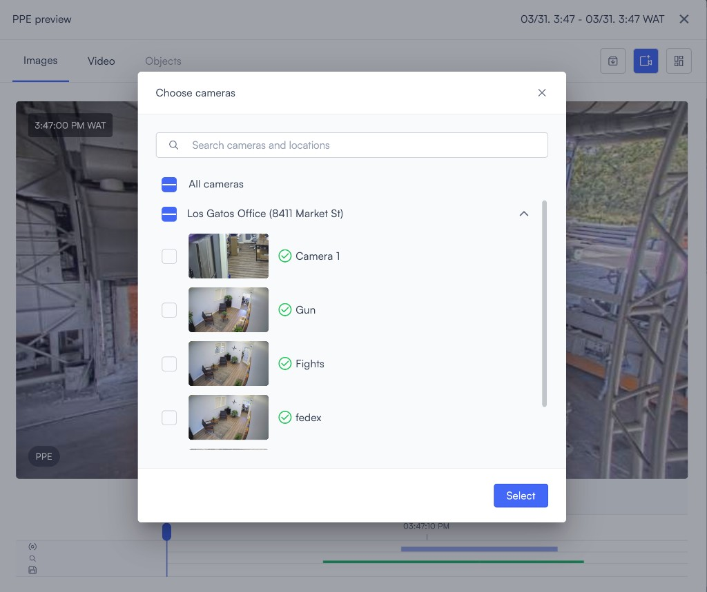
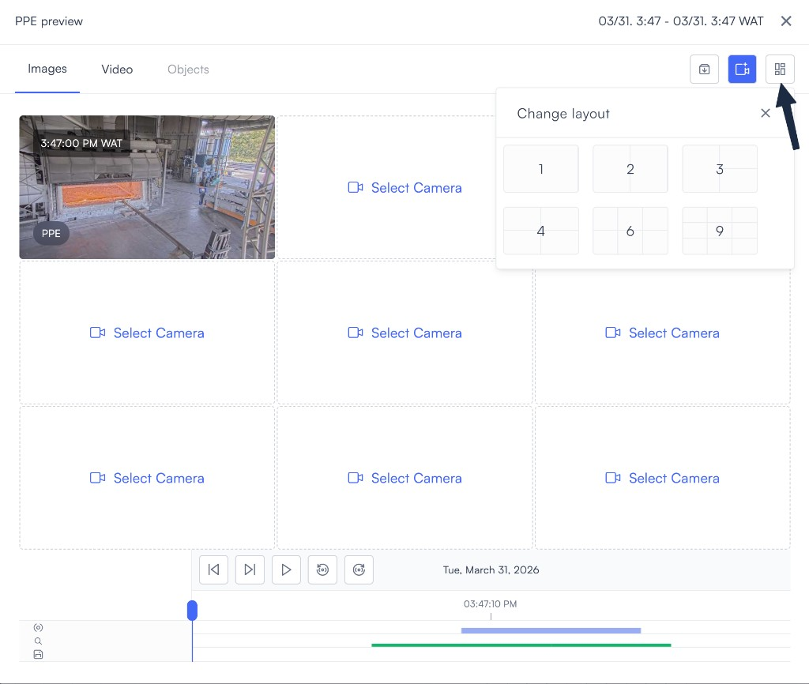
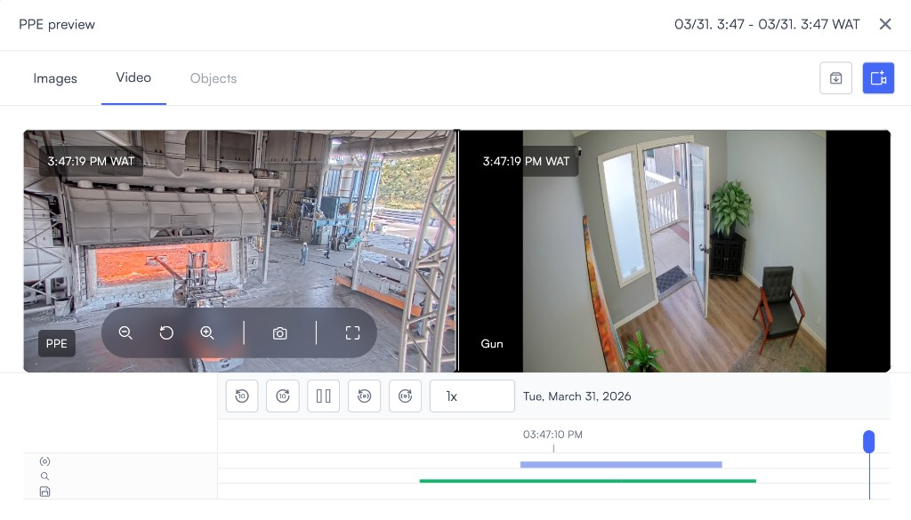
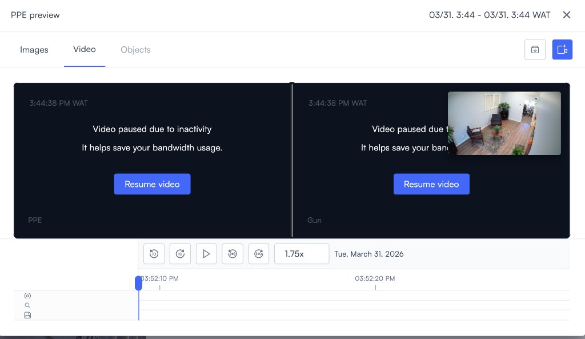

# Event tag clip preview

When you click a data point in an Event tags chart, Lumana opens the Event tag records view for that period. Selecting a result from that view opens the clip preview window, where you can review the video footage, navigate between events, and manage archives.

This page covers everything available in the clip preview window. To get here, follow the steps in [Event tags](chart-or-table-event-tags.md) first.

## Review the clip

The clip preview window opens with three tabs: **Images**, **Video**, and **Objects**. Each tab shows the same clip from a different angle.

- **Images**: Shows still frames captured during the event. Use **Previous captured image** and **Next captured image** to step through each frame.
- **Video**: Shows continuous video for the event segment. Includes a playback speed control so you can watch at a faster or slower rate.
- **Objects**: Shows detected objects associated with the clip.

The preview updates as you move the timeline on either the Images or Video tab.

## Navigate between events

A shared control bar sits below the viewer on all three tabs.

- **Previous alert** and **Next alert**: Move to the previous or next event in the records list.
- **Play**: Starts video playback. If you're on the Images tab, selecting Play switches to the Video tab and begins playing. While playing, the same control acts as Pause.
- **Previous captured image** and **Next captured image**: Step backward or forward through the still frames captured for the current event.

## Zoom, snapshot, and fullscreen

A floating toolbar appears over the feed with controls for adjusting the view.

- **Zoom out**, **Reset zoom**, **Zoom in**: Adjust how close you are to the picture. Reset zoom returns to the default framing.
- **Snapshot**: Saves the current frame to your device as a PNG file.
- **Fullscreen**: Expands the viewer to fill the screen.

## Archive, cameras, and layout

The toolbar on the right side of the tab row gives you three additional controls.

- **Create archive**: Opens the Create archive dialog. Enter a name, set the From and To time range, optionally add the clip to a case, then select **Create** to save the segment.

- **Choose cameras**: Opens the Choose cameras dialog. Search by name or location, select individual cameras or **All cameras**, then select **Select** to add feeds to the preview.

- **Change layout**: Opens the layout picker with options for 1, 2, 3, 4, 6, or 9 tiles. Select a layout to show one camera full screen or view multiple feeds in a grid. Empty tiles show **Select camera** until you assign a feed to them.

## View multiple cameras

After adding cameras and selecting a multi-tile layout, you can view several feeds at the same time. Each tile shows a different camera, and all tiles share the same timeline and playback controls.

## Video paused for inactivity

If a video feed has been idle for a while, it pauses automatically to reduce bandwidth use. A message appears on the tile with a **Resume video** button. Select it to restart that feed.

