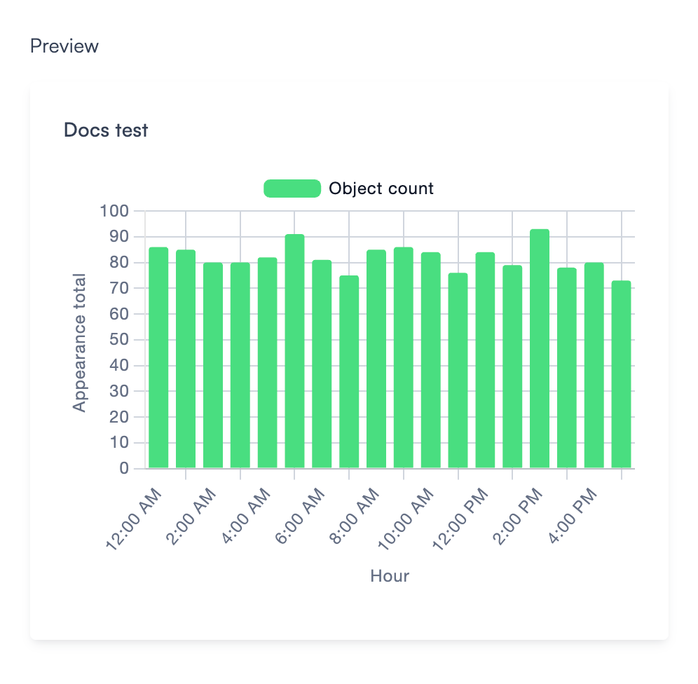
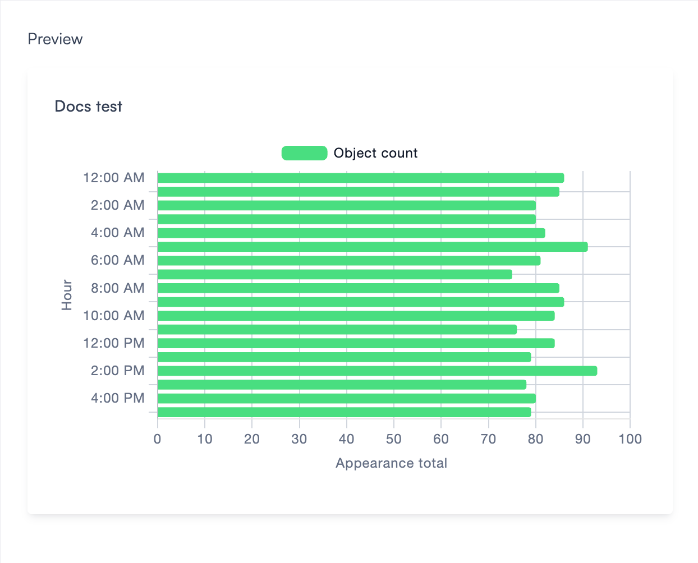
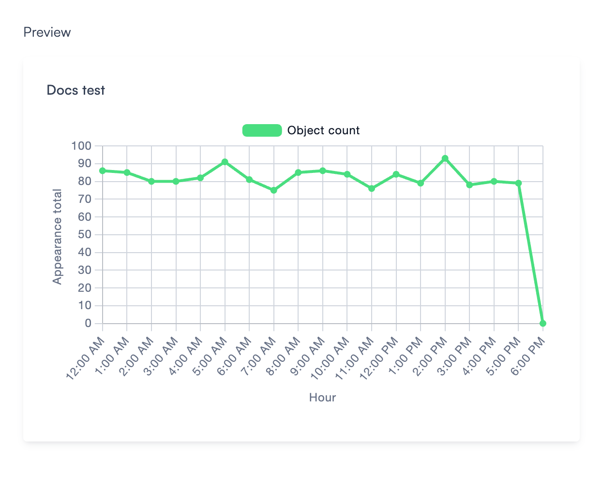
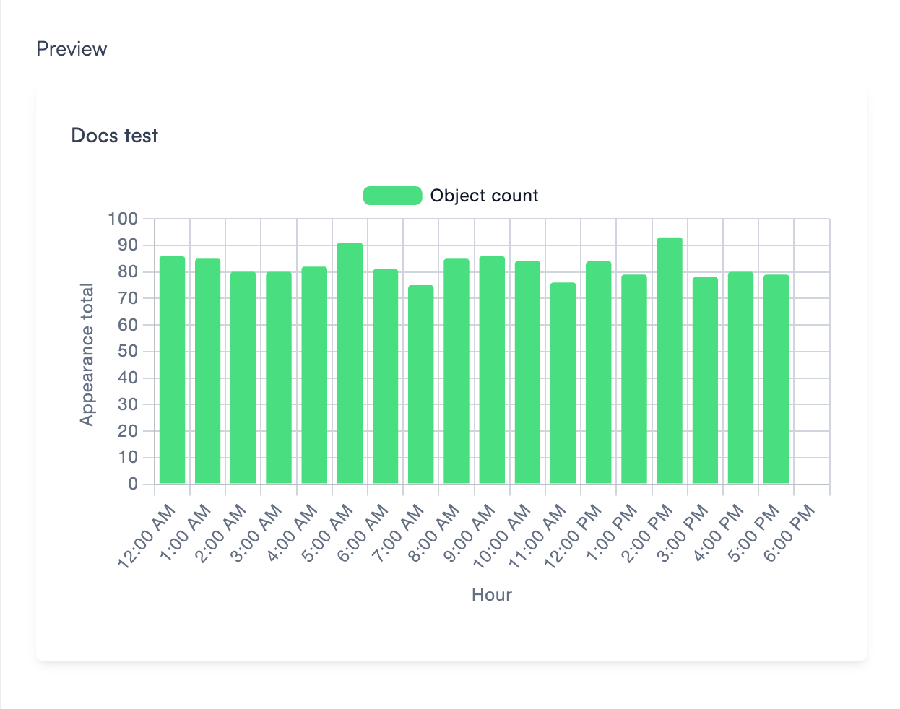
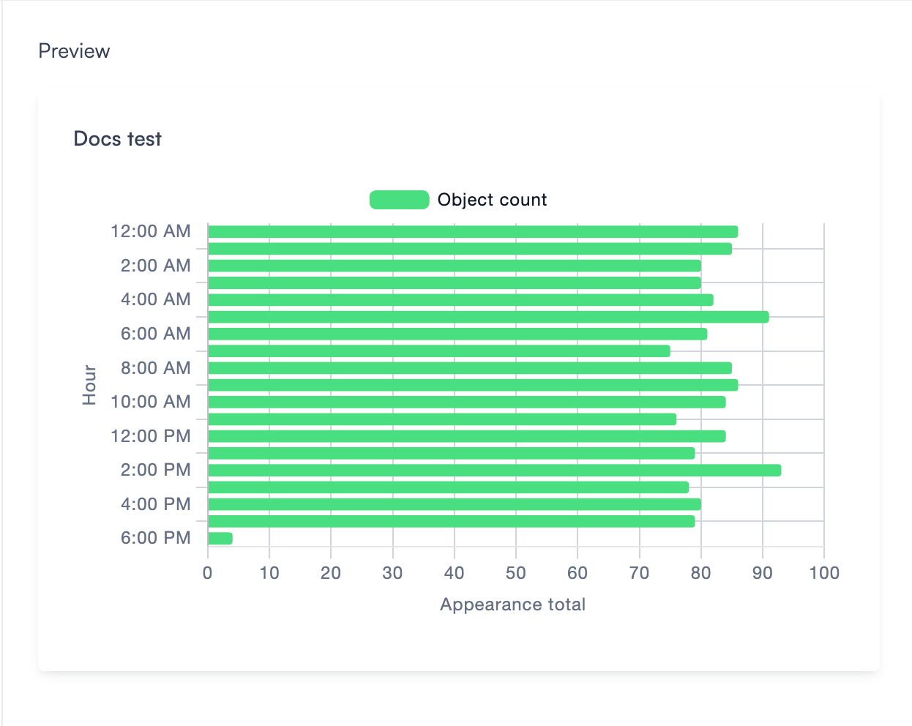
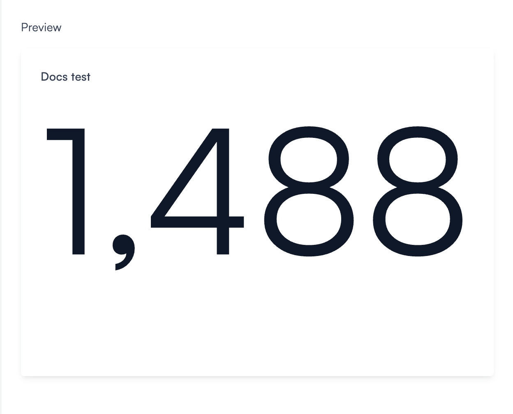
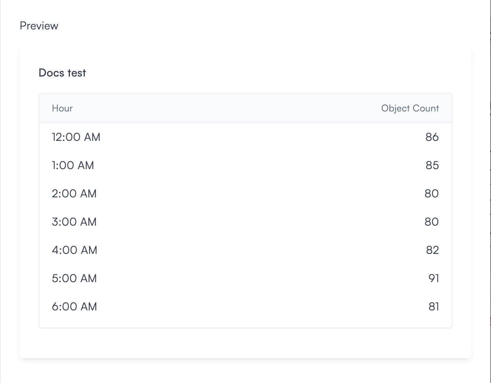

# Visualization types

The Chart or table widget supports seven visualization types. Each one presents your data differently and suits a different goal. You select the visualization type after choosing your datasource, and the preview panel updates immediately so you can see what your data looks like before saving.

## Vertical bar chart

Vertical bars grouped by time period, location, or camera. Each bar represents a count for that group. Use this when you want to compare activity across intervals at a glance, for example seeing which hour of the day had the most detections, or which day this week had the highest alert count.

## Horizontal bar chart

The same as the vertical bar chart, but rotated. Bars run left to right, with group labels on the Y-axis. Use this when your group labels are long, when you have many time periods to compare, or when a horizontal layout suits your dashboard better.

## Line chart

A single line connecting data points over time. Use this when you want to track trends across a longer period and spot patterns, for example whether alert counts are rising week over week, or whether foot traffic drops on weekends. The slope of the line tells the story faster than individual bars.

## Vertical stacked bar chart

Vertical bars split into segments by object type, alert type, or event tag. Each segment represents a subset of the total. Use this when composition matters, for example seeing not just how many detections occurred each hour, but how many were people versus vehicles. The height of each bar shows the total. The segments show the breakdown.

## Horizontal stacked bar chart

The same as the vertical stacked bar chart, but rotated. Use this for the same purpose when a horizontal layout suits your dashboard better or when group labels are long.

## Number

A single large count displayed on the canvas. No chart, no axes. Use this when you want one clear number at a glance, for example the total number of people detected today, the average alert count per hour this week, or the highest detection count in any single hour. It's the fastest way to surface a key metric.

## Table

Data displayed in rows and columns. Use this when you need precise values rather than a visual trend, for example reviewing exact detection counts per hour, comparing alert totals by location, or exporting data for a report. The table lets you read the exact number for every data point without hovering.

## Choosing the right type

Not sure which to pick? Here's a quick guide:

- **Compare values across categories or time periods**: Vertical bar chart or horizontal bar chart.
- **Track a trend over time**: Line chart.
- **See how a total breaks down into parts**: Vertical stacked bar chart or horizontal stacked bar chart.
- **Surface a single key metric**: Number.
- **Review or export exact values**: Table.

In practice, most security and operations teams use the vertical bar chart for daily activity monitoring, the line chart for weekly trend reviews, and the number widget for at-a-glance KPIs on overview dashboards.

Axis labels, filters, and the extra options for **Number** and **Table** depend on which datasource you selected. For a full field-by-field walkthrough with the Objects datasource, see [Objects](chart-or-table-objects.md).