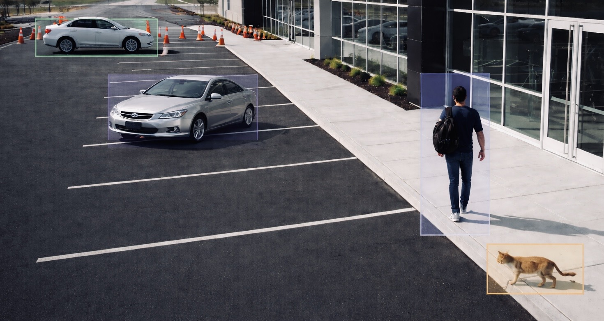
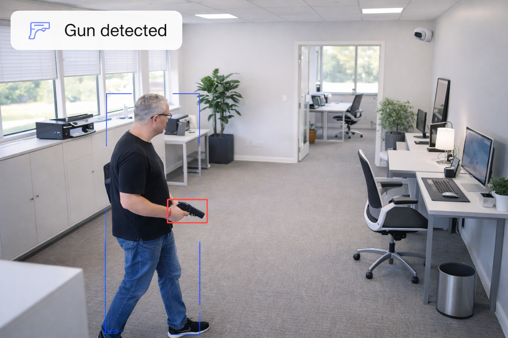

# Chart or table

The Chart or table widget turns camera data into visual reports. You choose a datasource, pick a visualization type, and configure your axes and filters to track what matters across seven different chart and table formats.

A datasource is the type of data the widget draws from. Lumana records three kinds of events from your cameras: object detections, alert firings, and manually applied event tags. The datasource you select determines which of these the widget counts, what filters are available, and how the axes behave. Each datasource has its own configuration guide.

## Choose a datasource

Select the datasource that matches what you want to track. Each one measures something different and unlocks its own set of filters and axis options.

<table>
<tbody>
<tr valign="top">
<td width="33%">

<strong>Objects</strong>

Counts camera detections of people, vehicles, and animals. Every detection is a recorded event you can drill into to see the actual camera frames.

Use this when you want to understand physical activity. For example, how many people passed through the main entrance between 6 and 9 AM, how long vehicles stayed in a loading zone, or which hour of the day sees the most foot traffic.

<a href="chart-or-table-objects.md">Set up with Objects →</a>

</td>
<td width="33%">

<strong>Alerts</strong>

Counts alert events fired by your configured alert rules. Each count represents a moment a rule condition was met: a gun detected, a safety helmet missing, a zone breached.

Use this when you want to monitor rule-triggered incidents over time. For example, how many PPE violations occurred this week, whether gun detection alerts are increasing, or which camera triggers the most trespassing alerts.

<a href="chart-or-table-alerts.md">Set up with Alerts →</a>

</td>
<td width="33%">
<!-- IMAGE: dashboards/widget-chart-datasource-eventtags.png — An event tag record showing a tagged video clip with the tag name, timestamp, and location. -->

<strong>Event tags</strong>

Counts times event tags were applied to video clips. Each count represents a moment an operator manually labelled a clip for review, follow-up, or categorisation.

Use this when your team tags video clips and you want to measure how often. For example, tracking how many clips were flagged for review this month, or whether tagging activity is consistent across shifts.

<a href="chart-or-table-event-tags.md">Set up with Event tags →</a>

</td>
</tr>
</tbody>
</table>

Not sure which datasource to use? Start with Objects if you want to track what the camera sees. Switch to Alerts if you want to track when rules were triggered. Use Event tags if your team labels clips and you want to measure how often.

## Visualization types

Once you've picked a datasource, you'll choose how to display the data. The widget supports seven formats: vertical bar chart, horizontal bar chart, line chart, vertical stacked bar chart, horizontal stacked bar chart, number, and table. Each suits a different goal. For guidance on choosing the right format, visit [Visualization types](chart-or-table-visualization-types.md)

When you're ready, select a datasource above to start building your widget. Each configuration guide walks you through every field from start to finish.