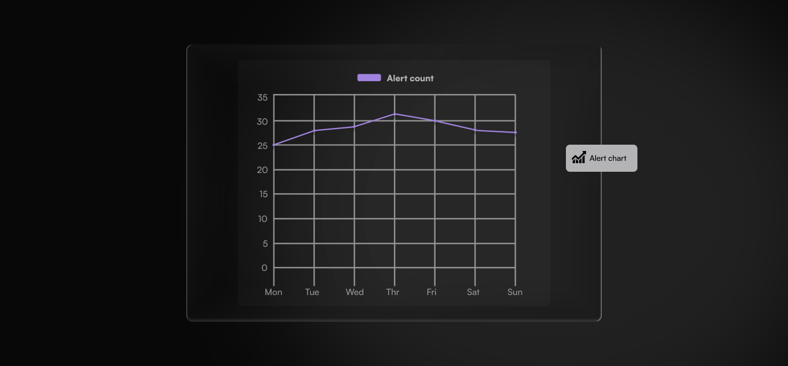

# Chart or table

<figure><figcaption></figcaption></figure>

The chart or table widget turns camera data into visual reports. You choose a datasource, choose a visualization format, and configure your axes and filters to track the data that matters.

## Choose a datasource

A datasource is the type of data the widget draws from. Lumana records three kinds of events from your cameras: object detections, alert firings, and manually applied event tags. The datasource you select determines which of these the widget counts, what filters are available, and how the axes behave. Each datasource has its own configuration guide.

Select the datasource that matches what you want to track. Each one measures something different and unlocks its own set of filters and axis options.

<table data-view="cards"><thead><tr><th></th><th data-type="content-ref"></th><th data-hidden data-card-cover data-type="image">Cover image</th><th data-hidden data-card-target data-type="content-ref"></th></tr></thead><tbody><tr><td>
<strong>Objects</strong>

Counts camera detections of people, vehicles, and animals. Every detection is a recorded event you can drill into to see the actual camera frames.

Use this when you want to understand physical activity. For example, how many people passed through the main entrance between 6 and 9 AM, how long vehicles stayed in a loading zone, or which hour of the day sees the most foot traffic.
</td><td><a href="chart-or-table-objects.md">chart-or-table-objects.md</a></td><td><a href="../../../.gitbook/assets/widget-chart-datasource-objects.png">widget-chart-datasource-objects.png</a></td><td><a href="chart-or-table-objects.md">chart-or-table-objects.md</a></td></tr><tr><td>
<strong>Alerts</strong>

Counts alert events fired by your configured alert rules. Each count represents a moment a rule condition was met: a gun detected, a safety helmet not worn after 3 minutes, a zone breached.

Use this when you want to monitor rule-triggered incidents over time. For example, how many alerts for a safety helmet not worn after 3 minutes occurred this week, whether gun detection alerts are increasing, or which camera triggers the most trespassing alerts.
</td><td><a href="chart-or-table-alerts.md">chart-or-table-alerts.md</a></td><td><a href="../../../.gitbook/assets/widget-chart-datasource-alerts.png">widget-chart-datasource-alerts.png</a></td><td><a href="chart-or-table-alerts.md">chart-or-table-alerts.md</a></td></tr><tr><td>
<strong>Event tags</strong>

Counts times event tags were applied to video clips. Each count represents a moment an operator manually labelled a clip for review, follow-up, or categorisation.

Use this when your team tags video clips and you want to measure how often. For example, tracking how many clips were flagged for review this month, or whether tagging activity is consistent across shifts.
</td><td><a href="chart-or-table-event-tags/">chart-or-table-event-tags</a></td><td><a href="../../../.gitbook/assets/widget-chart-datasource-eventtags.png">widget-chart-datasource-eventtags.png</a></td><td></td></tr></tbody></table>

Not sure which datasource to use? Start with Objects if you want to track what the camera sees. Switch to Alerts if you want to track when rules were triggered. Use Event tags if your team labels clips and you want to measure how often.

## Add the widget

1. Follow **Add a widget** in [Create and manage dashboards](../../create-and-manage-dashboards.md#add-a-widget) to open the widget list, then select **Chart or table**. The configuration dialog opens.
2. Enter a name in the **Title** field. Use a name that identifies what the widget is tracking, for example "Main entrance detections today" or "Gun detection alerts this week."
3. Under **Datasource**, select **Objects**, **Alerts**, or **Event tags**.
4. In **Visualization**, select a format from the icon row. The available visualization types and how they behave depend on the datasource you selected. Continue in the relevant page to complete the configuration:
   * [Object visualization](chart-or-table-objects.md)
   * [Alert visualization](chart-or-table-alerts.md)
   * [Event tag visualization](chart-or-table-event-tags/)
