# Alerts

The Alerts datasource counts alert events fired by your configured alert rules. Each count represents a moment a rule condition was met, confirmed by Lumana's AI, and recorded as an alert event. Use this datasource to monitor how often specific conditions occur, track incident trends over time, and identify which cameras or alert types are most active.

## Add the widget

1. Follow **Add a widget** in [Create and manage dashboards](../../create-and-manage-dashboards.md#add-a-widget) to open the widget list, then select **Chart or table**. The configuration dialog opens.
2.  Enter a name in the **Title** field.

    The title appears on the widget on the dashboard canvas. Use a name that identifies what the widget is tracking, for example "Gun detection alerts this week" or "Safety helmet not worn after 3 mins."
3. Under **Datasource**, select **Alerts**.

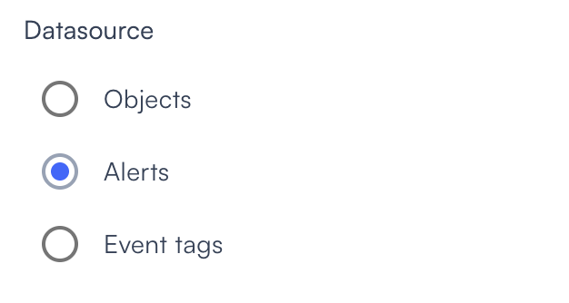

4. In **Visualization**, select a format from the icon row. The preview panel on the right updates immediately when you switch types.

Each visualization plots your selected X-axis grouping against Appearance total. Selecting a grouping from the dropdown updates the preview immediately, and the grouping can be time periods, locations, cameras, or alert types.

> **Note:** When the Y-axis filter is set to All alerts, all chart types display a single color with no breakdown. When you select Group or Individual, each alert type or named alert rule gets its own color and appears as a separate line, bar, or segment in the chart. This applies across all visualization types.

### Visualization previews

The previews below show each visualization type rendered with live data. The preview panel in the configuration dialog updates in real time as you adjust your settings.

#### Vertical bar chart

Vertical bars with Appearance total on the Y-axis. Each bar represents the alert count for one group in your selected X-axis grouping. When the Y-axis filter is set to Group or Individual, each alert type or named alert rule gets its own bar per interval, displayed side by side. For example, selecting Group with Protective gear, Face recognition, and Gun detection shows three colored bars per day, one for each type. Hover over any bar to see the exact count. For example, a bar at 3/30 10:00 PM, which is March 30, showing 17 tells you that hour had the most alert events.

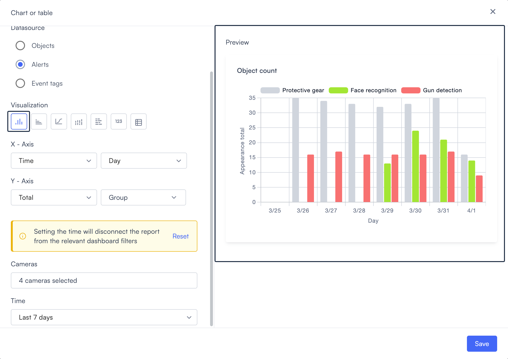

#### Horizontal bar chart

Horizontal bars with Appearance total on the X-axis. This works like the vertical bar chart but with a horizontal layout. When the Y-axis filter is set to Group or Individual, each alert type or named alert rule gets its own bar per interval, displayed side by side. Use this when labels are long or you're comparing many intervals. Hover over any bar to see the exact count.

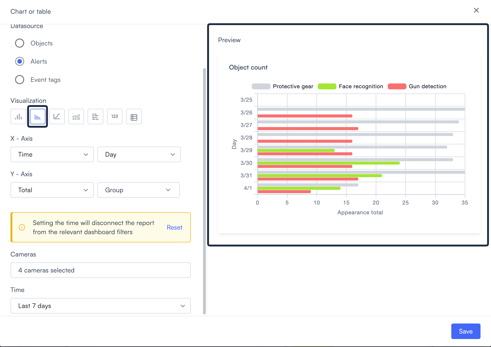

#### Line chart

A line connecting alert counts across your selected grouping. Use this to spot trends over time. For example, you might track whether gun detection alerts are rising week over week or whether alerts for a safety helmet not worn after 3 minutes increase on some days.

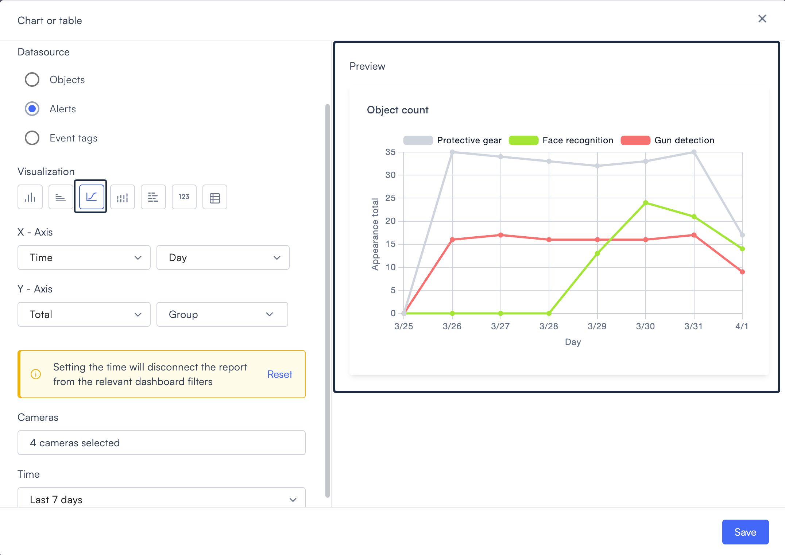

#### Vertical stacked bar chart

Vertical bars with Appearance total on the Y-axis. This works like the vertical bar chart, but instead of placing bars side by side, it stacks them within each interval. When the Y-axis filter is set to Group or Individual, each alert type or named alert rule appears as a colored segment within the bar, so you can see both the total and the breakdown at the same time. For example, selecting Group with Protective gear, Face recognition, and Gun detection shows one stacked bar per day where each color represents a different alert type.

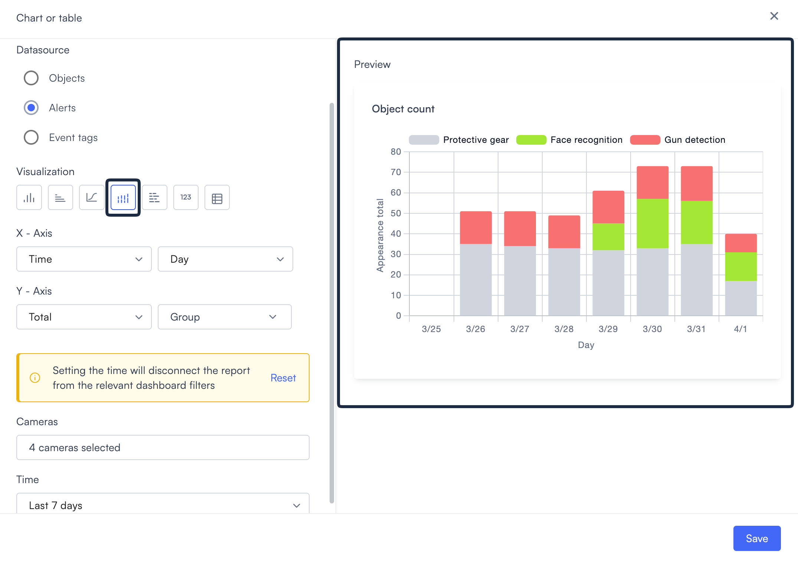

#### Horizontal stacked bar chart

Horizontal bars with Appearance total on the X-axis. This works like the horizontal bar chart, but stacks bars within each interval instead of placing them side by side. When the Y-axis filter is set to Group or Individual, each alert type or named alert rule appears as a colored segment within the bar. Use this when a horizontal layout suits your dashboard better.

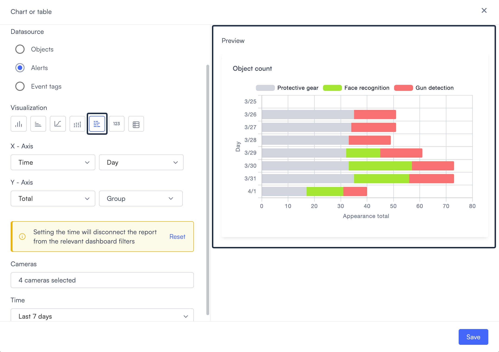

#### Counter

A single large alert count on the canvas. Use this for a quick at-a-glance total, for example the total gun detection alerts fired today. This is the only visualization that supports **Alert types** as the X-axis grouping.

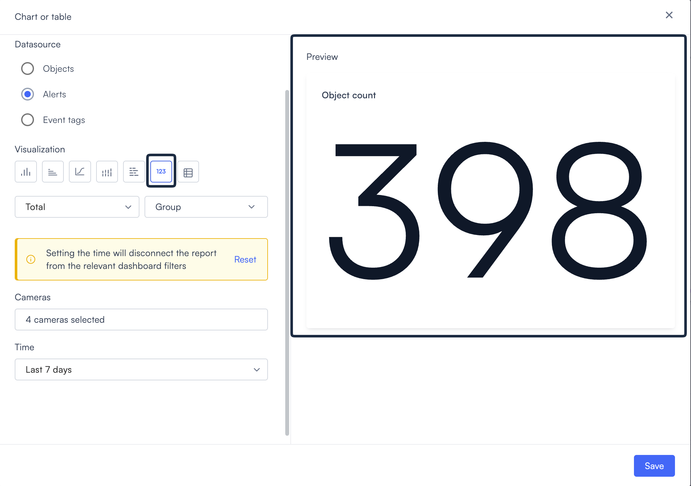

#### Table

Alert counts in rows and columns. Each row represents your selected grouping, such as a time period, location, camera, or alert type, with its Appearance total in the adjacent column. Use this when you need exact values rather than a visual trend.

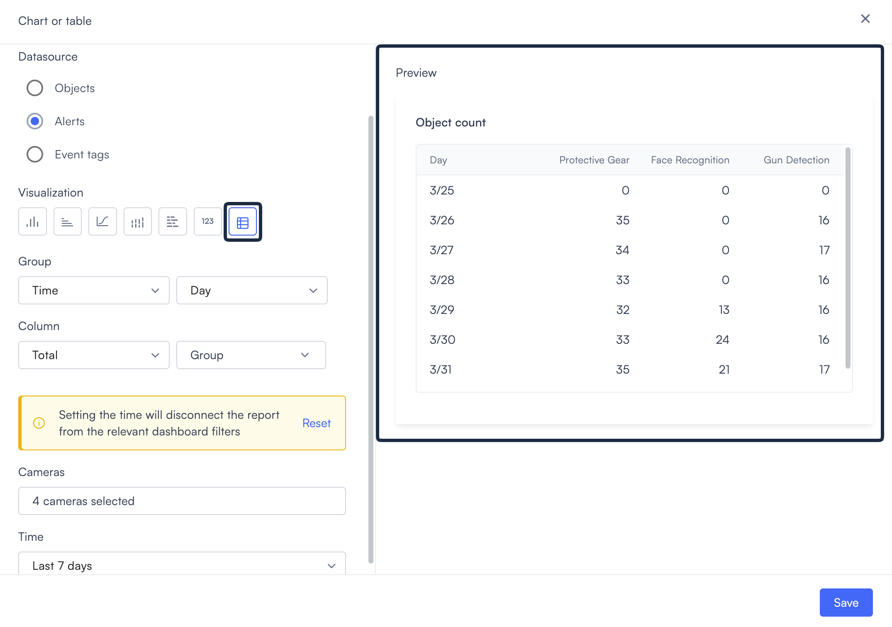

If you selected **Counter**, then skip to [Counter visualization](chart-or-table-alerts.md#counter-visualization). If you selected **Table**, then skip to [Table visualization](chart-or-table-alerts.md#table-visualization). For all other types, continue with step 5 below.

5. Set the **X-Axis**. The first dropdown controls how data is grouped.

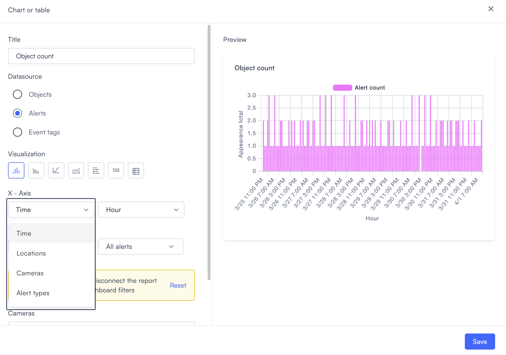

* **Time**: Groups data by time interval. A second dropdown appears where you set the interval. The chart layout changes when you switch visualization types. For example, Time with a vertical bar chart shows bars per hour, while Time with a line chart shows a trend line across the same intervals.
* **Locations**: Groups data by location. The X-axis label shows **Location name** and each bar or data point represents a location in your account. The chart layout updates when you switch visualization types.
* **Cameras**: Groups data by camera name. The X-axis label shows **Camera name** and each bar or data point represents a camera. The chart layout updates when you switch visualization types.
* **Alert types**: Groups data by alert type. Only use this with the **Counter** visualization. With any other visualization type, the widget saves but renders incorrectly on the dashboard canvas.

> **Warning:** If you select **Alert types** as the X-axis grouping, then select **Counter** as the visualization type. Selecting any other visualization type produces a broken widget on the dashboard canvas.

If you selected **Time**, then set the interval in the second dropdown.

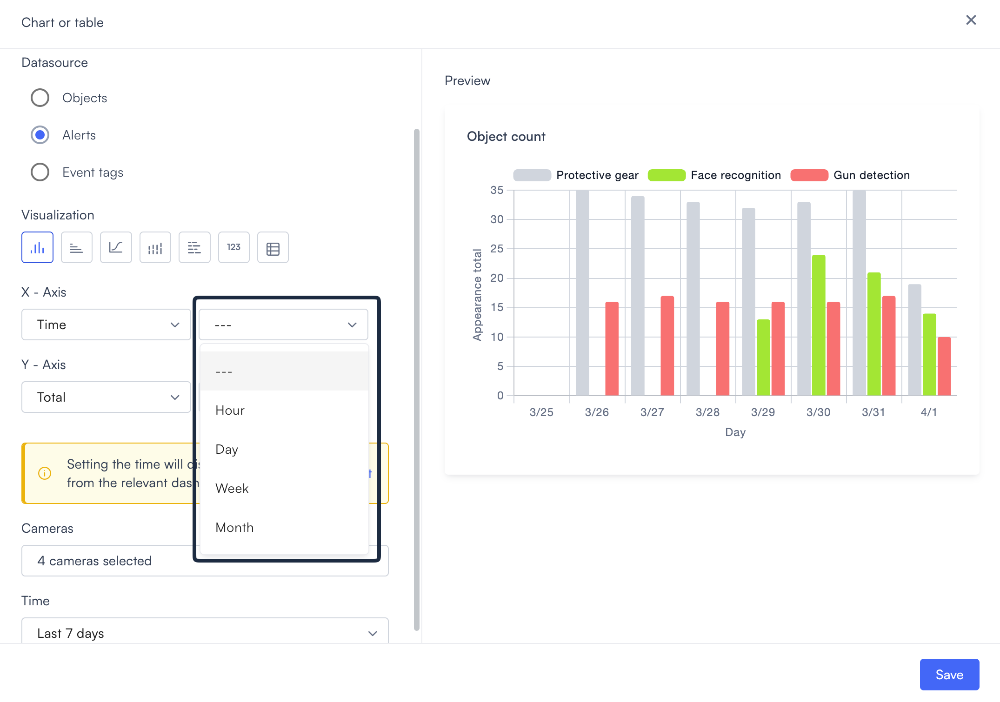

* `---`: No interval set. The widget determines the interval automatically.
* **Hour**: Groups data by hour.
* **Day**: Groups data by day.
* **Week**: Groups data by week.
* **Month**: Groups data by month.

6.  Set the **Y-Axis**. Two dropdowns control what is measured and which alerts are included.

    The Y-axis always measures alert count. The rendered chart labels this axis **Appearance total**.

    First dropdown, aggregation:

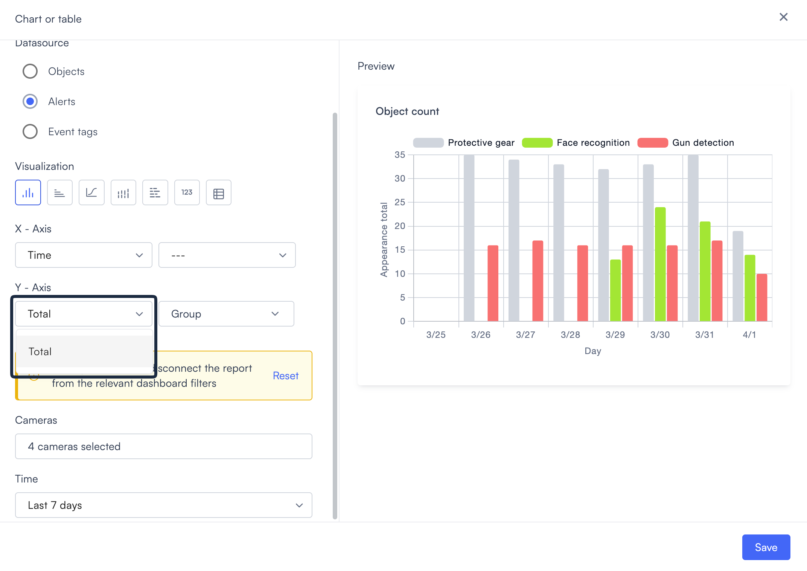

* **Total**: The total alert count across the selected period. This is the only aggregation option for the Alerts datasource because the axis always counts alert events.

Second dropdown, alert filter:

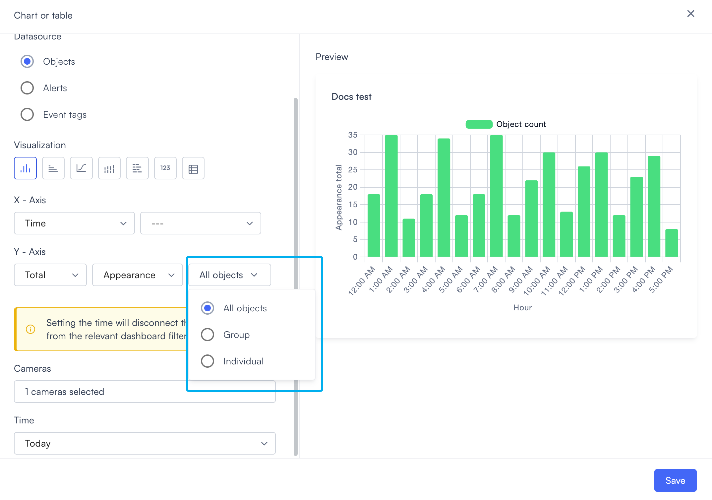

* **All alerts**: Includes every alert type in the count.
* **Group**: Filters by alert type category. Select one or more from the full list of configured alert types.

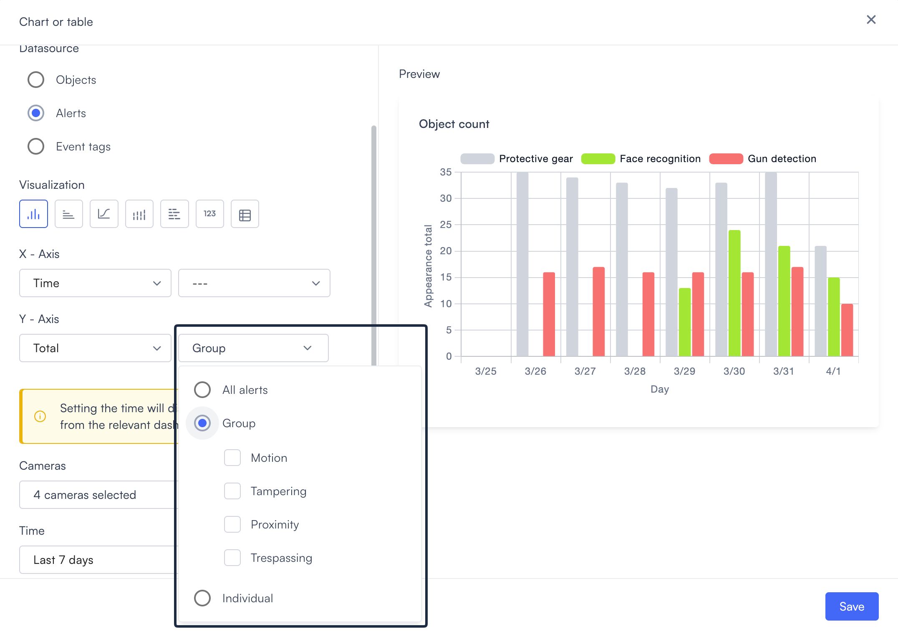

The full list of alert type options is: Motion, Tampering, Proximity, Trespassing, Trespassing zones, Tailgating, Zone protection, Gun detection, Speed control, Doors, Fire, Fall detection, Violence, Suspect, Gun brandished, Face recognition, License plate, Container, Appearing, Disappearing, Traffic control, Occupancy, Loitering, Holding a phone, Line crossing, Missing object, Absence, Snapshot, Camera status, Core status, Protective gear, Personal safety, Free text periodic, Gloves, Hands, Event tag, Event validation, Door tailgating, Event clearance, Developer, Shelf occupancy threshold, Shelf occupancy change, Custom state change, Custom state transition, Custom state duration, and Zone armed/disarmed. Each alert types, and its configuration rules, covered in [Alert types](../../../alerts-and-ai-detection/alert-types/).

* **Individual**: Filters by a specific named alert rule configured in your account. Use the search bar to find the alert by name.

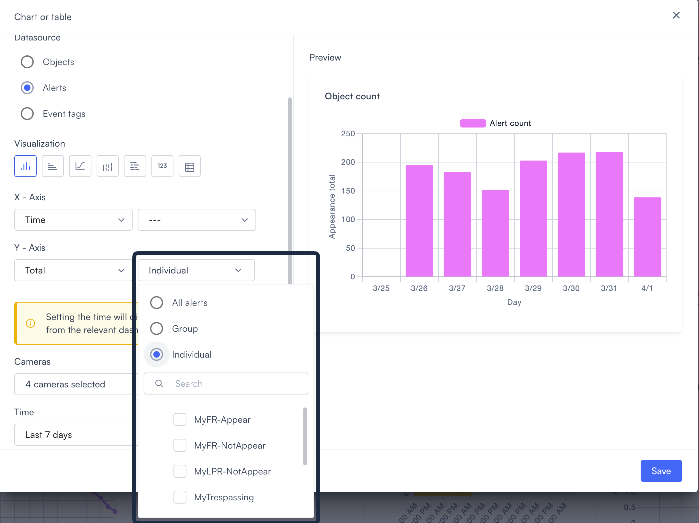

7. Select the **Cameras** field to choose which cameras contribute data.

* Search by camera name or location using the search field.
* Select **All cameras** to include every camera in your account.
* Select individual cameras to filter to specific ones.
* Select **Select** to apply. The field shows how many cameras are selected, for example "1 cameras selected."

8. Optionally, set a widget-level **Time** range. If you leave this as `---`, then the widget follows the dashboard time filter.

> **Note:** Setting a time disconnects the widget from the dashboard filters. To reconnect it, select **Reset**. This clears the **Cameras** and **Time** fields and the widget follows the dashboard filters again.

9. Select **Add**. The widget appears on the dashboard canvas.

When you hover over a data point in the chart, a tooltip shows the exact alert count for that interval. Timestamps in the tooltip use the format M/DD HH:MM, where the first number is the month and the second is the day. For example, 3/30 10:00 PM means March 30 at 10:00 PM.

When you click a data point, Lumana opens the Alert records view for that period. Each card shows the alert rule name, the trigger description, a timestamp in MM/DD/YY HH:MM timezone format, the location, and the alert type. Click any card to open the alert preview. The preview shows the recorded video clip of the alert event, a timeline scrubber for the alert window, and four tabs: **Images**, **Video**, **Objects**, and **Activity**.

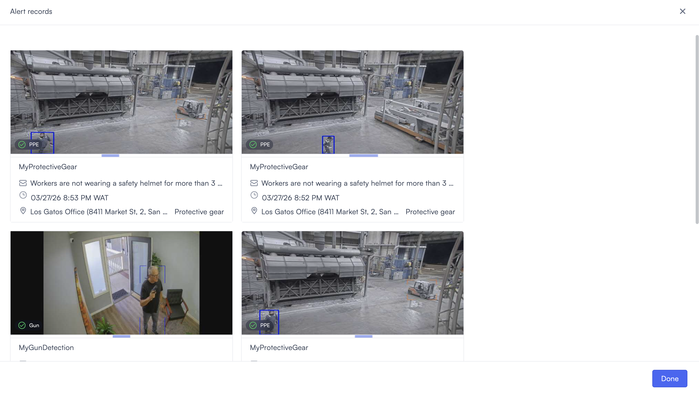

## Counter visualization

If you selected **Counter** in **Visualization** in step 4, two unlabelled dropdowns replace the X-Axis and Y-Axis fields. The count on the canvas changes based on what you select in each dropdown.

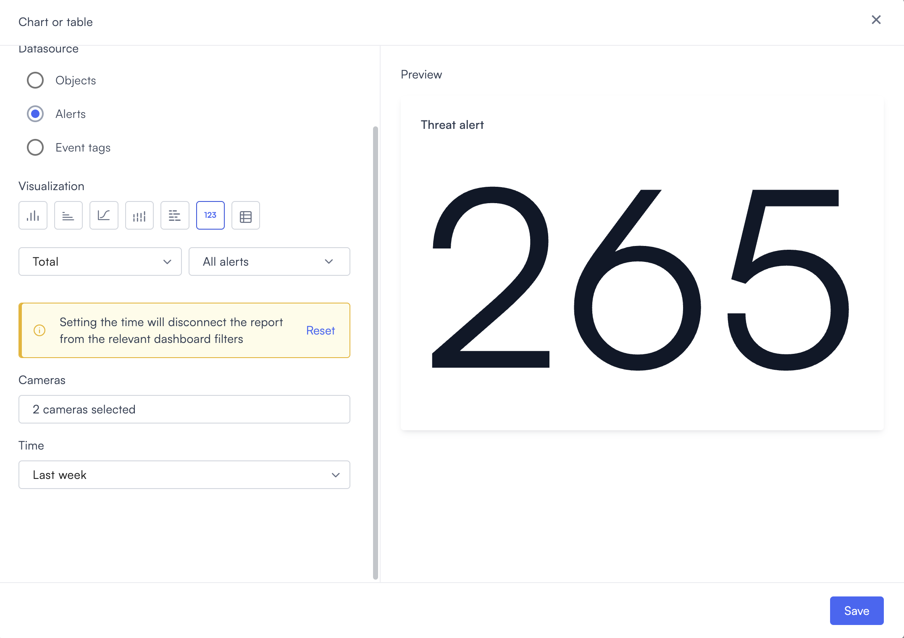

The first dropdown sets the aggregation:

* **Total**: The total alert count across the selected period. This is the only aggregation option for the Alerts datasource.

The second dropdown sets the alert filter:

* **All alerts**: Counts every alert event.
* **Group**: Counts by alert type category. Select one or more from the alert type list.
* **Individual**: Counts a specific named alert rule. Use the search bar to find it by name.

Once you've set the two dropdowns, continue with step 7 to select cameras.

> **Note:** Setting a time disconnects the widget from the dashboard filters. To reconnect it, select **Reset**. This clears the **Cameras** and **Time** fields and the widget follows the dashboard filters again.

## Table visualization

If you selected **Table** in **Visualization** in step 4, the X-Axis becomes **Group** and the Y-Axis becomes **Column**.

**Group** controls how rows are organized. The first dropdown sets the grouping type: Time, Locations, Cameras, or Alert types. If you select Time, then a second dropdown appears where you set the interval: Hour, Day, Week, or Month.

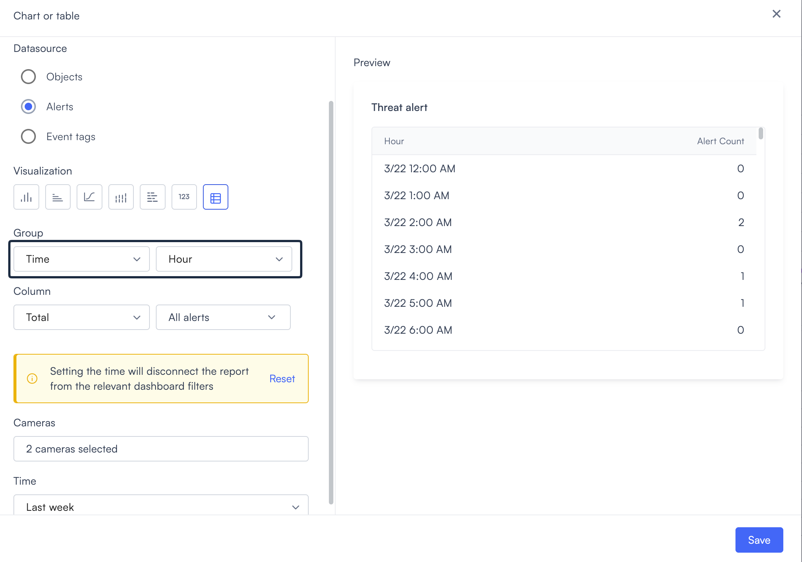

**Column** controls what value each column shows. Two dropdowns set the aggregation and the alert filter.

* First dropdown: **Total**. This is the only option.
* Second dropdown: **All alerts**, **Group**, or **Individual**.

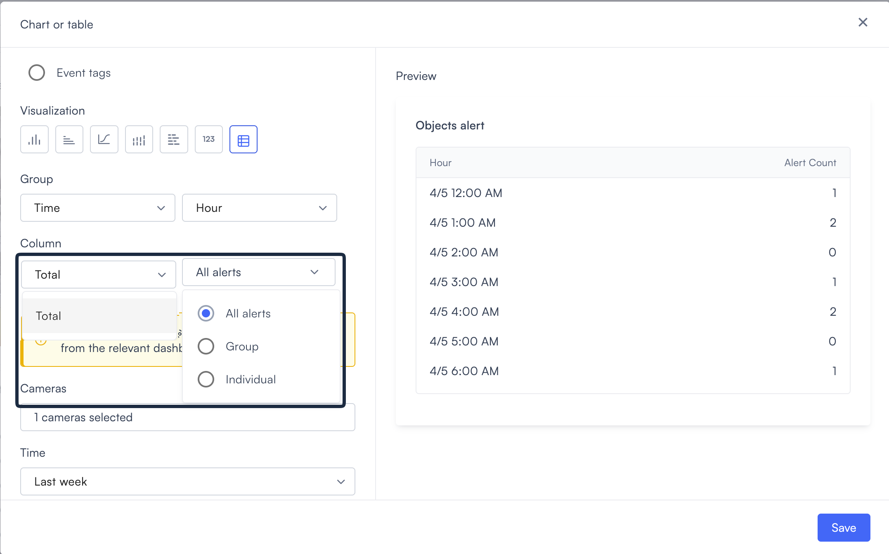

Once you've set Group and Column, continue with step 7 to select cameras.

> **Note:** Setting a time disconnects the widget from the dashboard filters. To reconnect it, select **Reset**. This clears the **Cameras** and **Time** fields and the widget follows the dashboard filters again.

## Edit or delete the widget

To edit or delete the widget, follow the steps in [Change widget settings](../../create-and-manage-dashboards.md#change-widget-settings) and [Delete a widget](../../create-and-manage-dashboards.md#delete-a-widget) in Create and manage dashboards.
