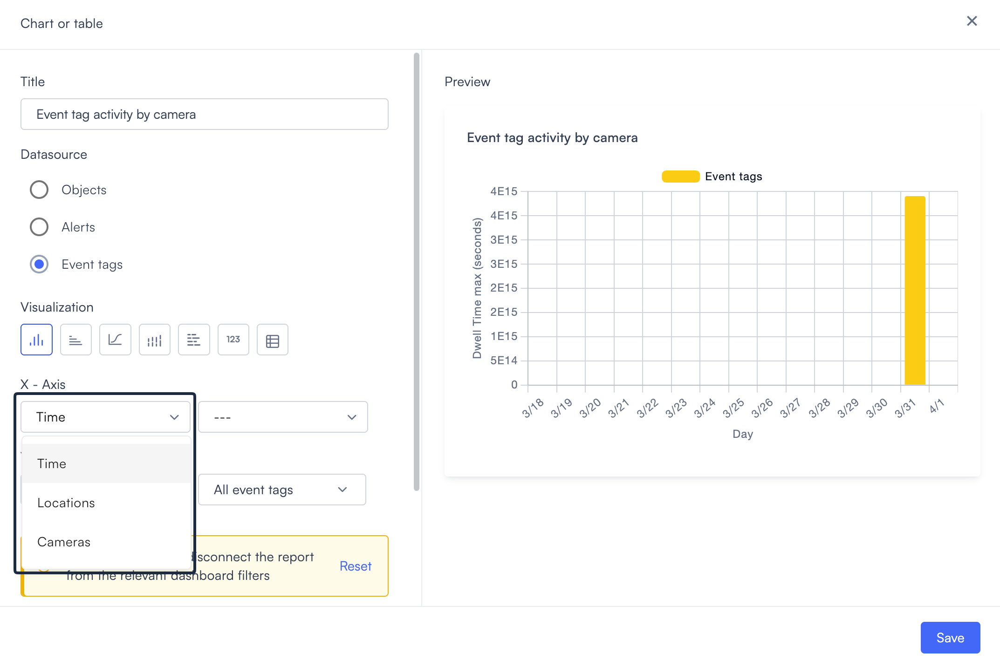
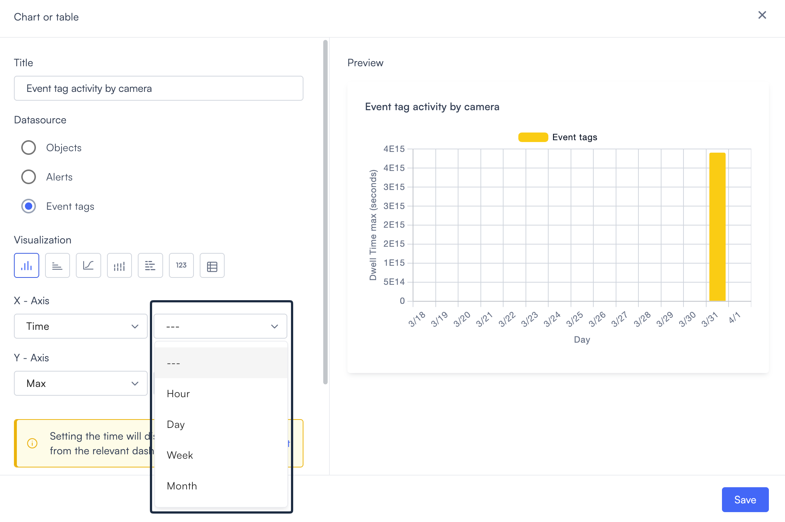
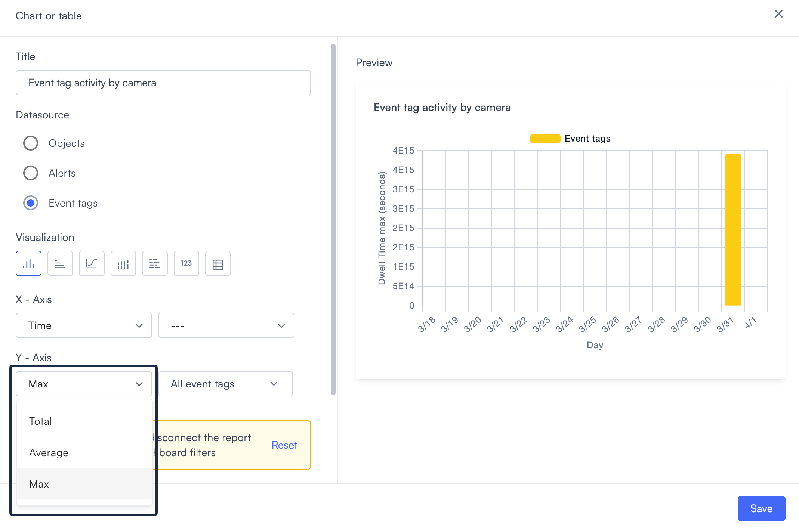
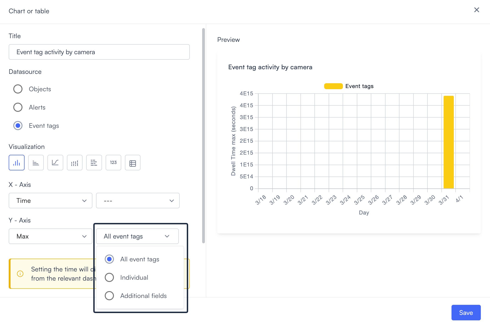
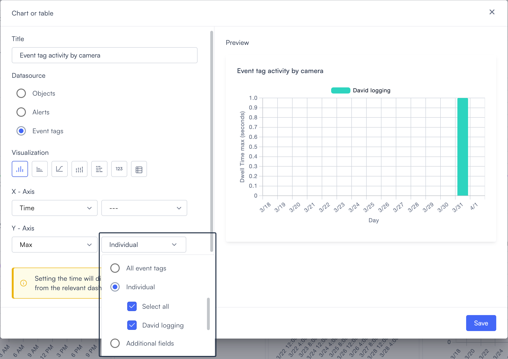
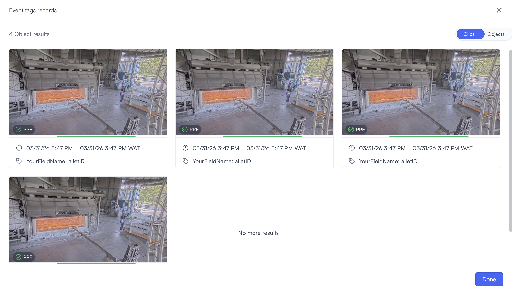
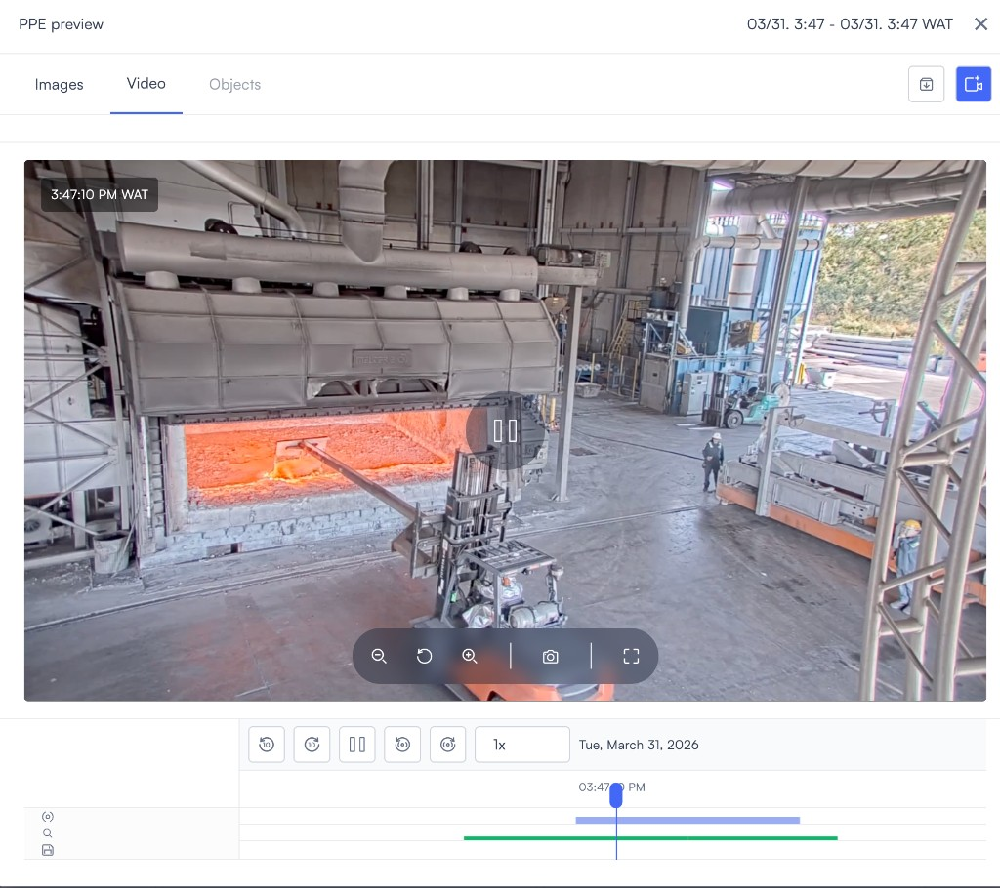
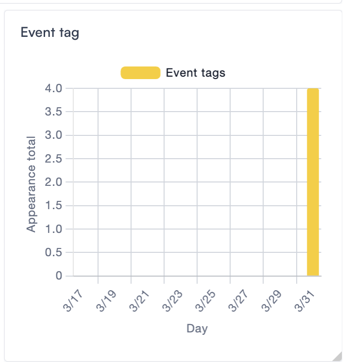

# Event tag visualization

The Event tags datasource counts how many times event tags were applied to video clips across your selected cameras. Each count represents a tagged moment, confirmed by a POST to the Lumana API, and recorded against a specific camera and timestamp. Use this datasource to track how often specific events were flagged, and to drill into the clips behind each count.

Before you can use this datasource, you need at least one event tag configured and at least one successful POST to the Lumana API. If no events have been created yet, the widget will have no data to display. Setting up event tags, including API keys, event type IDs, and POST requests, is covered in [Enhance your video data with Lumana Event Tags](../../../../databases-analytics-and-search/enhance-your-video-data-with-lumana-event-tags.md). Complete that flow before adding this widget.

In **Visualization**, select a format from the icon row. The preview panel on the right updates immediately when you switch types.

If you selected **Number**, then skip to [Number visualization](./#number-visualization). If you selected **Table**, then skip to [Table visualization](./#table-visualization). For all other types, continue with step 1 below.

1. Set the **X-Axis**. The first dropdown controls how data is grouped.

* **Time**: Groups data by time interval. A second dropdown appears where you set the interval.
* **Locations**: Groups data by location.
* **Cameras**: Groups data by camera name.

If you selected **Time**, then set the interval in the second dropdown.

* `---`: No interval set. The widget determines the interval automatically.
* **Hour**: Groups data by hour.
* **Day**: Groups data by day.
* **Week**: Groups data by week.
* **Month**: Groups data by month.

2.  Set the **Y-Axis**. Two dropdowns control what is measured.

    First dropdown, aggregation:

* **Total**: The sum of all tagged events across the period.
* **Average**: The mean count per time unit.
* **Max**: The highest count recorded in any single time unit.

Second dropdown, event tag filter:

* **All event tags**: Includes every event tag in the selected time range and cameras.
* **Individual**: Filters by specific event tags. Select all or check individual tags from the list. Only the checked tags appear as data series in the chart.
* **Additional fields**: Filters by field-level values attached to your event tag POST requests. Select all to include every field.

> **Note:** Event tags doesn't have its own metric selector. The Y-axis label in the preview reflects the metric last selected in the [Objects](../chart-or-table-objects.md#objects-y-axis-metric) datasource. If Objects was set to **Dwell Time**, the preview shows "Dwell Time average (seconds)." If Objects was set to **Appearance**, the preview shows "Appearance total." To change the label, switch to the [Objects](../chart-or-table-objects.md#objects-y-axis-metric) datasource, update the metric, then switch back to Event tags.

3. Select the **Cameras** field to choose which cameras contribute data.

* Search by camera name or location using the search field.
* Select **All cameras** to include every camera in your account.
* Select individual cameras to filter to specific ones.
* Select **Select** to apply. The field shows how many cameras are selected, for example "1 cameras selected."

> **Note:** Include every camera you used as `cameraId` in your API POSTs. If a camera isn't selected here, its events won't appear in the chart.

4. Optionally, set a widget-level **Time** range. If you leave this as `---`, then the widget follows the dashboard time filter.

> **Note:** Setting a widget-level time disconnects the widget from the dashboard time filter. To reconnect it, then clear the widget's time setting back to `---`. Make sure the time range you select covers the timestamps in your API POSTs, or the chart will show no data.

5. Select **Add**. The widget appears on the dashboard canvas.

When you click on a data point in the chart, Lumana opens the Event tag records view for that period. Each result shows a clip thumbnail, a timestamp, and the field values from your POST request.

Select a result to open the video clip for that time range on the selected camera.

## What the chart shows

The Y-axis label reads "Appearance total." Each bar or data point represents the count of event tag POSTs that matched your filter settings for that time bucket, camera selection, and tag filter.

For example, a bar on 3/31 with a height of 4 means four event tag POSTs were recorded for the selected tag and camera on that day.

Hovering over a bar shows the tag name and count for that period.

## If the chart shows no data

If the preview is empty or the counts are zero, check the following:

* Your API POST returned a 2xx response.
* The `cameraId` in your POST matches a camera selected in the **Cameras** field.
* The `timestamp` in your POST falls within the widget's **Time** range.
* The tag selected in the **Individual** filter matches the `eventTypeId` used in your POST.

If you've confirmed all four and still see no data, the troubleshooting checklist in [Enhance your video data with Lumana Event Tags](../../../../databases-analytics-and-search/enhance-your-video-data-with-lumana-event-tags.md) covers additional steps.

## Number visualization

If you selected **Number** in **Visualization**, two unlabelled dropdowns replace the X-Axis and Y-Axis fields. The count on the canvas changes based on your selections in each dropdown. The preview panel labels this widget "Counter."

The first dropdown controls aggregation:

* **Total**: The sum of all tagged events across the selected period.
* **Average**: The mean count per time unit.
* **Max**: The highest count recorded in any single time unit.

The second dropdown controls the event tag filter:

* **All event tags**: Counts every event tag in range.
* **Individual**: Counts specific event tags. Select all or check individual tags.
* **Additional fields**: Counts by field-level values. Select all to include every field.

Once you've set the two dropdowns, continue with step 3 to select cameras.

## Table visualization

If you selected **Table** in **Visualization**, the X-Axis becomes **Group**, and the Y-Axis becomes **Column**.

**Group** controls how rows are organized. The first dropdown sets the grouping type: Time, Locations, or Cameras. If you select Time, then a second dropdown appears where you set the interval: Hour, Day, Week, or Month.

**Column** controls what value each column shows. Two dropdowns set the aggregation (Total, Average, or Max) and the event tag filter (All event tags, Individual, or Additional fields).

The aggregation you choose affects how the value column is calculated per row. **Total** returns a straightforward count, for example, 4 events. **Average** and **Max** apply different calculations to the underlying data and may produce decimal values in the preview. If you want a plain event count per row, use **Total**.

Once you've configured these fields, select the Cameras field in step 3 to continue.
