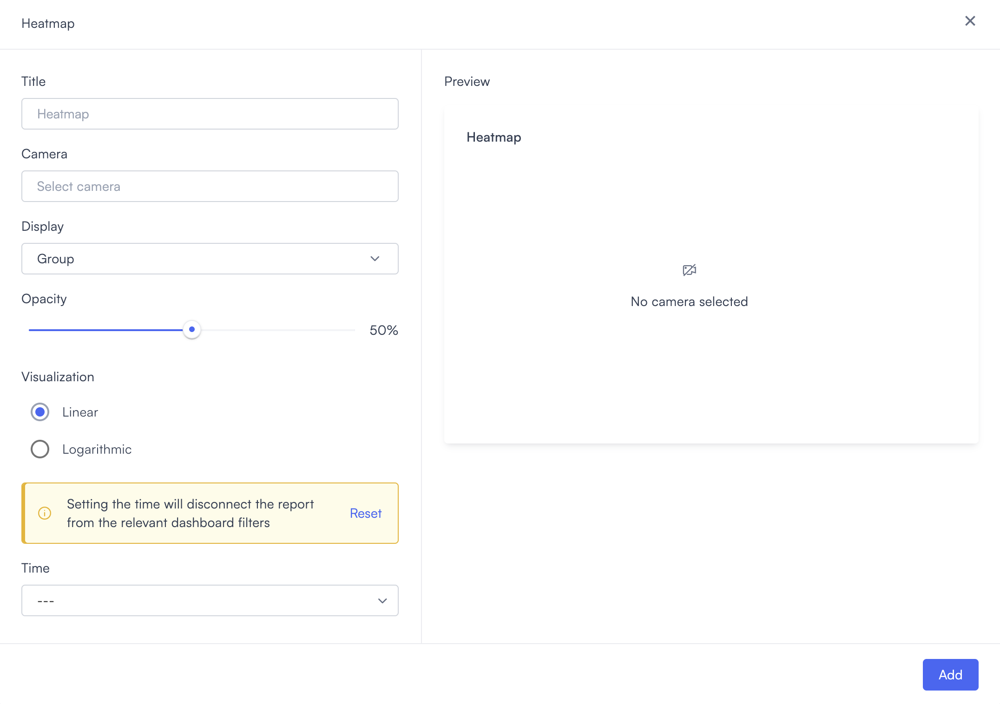
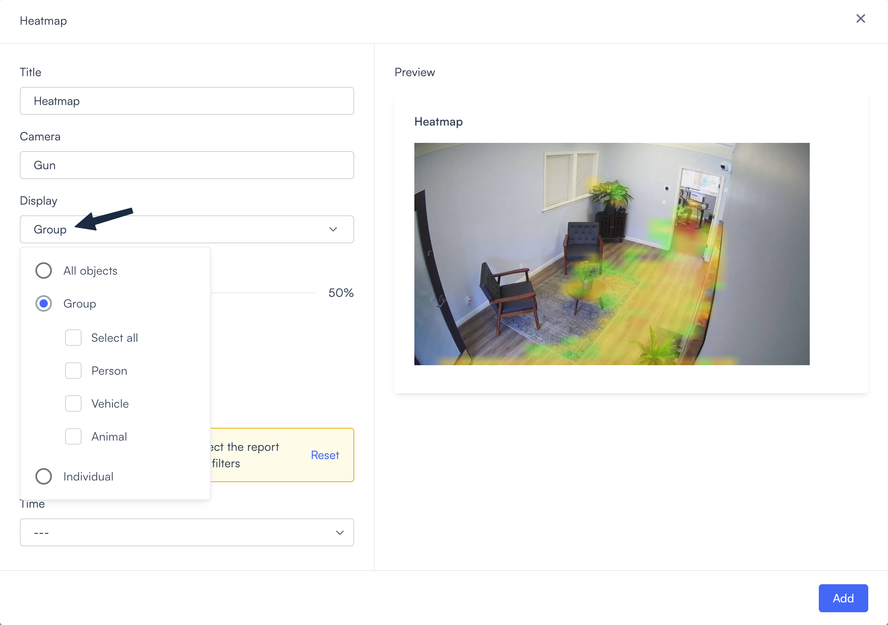
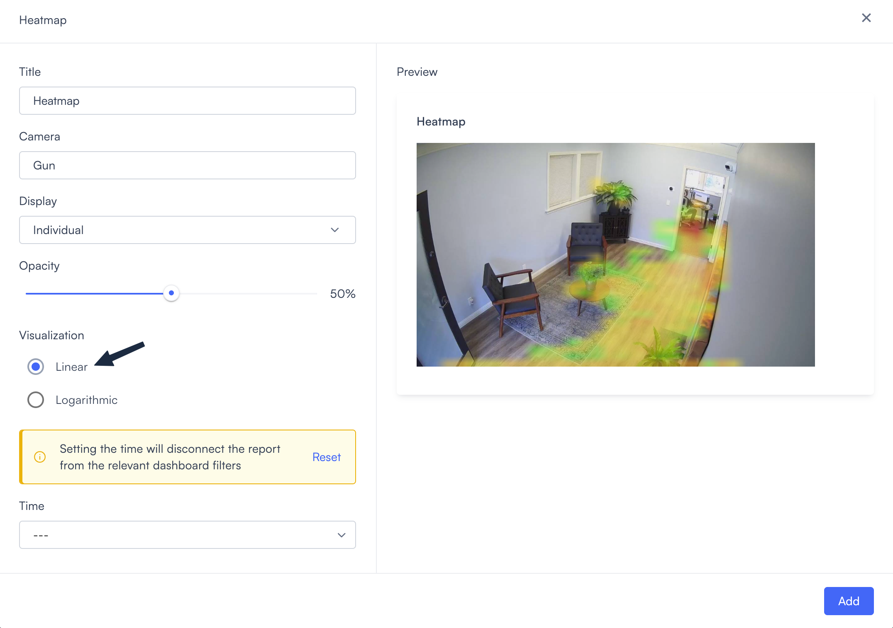
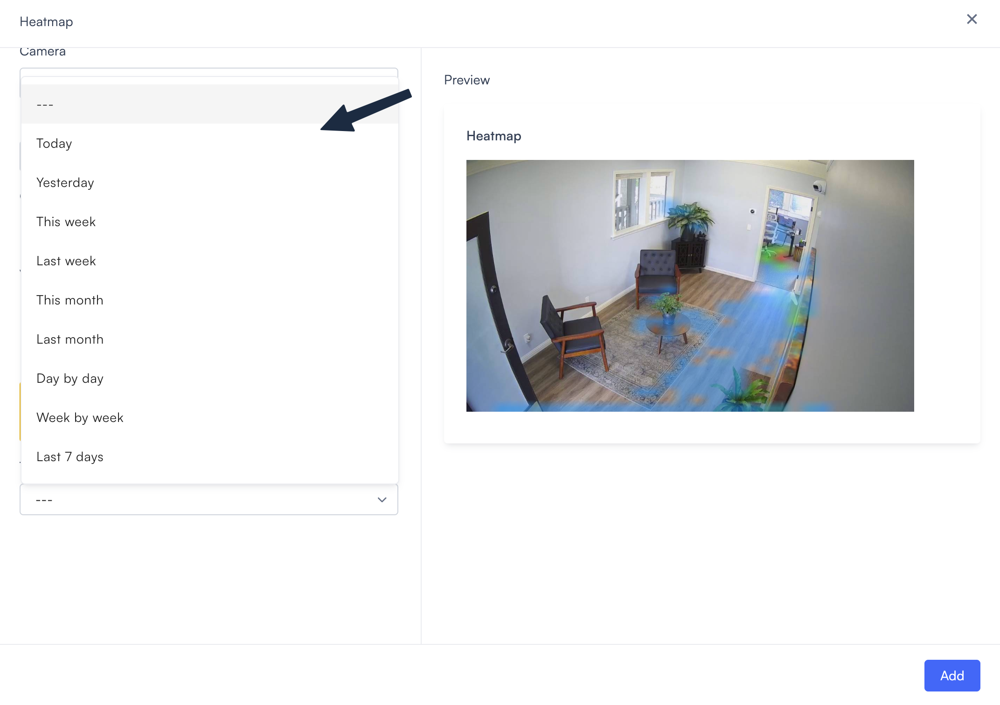

# Heatmap

The Heatmap widget shows where activity is concentrated in a camera's field of view. It overlays a color-coded map on the camera feed, with more intense colors indicating higher detection activity.

Use this widget to understand movement patterns: which entrance gets the most traffic, where people tend to congregate, or which areas see the most activity over a given period.

## Prerequisites

Before you can add a Heatmap widget, you need at least one camera configured and online in your system.

## Add a Heatmap widget

Adding a Heatmap widget opens a single configuration dialog where you select a camera, set the display mode, and choose a time range.

1. From the dashboard canvas, select **Add widget** in the top right corner. A dropdown lists the five widget types.
2. Select **Heatmap**. The configuration dialog opens.

3. Enter a name in the **Title** field.
4. Enter a camera name in the **Camera** field or select one from the list.

 The preview panel on the right updates to show that camera's view.

5. Set the **Display** mode. The options are covered in [Display mode](#display-mode) below.
6. Adjust the **Opacity** slider.
7. Select a **Visualization** scale. The options are covered in [Visualization scale](#visualization-scale) below.
8. Optionally, set a widget-level **Time** range. If you leave this as `---`, then the widget follows the dashboard time filter.
9. Select **Add**.

With the widget added, the heatmap renders on the dashboard canvas using the settings you configured.

## Camera

The **Camera** field lists all cameras configured in your system. The Heatmap widget displays activity from a single camera at a time. To compare activity across multiple cameras, add a separate Heatmap widget for each one.

## Display mode

The **Display** setting controls which detected object types the heatmap visualizes. Select the dropdown to choose a mode.

- **All objects**: Tracks every detected object type across the camera feed.
- **Group**: Shows activity grouped by object category. Select **Person**, **Vehicle**, or **Animal**, or use **Select all** for all three.
- **Individual**: Shows activity for specific detected subjects, such as Unknown person, Adult male, or Bus. The options shown depend on what the camera has detected.

With your display mode set, you can control how strongly the overlay appears on the camera image.

## Opacity

The **Opacity** slider controls how much the heatmap overlay covers the underlying camera image. Drag it left for a more transparent overlay, or right for a more opaque one. The default is 41%.

With opacity set, you can choose how the color scale represents activity intensity.

## Visualization scale

The scale affects how differences in activity density are represented across the overlay.

- **Linear**: Activity values map directly to color intensity, so the busiest areas appear most intense. Use this to quickly identify high-traffic zones, chokepoints, or entry points. Low-activity areas appear faint or empty.

- **Logarithmic**: Compresses high-activity areas and expands low-activity ones on the color scale. Use this when one area dominates the data so heavily that everything else appears flat, for example, when you suspect movement in a rarely used exit or a low-traffic zone that a linear scale would hide.

With your visualization scale set, you can optionally lock the widget to a specific time range.

## Widget-level time

Each Heatmap widget can have its own time range, independent of the dashboard filter. Set it in the **Time** dropdown at the bottom of the configuration dialog.

> **Note:** Setting a widget-level time disconnects the widget from the dashboard time filter. To reconnect it, then clear the widget's time setting back to `---`.

## Edit or delete the widget

You can update or remove the widget at any time while the dashboard is in edit mode.

To edit the widget:

1. Select the **edit icon** (pencil) in the top right corner of the dashboard. The tooltip reads **Edit dashboard**.
2. Select the **edit icon** on the widget. The same configuration dialog opens with your current settings.
3. Update the settings and select **Save**.

To delete the widget, select the **delete icon** on the widget while in edit mode.
