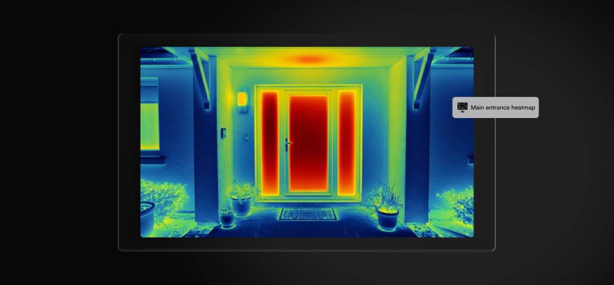
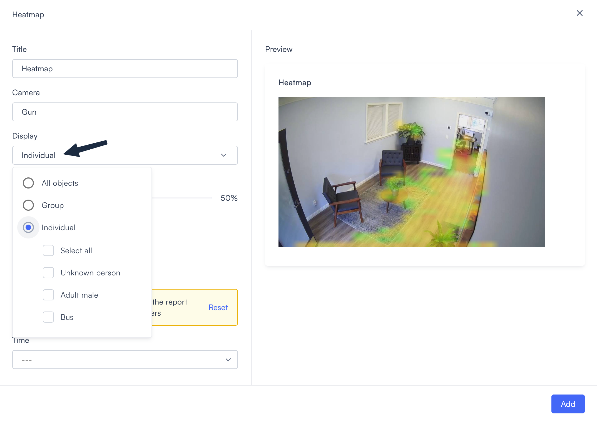
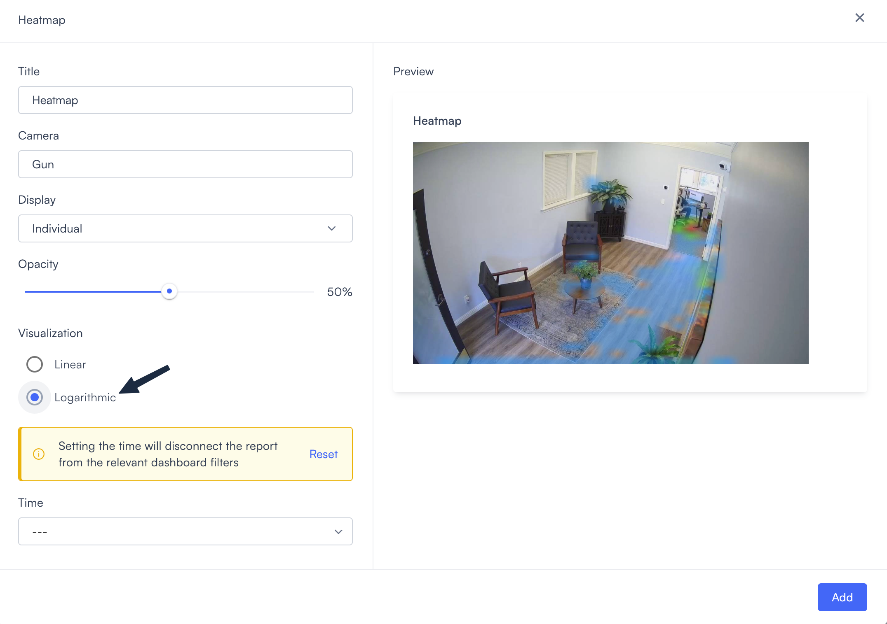

# Heatmap

A Heatmap widget shows where activity is concentrated in a camera's field of view. It overlays a color-coded map on the camera feed, with more intense colors indicating higher detection activity.

Use this widget to understand movement patterns: which entrance gets the most traffic, where people tend to congregate, or which areas see the most activity over a given period.

## Prerequisites

A Heatmap widget requires that your system contain at least one camera that is configured and online.

## Add a Heatmap widget

Adding a Heatmap widget opens a configuration dialog where you select a camera, set the display mode, and choose a time range.

1. While [creating your dashboard](../create-and-manage-dashboards.md#create-a-dashboard), or while it is in [edit mode](../create-and-manage-dashboards.md#edit-a-dashboard), select **Add widget** in the top right corner. Select **Heatmap** from the list that appears. The configuration dialog opens.

2. Enter a name in the **Title** field.
3. Choose a camera from the **Camera** field.


The Heatmap widget displays activity from a single camera at a time. To compare activity across multiple cameras, add a separate Heatmap widget for each one.


4. Select **Select.** The preview panel on the right updates to show the view from the selected camera.
5. Use the **Display** field to select which objects to track in the camera's view.

Your options are as follows:

* **All objects**: All detectable objects are included.
* **Group**: Only objects in the selected category or categories are included. Some examples of categories: **Person**, **Vehicle**, **Animal**, **Shopping cart**, and **Container**.
* **Individual**: Filter by specific detected subjects. The options available depend on what your cameras have detected.

6. Adjust the **Opacity** slider. This controls how much the heatmap overlay covers the underlying camera image. Drag it left for a more transparent overlay, or right for a more opaque one. The default is 50%.
7. Select a Visualization scale. Your options are **Linear** and **Logarithmic.**\
   In general, choose **Linear** if you want to track high-traffic zones, chokepoints, and entry points. Choose **Logarithmic** if you want to spot isolated cases of activity in unusual areas.\
   The [Linear vs. Logarithmic](heatmap.md#linear-vs.-logarithmic) section below explains these in more detail.
8. Optionally, set a **Time** range that the heatmap will cover.

If you set this to `---`, then this widget will use [the time range that is set for the dashboard as a whole](../filter-a-dashboard.md#time-range).

9. Select **Add** in the lower right. The heatmap appears on the dashboard canvas using the settings you configured.

## Linear vs. Logarithmic

You can choose between **Linear** and **Logarithmic** for the Visualization setting. Here’s what each one does:

* **Linear**: The color of a pixel reflects the _raw_ number of objects detected in that area. Additional detections change the color value at a constant rate. \
  Example: Imagine a case where the color of a pixel happens to change with every 10 detections. It will change by the same amount whether the number increases from 0 to 10 or from 1,000 to 1,010.\
  Use **Linear** when you want to identify and compare high-traffic and very-high-traffic areas. An increase from 1,500 people to 1,600 people stands out because the color shifts 10 times.\
  Avoid it when you want to spot isolated cases of activity in forbidden or unusual areas; even a jump from 1 to 8 is not large enough to change the color of a pixel.

* **Logarithmic**: The color of a pixel reflects the _relative_ number of objects detected in an area. Additional detections change the color value only if they represent a meaningful increase.\
  Example: Imagine a case where the color of a pixel happens to change whenever the number of detections doubles. It will change by the same amount whether the number increases from 10 to 20 or from 3,000 to 6,000.\
  Use **Logarithmic** when you want to identify unusual activity in low-traffic areas, such as forbidden zones or emergency exits. An increase from 1 to 8 detections stands out because the color shifts 4 times. \
  Avoid it when you want to compare high-traffic and very-high-traffic areas; an increase from 1,500 to 1,600 people isn't meaningful enough to change the color of a pixel.

