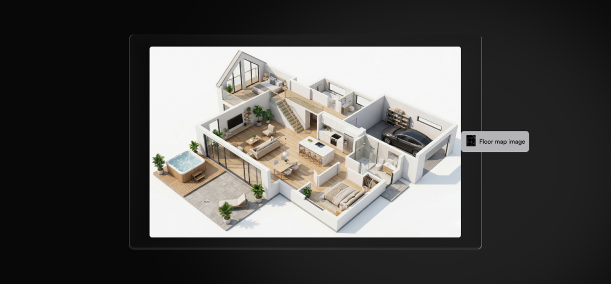
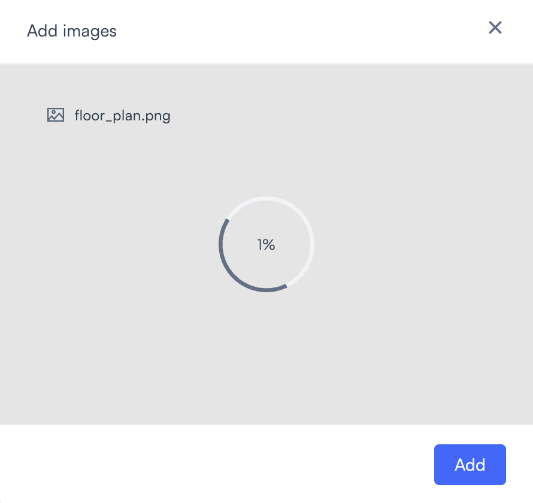
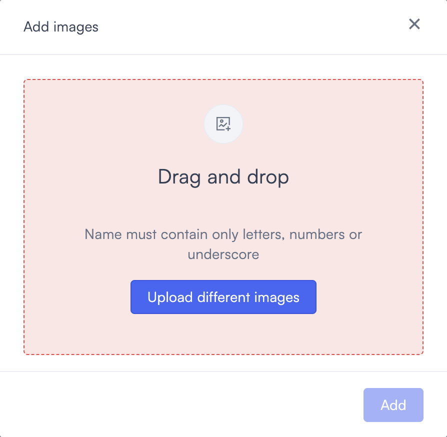

# Image

<figure><figcaption></figcaption></figure>

The Image widget displays a static image on your dashboard. Use it to add a floor plan, site map, or reference photo. It helps put your camera data in context alongside the other widgets on your dashboard.

## Add an Image widget

Before uploading, confirm that your file is a PNG or JPG and that its name contains only letters, numbers, and underscores.

1. While [creating your dashboard](https://app.gitbook.com/o/j4bw8XbXYB2hlb70Ntmo/s/5hwf4HoJ2sd0Q0VlFYar/dashboards/create-and-manage-dashboards/~/comments#create-a-dashboard), or while it is in [edit mode](https://app.gitbook.com/o/j4bw8XbXYB2hlb70Ntmo/s/5hwf4HoJ2sd0Q0VlFYar/dashboards/create-and-manage-dashboards/~/comments#edit-a-dashboard), select **Add widget** in the top right corner. Select **Image** from the list that appears. The configuration dialog opens.

3. Drag an image file into the upload area, or select **Or upload from your computer** to browse and select a file. When the file loads successfully, the dialog shows the file name, and the **Add** button becomes active.

4. Select **Add**. The image appears on the dashboard canvas.

## File names

File names must contain only letters, numbers, and underscores. Spaces, hyphens, and other special characters are not allowed.

If the file name is invalid, the upload area highlights in red and shows the message: "Name must contain only letters, numbers, or underscores." Select **Upload different images** to choose a renamed file. The **Add** button stays disabled until a valid file is uploaded.

With a valid file name, the upload proceeds normally.

## Supported file types

The Image widget accepts PNG and JPG files only. SVG, GIF, WebP, and other formats are not supported. If your image is in an unsupported format, convert it to PNG or JPG before uploading.

## Troubleshoot upload issues

If the upload area turns red after you drop or select a file, the file name is invalid. The upload area shows the message: "Name must contain only letters, numbers, or underscores." Rename the file to contain only letters, numbers, and underscores, then select **Upload different images** and try again.

If the upload shows a progress indicator but takes a long time, the file may be too large. The larger the file, the longer the upload takes. Images above 15 MB may stall without showing an error. Close the dialog, reduce the file size, and upload again.

## Edit or delete the widget

You can replace the image or remove the widget at any time while the dashboard is in edit mode.

To edit the widget:

1. Select the **edit icon** on the widget.
2. Upload a new image and select **Save**.
