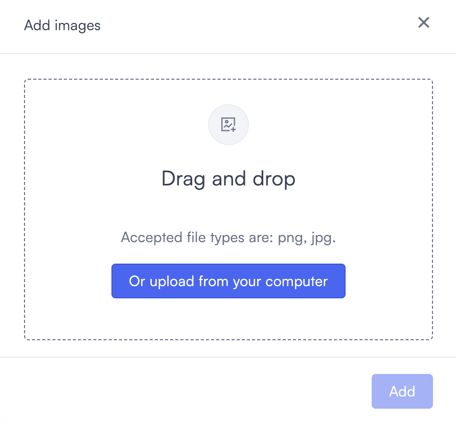
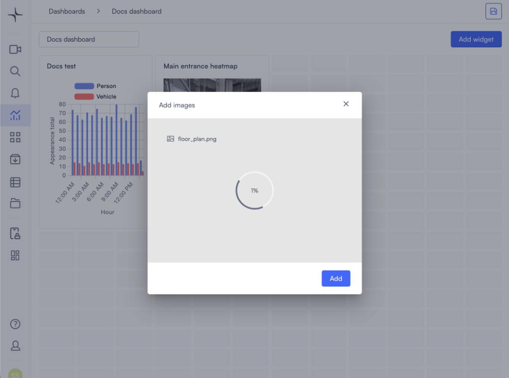

# Image

The Image widget displays a static image on your dashboard. Use it to add a floor plan, site map, reference photo, or any visual that helps put your data in context — for example, a building layout alongside your occupancy and heatmap widgets.

## Add an Image widget

1. Open a dashboard and select **Add widget**.
2. Select **Image**. The **Add images** dialog opens.

When the dialog first appears, you see the empty upload state: a dashed **Drag and drop** area, text that accepted types are **png** and **jpg**, and a control to choose a file from your computer (**Add** stays in the bottom corner for when you are ready to place the widget on the dashboard).

3. Drag an image file into the upload area, or use the control in the dialog to browse and select a file from your computer.
4. Wait until the upload progress finishes (when the dialog shows a progress ring, let it complete). Then select **Add** to place the image on the dashboard canvas.

After you add the widget, the image appears on the dashboard canvas; use [Resize the widget](#resize-the-widget) in edit mode to adjust how much space it uses.

## File names

File names must use **only letters, numbers, and underscores**. Spaces, hyphens, and other special characters are not allowed. If the name is invalid, the upload area is highlighted in red and shows: **Name must contain only letters, numbers or underscore.** Use **Upload different images** to choose a renamed file. **Add** stays disabled until a valid file is ready.

## Supported file types

The Image widget accepts **PNG** and **JPG** files only. SVG, GIF, WebP, and other formats are not supported.

## If upload stalls or the image never appears

Sometimes the progress indicator moves slowly or stays near **1%** for a long time, or the image does not show on the dashboard after you select **Add**.

Try the following:

- **Rename the file** so it contains only letters, numbers, and underscores, then upload again.
- Confirm the file is **PNG** or **JPG** and not unusually large; very large files can take longer or time out on slower networks.
- Select **Upload different images** (or close the dialog and open it again) and retry the upload.
- Check your network connection. If the issue continues, contact Lumana support.

## Resize the widget

With the dashboard in **edit mode** (select the **edit icon** / pencil in the top right), drag the edges or corners of the widget to resize it to fit your layout.

## Edit or delete the widget

To replace the image:

1. Select the **edit icon** (pencil) in the top right — tooltip **Edit dashboard**.
2. Select the **edit icon** on the widget.
3. Upload a new image and select **Save**.

To delete the widget, select the **delete icon** while in edit mode.

## Next steps

- [Text](text.md) — add labels or descriptions to your dashboard.
- [Create and manage dashboards](../create-and-manage-dashboards.md) — arrange and manage your full dashboard layout.
