# Occupancy

The Occupancy widget tracks the number of people or vehicles in a defined space at any given time. It counts entries and exits by detecting people who cross a line you draw in the camera's view and uses those crossings to maintain a running occupancy count.

Use this widget to monitor space capacity, understand when areas are busiest, and compare occupancy across business hours and days of the week.

## Prerequisites

Before you add an Occupancy widget, you need at least one camera with a Traffic control configured. The widget uses Traffic control line crossings to count entries and exits. If you haven't set one up yet, you'll be prompted to do so during the widget setup flow.

With your prerequisites in place, you're ready to add the widget to a dashboard.

## Add an Occupancy widget

Adding an Occupancy widget takes you through the main configuration dialog and an entrance and exit setup flow. You'll draw line crossings directly on your camera's live feed during this process.

1. Follow **Add a widget** in [Create and manage dashboards](../create-and-manage-dashboards.md#add-a-widget) to open the widget list, then select **Occupancy**. The configuration dialog opens.

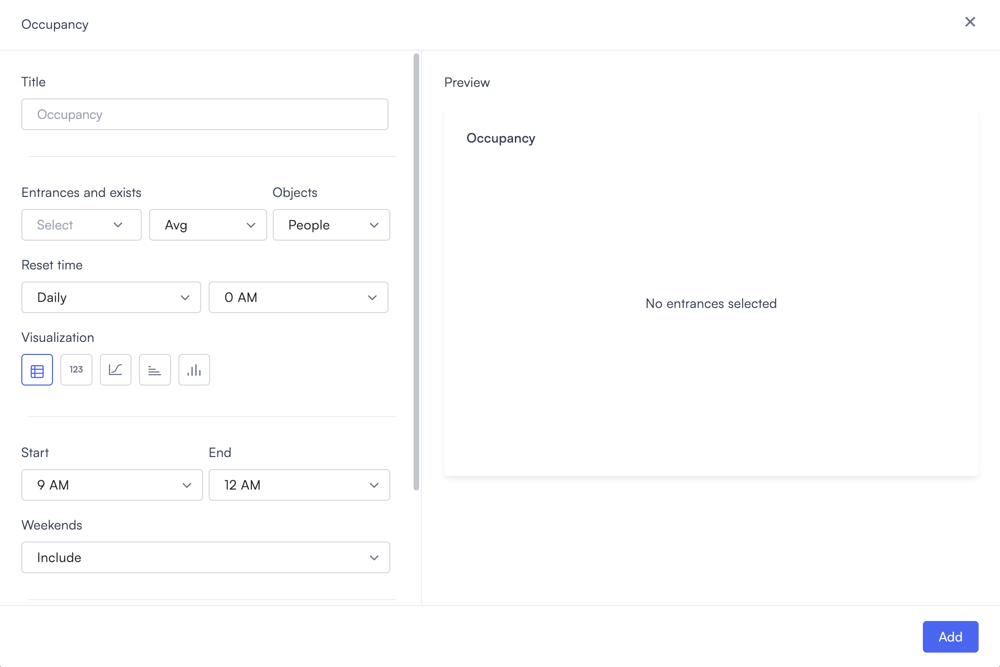

2. Enter a name in the **Title** field. Use a name that identifies what the widget is tracking, for example, "Main entrance occupancy" or "Warehouse floor capacity."
3. In the **Entrances and exits** row, select the **Select** dropdown. Any line crossings you've already configured appear as checkboxes. Select one or more to add them to the widget. If you need to create a new one, then select **+ Entrance and exit** to open the camera picker.

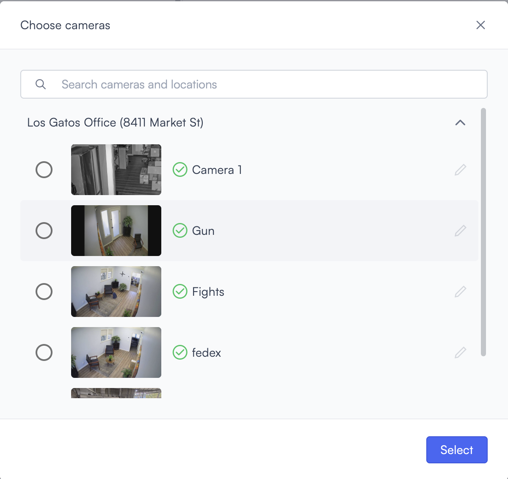

4.  Choose the camera you want to configure, then select **Select**.

    If no Traffic control line crossing exists for that camera, a warning banner appears: "You must select a Traffic control, use the edit button next to the camera to select one."

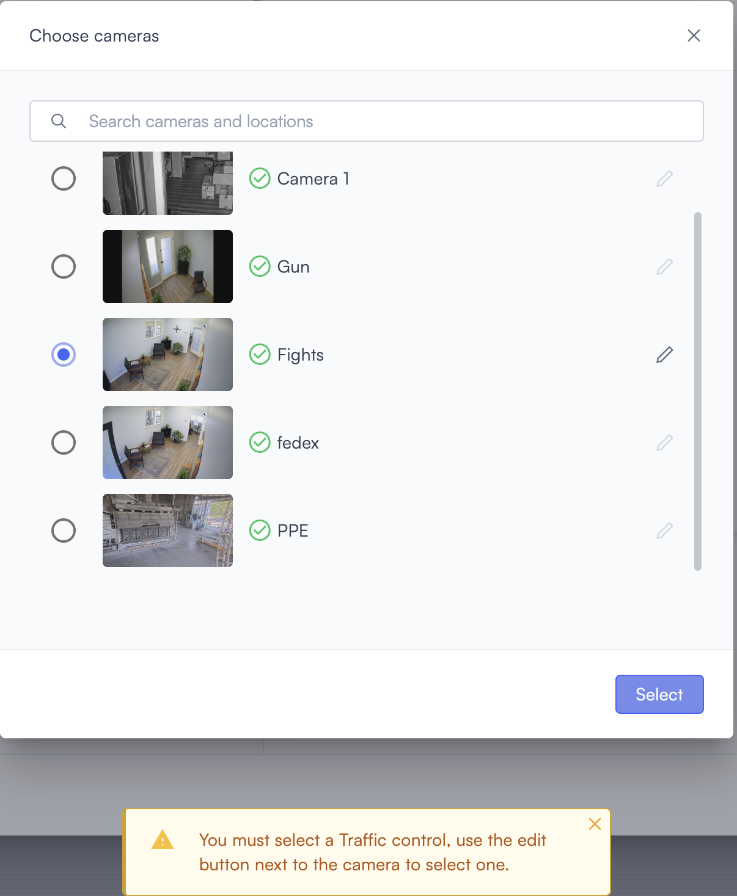

5. Select the **edit icon** next to the camera. The Select line crossing dialog opens over the camera's live feed.

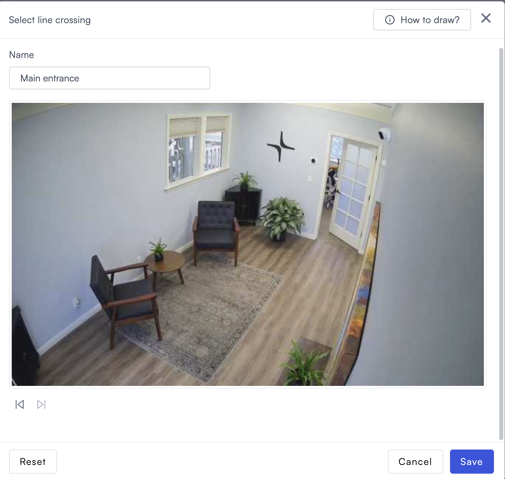

6. Enter a name for this line crossing configuration in the **Name** field at the top, for example, "Main entrance" or "Warehouse door."
7. Select **How to draw?** to open the drawing instructions overlay. The overlay explains that you click once to place the line start point and click again to place the line end point.

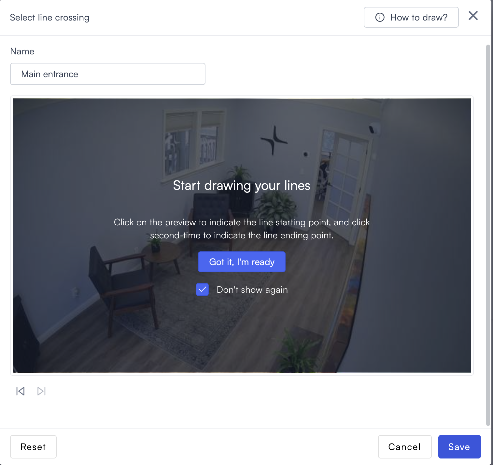

8. Select **Got it, I'm ready** to dismiss the overlay.
9.  Click once on the camera preview to place the line start point. Click a second time to place the line's endpoint. A line appears between the two endpoints spanning the entrance or exit you want to track.

    Each line shows two labels: **In** and **Out**. These indicate which direction of crossing counts as an entry and which counts as an exit. A rotation icon sits between the labels. Select it to flip the direction if needed.

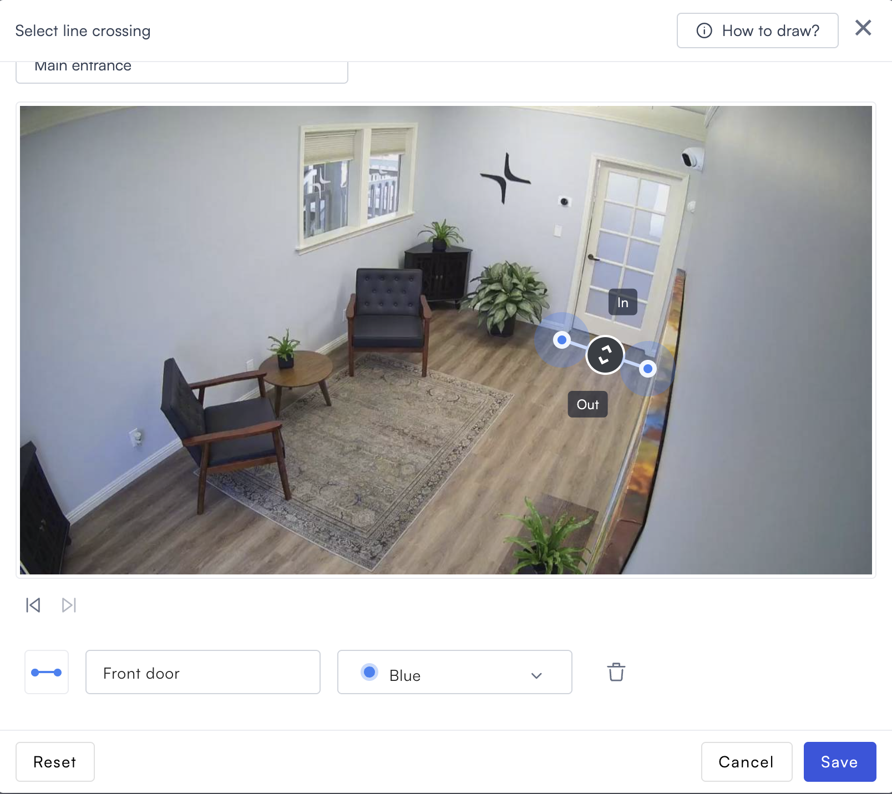

10. Enter a name for this line in the **Name your line** field at the bottom. Use a name that describes the specific crossing point, for example, "Main entrance," "Front door," or "Warehouse exit."
11. Optionally, select a color from the color dropdown. Use different colors if you draw more than one line on the same camera to distinguish them.

    > **Note:** Draw multiple lines on one camera when the space has separate entry and exit points that are both visible in the same camera view, for example, a lobby with distinct in and out doors.
12. To delete a specific line, select the **delete icon** next to that line's name field at the bottom of the dialog. To clear all lines and start over, select **Reset**.
13. Select **Save**. The camera picker opens again.

    > **Note:** There's no confirmation message after saving. Returning to the camera picker without any error confirms that the line crossing was saved successfully.
14. Select **Select** to confirm. A success message appears confirming the line crossing was created, for example, "Main entrance has been created." The message uses the name you entered in the **Name** field.

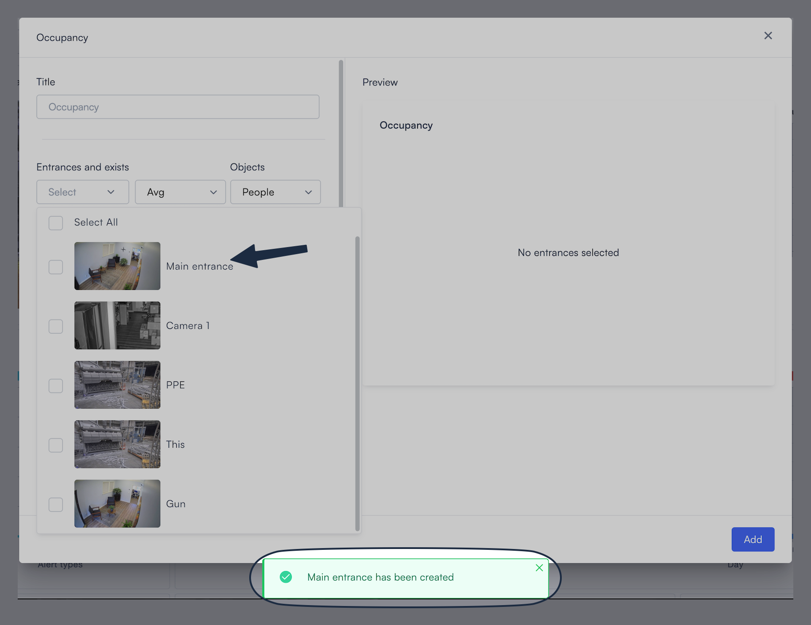

The line crossing name now appears as an option in the **Select** dropdown under **Entrances and exits**.

15. Repeat steps 3 to 14 for additional cameras if needed.
16. Select the **Avg** dropdown to choose which occupancy metrics appear in the widget. Select one or more options. Each selected metric appears as a separate line or data point in the chart.

    * **Avg**: The average occupancy count for the selected period. For example, Monday showing Avg: 16.4 means the average occupancy across Monday's intervals was 16.4 people.
    * **Max**: The highest occupancy count recorded in the selected period. For example, Monday showing Max: 33 means the peak occupancy on Monday was 33 people.
    * **Total in**: The total number of people who entered across the selected period. For example, Monday showing Total in: 363 means 363 entries were recorded on Monday.
    * **Total out**: The total number of people who exited across the selected period. For example, Monday showing Total out: 336 means 336 exits were recorded on Monday.

    > **Note:** The **Total in** and **Total out** options appear over time as the system records entry and exit data.

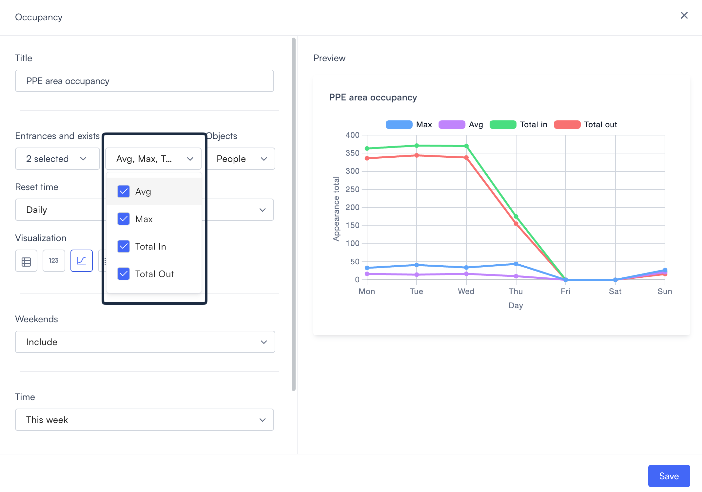

17. Select the **Objects** dropdown to choose which object type the widget counts. The options are **People** and **Vehicles**. The default is **People**.
18. Set the **Reset time**. This controls when the occupancy count resets to zero. The first dropdown sets the frequency, and the second sets the hour.

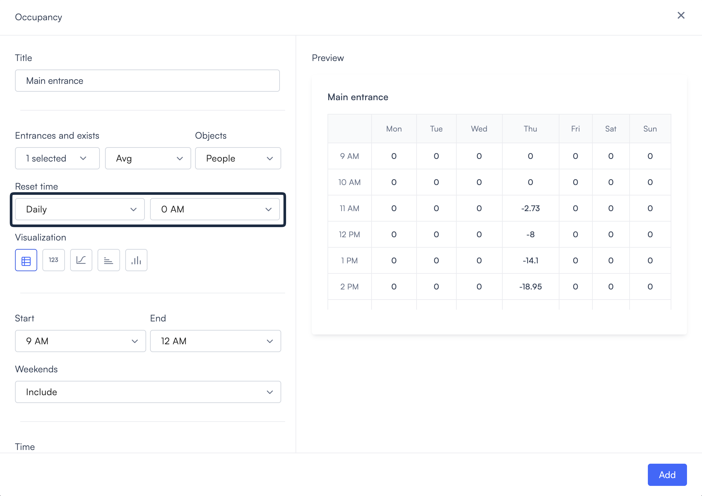

* **Daily**: Resets the count once per day at the hour you set. The default is Daily at 0 AM.
* **Weekly**: Resets the count once per week. Set the day and hour using the two additional dropdowns that appear.

19. Select a visualization type from the icon row. The fields below update based on your selection, and the Time options change depending on which visualization you choose.

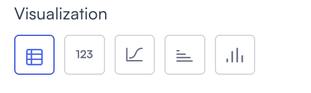

Each visualization type shows different data and requires different fields. The table and counter visualizations have unique field requirements. The chart types all share the same Weekends field and Time options.

| Visualization            | What it shows                                           | When to use                                                                                             | Available fields     | Time options                                   |
| ------------------------ | ------------------------------------------------------- | ------------------------------------------------------------------------------------------------------- | -------------------- | ---------------------------------------------- |
| **Table**                | Occupancy values in a grid, broken down by hour and day | When you want to identify which specific hours on which days have the highest occupancy                 | Start, End, Weekends | This week, Last week, Weekly                   |
| **Counter**              | A single occupancy value based on the selected metric   | When you need a quick at-a-glance number on a dashboard, for example, current average or peak occupancy | None                 | Today, Yesterday, This week, Last week         |
| **Line chart**           | Occupancy trend over the selected period                | When you want to track how occupancy changes across the week or spot patterns over time                 | Weekends             | Today, Yesterday, This week, Last week, Weekly |
| **Horizontal bar chart** | Occupancy by time period, horizontal layout             | When you want to compare occupancy across days side by side and labels are long                         | Weekends             | Today, Yesterday, This week, Last week, Weekly |
| **Vertical bar chart**   | Occupancy by time period, vertical layout               | When you want to compare occupancy across days side by side in a standard bar layout                    | Weekends             | Today, Yesterday, This week, Last week, Weekly |

20. If you selected **Table**, then set the **Start** and **End** fields to define your business hours. The table shows data only within this window. The default is 9 AM to 12 AM.
21. If you selected any visualization other than **Counter**, then set **Weekends**. This controls which days of the week the widget includes.
    * **Include**: Includes all days of the week.
    * **Exclude Friday and Saturday**: Removes Friday and Saturday from the data.
    * **Exclude Saturday and Sunday**: Removes Saturday and Sunday from the data.
22. Set the **Time** range. The default is **This week**. The available options change depending on the visualization you selected.

For the **Table** visualization:

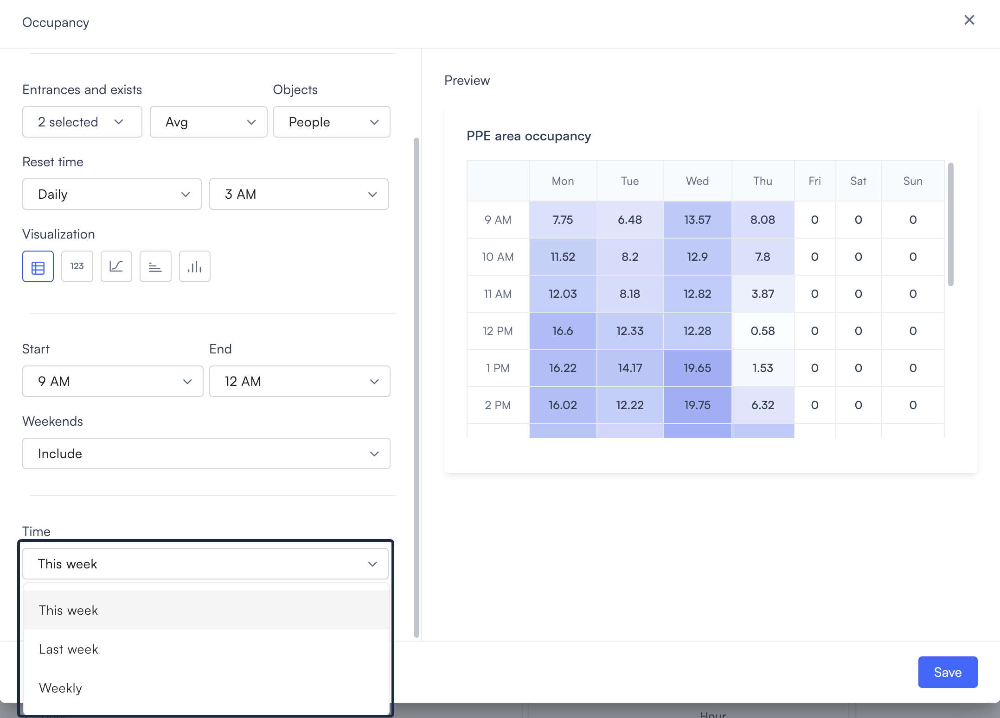

* **This week**: Shows data for the current week only. Days that haven't occurred yet show 0.
* **Last week**: Shows data for the previous week only. Days with no recorded data are shown as 0.
* **Weekly**: Shows occupancy data across all recorded weeks, including weekends.

For the **Counter** visualization:

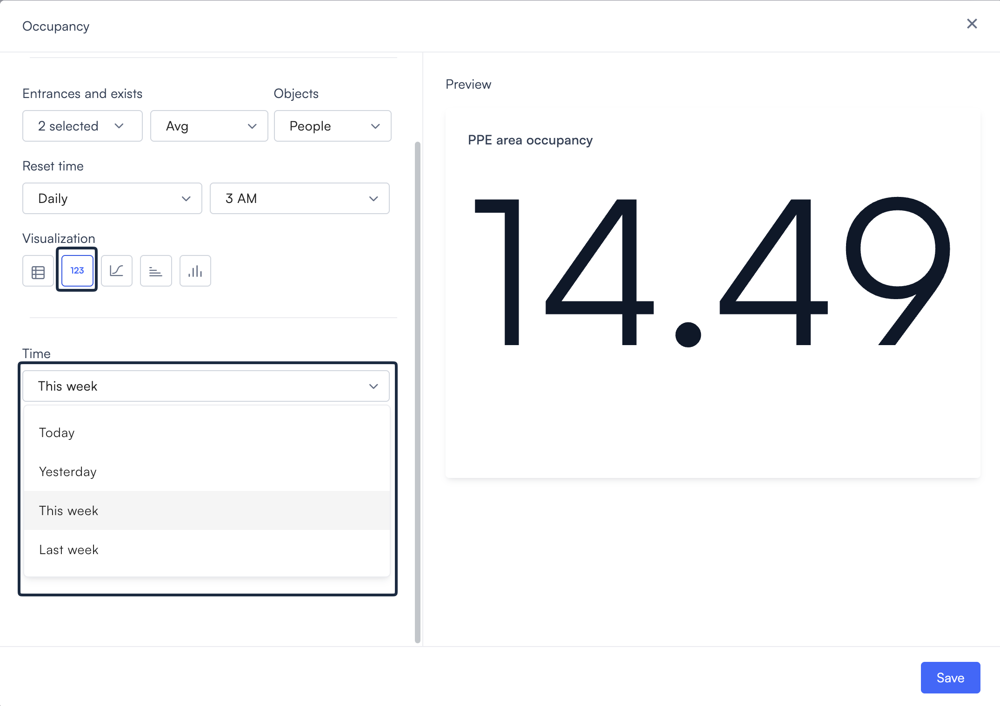

* **Today**: Shows data for today only.
* **Yesterday**: Shows data for yesterday only.
* **This week**: Shows data for the current week.
* **Last week**: Shows data for the previous week.

For the **Line chart**, **Horizontal bar chart**, and **Vertical bar chart** visualizations, the Time options are the same:

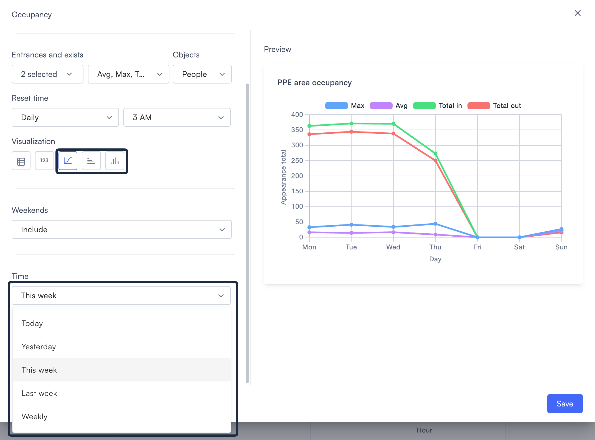

* **Today**: Shows data for today only.
* **Yesterday**: Shows data for yesterday only.
* **This week**: Shows data for the current week.
* **Last week**: Shows data for the previous week.
* **Weekly**: Shows occupancy data across all recorded weeks, including weekends.

23. Select **Add**. The widget appears on the dashboard canvas.

## What the Occupancy table shows

The Table visualization displays a grid with days of the week as columns and hours as rows. Each cell shows the occupancy value for that hour and day, based on the metric you selected in the **Avg** dropdown. For example, with **Avg** selected, a cell showing 16.22 at 1 PM on Monday means the average occupancy during that hour on Monday was 16.22 people. With **Max** selected, the same cell shows the peak occupancy recorded during that hour.

The Start and End settings control which hours appear as rows. Cells are shaded using a heat map. The darker the cell, the higher the occupancy value relative to other cells in the table. Days with no recorded data are shown as 0 and appear unshaded.

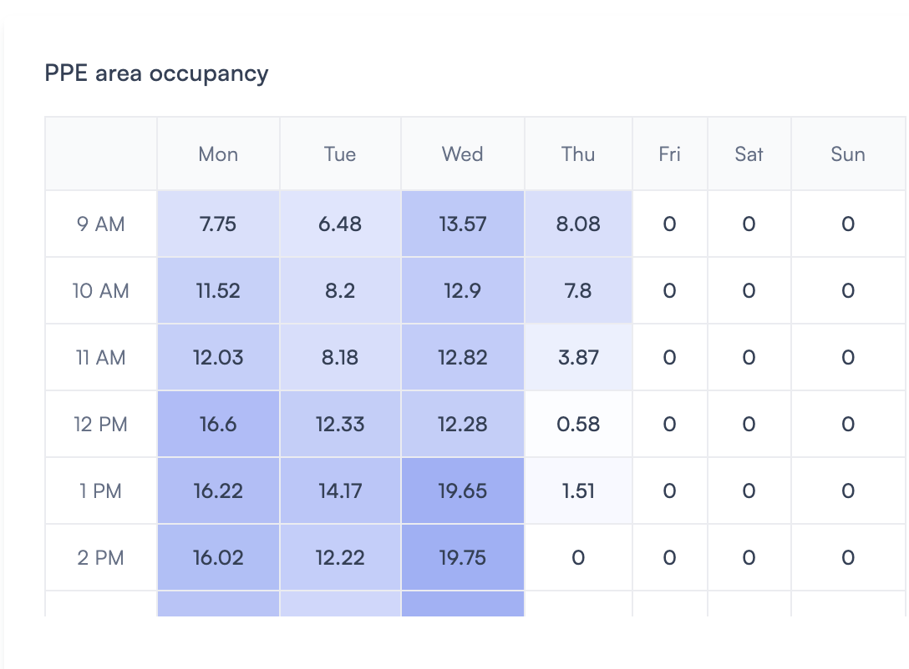

## Edit or delete the widget

To edit the widget:

1. Select the **edit icon** in the top right corner of the dashboard. The tooltip reads **Edit dashboard**.
2. Select the **edit icon** on the widget.
3. Update the settings and select **Save**.

To delete the widget, select the **delete icon** on the widget while in edit mode.
