# Text

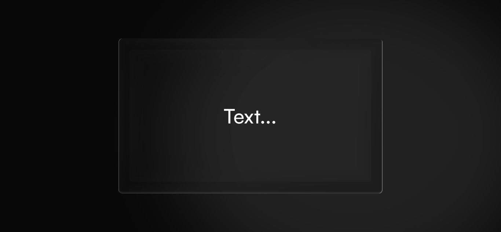

The Text widget adds a formatted text block to your dashboard. Use it to label a group of widgets, describe what a dashboard section shows, or add written context that helps make sense of the data at a glance.

## Add a Text widget

The Text widget opens a rich text editor where you can write and format your content before placing it on the canvas.

1. From the dashboard canvas, select **Add widget** in the top right corner. A dropdown lists the five widget types.
2. Select **Text**. The **Add text** dialog opens.

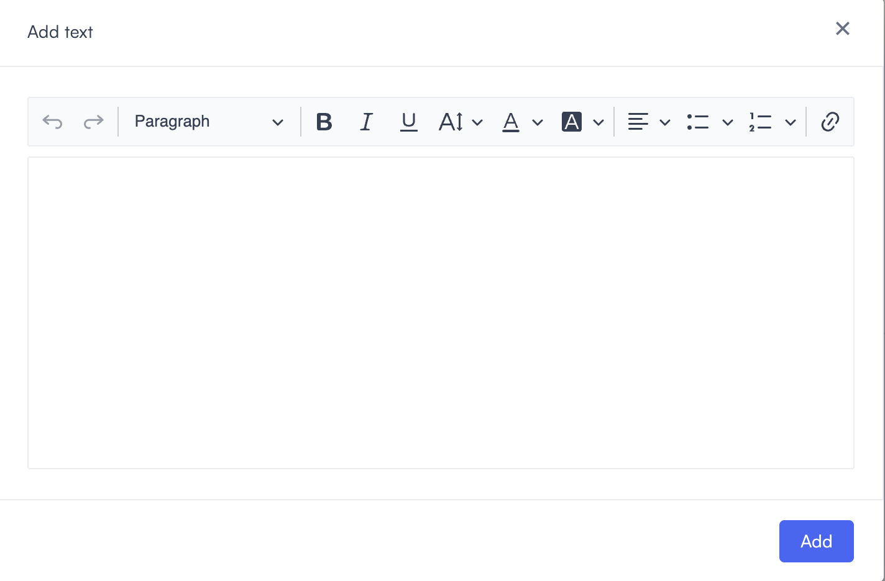

3. Enter your text in the editor area.
4. Use the toolbar to format it. The formatting options are covered in [Formatting options](text.md#formatting-options) below.
5. Select **Add**. The text block appears on the dashboard canvas.

With the widget on the canvas, you can resize it to adjust the amount of space it occupies. The text reflows automatically as you resize.

## Formatting options

The toolbar runs across the top of the editor. Here's what each control does.

### Undo and redo

The undo and redo buttons sit at the far left of the toolbar. Use **Undo** to reverse your last change and **Redo** to reapply it.

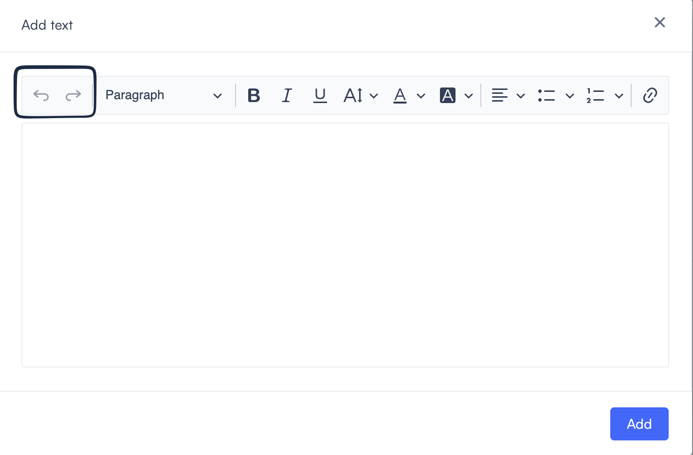

### Paragraph style

The paragraph style dropdown sets the text structure. Select it to choose a style.

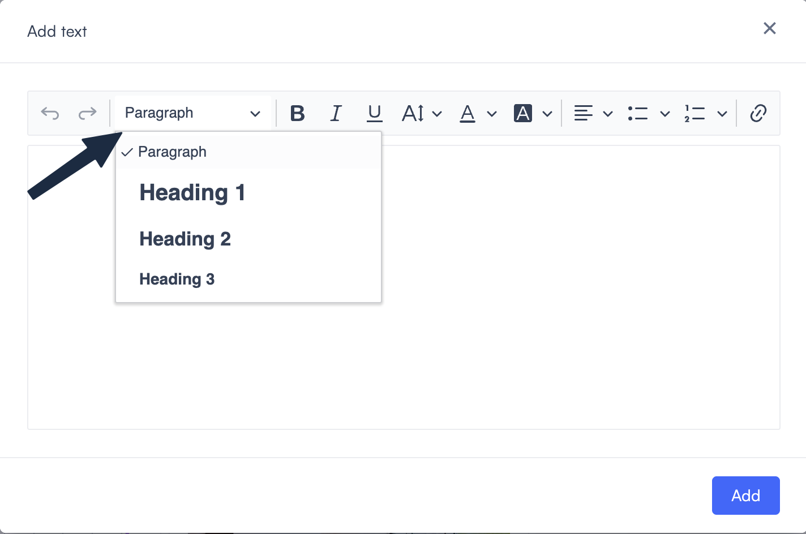

The options are:

* **Paragraph**: Default body text.
* **Heading 1**: Largest heading size.
* **Heading 2**: Mid-size heading.
* **Heading 3**: Smallest heading size.

### Text formatting

Three inline formatting controls sit next to the paragraph style dropdown:

* **Bold**: Makes selected text bold.
* **Italic**: Makes selected text italic.
* **Underline**: Underlines selected text.

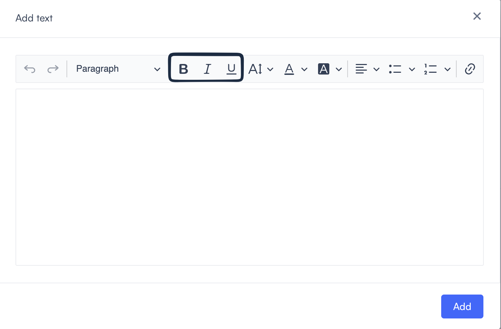

### Font size

The font size selector sets the size of selected text. The available sizes are 12, 14, 18, 24, and 32. The default size applies when no size is explicitly set.

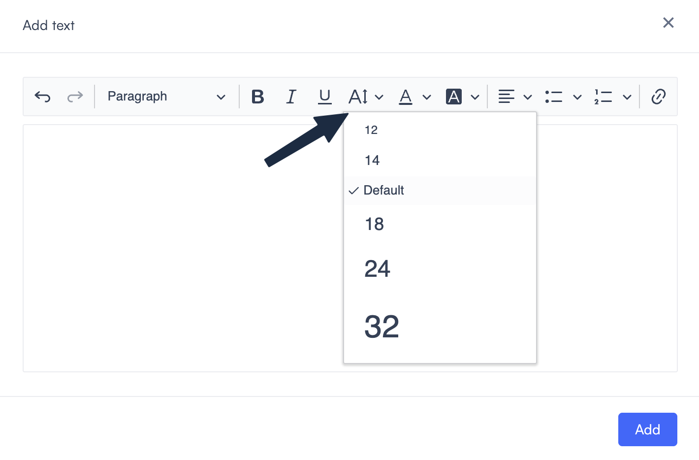

### Font color

The font color control sets the color of selected text. Select it to open the color panel.

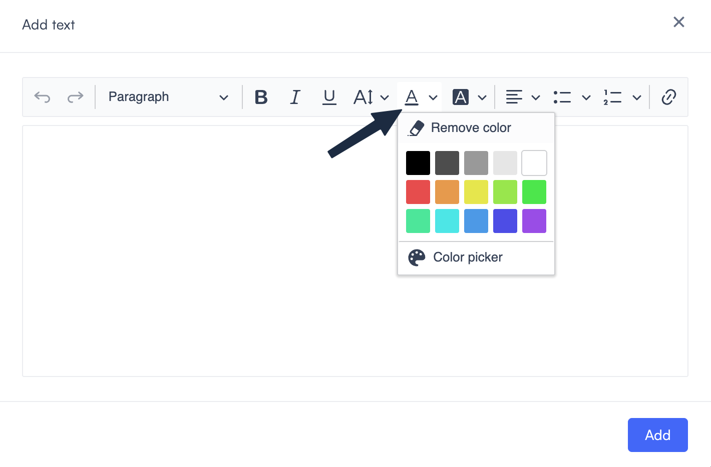

* Select a preset swatch to apply that color.
* Select **Color picker** to choose a custom color.
* Select **Remove color** to clear the color from selected text.

### Highlight color

The highlight color control applies a background color to selected text. It uses the same color panel as the font color control.

### Alignment

The alignment control sets how text is positioned horizontally. Select it to choose between left, center, right, and justify.

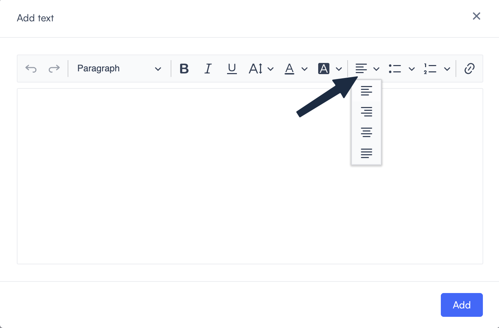

### Lists

The bullet list and numbered list controls each have a dropdown with multiple style options.

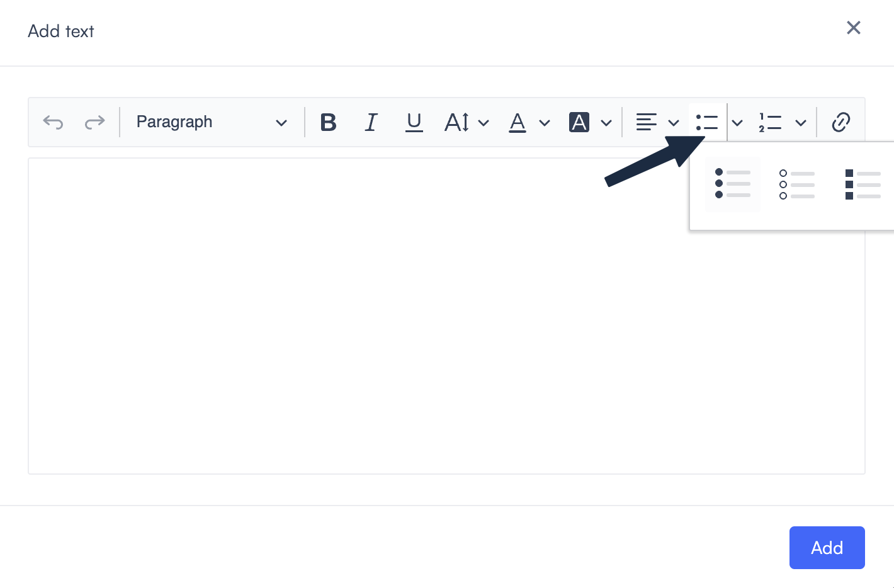

Available bullet list styles: **Disc**, **Circle**, and **Square**.

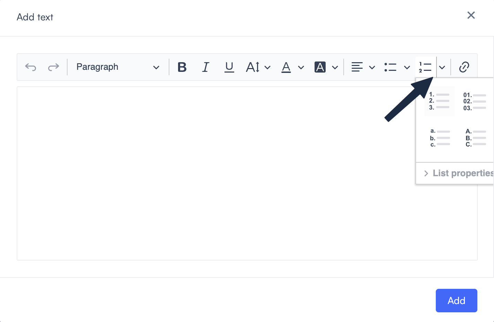

Available numbered list styles: 1. 2. 3., 01. 02. 03., a. b. c., and A. B. C.

Select **List properties** to adjust list settings.

### Link

The link button adds a hyperlink to selected text. Select the text you want to link, then select the link button and enter the URL.

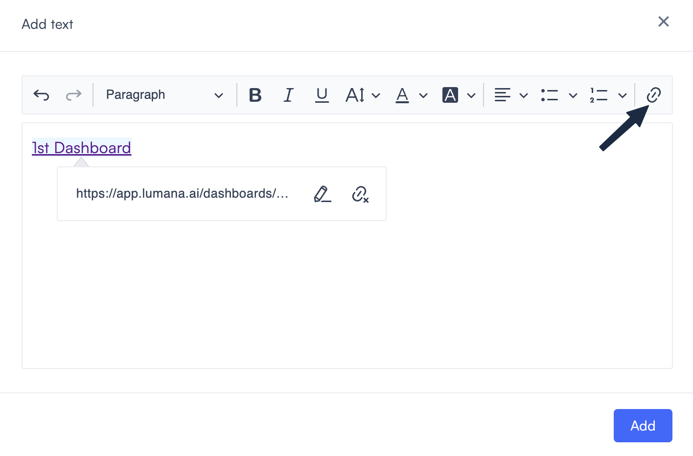

## Edit or delete the widget

To edit or delete the widget, follow the steps in [Edit a widget](../create-and-manage-dashboards.md#edit-a-widget) and [Delete a widget](../create-and-manage-dashboards.md#delete-a-widget) in Create and manage dashboards.
