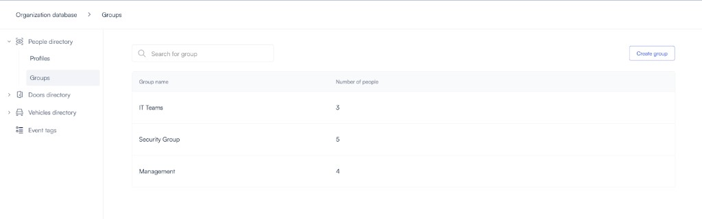
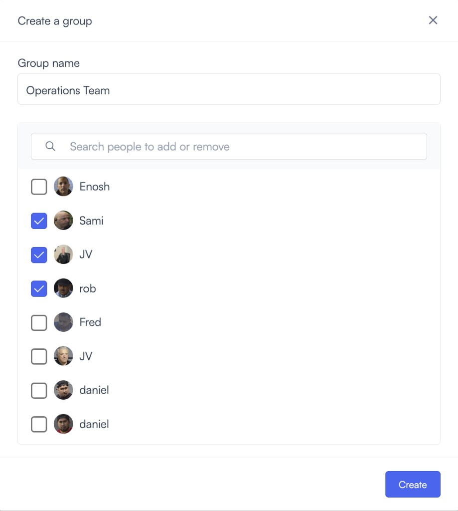
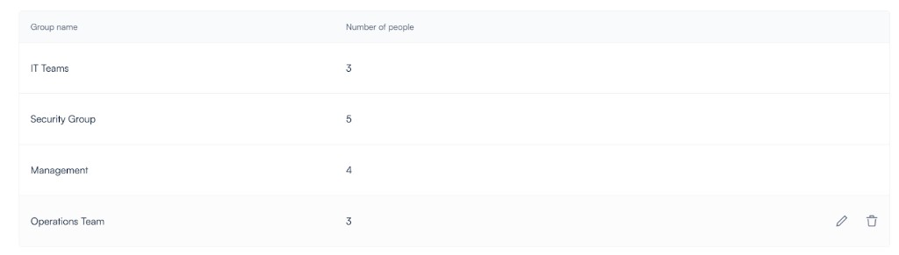
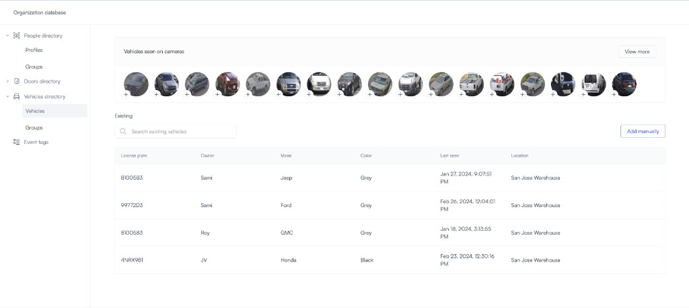
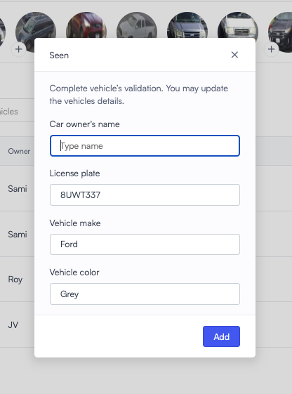
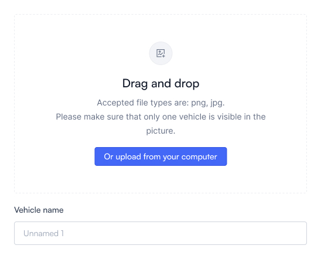
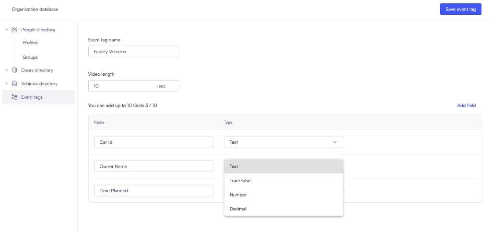
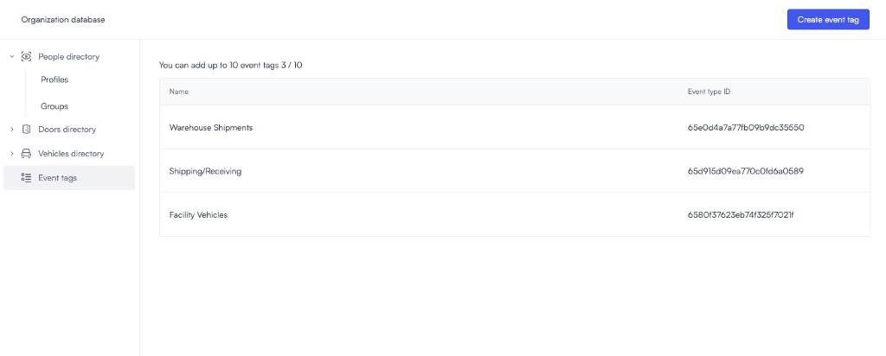
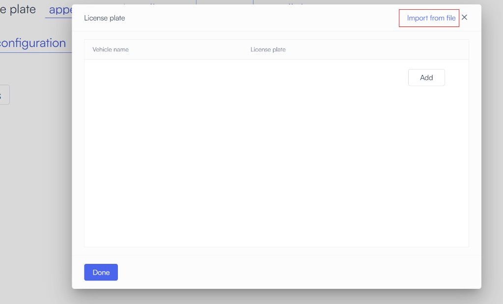
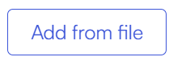

# Build a database of people and vehicles

# Directory

Introducing your organization’s directory in Lumana. Here you have a collection of the Faces, doors and vehicles that have been detected at your organization. You can organize this collection of detected objects by applying data - making it your database! Additionally, you will find Event Tags here. Event Tags enables you to enrich video footage with useful data to assist your team with critical operations. More on Event Tags here [link]

## People Directory 
Your people directory contains Faces that have been detected at your organization. You can assign a profile facial recognition, upload an image to create a profile and designate groups for people at your location(s).

### Profiles

**Unsaved people**
Under unsaved people are the recognitions waiting to be added as a known person. You can find them under the People seen on camera section.

**Saved profiles within your database**

Profiles contain the collection of recognitions you have assigned to a person. Note you can also add a person by uploading an image of their face. See [Working with Lumana Faces](https://support.lumana.ai/hc/en-us/articles/13972302272658) for more information on how to manage Faces.

 

### Groups
Under groups, Luman enables your team to organize the individuals at your organization further by adding profiles to unique groups.

*Notice: Groups works similarly for all items in your Directory*.

### Create a new group
Step 1: Select create group

Step 2: Give your group a name & select the relevant profiles to be added

Step 3: Hover over your group to Edit or Delete

## Doors Directory

### Doors
Any doors seen on camera can be added to your organization's database and used to configure door detection alerts. In this case, your team can activate an alert to trigger when a door is left open for a certain period of time. First, you add the door to the database. Then configure a Door Detection alert.

## Vehicles Directory

### Vehicles
Lumana’s Vehicle directory takes license plate recognition to the next level!

All vehicles detected by license plate on cameras at your organization will be collected here. Similar to people, you can create a database of specific vehicles.

 

**Vehicles seen on camera**
All images collected of any vehicle seen on camera will be collected here.

**List of existing vehicles**
By choosing a vehicle that has been detected on screen, you can add a useful identifying data to create a list of existing vehicles within your organization. 

 

Add vehicle to existing directory
Step 1: Click on the vehicle icon in your ‘Vehicles seen on cameras’ list

Step 2: Provide the name of owner and verify all data

Step 3: Click ‘Add’

Step 4: You can also add a vehicle manually by uploading an image and filling in the relevant details.

You’re all set! You’ve added a vehicle to your organization’s database.

 

## Event Tags
Event Tags enables users to integrate and utilize data from various external systems, on-premise or from the cloud. This feature empowers your team with advanced context based video search.

Here is where you create Event Tags for your organization in a few easy steps:

1. Generate your Public API Key Token
2. Setup Event Tag

   

3. POST Event data

   

For the full article on creating and managing Event Tags see [Enhance Your Video Data with Lumana Event Tag](https://support.lumana.ai/hc/en-us/articles/15928683380114).

A new feature is now available, allowing users to upload a CSV file containing a list of vehicles to the database. By clicking "Add File," users can download a template, input vehicle data, and upload the completed list back to Lumana’s database. This functionality is also accessible during alert creation.

This feature enables customers to efficiently upload multiple vehicles in bulk, either to trigger alerts or exclude them from alerting when entering the property.

 

## Alert creation upload 
When creating a license plate alert, click on the list and select "Import from File" to upload a CSV file.

### DataBase Update 
Under **Organisation** → **Database** → **Vehicles Directory** → **Vehicles**, click the  button to upload your CSV file.