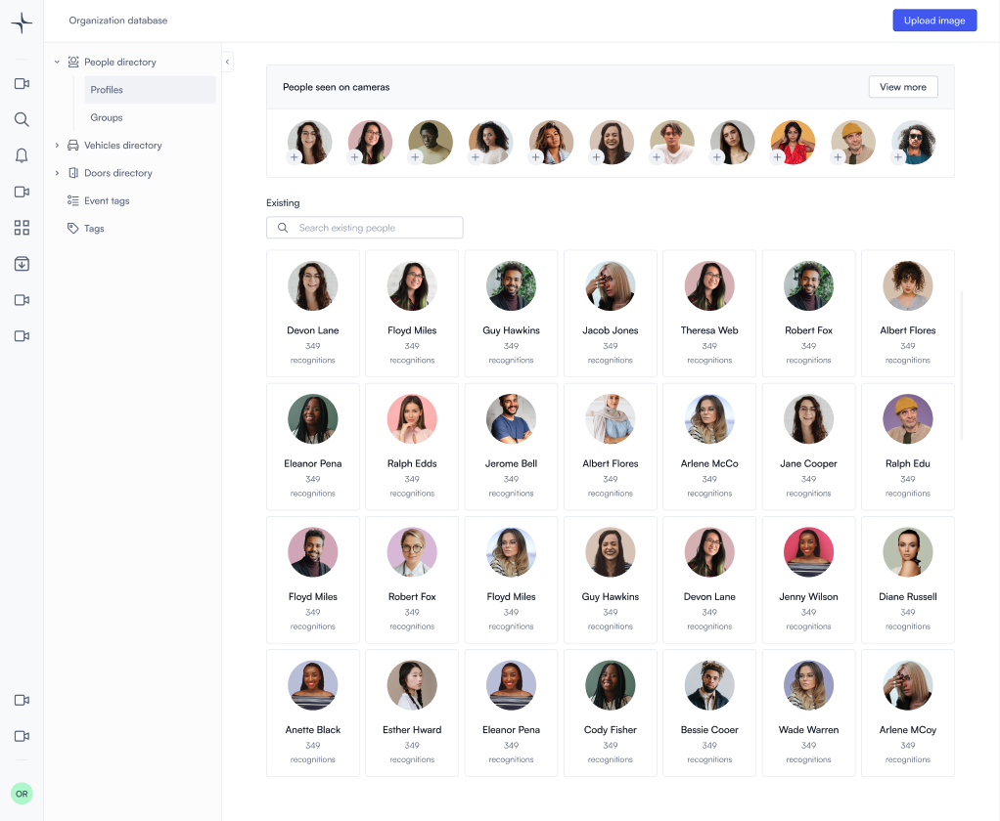
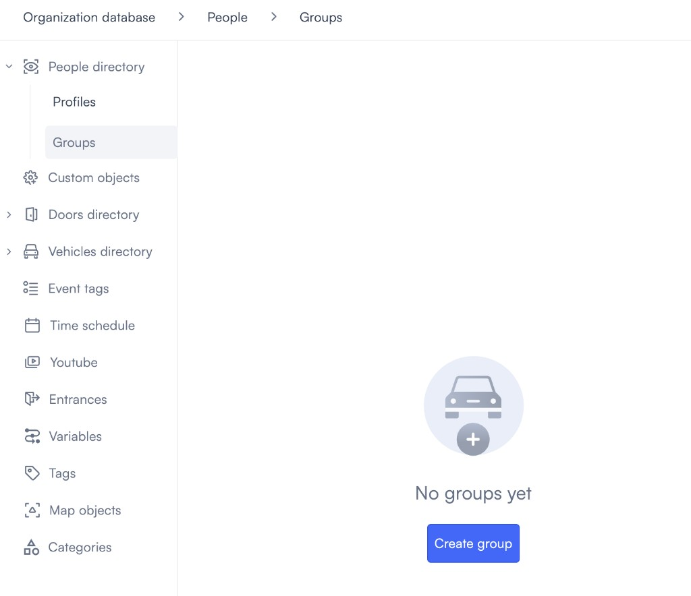
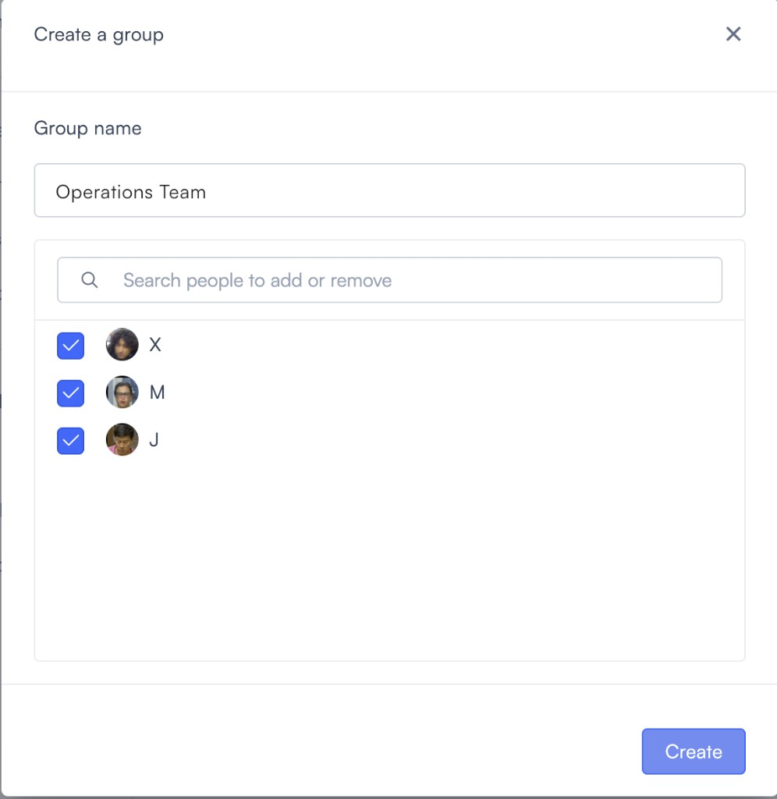
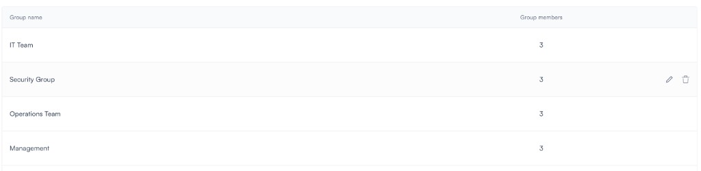
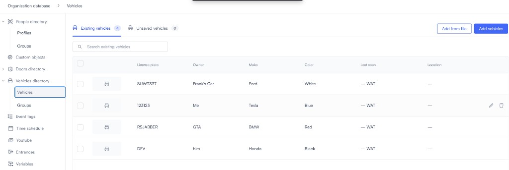
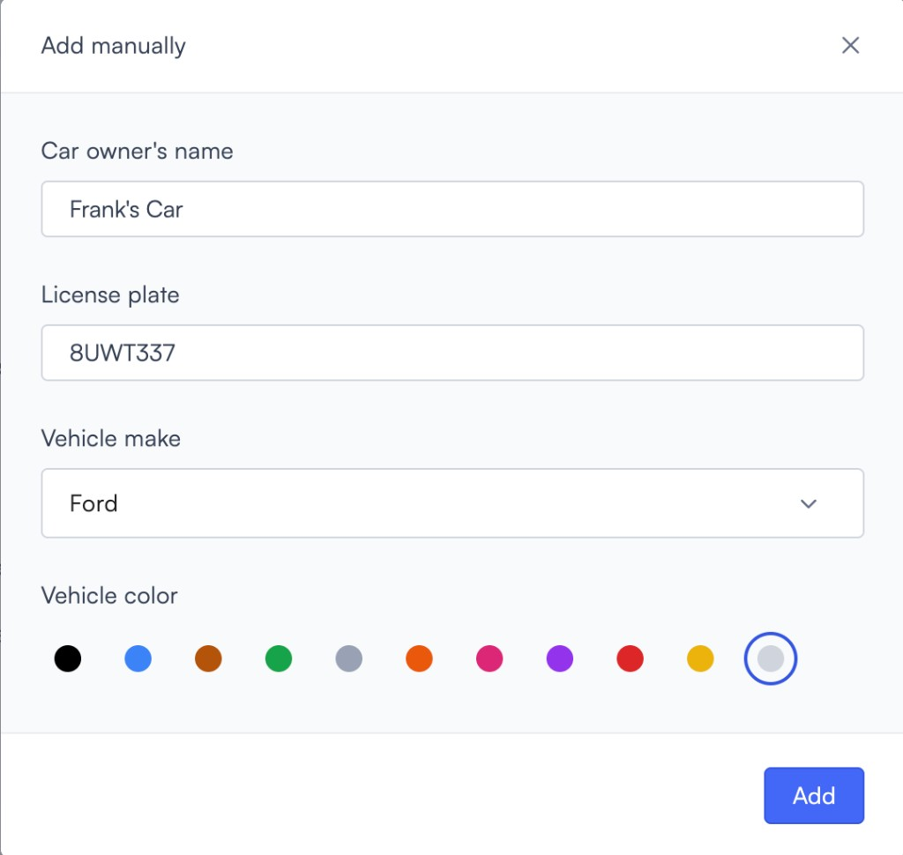
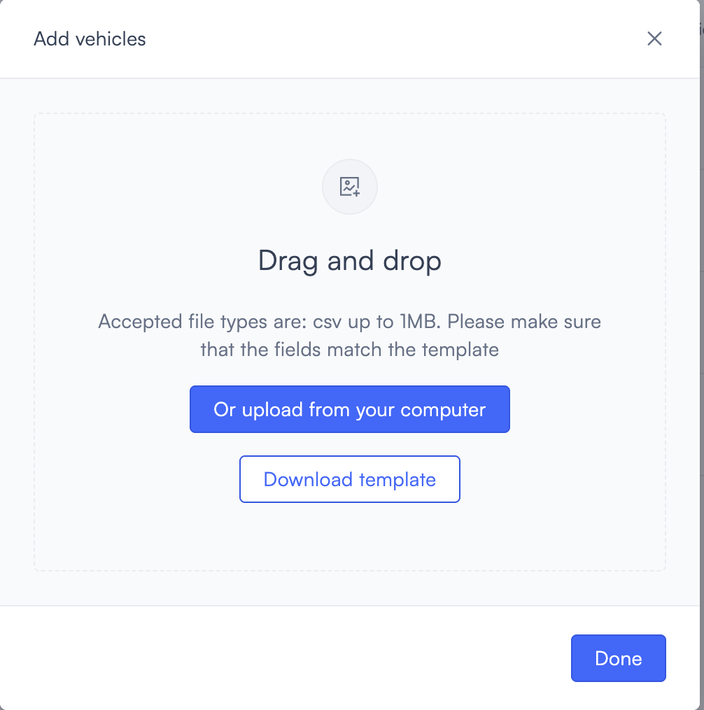
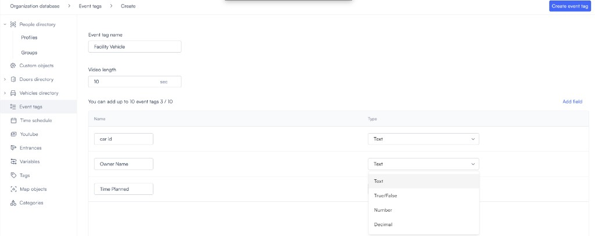
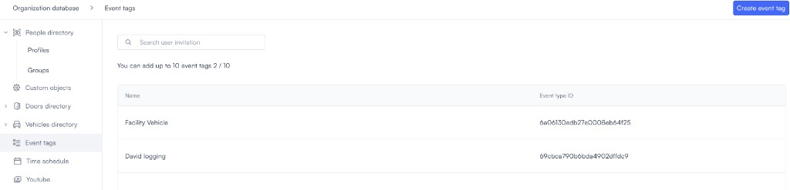

# Build a database of people and vehicles

Use the organization database to organize detected people, doors, and vehicles into a searchable list your team can manage over time. You can also use Event Tags to attach structured external data to video and import vehicle lists in bulk when you need faster setup.

## Prerequisites

Make sure you can open the organization database and edit the people, doors, or vehicles you want to manage. If you plan to use Event Tags or import vehicles from a CSV file, then confirm you have access to those features in your organization.

## Understand the organization database

The organization database stores detected items that Lumana has already identified in your environment. This gives your team one place to review people, doors, vehicles, and event-related data.

People and vehicles can move from detected items into a maintained database entry with names, groups, and other identifying details. Groups work in a similar way across the directory, so once you understand the group workflow for people, the same pattern applies elsewhere.

## Manage people profiles and groups

Use the people directory to review detected faces, save profiles, and organize people into groups.

Unsaved people are recognitions waiting to be added as known people. Saved profiles contain the recognitions you have assigned to a person. You can also create a profile by uploading an image of that person's face.

### Create a group

Create groups when you need to organize people into reusable sets for review or workflow purposes.

1. In the people directory, select **Create group**.

   The group creation dialog opens.

   

2. Enter a group name.

3. Select the profiles to include.

   The dialog shows the selected people before you finish.

   

4. Select **Create**.

   You can later hover over the group to edit or delete it.

   

## Use doors in the database

Use the doors section to store doors seen on camera so you can work with them later in alerting workflows. Once a door is in the database, you can use it with alerts such as [Door state change](../alerts-and-ai-detection/alert-types/security/door-state-change.md).

## Add vehicles to the database

Use the vehicles directory to review detected vehicles, save known vehicles, and maintain a list your team can reuse in alerts and investigations.

Vehicles seen on camera appear in the detected list. Existing vehicles are the saved records your team maintains over time.

### Add a detected vehicle

Add a detected vehicle when Lumana has already captured the plate and vehicle details from camera footage.

1. In **Vehicles seen on camera**, select the vehicle you want to save.

2. Enter the **owner name** field.

3. Verify the vehicle details in the dialog (plate, make, color, and other fields).

    The validation dialog shows the detected plate, make, color, and other saved fields.

    

4. Select **Add**.

   The vehicle is added to your organization's saved vehicle list.

### Add a vehicle manually

Use manual entry when you do not have a detection row to start from.

1. Open the manual vehicle form from the vehicles directory.
2. Upload an image and enter the relevant details.

## Import vehicles from a CSV file

Use CSV import when you need to add many vehicles at once instead of entering them one by one.

1. In the vehicles directory, open **Vehicles**.
2. Select the **Add from file** button.
3. When **Add from file**  opens the importer, select **Download template** (or the equivalent control) and save the CSV locally.

4. Enter the vehicle data in the template.

5. Upload the completed CSV file in the importer.

   The import adds vehicles to the organization database in bulk.


If you are creating a license plate alert, you can also select **Import from file** in the alert flow to reuse the same CSV pattern while you configure [License plate recognition](../alerts-and-ai-detection/alert-types/identification/license-plate.md).


## Use Event Tags

Use Event Tags when you want to attach structured external data to video, such as access control events, point-of-sale records, or warehouse scan data. This makes those events searchable alongside camera footage and helps your team add more context to investigations.

To create and manage Event Tags, read [Add Lumana Event Tags to your video data](enhance-your-video-data-with-lumana-event-tags.md).

## Next steps

After you organize your database, you can continue with related search and alert workflows.

* Use [Search video footage for people or vehicles](search-video-footage-for-people-or-vehicles.md) to review results from saved profiles and vehicles.
* Read [Add Lumana Event Tags to your video data](enhance-your-video-data-with-lumana-event-tags.md) to connect external systems to video.
* Use [License plate recognition](../alerts-and-ai-detection/alert-types/identification/license-plate.md) to create alerts from saved vehicle lists.
