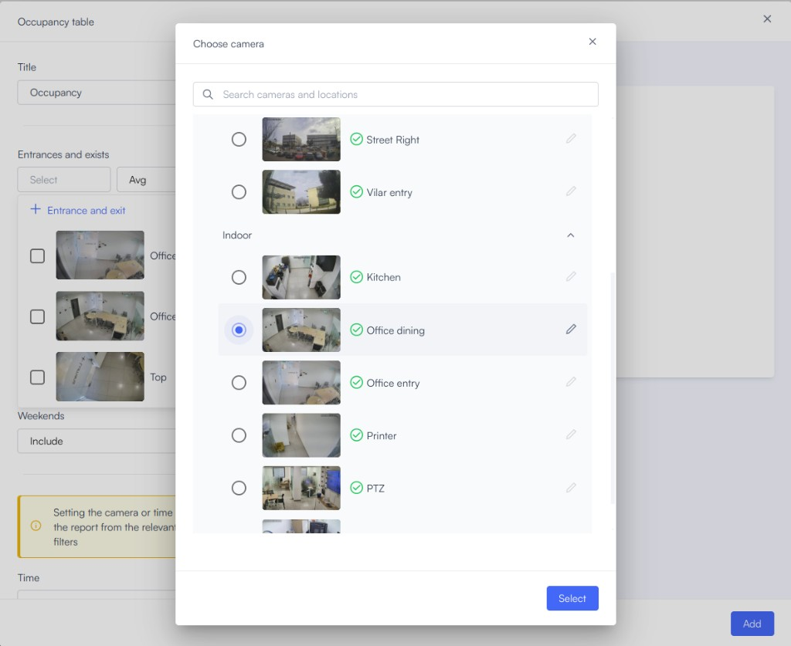
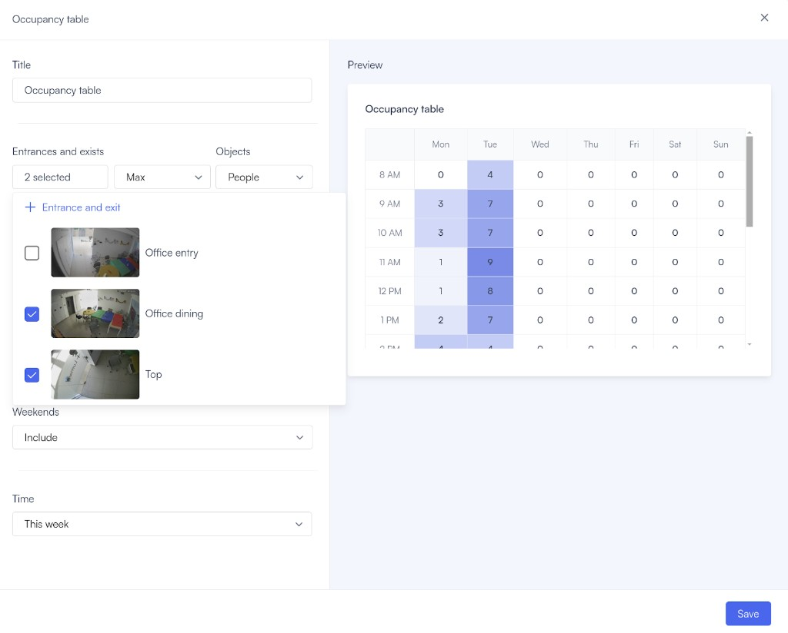
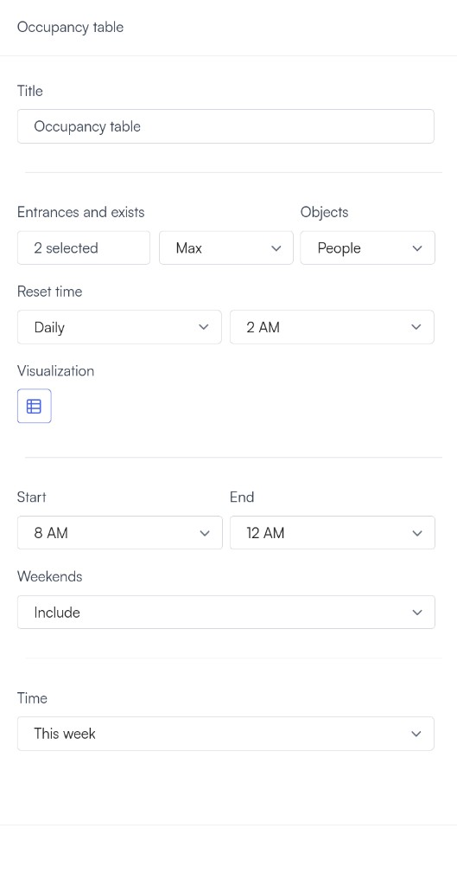

# Configure a space occupancy dashboard

Use the occupancy widget to visualize current occupancy, historical trends, and entry and exit activity for a defined space. This guide walks you through the main dashboard setup flow.

## Before you begin

Make sure the relevant entry and exit points are covered by cameras and that you can edit dashboards in your organization. If line crossings are not configured yet, the setup flow prompts you to create them.

## Add the occupancy widget

Add the widget first, then choose the entrances and exits you want the dashboard to track.

1. Open your dashboard in edit mode.
2. Click **Add widget**.
3. Select **Occupancy**.

   The occupancy widget configuration opens.

## Configure widget settings

After you select the entrances and exits, configure the operational settings that control how the widget calculates and displays occupancy.

1. Choose the calculation method.

   Use **Max** to show the highest recorded occupancy in the selected time range. Use **Average** to show the average occupancy across that time range.

2. Set the reset time.

   Choose whether the reset runs daily or weekly, then set the reset hour. To avoid incorrect counts, make sure the space is empty when the reset runs.

3. Define viewing hours if needed.

   Use viewing hours when the widget should display occupancy data only during specific hours or days.

## Review the results

Once these settings are configured, the occupancy widget starts tracking and visualizing space usage based on current and historical data.

## Next steps

After you configure the dashboard, you can refine the setup or review the concept guidance behind the counts.

- Read [Space occupancy analytics](space-occupancy-analytics.md) to understand camera placement, counting logic, and common accuracy issues.
- Read [Occupancy](../dashboards/widgets/occupancy.md) for the full widget guide and advanced configuration options.
