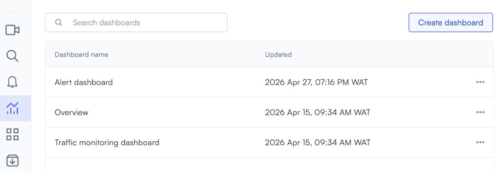
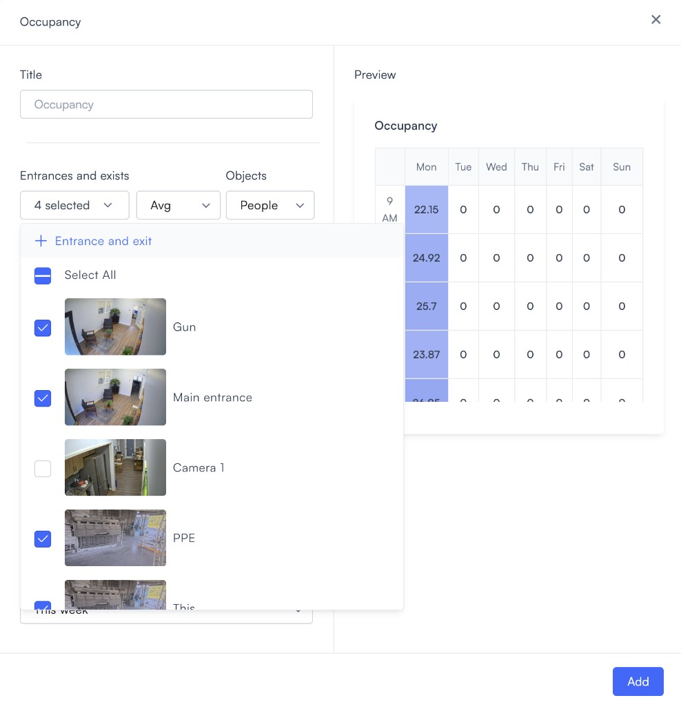
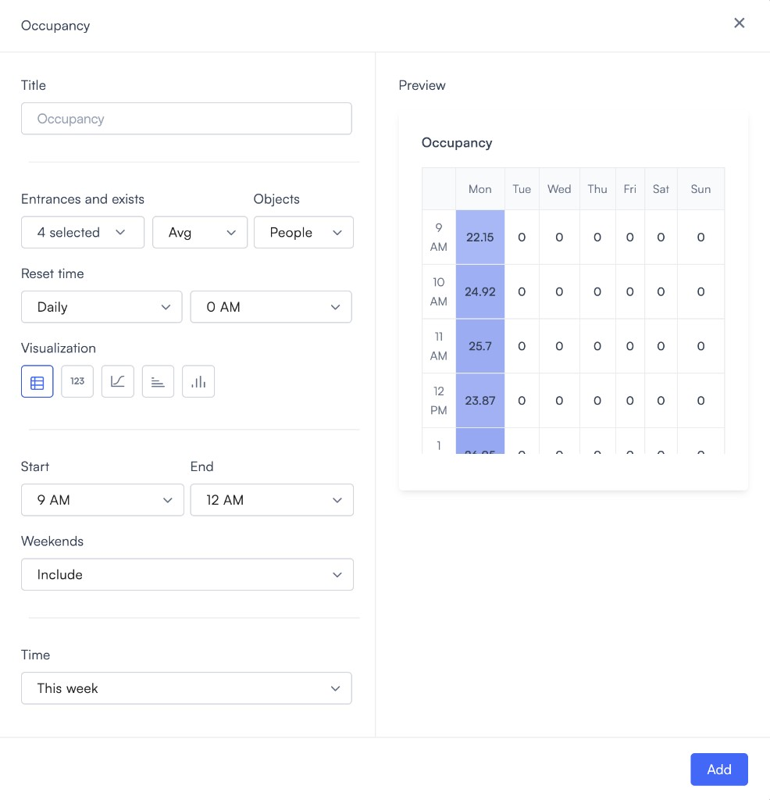
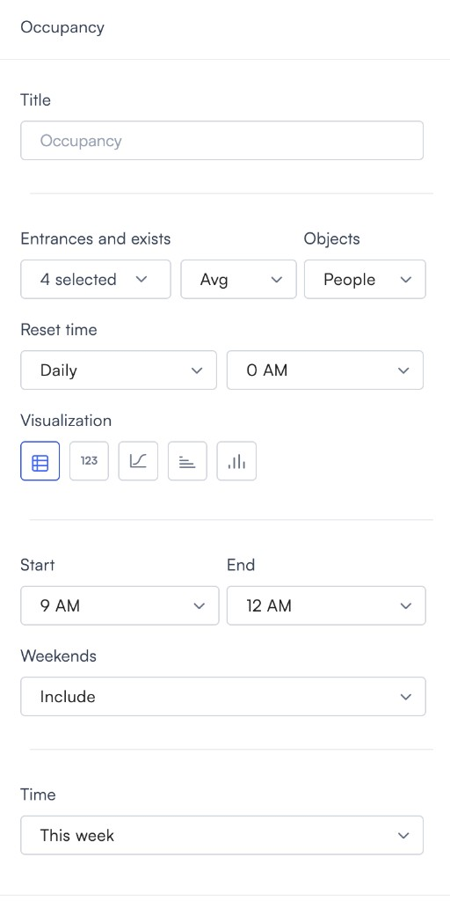

# Configure a space occupancy dashboard

Use the occupancy widget to visualize current occupancy, historical trends, and entry and exit activity for a defined space. This guide walks you through the main dashboard setup flow.

## Prerequisites

Make sure the relevant entry and exit points are covered by cameras and that you can edit dashboards in your organization. If line crossings are not configured yet, then the setup flow prompts you to create them.

## Add the occupancy widget

First create or open a dashboard, add the occupancy widget, then choose the entrances and exits you want the dashboard to track.

1. Select **Dashboards** in the left navigation bar.
2. Select **Create dashboard** in the top right corner.

3. Open the dashboard canvas in edit mode.

   If you just created a new dashboard, then you are already on the canvas. If you are adding the widget to a saved dashboard, then open that dashboard and select the **Edit dashboard** icon in the top right.
4. Select **Add widget**.
5. Select **Occupancy**.

   The occupancy widget configuration opens.

## Configure widget settings

After you select the entrances and exits, configure the operational settings that control how the widget calculates and displays occupancy.

1. Choose the calculation method.

   Use **Max** to show the highest recorded occupancy in the selected time range. Use **Average** to show the average occupancy across that time range.

2. Set the reset time.

   Choose whether the reset runs daily or weekly, then set the reset hour. To avoid incorrect counts, make sure the space is empty when the reset runs. If numbers still look wrong after a reset, then see [Common accuracy issues](space-occupancy-analytics.md#common-accuracy-issues).

3. Define viewing hours if needed.

   Use viewing hours when the widget should display occupancy data only during specific hours or days.

## Review the results

After you save these settings, the occupancy widget starts tracking and visualizing space usage based on current and historical data.

## Next steps

After you configure the dashboard, you can refine the setup or review the concept guidance behind the counts.

- Read [Space occupancy analytics](space-occupancy-analytics.md) to understand camera placement, counting logic, and common accuracy issues.
- Read [Occupancy](../dashboards/widgets/occupancy.md) for the full widget guide and advanced configuration options.
