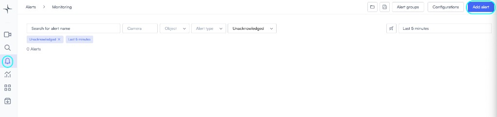
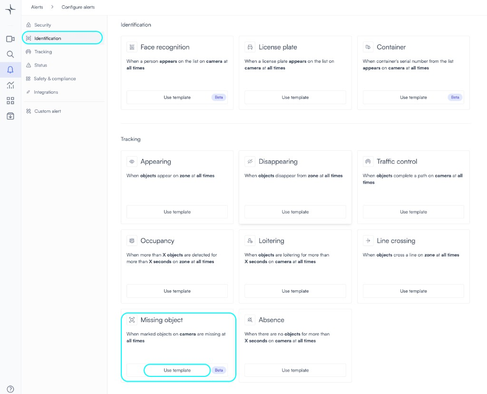
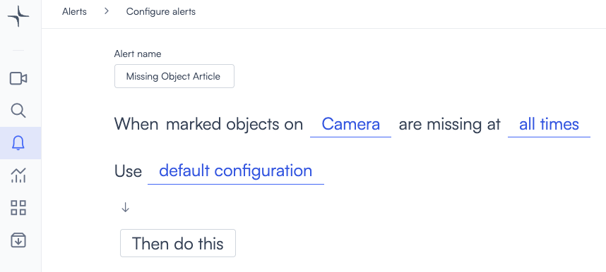
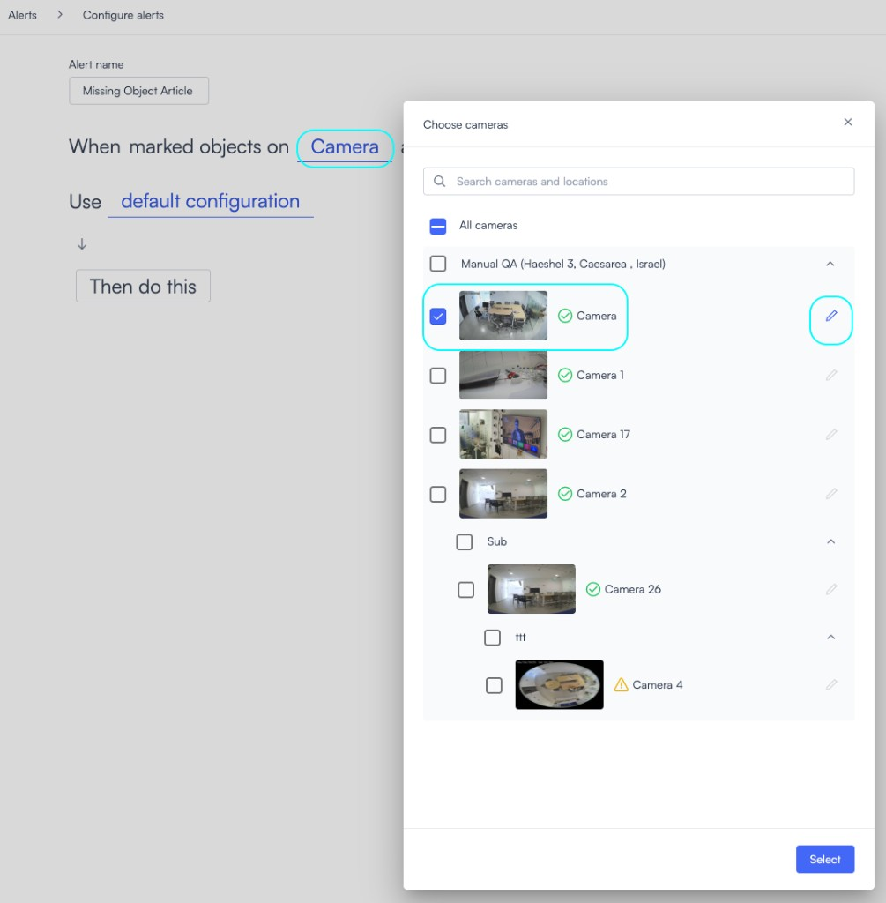
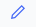
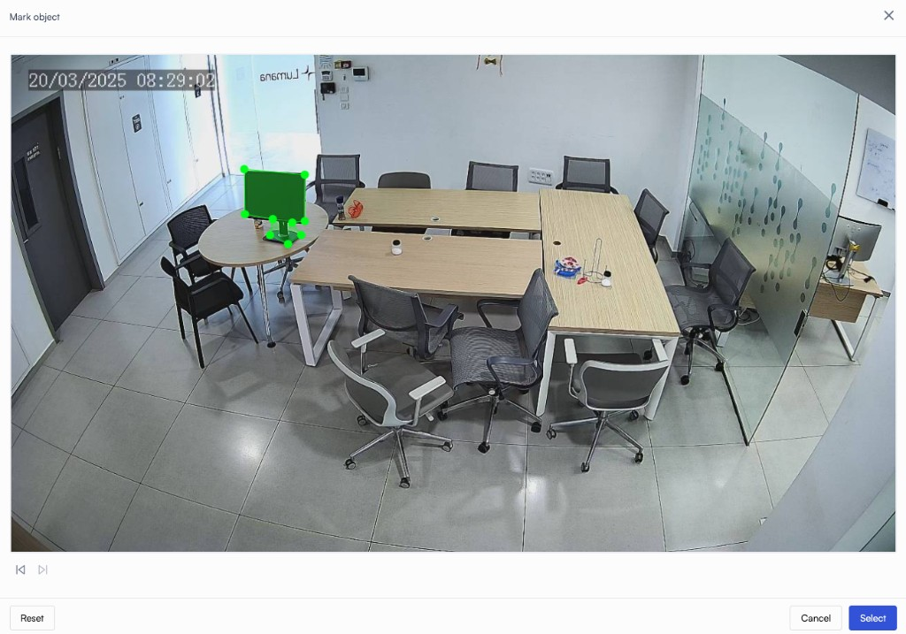
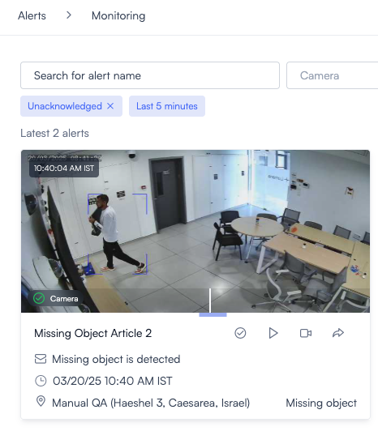
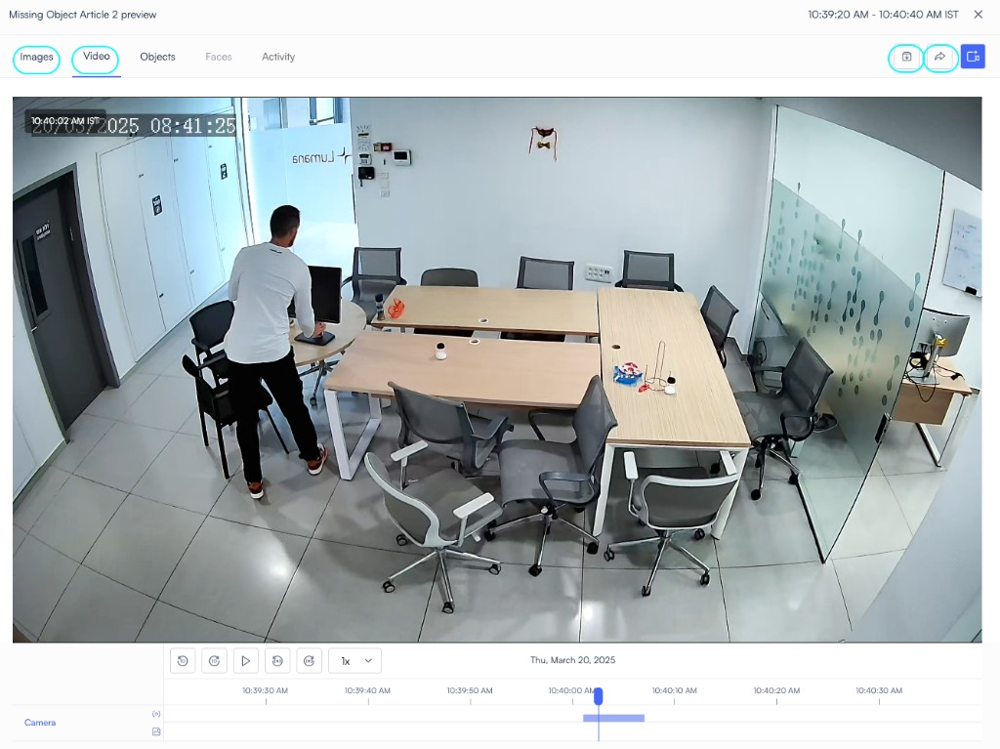
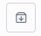
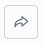

# Custom objects

The **Missing Object Alert** feature detects and notifies users when a selected object is no longer visible in a monitored area. This automation enhances security, prevents operational disruptions, and reduces manual oversight.

## Why It Matters
🔹 **Real-time detection** – Instant alerts prevent delays in response.
🔹 **Automated tracking** – Eliminates reliance on manual checks.
🔹 **Security enforcement** – Detects unauthorized removals or theft.
🔹 **Operational continuity** – Ensures critical items remain in place.

 

## How to configure:

1. Click on the alert icon  on the left menu

2. Click on add alert 

3. In the "Identification" section you will find "Missing object" alert. Click on "use template"

4. Click on "all times" to select the schedule for object detection

5. Click on "Then do this" to select an action when the alert occur, for example notify person

6. Click on "Cameras" in order to choose the needed camera

7. Click on the edit icon  to select the "object" that you would like the alert to focus on.

8. In the **Mark object** dialog, click **Select** when you are done outlining the object.

9. Click **Create alert**  when finished.

When the alert is set up, at any point that the object you selected will disappear from the camera, the alert will be triggered.

See examples:

You can click on alert to view a video clip or an image of the incident.

From the same screen of the alert, you can save this video in the archive (upload it to the cloud) by clicking the archive icon , or click the share icon  to share the video with police or other people within the organization or outside.

 