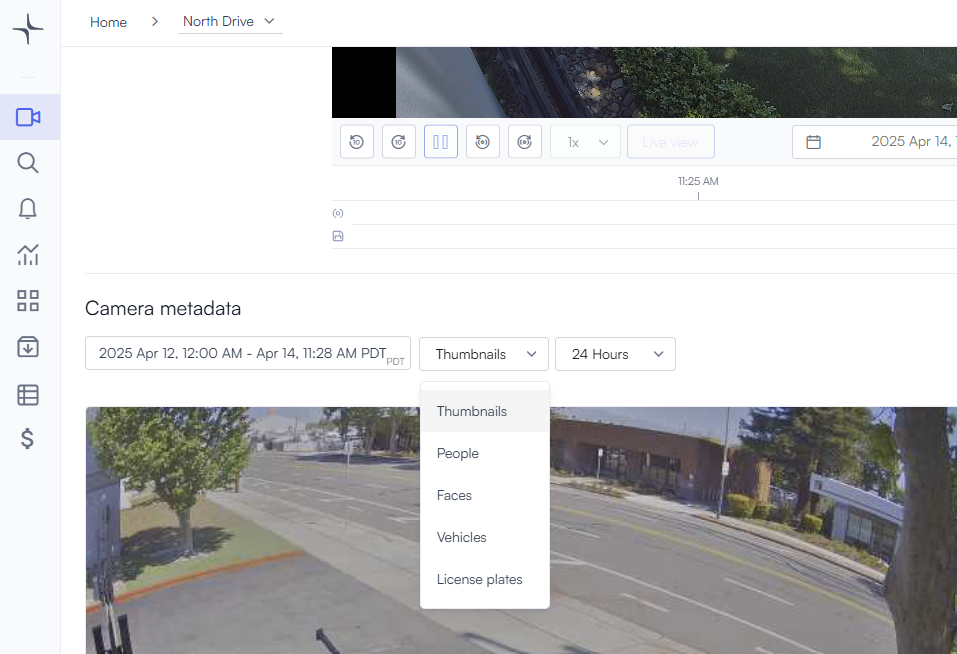

# Custom objects

In this video, you'll learn how to use the video playback area, along with the People, License Plate, and Thumbnail tabs. These tabs provide a summary of all actions detected in the scene, and you'll see how to view and navigate through them effectively.

