# Custom objects

The **Missing object** alert notifies you when a marked object is no longer visible in the camera view you monitor. That helps you catch removals or theft sooner and reduces the need for constant manual checks of the same scene.

## Why this alert helps

- **Faster response**: You get a notification when the object disappears instead of scrubbing footage later.
- **Less manual watching**: The system watches the marked region for you.
- **Security and loss prevention**: You can detect unauthorized removal of equipment or inventory.
- **Operational checks**: You can confirm that critical items stay in frame during business hours or after hours.

## Before you begin

Make sure you can open **Alerts** and create alert rules. You need a camera that shows the object clearly enough to mark it in the frame, and permission to choose notification actions under **Then do this**.

For the full task-based guide (same workflow), see [Create a Missing object alert](missing-object-alert.md).

## Configure the alert

1. In the left sidebar, select **Alerts** 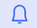.

2. Select **Add alert**.

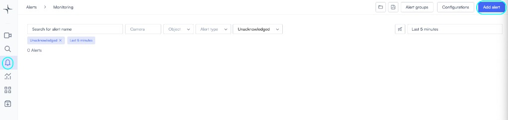

3. Under **Identification**, find the **Missing object** template and select **Use template**.

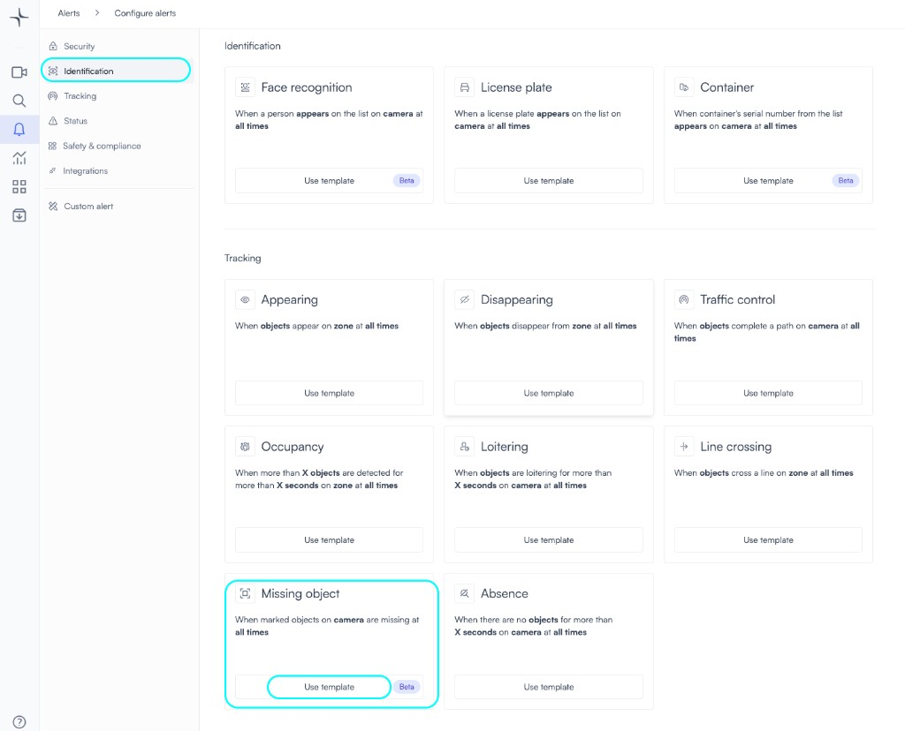

4. Set when the rule runs, for example **All times**, so object detection follows the schedule you need.

5. Select **Then do this** and choose what happens when the alert fires, for example notify someone.

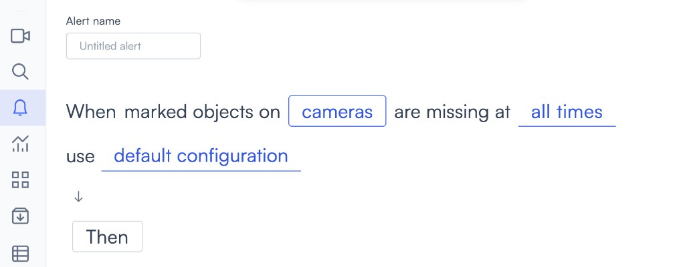

6. Select **Cameras** and select the camera (or cameras) that should watch the object.

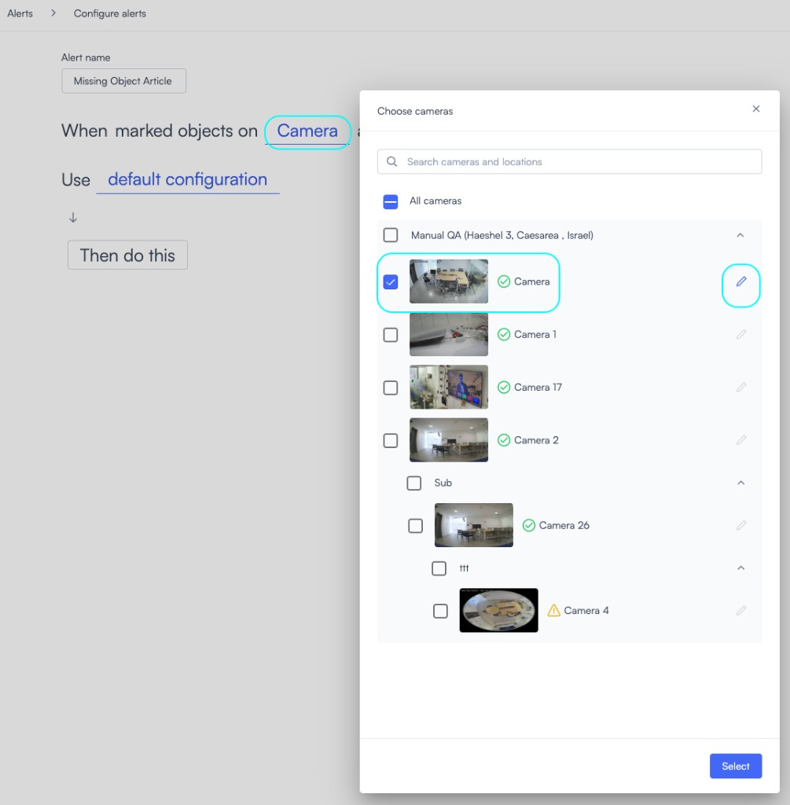

7. Select the pencil icon 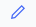 next to the camera so you can mark the object the alert should track.

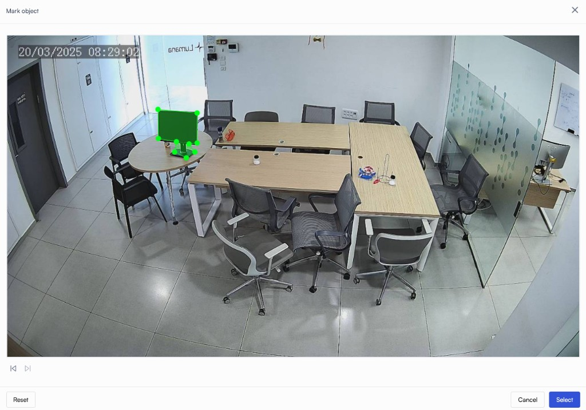

8. In the **Mark object** dialog, outline the object, then select **Select**.

9. When the rest of the rule is complete, select **Create alert** 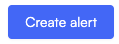.

## Review alerts in monitoring

When the alert fires, it appears in the monitoring view with a still, time, location, and actions such as acknowledge, play, and share.

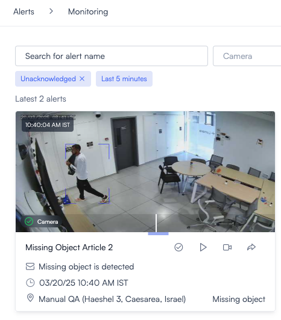

Select the alert to open a video clip or image for that event.

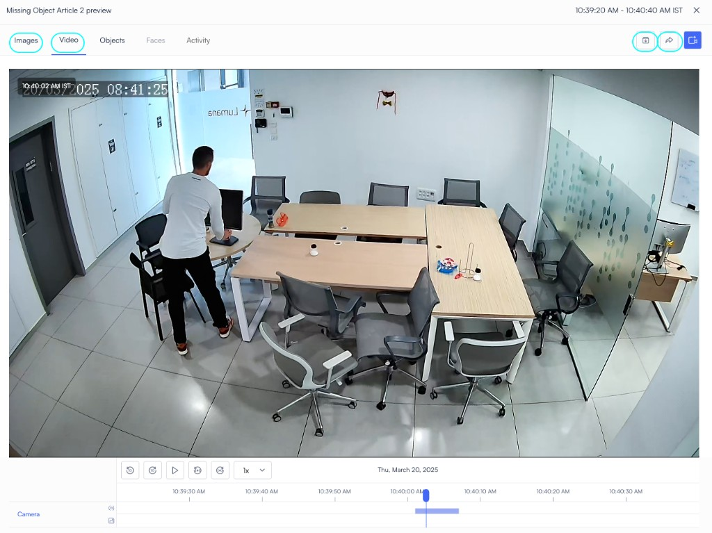

From the preview, you can save footage to the archive with the archive icon 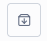, or select **Share** 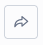 to share the clip according to your organization's policy.

## Next steps

- Use [Share video](../live-video-monitoring-and-operations/share-video.md) for more detail on sharing options and access controls.
