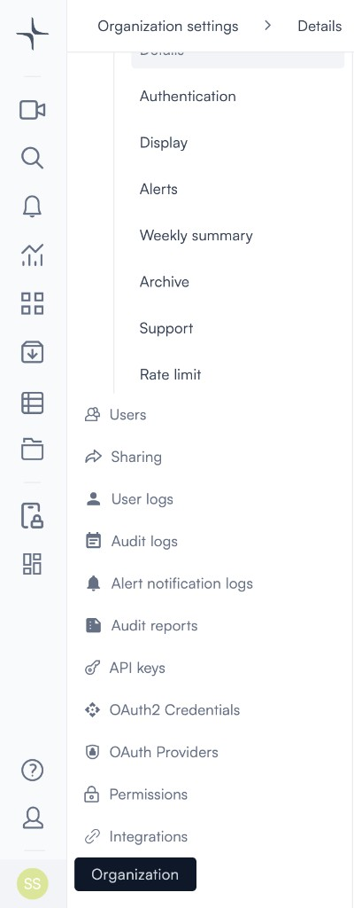
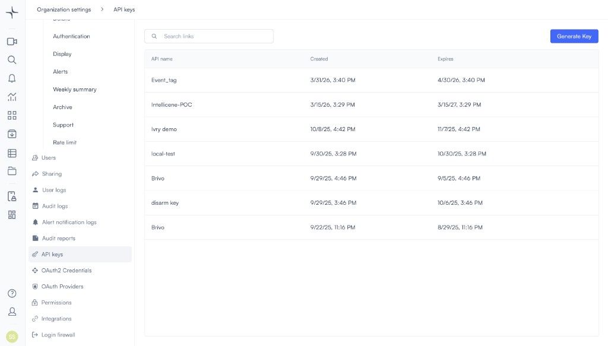
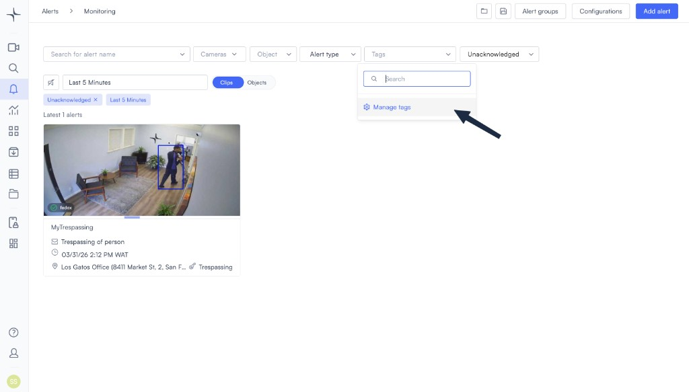
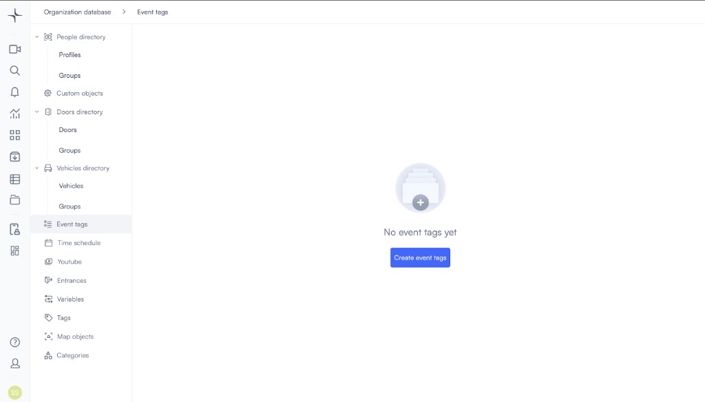
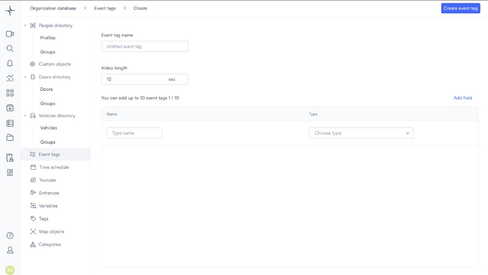
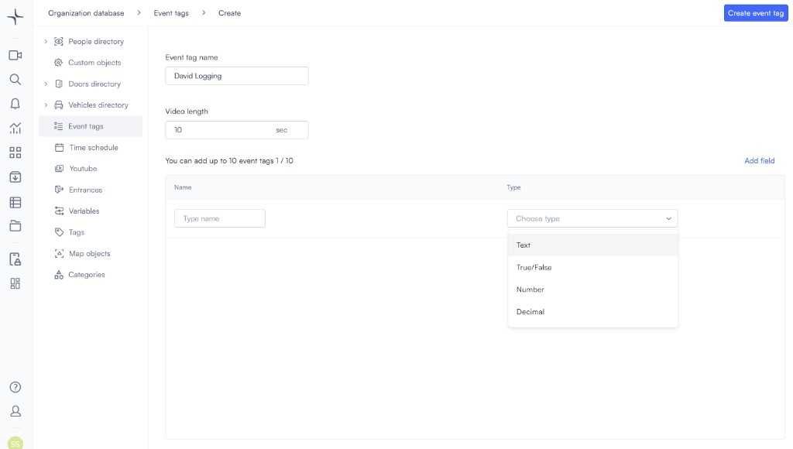
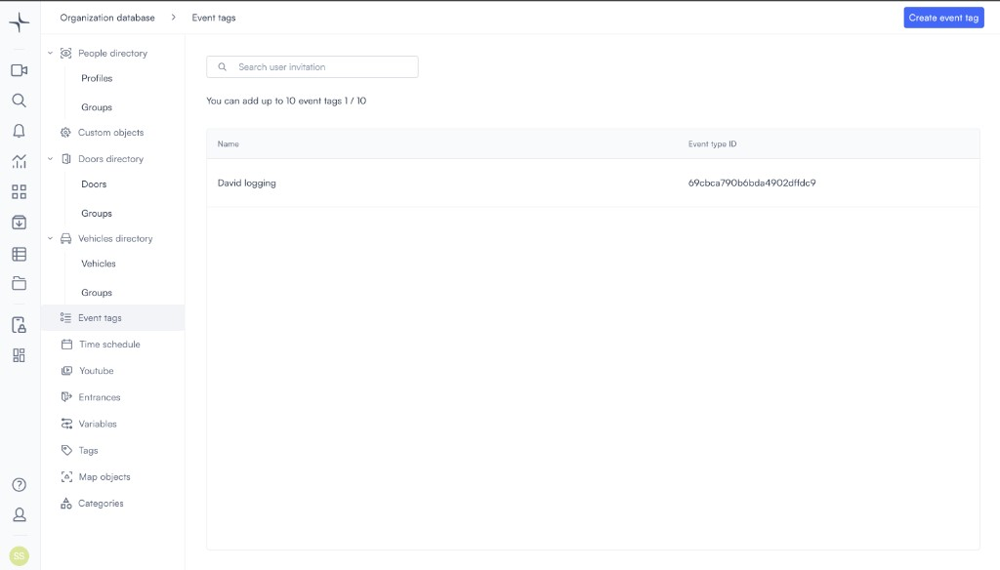
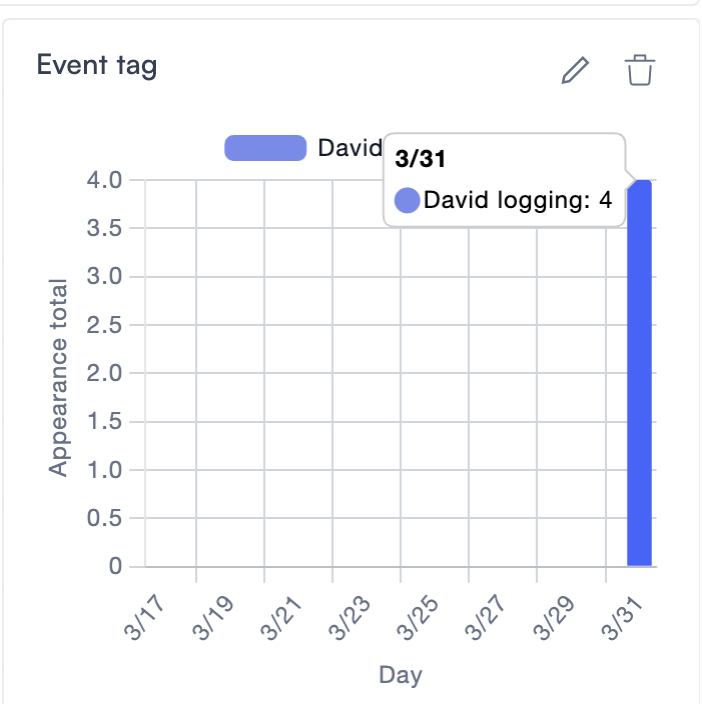

# Enhance your video data with Lumana Event Tags

Event tags let you record structured events from external systems and tie them to camera footage by time and camera. You might use them to link a point-of-sale transaction, a warehouse scan, or an access control event to the exact moment it appeared on a camera. Once posted, events are searchable in Lumana and can be visualized in a Chart or table widget on any dashboard.

This guide walks you through the full setup: generating an API key, creating an event tag, posting events to the Lumana API, and verifying the data. To add and configure the dashboard widget, visit [Event tags](../dashboards/widgets/chart-or-table-event-tags.md) after completing this guide.

## Step 1: Generate an API key

Lumana uses API keys to authenticate event tag POST requests. You'll use the key as a Bearer token in every API call.

1. Open **Organization** and select **Organization settings**.
2. In the left menu, select **API keys**.

<div align="center"></div>

3. Select **Generate Key**.
4. Enter a name for the key, set an expiration date, and select **Save**.
5. Copy the secret that appears and store it securely. You'll paste it into your API client as the Bearer token. Lumana won't show it again.

<div align="center"></div>

> **Note:** Keep your API key secure. Anyone who has it can post events to your organization until it expires or you revoke it.

## Step 2: Create an event tag

An event tag is a template that defines the structure of events you'll post. Each tag has a display name, a video clip length, and up to 10 custom fields. The fields define what data you'll send with each event, such as a pallet ID, a register number, or a transaction amount.

### Open event tag management

1. Go to **Alerts** and select **Monitoring**.
2. In the filter row, open the **Tags** control and select **Manage tags**.

<div align="center"></div>

Lumana takes you to **Organization database** → **Event tags**.

### Create the tag

If no tags exist yet, the page shows a **Create event tags** button. Select it to open the creation form.

<div align="center"></div>

<div align="center"></div>

Fill in the form:

- **Event tag name**: A short label your team will recognize in search, alerts, and dashboards. For example, "Pallet checkout" or "Door forced open."
- **Video length**: How many seconds of camera recording to attach around the event timestamp. Increase this if operators need more context when reviewing clips.
- **Name** (field column): The key name for each piece of data you'll send in the API. Use clear, stable names that match what your integration will send, for example "PalletID" or "RegisterNumber."
- **Type** (field column): The data type for that field. Choose **Text** for strings, **Number** for whole numbers, **Decimal** for fractional numbers, or **True/False** for booleans.

<div align="center"></div>

Select **Add field** to add more rows. You can add up to 10 fields per tag. Select **Create event tag** when you're done.

### Copy the Event type ID

After saving, Lumana returns you to the Event tags list. The list shows each tag's **Name** and **Event type ID**. The Event type ID is what you'll send as `eventTypeId` in every API POST for this tag. Copy it and keep it with your integration configuration.

<div align="center"></div>

## Step 3: POST event data

Send a POST request to the Lumana API for each event you want to record.

**Endpoint:**

```
POST https://access.lumana.ai/v1/events-tag/insert
```

**Required fields:**

| Field | Description |
|---|---|
| `orgId` | Your organization ID. Find it in **Organization** → **Organization settings**. |
| `cameraId` | The ID of the camera the event is associated with. Find it on the camera's edit screen. |
| `eventTypeId` | The Event type ID from the Event tags list in step 2. |
| `timestamp` | The time the event occurred, in Unix epoch milliseconds. |
| `fields` | An object of field names and values as defined on your tag. Not every field needs to be present in every POST. |

**Authorization:** Set the Authorization header to `Bearer YOUR_API_KEY` using the key from step 1.

### Example JSON body

Replace every placeholder with your real values:

```json
{
  "orgId": "YOUR_ORG_ID",
  "cameraId": "YOUR_CAMERA_ID",
  "eventTypeId": "YOUR_EVENT_TYPE_ID",
  "fields": { "YourFieldName": "your-value" },
  "timestamp": 1774968426317
}
```

### Example using cURL

```bash
curl --location 'https://access.lumana.ai/v1/events-tag/insert' \
  --header 'Authorization: Bearer YOUR_API_KEY' \
  --header 'Content-Type: application/json' \
  --data '{
    "orgId": "631d897c32b1b5c5c0c6350f",
    "cameraId": "646dd77b3b6af4f41e0c2129",
    "eventTypeId": "655cb88d1ff98797b9dc0c3b",
    "fields": { "PalletID": "2acd" },
    "timestamp": 1774968426317
  }'
```

### Send using Postman

1. Set the method to **POST** and the URL to `https://access.lumana.ai/v1/events-tag/insert`.
2. Under **Authorization**, select **Bearer Token** and paste your API key secret.
3. Under **Body**, select **raw** and **JSON**. Paste your JSON body and replace all placeholders.
4. Select **Send**. A successful ingest returns a `2xx` response.

> **Note:** Use a current timestamp in milliseconds. You can run `Date.now()` in a browser console to get the current value. If your timestamp falls outside the time range set on the dashboard widget, the event won't appear in the chart.

## Step 4: Verify the data

The event tag definition alone doesn't create any data. Data only appears after Lumana has accepted at least one successful POST for that tag.

Before checking the dashboard, confirm the following:

- Your POST returned a `2xx` response. A `4xx` or `5xx` response means the event wasn't ingested.
- The `eventTypeId` matches the Event type ID in the Event tags list.
- The `cameraId` is a real camera in your organization.
- The `timestamp` is in milliseconds and falls within the time range you plan to use in the dashboard widget.
- The `fields` keys match the field names you defined on the tag, with the correct spelling.

### Confirm in Search

1. Open **Search** in the portal.
2. Select the camera and time range that cover when you sent the event.
3. Apply field filters to match the values from your POST.

If the event appears in Search, the POST was ingested correctly and the data is ready for the dashboard. If Search shows nothing, fix the POST before checking the chart.

## Step 5: Create an alert for an event tag

You can build alerts that react to event tag data in two ways.

**Event tag alert**: Fires when an event tag is received. Select the **Event tag** alert type, choose the event tag and camera, set a trigger delay, configure actions, and create the alert.

**Event validation alert**: Adds an object detection check on top of an event tag. For example, require a person to be present or absent for a set duration when the event arrives. Select the event tag, camera, appearance or absence, object type, duration, and actions, then create the alert.

For full configuration steps, visit [Event tag](../alerts-and-ai-detection/alert-types/integrations/event-tag.md).

## Step 6: Chart event tags on a dashboard

Once your events are verified in Search, add a Chart or table widget to a dashboard to visualize the counts over time. Full configuration steps, including axis options, camera selection, time settings, and how to drill into clips from the chart, are covered in [Event tags](../dashboards/widgets/chart-or-table-event-tags.md).

<div align="center"></div>