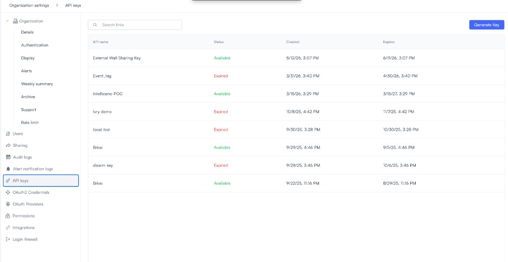
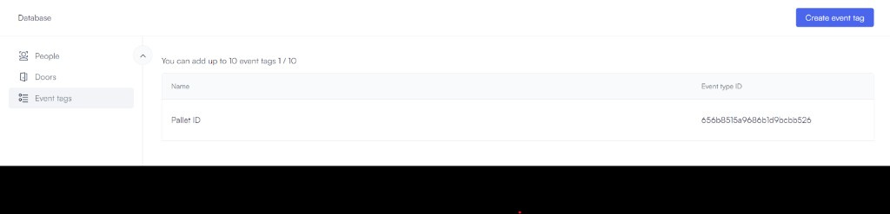
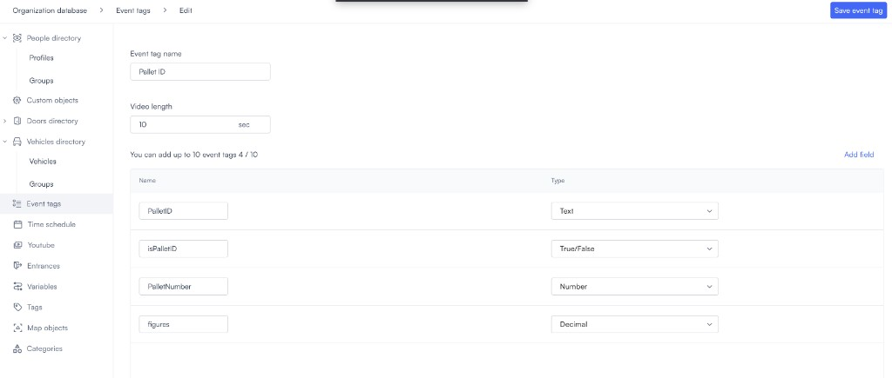
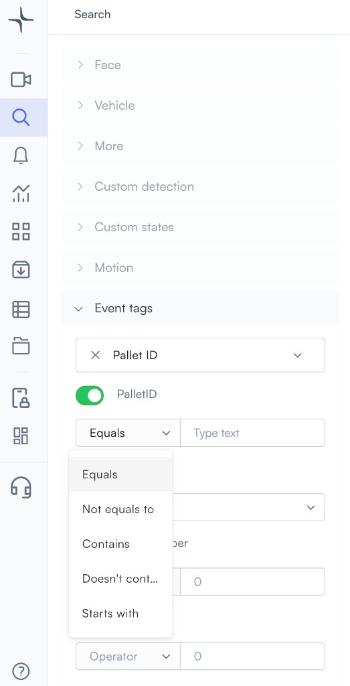
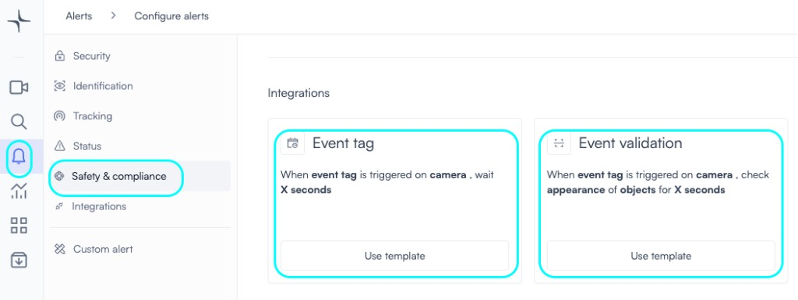
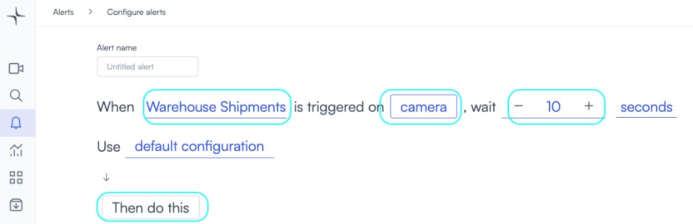
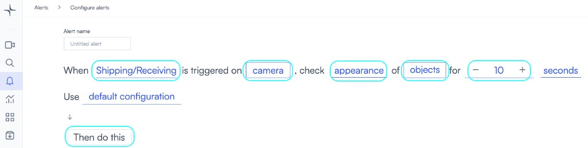
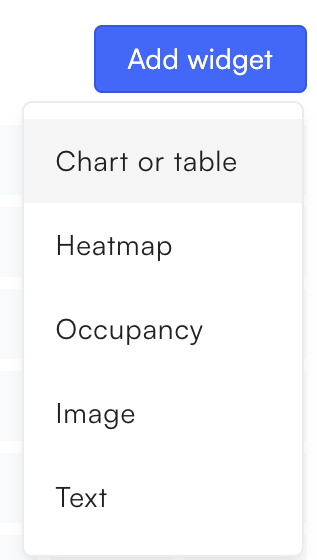
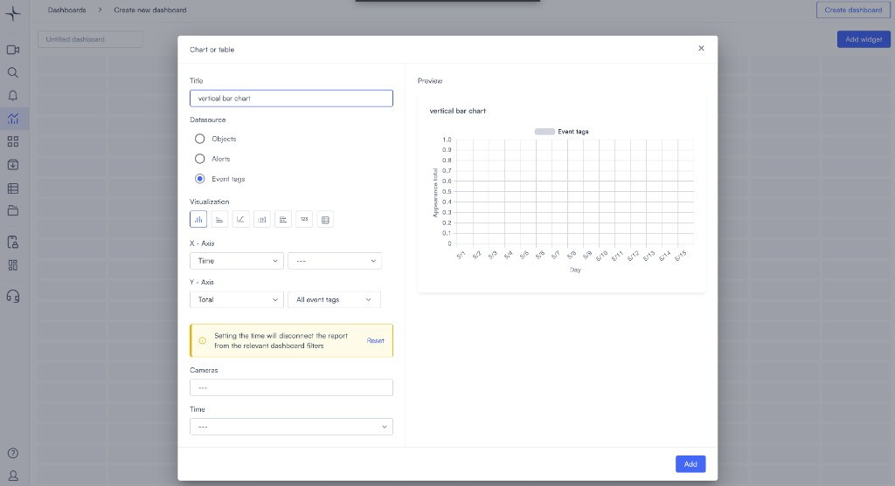

# Add Lumana Event Tags to your video data

Event tags let you record structured events from external systems and tie them to camera footage by time and camera. Those systems can run on premises or in the cloud. After you post a tag, you can search the payload in **Search** and use it as context for investigations, security, and operations.

Consider a warehouse example. If your Warehouse Management System (WMS) knows a pallet's ID, then you can POST that ID to Lumana with a camera and timestamp. Operators can then search for the pallet to pull the clip for loading or condition checks and share that clip as evidence.

This guide walks you through the full Event Tags workflow: generate an API key, create an event tag, POST events to the Lumana API, find them in **Search**, and optionally use them in alerts or a **Chart or table** widget. For widget options in depth, see [Chart or table](../dashboards/widgets/chart-or-table/README.md). For clip preview controls after you select the chart, see [Event tag clip preview](../dashboards/widgets/chart-or-table/chart-or-table-event-tags/chart-or-table-event-tags-clip-preview.md).

## Prerequisites

Make sure you can open **Organization settings** and **Database** in the portal. You also need to generate API keys and call the Lumana API from the reference or a client such as Postman. Have your organization ID, a valid camera ID, and access to **Search**. Each organization can have up to **10** API keys (each with an expiration you set) and up to **10** event tag definitions.

## Generate an API key

Lumana authenticates POST requests with API keys and your organization ID. Send the key as a `Bearer` token on every call.

1. Open **Organization**, then **Organization settings**.
2. In the left menu, select **API keys**.
3. Select **Generate Key**. The **Create API Key** dialog opens.
4. Enter an **API Key name** and an **Expiration** value. The dialog shows the generated secret; copy it or use download if you prefer. You will not see the full key again after you complete the dialog.
5. Select **Create** to finish.

<div align="center" data-with-frame="true"></div>


Keep your API key secret. Anyone who has it can post events to your organization until it expires or you revoke it.


## Create an event tag

An event tag is a template for events you will POST. It has a display name, a **Video length** (seconds of clip around the event time), and up to **10** custom fields. Each field has a **Name** (the key your API sends) and **Type**: **Text**, **Number** (whole numbers), **Decimal**, or **True/False**.

### Open event tag management

1. In the sidebar, select **Database**, then **Event tags**.

   For a new tag, continue with step 2. For an existing tag, continue with step 3.

2. Select **Create event tag** when you need a new definition.
3. Select a tag in the list when you need to edit an existing definition.

<div align="center" data-with-frame="true"></div>

### Fill in the tag

<div align="center" data-with-frame="true"></div>

* **Event tag name**: A short label for **Search**, alerts, and dashboards, for example a pallet workflow name your operators recognize.
* **Video length**: Seconds of recording to attach around the `timestamp` from your POST.
* **Name** (each field row): The field key used in the JSON `fields` object. Use stable names that match your integration, for example `PalletID`.
* **Type**: **Text**, **Number**, **Decimal**, or **True/False**.

Select **Add field** until the form matches the payload your system will send. You can define up to **10** fields per tag.

Select **Save event tag** when you are done.

### Copy the Event type ID

After you save, the **Event tags** list shows **Name** and **Event type ID** for each tag. Copy the **Event type ID** for this tag. You send it as `eventTypeId` on every POST for that definition.

## POST event data

Send a POST request to the Lumana API for each event you want to record.

**Endpoint**:

```
POST https://access.lumana.ai/v1/events-tag/insert
```

**Body and headers**:

| Item | Description |
| --- | --- |
| `orgId` | Your organization ID. Find it under **Organization** → **Organization settings**. |
| `cameraId` | Camera that should own the clip. Find the ID on that camera's **Edit camera** page. |
| `eventTypeId` | The Event type ID from [Create an event tag](#create-an-event-tag). |
| `timestamp` | Time of the event, Unix epoch time in **milliseconds**. |
| `fields` | Object of field names and values from your tag. You can omit keys you are not sending in that POST. |
| Authorization | `Authorization: Bearer YOUR_API_KEY` header using the secret from [Generate an API key](#generate-an-api-key). |

### Example JSON body

Replace every placeholder with your real values:

```json
{
  "orgId": "YOUR_ORG_ID",
  "cameraId": "YOUR_CAMERA_ID",
  "eventTypeId": "YOUR_EVENT_TYPE_ID",
  "fields": { "YourFieldName": "your-value" },
  "timestamp": 1702933595445
}
```

### Example using cURL

```bash
curl --location 'https://access.lumana.ai/v1/events-tag/insert' \
  --header 'Authorization: Bearer YOUR_API_KEY' \
  --header 'Content-Type: application/json' \
  --data '{
    "orgId": "631d897c32b1b5c5c0c6350f",
    "cameraId": "646dd77b3b6af4f41e0c2129",
    "eventTypeId": "655cb88d1ff98797b9dc0c3b",
    "fields": { "PalletID": "2acd" },
    "timestamp": 1702933595445
  }'
```

### Test the request

You can send a test POST from the Lumana API reference. Open [Insert an event tag in the Lumana API reference](../api-reference/rest-apis/lumana-api.md) and select **Test it** on the cURL block. Enter your `Bearer` token under **Authentication**, replace the body with your `orgId`, `cameraId`, `eventTypeId`, and a **current** millisecond timestamp, then select **Send**. A successful request returns **200 OK**.

If you prefer a desktop client, then use Postman.

### Send using Postman

1. Set the method to **POST** and the URL to `https://access.lumana.ai/v1/events-tag/insert`.
2. Under **Authorization**, select **Bearer Token** and paste your API key secret.
3. Under **Body**, select **raw** and **JSON**. Paste your JSON body and replace all placeholders.
4. Select **Send**. A successful ingest returns a `2xx` response.


Use a current timestamp in milliseconds. You can run `Date.now()` in a browser console. If the timestamp falls outside the time range of your chart widget or **Search**, then the event will not appear where you expect.


## Search for events

After Lumana returns success on the POST, the event becomes searchable in the portal.

Before you rely on results, confirm:

* The HTTP response was `2xx`.
* `eventTypeId` matches the tag in **Database** → **Event tags**.
* `cameraId` is a real camera in your organization.
* `timestamp` is in milliseconds and inside the **Search** time range you choose.
* Keys under `fields` match the field names on the tag.

### Use Search filters

1. Open **Search**.
2. Set **Camera** and **Time range** so they include the POST you sent.
3. Expand **Event tags** and choose your event tag.
4. Turn on the fields you want to filter.
5. Set the operator (**Equals**, **Not equals to**, **Less than**, **Greater than**, and so on).
6. Enter the values.

<div align="center" data-with-frame="true"></div>

If results appear here, then ingestion and matching worked. You can add dashboards or alerts on top of the same data.

## Create an alert for an event tag

You can create two kinds of alert from **Alerts** → **Configure alerts** under the **Safety & compliance** category:

<div align="center" data-with-frame="true"></div>

### Event tag alert

Triggers when a given event tag is received on a camera after an optional wait.

1. Select **Use template** on **Event tag**.
2. Set **Alert name** and choose the **Event tag** and **camera**.
3. Set how long to **wait** before the rule evaluates.
4. Open **Then do this** to pick notification or automation actions.
5. Create the alert.

<div align="center" data-with-frame="true"></div>

### Event validation alert

Adds a detection check on top of an event tag (for example require a **person** or **vehicle** to appear or stay absent for N seconds).

1. Select **Use template** on **Event validation**.
2. Choose the **Event tag** and **camera**.
3. Set **appearance** or **absence**, the object type, and the duration.
4. Configure **Then do this** actions.
5. Create the alert.

<div align="center" data-with-frame="true"></div>

For more detail on rule fields, see [Event tag alert](../alerts-and-ai-detection/alert-types/integrations/event-tag.md).

## Chart event tags on a dashboard

1. Select the **Dashboards** icon  in the sidebar.
2. Create a dashboard or open an existing one to edit.
3. Select **Add widget**, then select **Chart or table** from the menu.

<div align="center" data-with-frame="true"></div>

4. Enter a **Title**.
5. Under **Datasource**, select **Event tags**.
6. Set **Visualization**, **X-axis**, **Y-axis** (for example **Total** and **All event tags** or one specific tag), and any camera or time overrides the chart needs. Read the in-dialog note if you disconnect widget filters from dashboard filters.
7. Select **Add** to place the widget.

<div align="center" data-with-frame="true"></div>

Full axis and filter behavior, including drill-in, is described in [Chart or table](../dashboards/widgets/chart-or-table/README.md).

## Retention and storage

Event tag clips follow your organization's storage and retention settings. If you need longer retention or more capacity, then contact your Lumana account team.

## Next steps

- Read [Chart or table](../dashboards/widgets/chart-or-table/README.md) if you need deeper widget layout, axis, and filter detail than this guide covers.
- Review [Event tag alert](../alerts-and-ai-detection/alert-types/integrations/event-tag.md) when tags should drive notifications.
