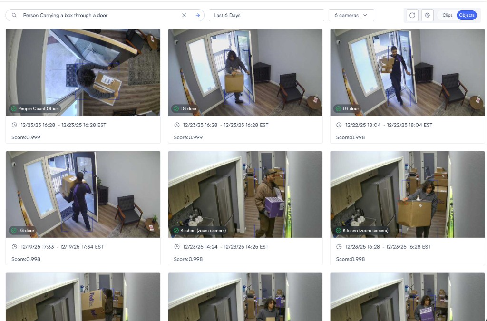
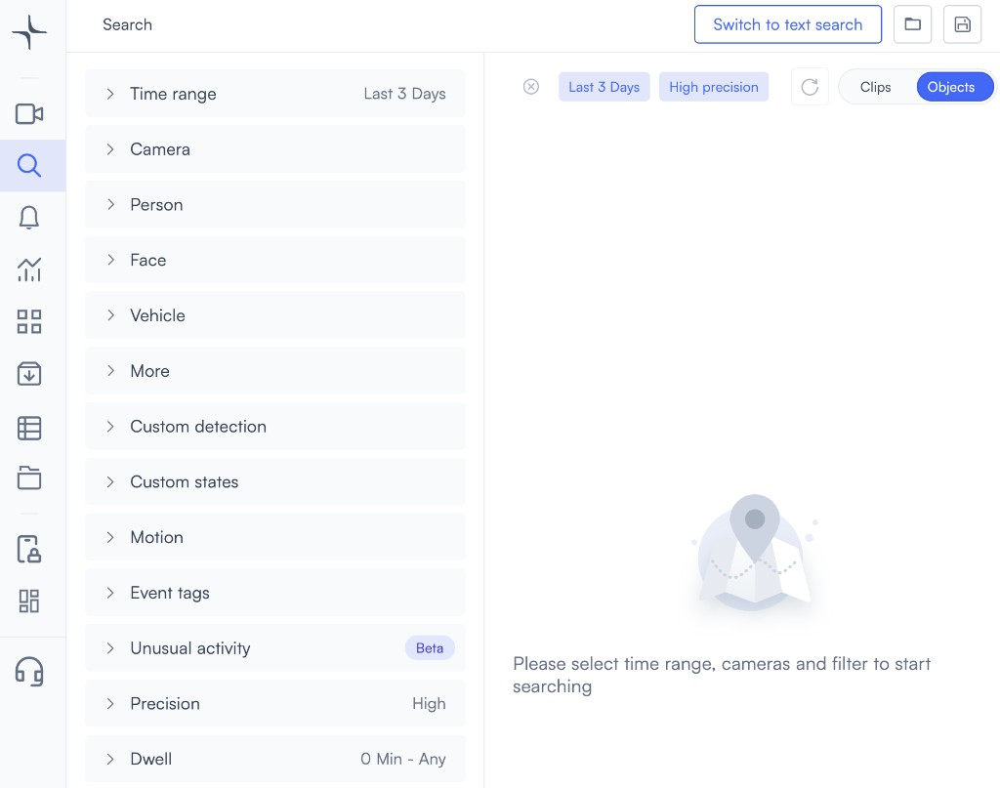
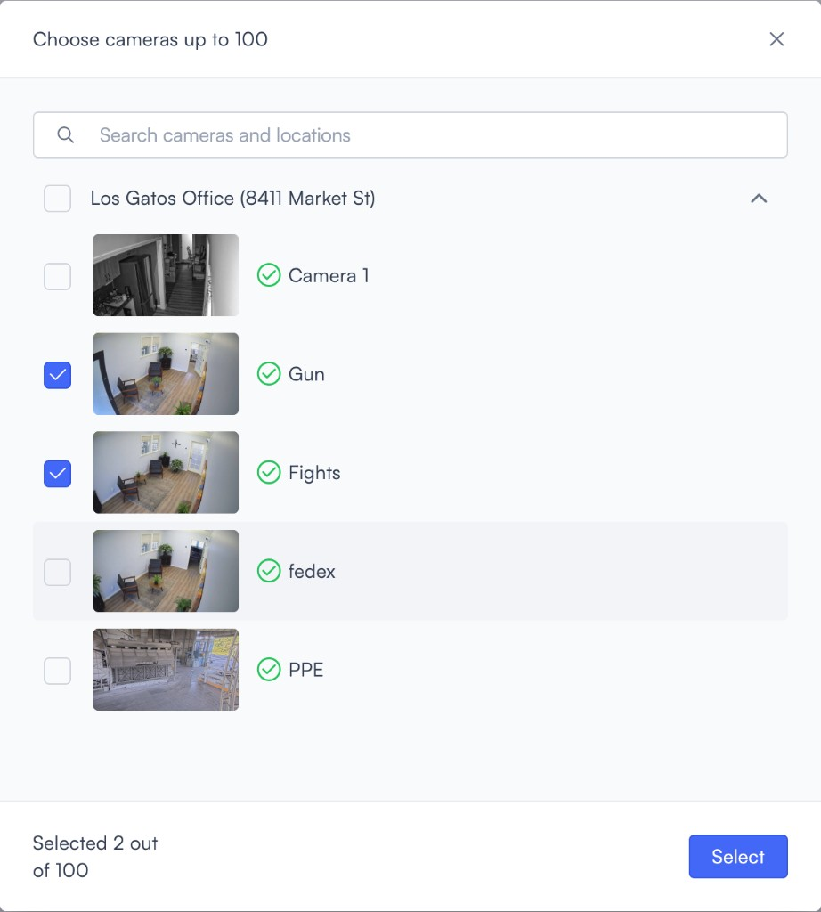
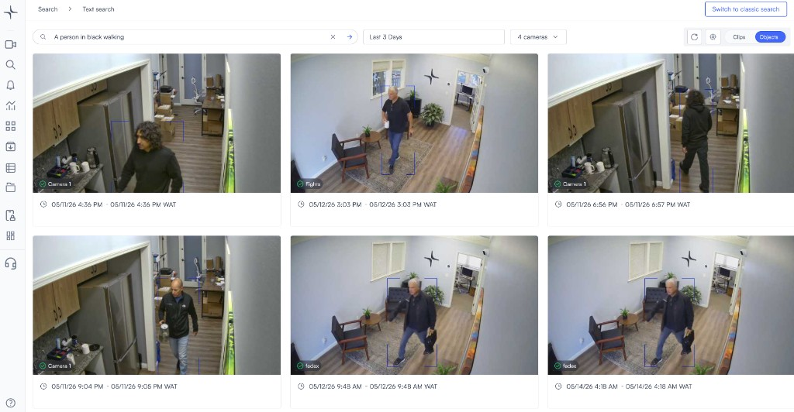

# Free text search

Use natural language on **Search** to find people, vehicles, and other objects across your cameras. In the product UI the page title is usually **Text search**, and the **Free text** control holds your query. This path helps when scenes or attributes are harder to capture with fixed filters alone.

## Prerequisites

Make sure you can open **Search** and access the cameras you want to review. If you already know the time range or locations you want to search, then keep those details ready so you can narrow the results faster.

## Example search

Free text search works well when you need to describe a scene in plain language instead of selecting only predefined filters.

For example, search for a person carrying a box through a door. You can then narrow the results to specific doors, entry points, or other camera groups.

## Start a free text search

Open the text search mode first, then choose the cameras and enter your query.

1. Open **Search**.

    

2. Select **Switch to text search**.

    The text search view opens. It includes the text query bar, camera selector, time range, and other search controls.

    

3. Select the cameras you want to search.

    The camera selection dialog lets you choose one or more locations and cameras.

    

4. Enter a description of what you want to find.

    For example, you can search for `person in a black shirt walking through a door`.

    

## Next steps

After you run a text search, you can continue reviewing or refining the results.

* Use [Search video footage for people or vehicles](search-video-footage-for-people-or-vehicles.md) when you want to use structured filters instead of natural-language queries.
* Use [Build a database of people and vehicles](build-a-database-of-people-and-vehicles.md) to organize known people and vehicles for later search and review.
