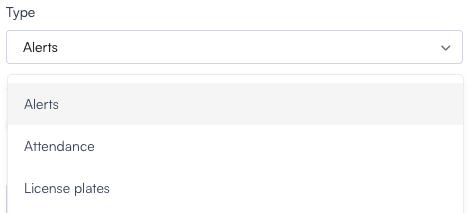
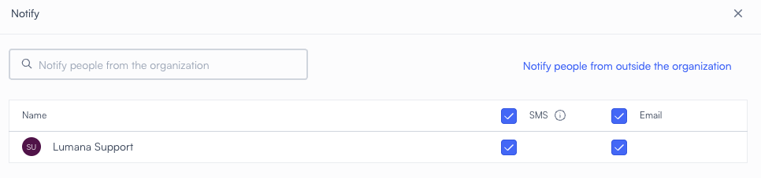

# Generate reports

By the end of this guide, you can configure **Reports**, choose a **Type**, and export **CSV** files.

You can set **One time** or **Recurring** runs and pick **Notify** recipients.

Reports summarize analytics from your VMS+ data (alerts, attendance, license plates), alongside **Search** and tracking in this section.

The **Reports** feature creates **CSV** exports and can automate delivery by download or email. Select **Reports** in the main navigation. The entry uses a list-style icon, as shown below.

## Before you begin

* Your role can open **Reports** and **Create report**.
* Cameras and analytics for **Alerts**, **Attendance**, or **License plates** match the report **Type** you plan to use.
* If you use **SMS** or **Email** delivery, then confirm recipients in your organization or use **Notify people from outside the organization**.

## Report types

When you set up a new report, you choose one of three categories. The **Create report** form includes **Name**, **Cameras**, **Type**, frequency (**One time** or **Recurring**), **Period**, and **Notifications**.

Under **Type**, you select **Alerts**, **Attendance**, or **License plates**.

1. **Alerts report** – Summarizes triggered alerts based on selected filters (for example, alert type, camera, location).
2. **Attendance report** – Tracks entries and presence data for individuals.
3. **License plates report** – Extracts license plate recognition data from selected cameras and time ranges.

Each type uses the filters you set on **Create report** for cameras, time range, and report-specific options.

## Report modes: One-time or recurring

You can set each report to run once or on a schedule. Select **One time** or **Recurring**, then set **Period** and the timezone for that range when you run a one-time export.

## One-time report

Use a one-time export when you need a fixed date range and a single run.

* Select the time range for which to gather data.
* Manually trigger the report generation.
* Download the **CSV** file or email it to designated recipients.

## Recurring report

Select **Recurring**, then configure **Period** (for example **Weekly**), **Include** days, and **Frequency** (cadence, start day, time, and timezone).

Use a recurring export when the same report should run on a cadence.

* Choose the **report period**: daily, weekly, or monthly.
* Define **inclusion or exclusion rules** (for example, skip weekends).
* Set the **report frequency** and **delivery schedule**.

Recurring runs still use **Notifications** so recipients get each delivery by **Email** or **SMS** when you configure them.

## Notify recipients

On **Create report**, open **Notifications** to choose who receives the export. The **Notify** window lists people from your organization. You can select **SMS** and **Email** per person, search recipients, or use **Notify people from outside the organization** when that fits your process.

## Delivery and format

All reports are exported as **CSV** files. You can open them in spreadsheets or load them into **BI** tools. You can:

* **Download** exports from the **Reports** section.
* **Email** exports to one or more recipients when delivery is configured.

**CSV** gives you a stable record of alert, attendance, or plate activity without repeating manual exports for the same question.

## Next steps

* [Understand search in Lumana](../concepts/understand-search-in-lumana.md) — how search relates to the data you report on.
* [Free text search](free-text-search.md) — keyword search across your archive.
* [Search video footage for people or vehicles](search-video-footage-for-people-or-vehicles.md) — drill into footage behind report metrics when you need video proof.
