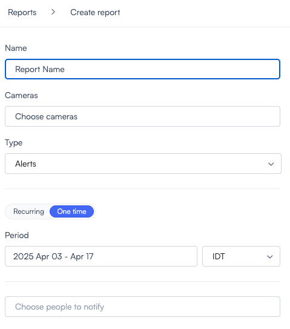
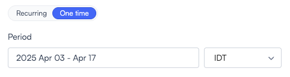
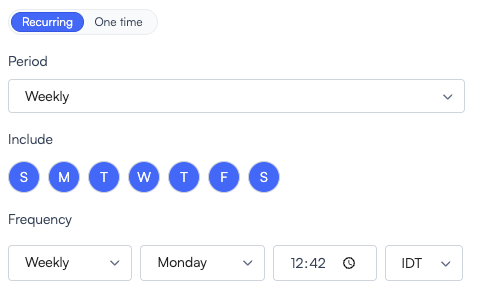

# Generate reports

# Reports: Automated Statistical Exports in Lumana

The **Reports** feature lets you create CSV exports and automate delivery by download or email. Select **Reports** in the main navigation. The entry uses a list-style icon, as shown below.

Use reporting for operational tracking, compliance, and performance review on the data each report type covers.

### Report Types
When setting up a new report, you can choose from three categories. The **Create report** form includes **Name**, **Cameras**, **Type**, frequency (**One time** or **Recurring**), **Period**, and **Notifications**.

Under **Type**, you select **Alerts**, **Attendance**, or **License plates**.

1. **Alerts report** – Summarizes triggered alerts based on selected filters (for example, alert type, camera, location).

2. **Attendance report** – Tracks entries and presence data for individuals.

3. **License plates report** – Extracts license plate recognition data from selected cameras and time ranges.

Each report type is tailored to offer insights relevant to its context, with customizable filters.

### Report modes: One-time or recurring

You can set each report to run once or on a schedule. Select **One time** or **Recurring**, then set **Period** and the timezone for that range when you run a one-time export.

### One-time report

Ideal for ad hoc analysis or retrospective reviews:

- Select the time range for which to gather data.

- Manually trigger the report generation.

- Download the CSV file or email it to designated recipients.

### Recurring report

Select **Recurring**, then configure **Period** (for example **Weekly**), **Include** days, and **Frequency** (cadence, start day, time, and timezone).

Perfect for continuous monitoring or periodic reviews:

- Choose the **report period**: daily, weekly, or monthly.

- Define **inclusion or exclusion rules** (for example, skip weekends).

- Set the **report frequency** and **delivery schedule**.

- Specify the **recipient(s)** who will receive the report via email or SMS.

The **Notify** window lists people from your organization. You can select **SMS** and **Email** per person, search recipients, or use **Notify people from outside the organization** when that fits your process.

This option supports automation and consistency, ensuring stakeholders receive timely data updates without manual effort.

### Delivery & Format

All reports are exported as **CSV files**, compatible with spreadsheets and BI tools. Reports can be:

- **Downloaded** from the Reports section.

- **Automatically** emailed to one or more recipients based on configuration.

This feature provides teams with a scalable way to gain visibility into system activity, user behavior, and operational patterns—while reducing manual data pulls and ensuring consistent reporting.