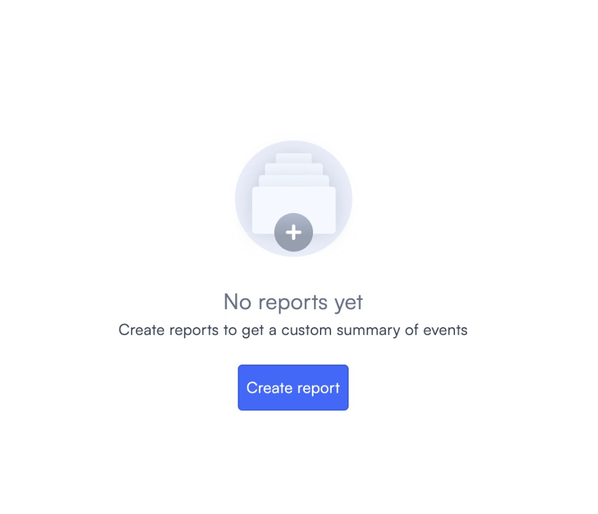
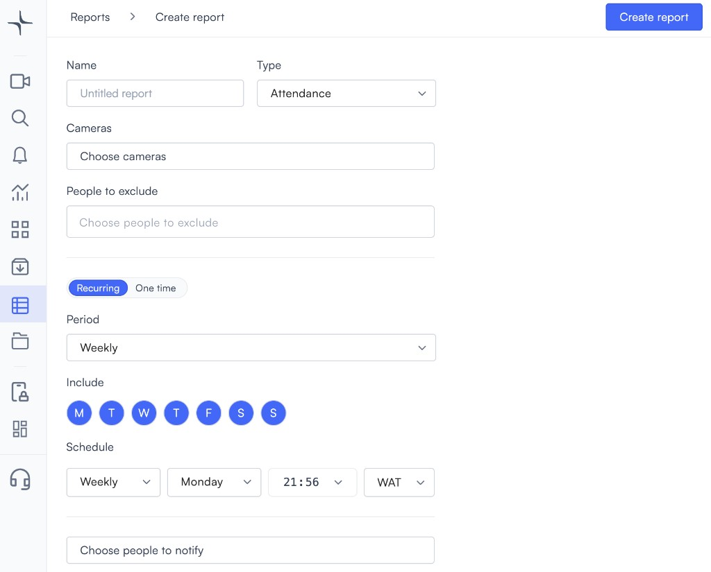
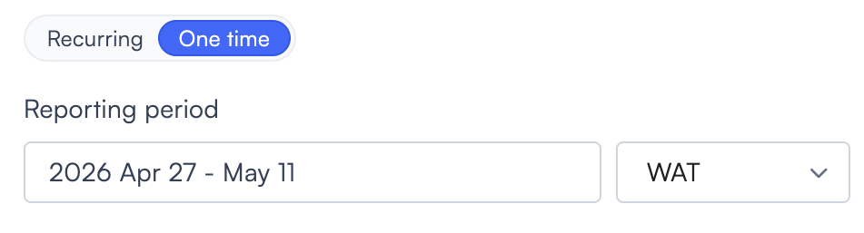
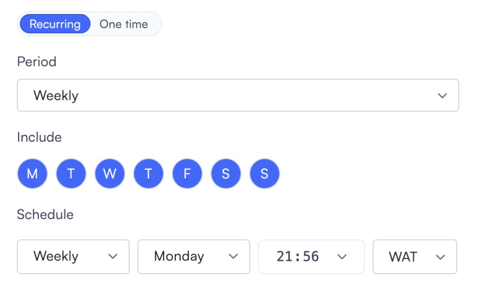
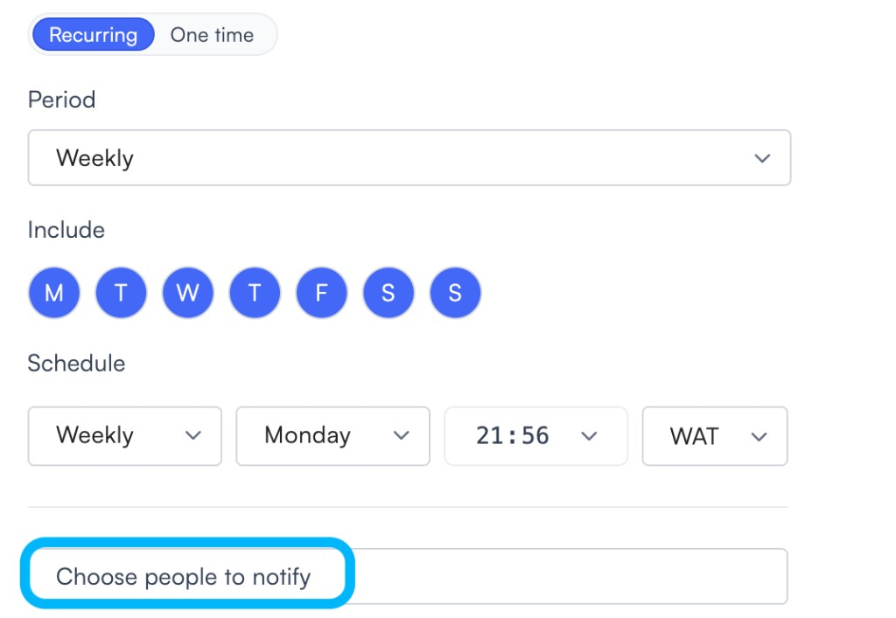
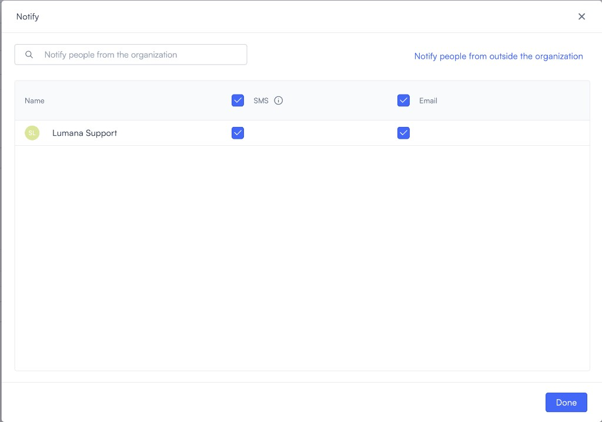

# Generate reports

By the end of this guide, you can configure **Reports**, choose a **Type**, and export CSV files.

You can set **One time** or **Recurring** runs and pick **Notify** recipients.

Reports summarize analytics from your VMS+ data (alerts, attendance, license plates), alongside **Search** and tracking in this section.

The **Reports** feature creates CSV exports and can automate delivery by download or email. Select **Reports** in the main navigation. The entry uses a list-style icon: 

## Prerequisites

- Your role can open **Reports** and **Create report**.
- Cameras and analytics for **Alerts**, **Attendance**, or **License plates** match the report **Type** you plan to use.
- For **SMS** or **Email** delivery, have recipients confirmed in your organization, or use **Notify people from outside the organization** for external addresses.

## Report types

Lumana groups exports into three categories. Each report uses the **Create report** form; **Type** sets which dataset fills the CSV.

1. Select **Reports** in the main navigation (list icon). When you have no saved reports yet, you see **No reports yet** and **Create reports to get a custom summary of events**. Select **Create report**.

2. On **Create report**, set **Name** (replace **Untitled report** when needed). Choose **Type**, **Cameras**, and **People to exclude** when that field appears for your **Type**.

   For **One time**, use **Reporting period** for the date range. Set the timezone in the control next to the range.

   For **Recurring**, set **Period**, **Include**, and **Schedule** (day, time, and timezone) as needed.

   Under **Notifications**, choose recipients (**Choose people to notify**). When the form is complete, select **Create report** in the upper right.

3. Under **Type**, pick one of these categories:

   - **Alerts**: Summarizes triggered alerts based on selected filters (for example, alert type, camera, location).
   - **Attendance**: Tracks entries and presence data for individuals.
   - **License plates**: Extracts license plate recognition data from selected cameras and time ranges.

Each type uses the cameras, schedule, and options you set on **Create report**.

## Report modes: One-time or recurring

On **Create report**, switch **Recurring** and **One time** to match how often the export should run.

When you select **One time**, **Reporting period** holds the date range. Pick the start and end dates, then choose the timezone for that range in the field beside it (for example **WAT**).

## One-time report

Use a one-time export when you need a fixed date range and a single run.

- Select **One time**, then set **Reporting period** to the dates you want.
- Set the timezone next to the range.
- Finish **Create report**, trigger or collect the CSV as your workflow allows, and use **Download** or **Notifications** for delivery.

## Recurring report

Select **Recurring**, then set **Period** (for example **Weekly**). Under **Include**, select the day buttons (**M** through **S**) that should run the export.

Under **Schedule**, set cadence, run day, time, and timezone. In a weekly example, the row may show **Weekly**, **Monday**, **21:56**, and **WAT**.

Use a recurring export when the same report should run on a cadence.

- Align **Period** with how often you need the CSV (daily, weekly, or monthly).
- Use **Include** to skip days you do not want (for example turn off weekend circles).
- Use **Schedule** so delivery time and timezone match your operations team.

Recurring runs still use **Notifications** so recipients get each delivery by **Email** or **SMS** when you connect them in **Create report**.

## Notify recipients

1. On **Create report**, select **Choose people to notify**. The **Notify** dialog opens.

2. In **Notify**, search **Notify people from the organization**. Select people and mark **SMS** or **Email** per row. Use **Notify people from outside the organization** when you need addresses that are not in the directory.

3. Select **Done** to save the list and return to **Create report**.

## Delivery and format

Lumana exports all reports as CSV files. You can open them in spreadsheets or load them into BI tools. You can:

- **Download** exports from the **Reports** section.
- **Email** exports to one or more recipients when delivery is configured.

CSV gives you a stable record of alert, attendance, or plate activity without repeating manual exports for the same question.

## Next steps

- [Understand search in Lumana](../concepts/understand-search-in-lumana.md) - how search relates to the data you report on.
- [Free text search](free-text-search.md) - keyword search across your archive.
- [Search video footage for people or vehicles](search-video-footage-for-people-or-vehicles.md) - drill into footage behind report metrics when you need video proof.
