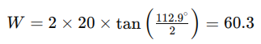
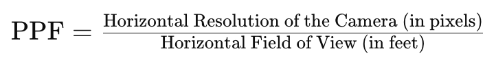
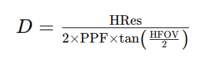

# Pixels per foot (PPF) for camera placement

This reference explains how to estimate **pixels per foot (PPF)** from camera **resolution**, **horizontal field of view (HFOV)**, and **distance**. You can use PPF to plan mounting height, lens choice, and where a stream still meets a detail target.

Capability-specific minimums (for people or vehicles) live on [Tracking people](tracking-people.md) and [Tracking vehicles](tracking-vehicles.md). General mounting guidance is in the [camera guidelines article](https://support.lumana.ai/knowledge/editor/01HEN6TW1P90ZT21YXAJT7FV3X/en-us?brand_id=10899747518610).

## What you need from the camera

1. **HFOV** — Horizontal angle from the datasheet or lens settings.
2. **Horizontal resolution** — Pixel width of the stream Lumana analyzes (not always the sensor’s max).
3. **Distance** — Distance from the lens to the zone where you need a given detail level (face, plate, full person, and so on).

## Horizontal scene width

At distance **D**, horizontal width **W** uses the same length unit as **D** (for example, feet):

Where:

* **W** is the horizontal width of the scene at that distance.
* **D** is the distance from the camera to the subject or plane of interest.
* **HFOV** is the horizontal field of view.

**Example (Lumana 8MP, HFOV = 112.9°):** at **20 feet**, **W** is about **60.3 feet**.

## PPF from width and resolution

PPF is horizontal pixel count divided by **W**:

Using the example above with **3840** horizontal pixels and **W = 60.3** feet:

**PPF ≈ 63.6** pixels per foot at **20 feet** for that camera and geometry.

The chart below shows how PPF changes with distance for **5MP** and **8MP** Lumana cameras. Use it as a quick check when you move a camera or compare models.

## Distance for a target PPF

You can solve for **D** when you know required PPF, horizontal resolution, and HFOV:

For example, for **128 PPF** with the same **8MP** geometry as above, **D** is about **9.95 feet**.

## Planning habits

* Treat calculated PPF as a starting point. Then validate on site with real lighting, traffic, and occlusion.
* If you change resolution, lens, or crop, recalculate PPF for the distances you care about.
* Use the requirement tables on [Tracking people](tracking-people.md) and [Tracking vehicles](tracking-vehicles.md) with these formulas so each camera meets the right capability.

## Next steps

* [Tracking people](tracking-people.md) — people analytics PPF targets and typical distances.
* [Tracking vehicles](tracking-vehicles.md) — vehicle analytics PPF targets, LPR notes, and typical distances.
