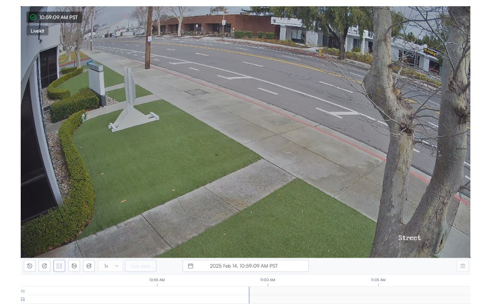
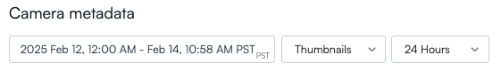
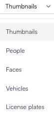
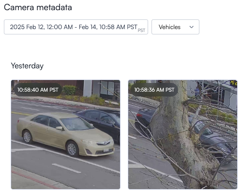
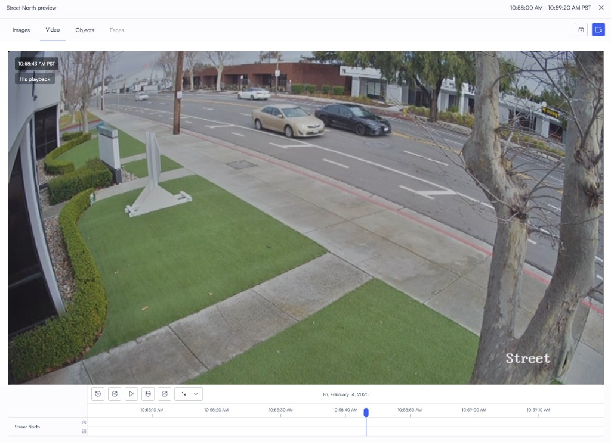
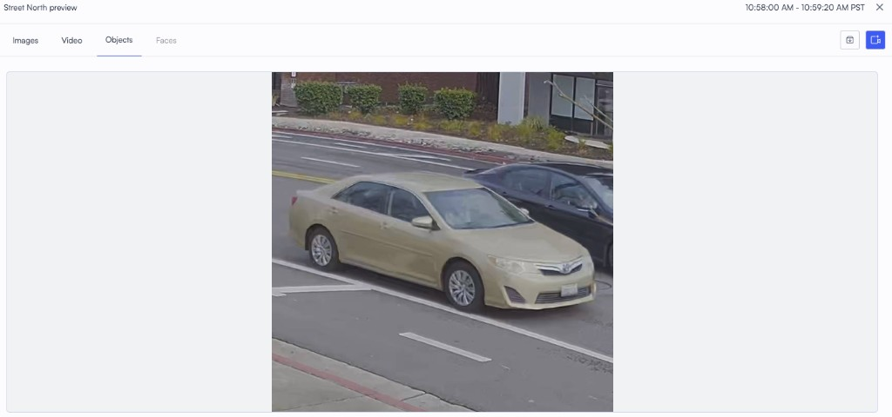
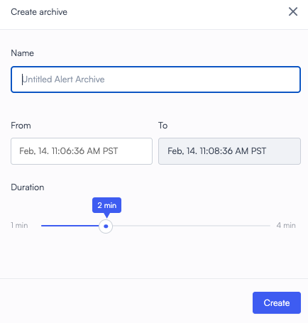

# Filter people, faces, vehicles, and license plates from the camera view

Use the camera player to scrub recorded footage and filter detected **People**, **Faces**, **Vehicles**, and **License plates** from **Camera metadata** below the live view. This path is useful when you are already on a camera and want to browse detections without opening the main **Search** page first.

## Before you begin

Open the camera you want to review and make sure you can see the timeline and the **Camera metadata** strip under the player. You need permission to view that camera and its recorded footage.

## Filter detections from the camera player

1. Navigate to the camera whose footage you want to scrub.

   

2. Scroll to **Camera metadata** under the live view.

   The strip shows the time range, interval, and the object-type control next to the time.

   

3. Open the dropdown labeled **Thumbnails** (next to the time and date).

   

4. Choose the object type you want to browse: **Thumbnails**, **People**, **Faces**, **Vehicles**, or **License plates**.

5. Matching detections appear as tiles under **Camera metadata** so you can scrub through them quickly.

   

6. Click a tile to open the preview. Use **Images**, **Video**, **Objects**, or **Faces** to review the moment, zoom on the detection, or play the clip. Download controls are available on the preview when your role allows it.

   

   On **Objects**, the panel can show a tight crop of the selected vehicle or other detection.

   

7. To save a clip to your archive, start archive creation from this preview flow. Enter a **Name**, set **From** and **To** (and duration if shown), then click **Create**.

   

## Next steps

- Use [Search video footage for people or vehicles](search-video-footage-for-people-or-vehicles.md) when you need the full **Search** page with multi-camera filters and attribute search.
- Use [Free text search](free-text-search.md) when you want to describe what you are looking for in natural language.
