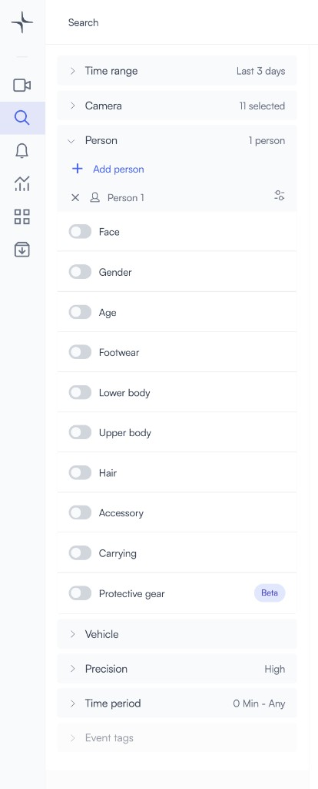
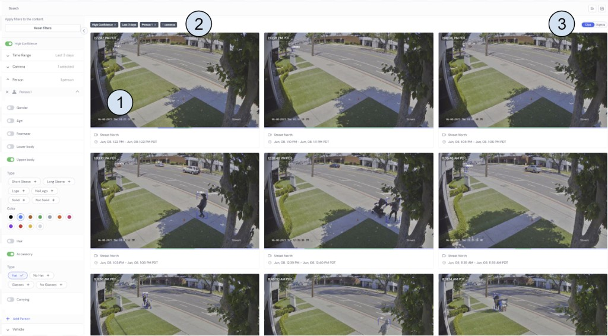
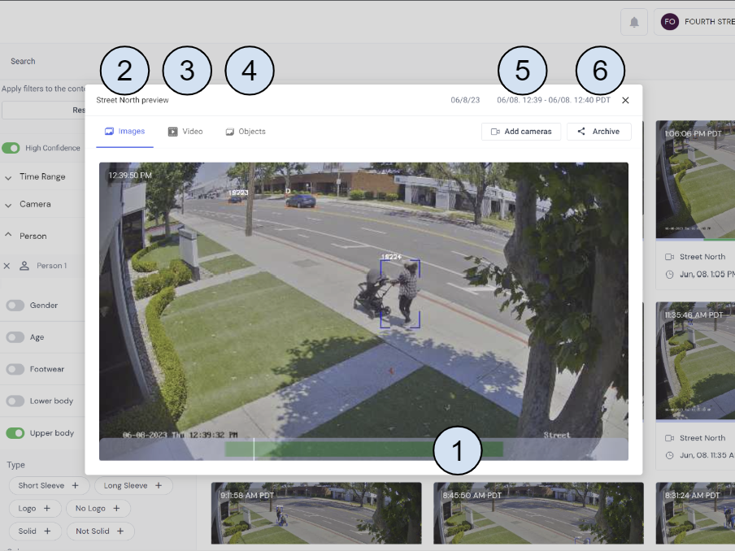

# Search video footage for people or vehicles

# Person Attribute Search

With Lumana’s powerful Smart Search, you can find vehicles, people, and even pets in a matter of seconds. The Lumana Core is an advanced search engine that allows you to filter based on more than thirty attributes and find a single frame with certain people near a specific car—like a person wearing a red T-shirt and a hat standing next to a white Tesla Model S.

## How to Get Started with Search

To get to the search page simply select the magnifying glass icon  on the left Navigation menu.

Use the filters to select the time range, cameras, and objects you would like to search for.

 

## How to Search for a Person 
Step 1: Be sure to select the relevant time range and cameras you'd like to search through. Then, select “**Person.**”

Step 2: Click on the + to add a person. This will filter for all clips with at least 1 person from the designated cameras and time range.

Step 3: If you would like to add details, such as clothing colors, expand the search using the down arrow on the right and select the attributes you want the system to match.

Step 4: You can search for up to four people at a time, but if you do so, all four people must be in the same frame.

### Search Results 

When you select the attributes and objects to filter by, the search results begin showing immediately. Let’s review what type of data you should expect.

1. 60 seconds thumbnail clips. 

2. Markers showing search selections.

3. An easy way to switch between thumbnails and clips.  

Each clip will show you information about the camera and the time and date. If you would like to dig further, simply click on the clip to scrub through the thumbnails, crop or zoom in on the object of interest, or play back the video of that event.

1. Green marker on the thumbnail timeline where the object of interest appears.

2. **Images**: Thumbnail view.

3. **Video**: Playback view.

4. **Objects**: Auto-zoom on the object of interest.

5. **Add Camera**: Add multiple cameras to the view for a synchronized scrub.

6. **Archive**: Archive the video corresponding to the search results for future use.

### Smart Vehicle Search and Multi-Object Search

To learn more about Smart Vehicle Search, please follow this [link](https://support.lumana.ai/hc/en-us/articles/11890679495954).

To learn more about how to search for multiple people or vehicles in the same frame, please follow this [link](https://support.lumana.ai/hc/en-us/articles/11890670516242).

### Advance mode

**High Confidence Knob**

Lumana system enables you to utilize AI confidence level to sort your results. If you can not find what you are looking for, turn off the High Confidence knob to get more results with a high probability of detection but also with a higher probability of false detection.

## Vehicle Attribute Search

With Lumana’s powerful Smart Search, you can locate vehicles, people, and even pets in a matter of seconds. The brainpower behind this function is the Lumana Core, an advanced search engine equipped with license plate recognition (LPR) capability that enables any camera to capture license plate information. The system allows you to filter based on more than ten different attributes. Such detailed searches empower you to find a frame that includes multiple people and a particular vehicle.

Note: License plate recognition (LPR) and make model color (MMC) capabilities require enablement. To learn how to enable those features, please follow this [link](https://support.lumana.ai/hc/en-us/articles/11892546981138). 

## How to Get Started with Search

To get to the search page simply select the magnifying glass icon  on the left Navigation menu.

Use the filters to select the time range, cameras, and objects you would like to search for.

 

### How to Search for a Vehicle 

Step 1: Be sure to select the relevant time range and cameras you'd like to search through. Then, select “Vehicle.”

Step 2: Click on the + to add a vehicle.

Step 3: If you would like to add details to the vehicle search (such as make, model, type, color, or license plate), expand the search using the down arrow on the right and select the attributes you want the system to match.

Step 4: You can search for up to four vehicles at a time, but if you do so, all four vehicles must be in the same frame.

### Smart Vehicle Search and Multi-Object Search

To learn more about Smart People Search, please follow this [link](https://support.lumana.ai/hc/en-us/articles/11176329842194)

To learn more about how to search for multiple people or vehicles in the same frame, please follow this [link](https://support.lumana.ai/hc/en-us/articles/11890670516242)

### Advance Mode
**High Confidence Knob**
Lumana system enables you to utilize AI confidence level to sort your results. If you can not find what you are looking for, turn off the High Confidence knob to get more results with a high probability of detection but also with a higher probability of false detection. 

