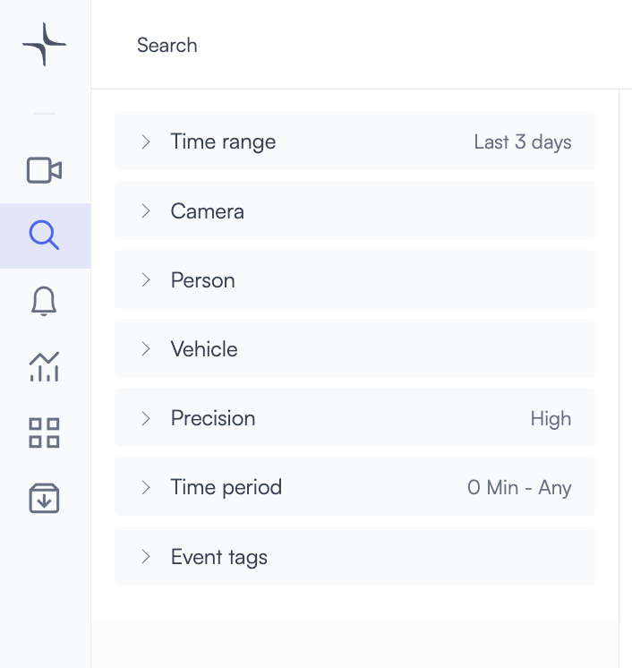
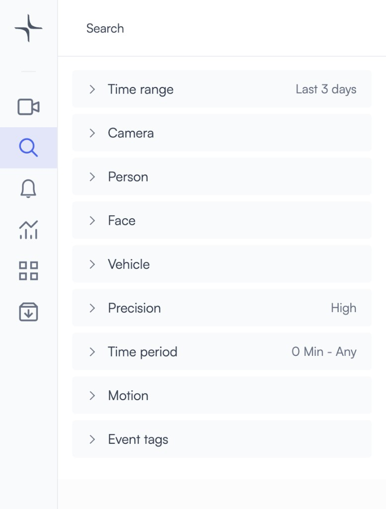
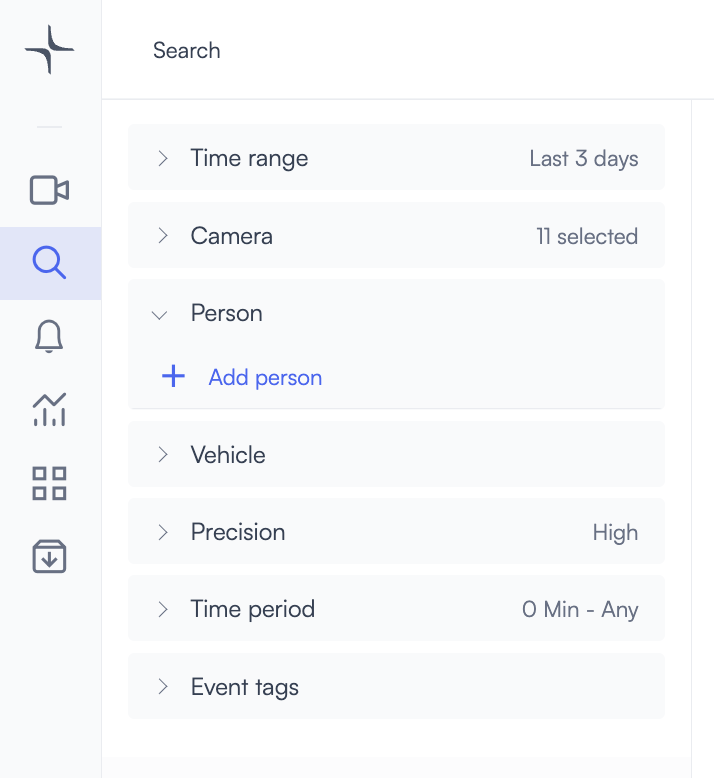
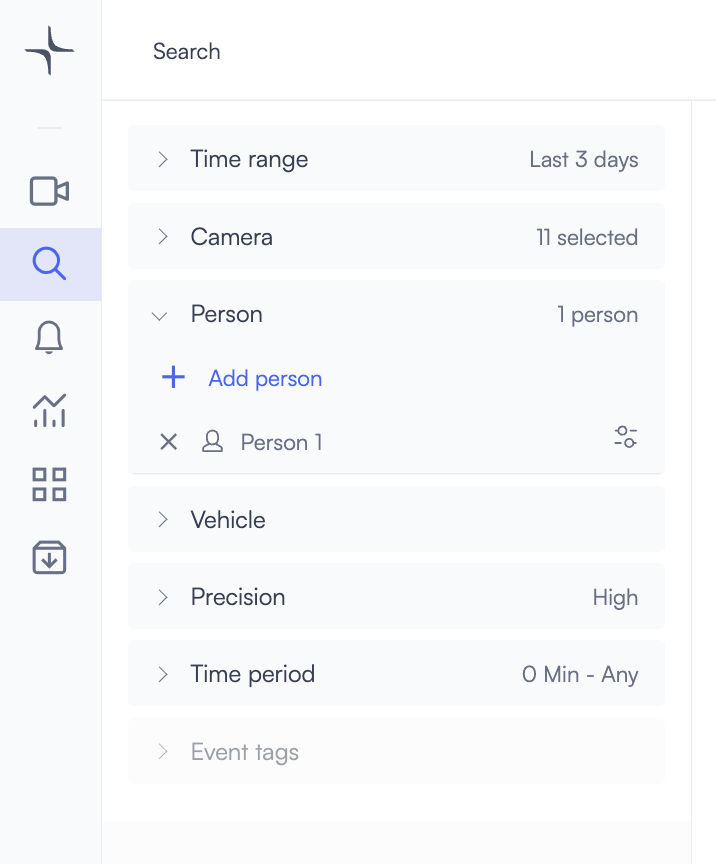
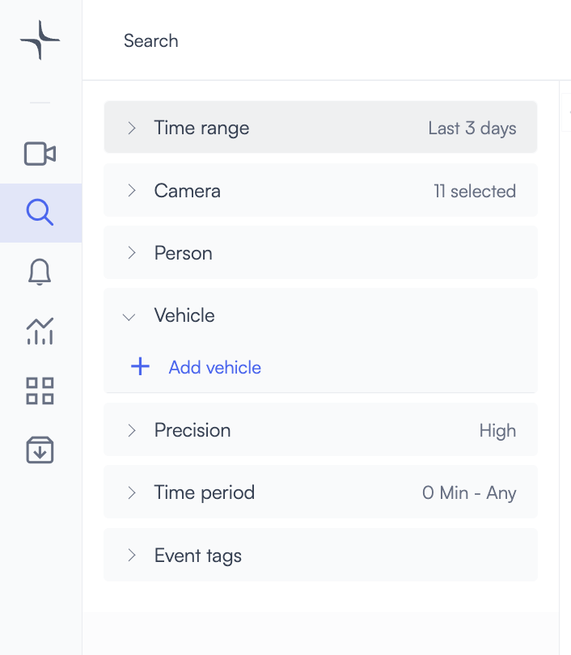
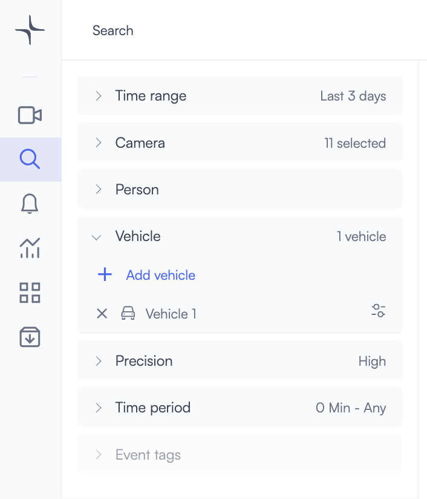
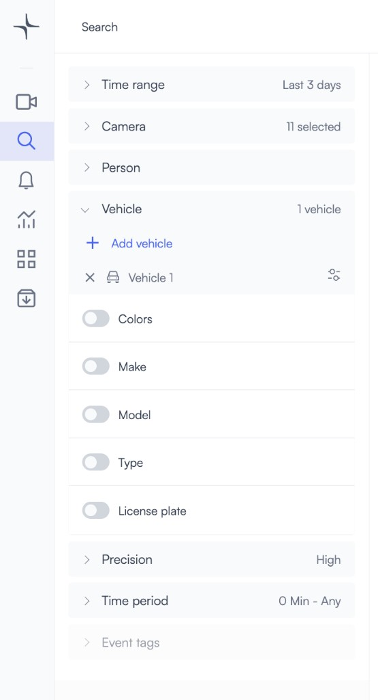

# Search video footage for people or vehicles

Use Smart Search to find people and vehicles across your cameras by time range, location, and attribute filters. Lumana Core runs the search so you can combine filters such as clothing or vehicle details and review matching clips without scrubbing every feed manually.

## Before you begin

Make sure you can open **Search** from the main navigation and select the cameras and time range you need. If you plan to filter by license plate or make, model, and color (MMC), those capabilities must be enabled for your organization.


License plate recognition (LPR) and MMC require enablement. For setup steps, see [Enable LPR and MMC in Lumana](https://support.lumana.ai/hc/en-us/articles/11892546981138).


## Open Search and set the scope

1.  In the left sidebar, click **Search** .

    The Search page opens with filters for time range, cameras, and object types.
2. Set the **Time range** and **Camera** (or cameras) you want to include.
3. Add or adjust other filters as needed, such as **Precision**, **Time period**, or **Event tags**.

Use the filter list to narrow results before you add a **Person** or **Vehicle** object.

## Search for multiple objects in one frame

You can combine several object filters so results only include moments where **all** selected objects appear together (for example, a specific person near a specific vehicle). The same pattern applies as when you search primarily for a [person in Smart Search](https://support.lumana.ai/hc/en-us/articles/11176329842194) or a [vehicle in Smart Search](https://support.lumana.ai/hc/en-us/articles/11890679495954).

You may search for up to **four** different objects at a time. Results show frames that contain **every** selected object with the attributes you configured.

For more detail on multi-object searches, see [Search for multiple people or vehicles in the same frame](https://support.lumana.ai/hc/en-us/articles/11890670516242).

The Search layout can include extra categories when you work across object types, such as **Face**, **Motion**, or additional filters alongside **Person** and **Vehicle**.

## Search for a person

1.  On the Search page, select the time range and cameras you want. Then open the **Person** section and start a person search.

    

2.  Click **+** to add a person row.

    The search returns clips that include at least one person in the chosen cameras and time range.

    

3.  To filter by appearance, expand the person row with the down arrow and turn on the attributes you want, such as clothing colors, face, gender, age, or accessories.

    

4. You can add up to **four** people. If you add more than one, **all** of them must appear in the **same** frame for a clip to match.

## Search for a vehicle

Vehicle search uses attribute filters such as color, make, model, type, and license plate when LPR and MMC are available.

1.  On the Search page, select the time range and cameras you want. Then open the **Vehicle** section.

    

2.  Click **+** to add a vehicle row.

    

3.  To narrow the match, expand the vehicle row and select attributes such as **Colors**, **Make**, **Model**, **Type**, or **License plate**.

    

4. You can add up to **four** vehicles. If you add more than one, **all** of them must appear in the **same** frame for a clip to match.

For more on vehicle-focused Smart Search, see [Smart vehicle search in Lumana](https://support.lumana.ai/hc/en-us/articles/11890679495954).

## Understand search results and the clip preview

Results update as you set filters. Each row ties to a camera and a time.

1. **Thumbnail clips:** About 60 seconds of context per result.
2. **Filter markers:** Show which Person, Vehicle, or other filters are active.
3. **Clips / Objects:** Switch how results are grouped or displayed.

Click a result to open the preview. You can scrub thumbnails, zoom or crop on the object, and play video for that moment.

1. **Green marker** on the thumbnail timeline where the match appears.
2. **Images:** Thumbnail view.
3. **Video:** Playback view.
4. **Objects:** Focused view on the detected object.
5. **Add cameras:** Add more cameras for synchronized review (see [Multi-camera playback](../live-video-monitoring-and-operations/multi-camera-playback.md)).
6. **Archive:** Save the clip to your archive for later.

## Refine results with High Confidence

Under **Precision**, the **High Confidence** control limits results to higher-confidence detections. If you see too few matches, turn **High Confidence** off to include more candidates. That usually increases recall but can add more false positives.

## Next steps

* Use [Free text search](free-text-search.md) when you want to describe a scene in natural language.
* Use [Build a database of people and vehicles](build-a-database-of-people-and-vehicles.md) to manage known people and vehicles for ongoing search and alerts.
