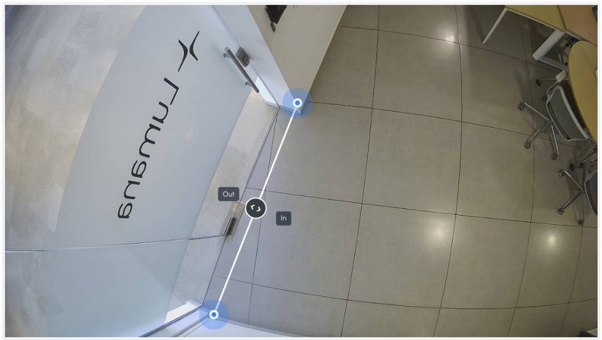
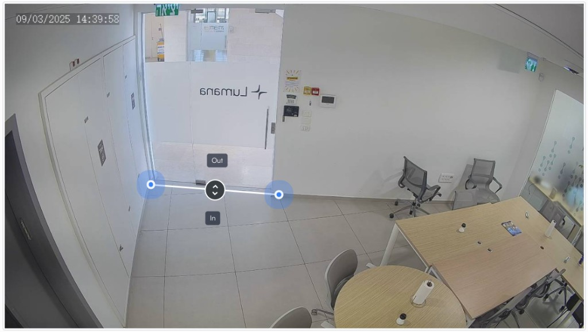

# Space occupancy analytics

Space occupancy analytics helps you track how many people or vehicles are in a defined space over time. You can use it to monitor current occupancy, review historical trends, and understand how a space is used during different hours or days.

## How space occupancy works

Space occupancy relies on cameras that monitor entry and exit points. Lumana counts crossings at those access points and maintains a running occupancy total based on entries and exits.

This means the feature works best when every way into and out of the space is covered. If one access point is missing, then the occupancy count can drift away from the real number of people or vehicles inside.

## What space occupancy helps you measure

Space occupancy data can help you answer different operational questions depending on how you use the dashboard.

- **Current occupancy:** Check how many people or vehicles are in a space right now.
- **Historical trends:** Review peak periods and compare space usage across days or time ranges.
- **Capacity monitoring:** Watch for spaces that are approaching or exceeding expected occupancy levels.
- **Operational planning:** Compare usage patterns so teams can plan staffing, access, or layout changes.

## Choose a camera placement

Camera placement has a direct effect on counting accuracy. In most cases, you should place cameras so they have a clear view of every entrance and exit you want to count.

### Overhead camera placement

Use overhead placement when counting accuracy is the highest priority and the camera can look straight down across the entry path.

- **Placement:** Mount the camera directly above the entrance so it captures movement across the camera's field of view.
- **Best for:** High-traffic entrances where multiple people may enter or exit at the same time.
- **Limitation:** The top-down angle can limit facial visibility and license plate visibility.

### Front-facing camera placement

Use front-facing placement when you need occupancy data and also want better visibility for identification workflows.

- **Placement:** Position the camera at eye level or slightly above, about eight to 10 feet in front of the entry or exit point.
- **Best for:** Spaces where occupancy monitoring and identification both matter.
- **Limitation:** In crowded conditions, people can overlap and create minor counting mismatches.

### Maintain counting accuracy

Regardless of camera angle, accurate counting depends on a few common conditions.

- **Clear sightlines:** Avoid doors, pillars, signs, or other objects that block the camera view.
- **Full access-point coverage:** Make sure every entrance and exit is covered.
- **Usable lighting:** Low light can reduce detection quality, so adjust placement or use cameras that work well in those conditions.

## Common accuracy issues

Even a correct setup can produce misleading numbers if the counting conditions are wrong. These are the most common causes.

### Reset while the space is occupied

Occupancy is calculated from entries minus exits. If the count resets to zero while people are still inside, then the next exits can produce negative values or other misleading totals.

For example, if five people remain in the building when the reset runs, the next recorded exits will lower the count below zero even though the system is only missing the original starting value.

### Occlusion at the entrance or exit

People counting depends on a clear view of movement across the entry point. If people are blocked by objects, building features, or other people, then the system may miss some entries or exits.

When the camera misses more entries than exits, the occupancy count can drift downward and become less reliable over time.

## Configure a space occupancy dashboard

Once camera placement and counting conditions are ready, you can add an occupancy widget to a dashboard to monitor the data.

The setup flow uses the **Occupancy** widget, entrance and exit line crossings, and reset settings to define how the chart or table behaves. For step-by-step setup instructions, use [Configure a space occupancy dashboard](configure-a-space-occupancy-dashboard.md).

## Next steps

After you understand how space occupancy works, you can configure the dashboard and related workflows.

- Use [Configure a space occupancy dashboard](configure-a-space-occupancy-dashboard.md) to add the occupancy widget and set counting behavior.
- Read [Occupancy](../dashboards/widgets/occupancy.md) for the full widget guide and advanced dashboard options.

