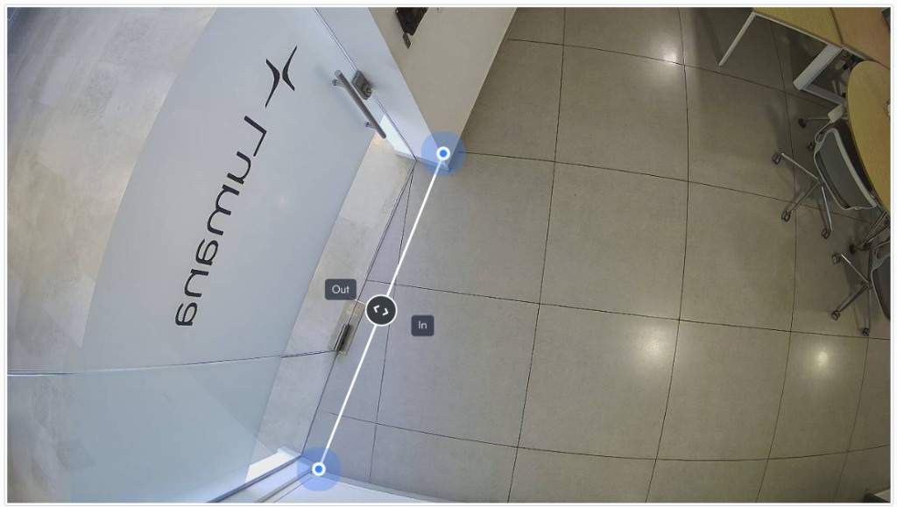
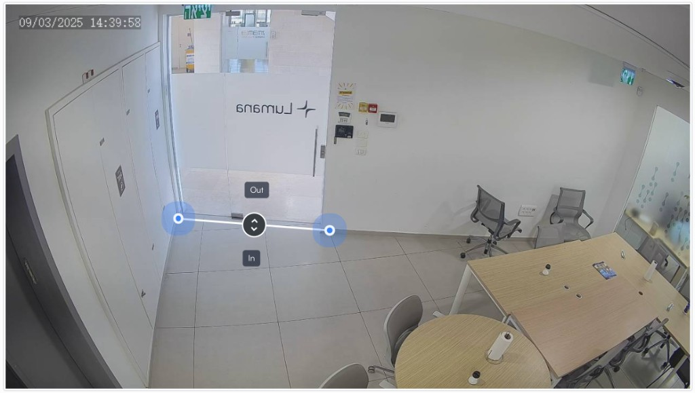

# Space occupancy analytics

Space occupancy analytics uses your cameras and Lumana's analytics to track how many people or vehicles are in a defined space over time. You get live counts plus historical views. Use them to monitor current occupancy, review trends, and compare space usage across hours or days.

## Key features

Space occupancy can support several operational uses.

### Real-time occupancy tracking

Analytics process the video stream to estimate how many people or vehicles are in monitored areas. You can:

- Monitor utilization and spot overcrowding or quiet periods.
- Compare live counts to occupancy limits your organization defines.
- React to changing counts with staffing, access, or routing adjustments.

### Historical trend analysis

Lumana keeps occupancy history so you can review patterns. That helps you:

- Identify peak hours and adjust schedules or operations.
- Inform layout changes from movement patterns.
- Plan space and resources using longer-range usage data.

### Location analysis

You don't need to cover the whole floor with cameras. Aim coverage at every path in and out of the zone; that often needs fewer devices than full-floor monitoring. If anyone can bypass a count line, then the totals drift from reality. How virtual lines and crossings work is explained in [How space occupancy works](#how-space-occupancy-works).

### Dashboards and reporting

Use dashboards to present occupancy metrics in one place. You can:

- See live and historical data together.
- Compare zones or sites when your setup supports multiple lines or spaces.
- Export or share reports when you need evidence for audits, compliance, or planning. Details depend on your widget and export options. See [Occupancy](../dashboards/widgets/occupancy.md).

### Security and compliance

- **Current occupancy**: Check how many people or vehicles are in a space right now.
- **Historical trends**: Review peak periods and compare space usage across days or time ranges.
- **Capacity monitoring**: Watch for spaces that are approaching or exceeding expected occupancy levels.
- **Operational planning**: Compare usage patterns so teams can plan staffing, access, or layout changes.

## How space occupancy works

Space occupancy relies on cameras that watch entry and exit points. You place virtual count lines on the video so crossings count as in or out. Lumana maintains a running total from those crossings. Multiple cameras can feed one logical space so you cover every doorway or lane that matters.

The feature works best when every way into and out of the counted area is covered. If someone can enter or leave without crossing a line, then the total drifts from the real number inside.

### Choose a camera placement

Camera placement affects counting accuracy. Aim each camera so it has a clear view of the crossing you want to measure. Include every entrance and exit in the count.

### Overhead camera placement

Use overhead placement when counting accuracy matters most and you can mount the camera to look straight down across the path.

- **Placement**: Mount the camera directly above the entrance so it captures movement across the camera's field of view.
- **Best for**: High-traffic entrances where multiple people may enter or exit at the same time.
- **Limitation**: The top-down angle can limit facial visibility and license plate visibility.

### Front-facing camera placement

Use front-facing placement when you want occupancy counts plus a view that is also useful for identification. Examples include face or plate workflows when the scene supports them.

- **Placement**: Position the camera at eye level or slightly above, about eight to 10 feet in front of the entry or exit point.
- **Best for**: Spaces where occupancy monitoring and identification both matter.
- **Limitation**: In crowded conditions, people can overlap and create minor counting mismatches.

### Maintain counting accuracy

Whatever angle you choose, the same conditions usually apply:

- **Clear sightlines**: Avoid doors, pillars, signs, or other objects that block the camera view.
- **Full access-point coverage**: Make sure every entrance and exit is covered.
- **Usable lighting**: Low light can reduce detection quality, so adjust placement or use cameras that work well in those conditions.

## Common accuracy issues

Even with good placement, counts can mislead when rules or the scene are wrong.

### Reset while the space is occupied

Occupancy is entries minus exits (with reset rules you configure). If the count resets to zero while people are still inside, then later exits can drive the total negative or otherwise confuse the chart. The system is not wrong about the exits. It is missing the true starting population.

For example, if five people remain when the reset runs, then the next exits subtract from zero and the line can go below zero.


Schedule resets when the space is empty, or align with your [widget reset settings](configure-a-space-occupancy-dashboard.md) so the baseline matches reality.


### Occlusion at the entrance or exit

Counting needs a clear crossing. If people are hidden by objects, architecture, or each other, then the model can miss an in or out. When entries are missed more than exits (or the reverse), the running total drifts. Severe imbalance can also contribute to strange negatives over time.

## Configure a space occupancy dashboard

When cameras are aimed and count lines exist for your doors or lanes, add the **Occupancy** widget and finish its settings in the UI. Follow [Configure a space occupancy dashboard](configure-a-space-occupancy-dashboard.md).

## Next steps

- Use [Configure a space occupancy dashboard](configure-a-space-occupancy-dashboard.md) for the step-by-step widget flow (calculation, reset schedule, viewing hours).
- Read [Occupancy](../dashboards/widgets/occupancy.md) for widget options, calculations, and exports.
