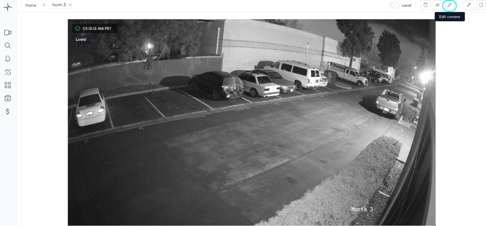
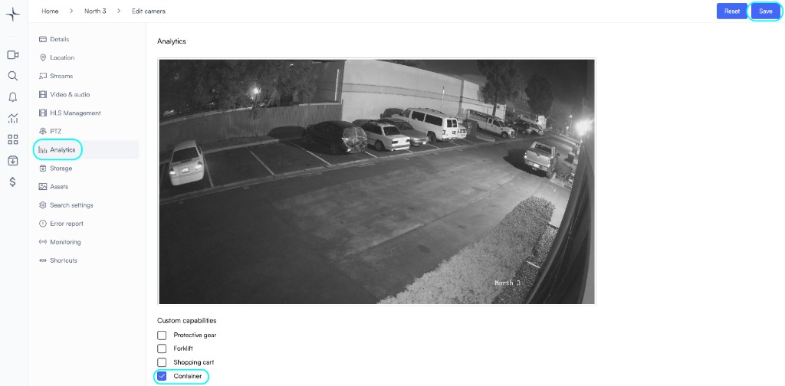
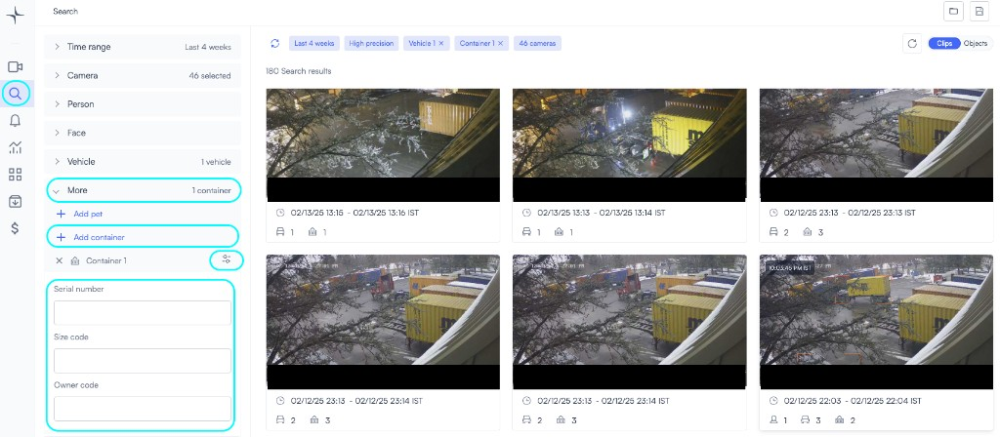

# Tracking containers

**Container** analytics reads container identifiers from the video stream. You can turn it on per camera, then use **Search** to find footage and narrow results by serial number, size code, and owner code.

Many teams use it at gates, yards, and warehouse doors where containers pass fixed cameras. Results still depend on lighting, angle, and how clearly the ID is visible in frame.

## Before you begin

* You can **edit camera** settings and analytics for the target cameras.
* The scene shows enough of the container ID that reads are plausible for your use case.
* Optional: you already know how to open **Search** in VMS+.

## Enable container detection on a camera

Turn on container detection in **Edit camera** for each camera that should run it.

1. Open the camera where you want container detection.
2. Select **Edit camera** in the toolbar.

3. In the sidebar, select **Analytics**.
4. Under **Custom capabilities**, select **Container**.
5. Select **Save**.

## Search for containers

After you enable **Container** and save, use **Search** to find matching clips or events. Add a container filter when you need to restrict results.

You can filter by **Serial number**, **Size code**, and **Owner code** when those fields apply to your inventory.

## Next steps

* [Understand search in Lumana](../concepts/understand-search-in-lumana.md) — how **Search** fits the rest of VMS+.
* [Free text search](free-text-search.md) — query by keywords across your archive.
* [Container detection](../alerts-and-ai-detection/alert-types/identification/container.md) — alert when Lumana identifies a container.
