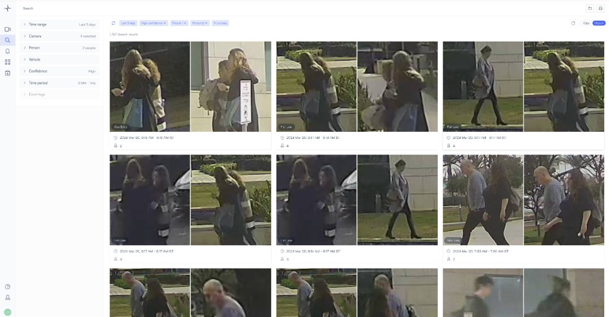
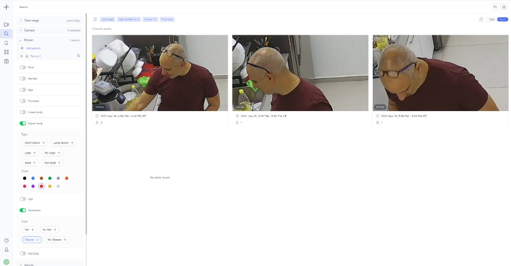
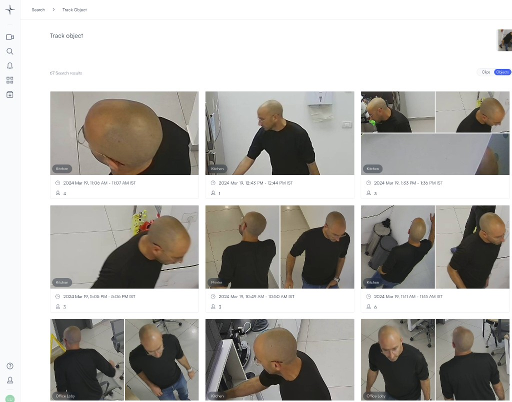
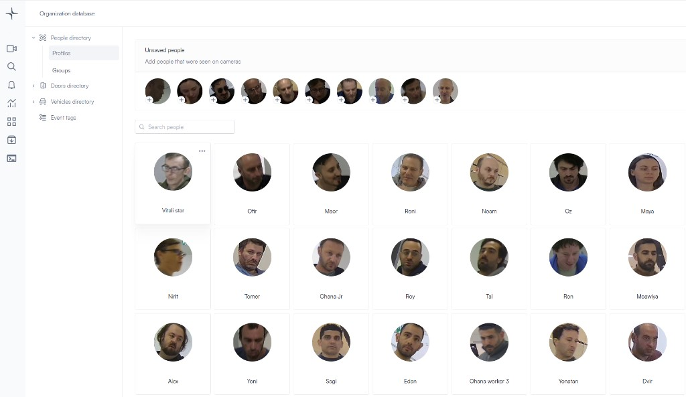
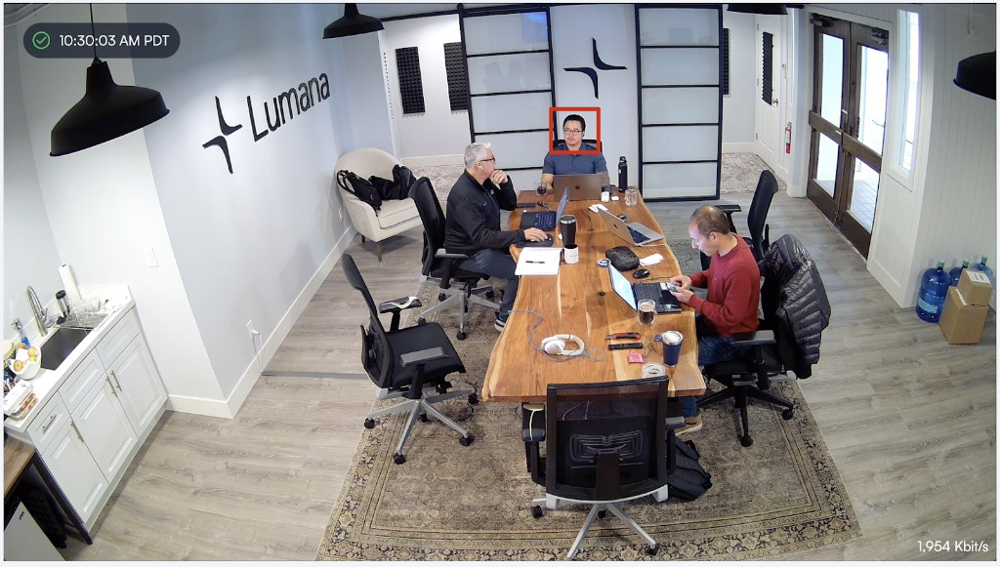
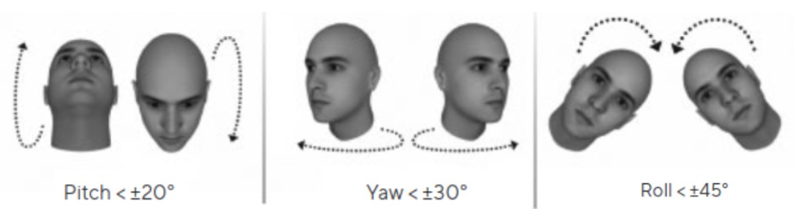
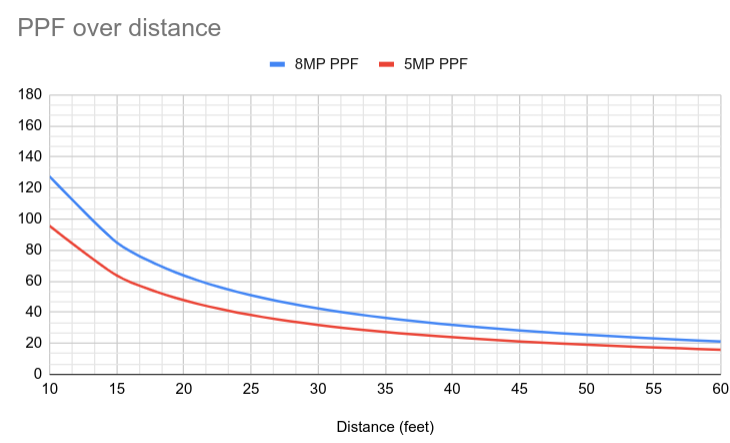
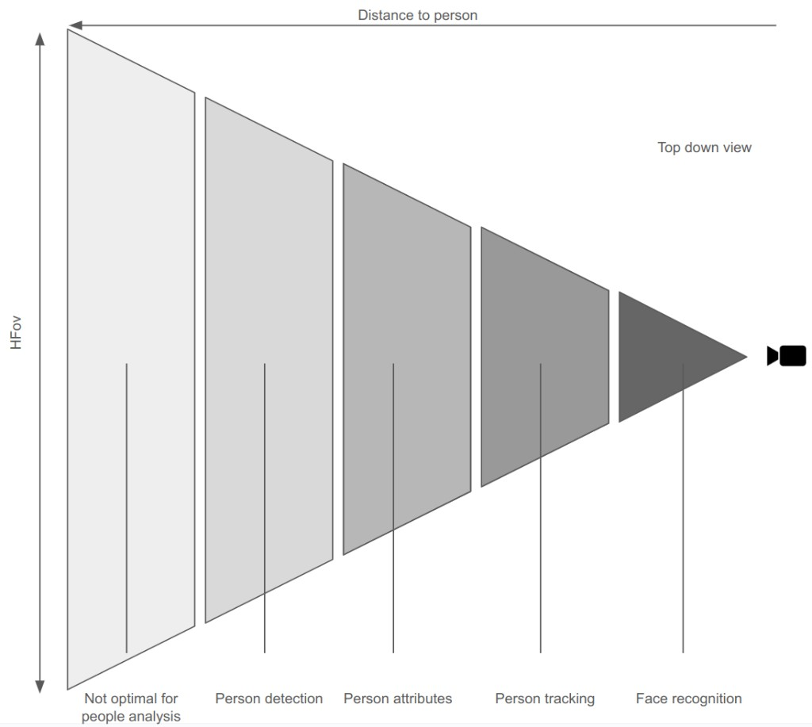

# Tracking people

Lumana combines video management with an AI engine so you can search large archives of footage quickly, receive real-time alerts, and automate responses. People analytics builds on that stack: you can search, track, and review occupancy-related activity using person detection, attributes, cross-camera association, and—where enabled—face recognition.

The platform is designed to install with standard cameras. Detection and analytics improve as the system processes each stream; positioning and resolution still matter, especially for face recognition and attribute detail at distance.

## Before you begin

- Cameras are added in Lumana and streaming reliably.
- You know which sites or cameras should run people-related analytics (and any org policies that apply to face recognition or cross-camera identity).
- For mounting and aiming, see [camera guidelines for people analytics](https://support.lumana.ai/knowledge/editor/01HEN6TW1P90ZT21YXAJT7FV3X/en-us?brand_id=10899747518610) on the support site.

## People analytics features

### Person detection

The engine supports long-range person detection: individuals can be tracked and their crops stored at useful resolution. You can review everyone detected across your organization, select one person or groups that appear together, and base alerts on their activity. This supports security, investigations, and operations that depend on knowing who moved where and when.

### Person attributes

You can filter and alert on person attributes such as clothing color and type, accessories, and gender (where the model provides them). That narrows search and review without manually scanning every clip.

### Cross camera tracking

Cross-camera tracking uses body shape, clothing, and other visible cues—not only the face—to associate the same person across cameras. That helps when the face is not visible or not suitable for recognition. Typical uses include attendance, access and investigations across large sites, and safety monitoring where you need continuity beyond a single camera view. Configure and use this capability according to your organization’s policies and applicable privacy requirements.

### Face recognition

Face recognition supports search and alerts based on enrolled or observed faces. Performance depends on lighting, angle, and resolution (see [Head angle impact](#head-angle-impact) and the PPF section below). Use face data in line with your policies and regulatory obligations.

### Head angle impact

For best face recognition results, faces should be roughly head-on—looking toward the camera—and within the distance your setup can support for the required pixels per foot (PPF).

Acceptable head orientation falls in the ranges illustrated below (pitch, yaw, roll).

## Optimize your camera setup

Position and aim cameras using the [camera guidelines for people analytics](https://support.lumana.ai/knowledge/editor/01HEN6TW1P90ZT21YXAJT7FV3X/en-us?brand_id=10899747518610) so people analytics gets consistent coverage.

### PPF and distance

For person detection and face recognition, usable range is tied to **resolution** and **horizontal field of view (HFOV)**. **Pixels per foot (PPF)** relates the camera’s horizontal pixel count to the real-world width the scene covers at a given distance: higher PPF means more pixels across each foot of scene, which supports finer detail for attributes and faces.

Clarity at the subject matters: the same camera can be adequate for detection at one distance and too weak for recognition closer or farther depending on geometry and lighting. Estimating PPF is a practical first step when you place cameras.

### Calculate PPF

1. **Horizontal field of view (HFOV)** — From the camera datasheet or configuration; this is the horizontal angle the lens sees.
2. **Resolution** — Horizontal pixel count of the encoded or analyzed stream (for example, 3840 for a wide 8MP frame).
3. **Distance** — Distance from the lens to the region where you need a given level of detail (for example, where faces should be recognized).

**Horizontal width of the scene** at distance **D** (use the same unit for **D** and **W**, e.g. feet):

Where:

- **W** is the horizontal width of the area the camera sees at that distance.
- **D** is the distance from the camera to the subject or plane of interest.
- **HFOV** is the horizontal field of view of the camera.

**Example (Lumana 8MP camera, HFOV = 112.9°):** at **20 feet** distance, the horizontal width **W** is about **60.3 feet**.

**PPF** is the horizontal resolution divided by that width **W** (pixels per foot):

Using the numbers above for an **8MP** stream:

- Horizontal resolution = **3840** pixels  
- Horizontal width **W** = **60.3** feet  

**PPF ≈ 63.6** pixels per foot at that distance.

You can also solve for **distance** when you target a required PPF:

For example, for a target of **128 PPF**, the corresponding distance in the same model is about **9.95 feet**.

### Planning notes

1. **Minimum PPF** — For people analytics, about **18 PPF** is a common minimum for identifying individuals in the scene; **higher PPF** is needed for finer detail, including typical face recognition setups.
2. **Environment** — Lighting, occlusion, and aim change how much effective detail you get; treat calculated PPF as a starting point and validate on site.
3. **Re-check over time** — If you change resolution, lenses, or scenes, recalculate PPF for the distances you care about.

A small reference table per camera model (PPF vs. distance) speeds up placement and troubleshooting.

Use the following **PPF targets** when planning which capability you need at a given distance:

| Capability | Requirement (PPF) |
| --- | --- |
| Person detection | 7.5 PPF |
| Person attributes | 15 PPF |
| Person tracking | 18 PPF |
| Face recognition | 137 PPF |

**Approximate maximum distances** on Lumana cameras (assembly height **9 feet**, tilt **25°**, reference person height **5′10″**). Treat these as **typical** planning values; your mounting, scene, and lighting will change results.

| Camera resolution | Person detection | Person attributes | Person tracking | Face recognition |
| --- | --- | --- | --- | --- |
| 5MP | 120 feet | 63 feet | 53 feet | 7 feet |
| 8MP | 160 feet | 84 feet | 70 feet | 9.3 feet |

## Next steps

- [Build a database of people and vehicles](build-a-database-of-people-and-vehicles.md) — enroll faces and organize profiles for search and alerts.
- [Search video footage for people or vehicles](search-video-footage-for-people-or-vehicles.md) — query by person, attributes, and time.
- [Tracking vehicles](tracking-vehicles.md) — parallel guidance for vehicle analytics and placement.
