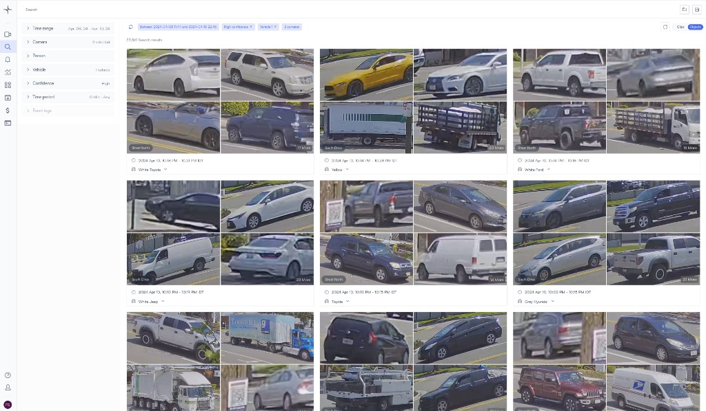
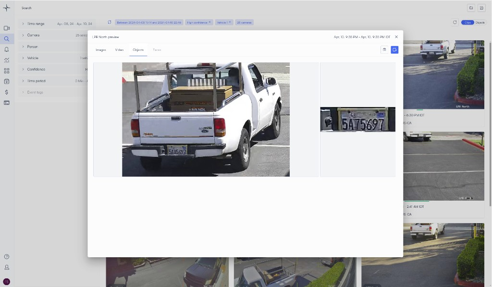
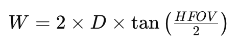
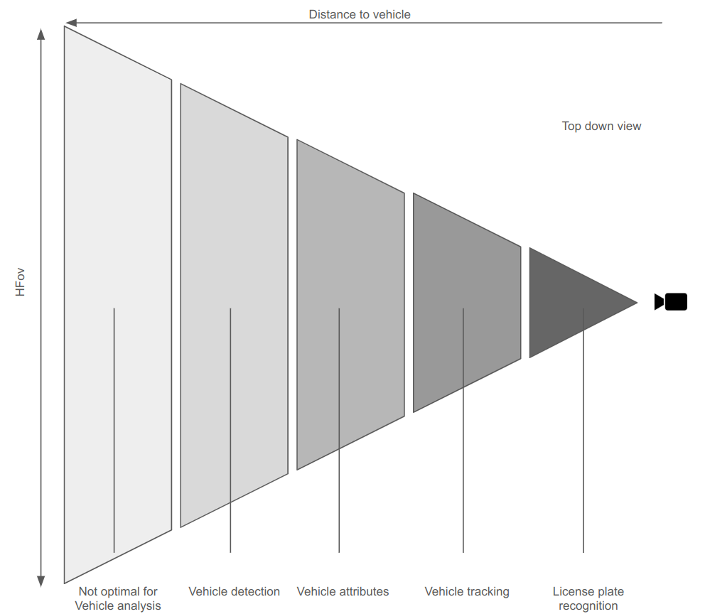

# Tracking vehicles

# Introduction

Lumana is a pioneering, cloud-based VMS+ platform that leverages our state-of-the-art AI Engine to transform video surveillance into a dynamic, proactive video management system. With Lumana, users can search through thousands of hours of video in mere seconds, receive real-time alerts, and automate responses. This revolution in visual intelligence makes spaces safer and operations smarter, all without the need for human intervention.

Our patented AI algorithms not only enhance camera functionality but also learn from the video stream, offering unparalleled object detection capabilities that evolve continuously.

Utilizing our innovative AI engine, Lumana now extends its analytics to vehicles, enabling robust search, identification, and analysis capabilities for license plates, makes, models, types, and colors.

## Vehicle analytics features
### Vehicle detection

Lumana's AI Engine sets a new standard in vehicle detection, capable of identifying vehicles at long ranges and capturing their details in high resolution. This feature allows for an exhaustive view of all detected vehicles within an environment. Users can filter searches by individual or multiple vehicle characteristics and set alerts based on specific behaviors or attributes, significantly enhancing security and operational insights.

### Vehicle attributes
With advanced recognition of vehicle attributes, Lumana enables proactive alerting and detailed searches across your organization based on vehicle color, make, model, and type. This capability not only bolsters security protocols but also streamlines operational workflows and enriches user engagement by offering tailored monitoring and interaction within any setting.

### Cross Camera Tracking
Extend the capabilities of vehicle monitoring beyond static recognition with cross-camera tracking. This technology allows for the continuous observation of vehicles across multiple cameras, utilizing a combination of license plate data, vehicle characteristics, and movement patterns. It ensures comprehensive coverage and security, vital for managing large premises and sensitive areas.

TBD: Add an example

 

###License Plate Recognition
Lumana's license plate recognition technology is designed to identify and catalog vehicles swiftly, enhancing security measures and user experiences. This feature is instrumental in access control, parking management, and traffic monitoring, providing an efficient and secure method to manage vehicle entry and movement. 

## Optimizing Your Camera Setup 

Ensure your cameras are positioned according to the [following guidelines](https://support.lumana.ai/knowledge/editor/01HEN6TW1P90ZT21YXAJT7FV3X/en-us?brand_id=10899747518610) to get the
optimized results with Vehicle Analytics.

## Determining Optimal Distance for Person analysis

The effectiveness of vehicle detection and analytics relies on the camera's resolution and the calculated Pixels Per Foot (PPF), which directly impacts the ability to identify specific vehicle features accurately.

## The Necessity of PPF in Vehicle Analytics

For vehicle analytics, clarity is paramount. The ability to distinguish vehicle details depends on the calculated optimal PPF, serving as the foundation for an effective surveillance setup.

Step-by-Step Calculation of PPF for Vehicle Detection

1. **Determine the Horizontal Field of View of the Camera (HFoV)**: Begin by assessing the camera's field of view, which is the observable area the camera can capture. This is often provided in the camera's specifications.

2. **Understand the Camera's Resolution**: Know the resolution of the camera, typically denoted in pixels (e.g., 2560x1440 in 4MP camera).

3. **Identify the Distance**: Identify the distance from the camera to the area of interest where individuals will be monitored.

With these elements, calculate the PPF to ensure high-resolution vehicle detection and analytics.

First, we would like to find what is the horizontal length the camera covers

where:

�W is the horizontal length the camera can see

�D is the distance from the camera to the subject

����HFOV is the horizontal field of view of the camera
Example based on Lumana 8MP camera (HFOV=112.9)

On 20 feet distance the horizontal length of the image plane is approximately 60.3 feet width.

The next step is to calculate the PPF at this distance

Using the numbers from above with a Lumana 8MP camera:

| Input | Value |
| --- | --- |
| Horizontal resolution of the camera | 3840 pixels |
| Horizontal field of view (width) | 60.3 feet |

Plugging these into the PPF formula:

So at 20 feet, the PPF is approximately **63.6 pixels per foot**.

The chart below shows how PPF changes with distance for Lumana 5MP and 8MP cameras, which you can use as a quick reference when planning camera placement:

### Finding the distance for a required PPF

You can also work the formula in reverse to find the maximum distance at which a camera still meets a required PPF:

For example, to find the distance at which the 8MP camera above delivers 128 PPF, the distance is approximately **9.95 feet**.

### Practical considerations

1. **Minimum PPF for identification** — A minimum of 25 PPF is recommended for basic vehicle detection, with higher values required for detailed analytics like license plate recognition.
2. **Environmental factors** — Consider lighting, obstructions, and camera angles, as they influence the effective PPF and the overall quality of vehicle analytics.
3. **Continuous assessment** — As conditions and technologies evolve, regularly reassess your PPF calculations to ensure your surveillance system remains effective for vehicle analytics.

To apply this knowledge practically, consider setting up a reference table that lists the PPF values against varying distances for each camera model in your inventory. This table will act as a quick guide to determining the maximum effective distance for vehicle detection, attributes, tracking, and license plate recognition for each camera.

Requirement table per feature: 

|  | Requirements |
| --- | --- |
| Vehicle detection | 7.5 PPF |
| Vehicle attributes | 30 PPF |
| Vehicle tracking | 40 PPF |
| License plate recognition | 80 PPF |

Vehicle analytic performance over Lumana cameras: 

Assembly with 9 feet height, 25 degree tilt, typical US plate is 12-inch width

| Camera resolution | Vehicle detection | Vehicle attributes | Vehicle tracking | License plate recognition |
| --- | --- | --- | --- | --- |
| 5MP | 120 feet | 32 feet | 24 feet | 12 feet |
| 8MP | 160 feet | 42 feet | 32 feet | 16 feet |

### Special Considerations for License Plate Recognition

License plate recognition (LPR) is an intricate capability within vehicle analytics, demanding a detailed focus on several technical factors to ensure accuracy across varying conditions:

**Camera Selection for LPR**
Cameras tailored for LPR typically feature advanced imaging technologies designed to capture crisp, readable images of license plates in diverse lighting and speed scenarios. These specialized cameras might include features like global shutters and infrared capabilities.

**Importance of FoV for LPR**
The Field of View (FoV) of the camera plays a critical role in license plate recognition:

| FoV consideration | Why it matters |
| --- | --- |
| **Narrow FoV** | A narrower FoV is often preferable for LPR because it allows the camera to focus on a smaller area, which can enhance the detail of the captured image at greater distances. This is particularly important when monitoring traffic in a specific lane or at controlled access points. |
| **Typical FoV for LPR** | The typical FoV for effective LPR ranges from 25 to 40 degrees, which helps to isolate the license plate from the surrounding scene and reduces distortion. |

**LED Illumination for Nighttime Clarity**
Proper LED illumination is essential for night visibility. High-powered, focused LED lights specifically designed for LPR can significantly improve the clarity of license plate capture in low-light conditions.

**Precise Exposure Settings**
Short exposure times are crucial to freeze the motion of a moving vehicle and obtain a clear capture of its license plate. Cameras equipped with automatic exposure adjustment capabilities can adapt to changes in lighting conditions, maintaining the necessary exposure to capture clear images.

**Comprehensive Environmental Considerations**
Lighting, obstructions, camera angles, and FoV are intertwined factors that define the successful deployment of LPR technology:

| **Lighting** | **Obstructions** | **Camera angles** | **FoV** |
| --- | --- | --- | --- |
| Must be balanced to avoid under or overexposure of the license plate. | Clear lines of sight are necessary to prevent blockages of the plate. | Angles close to perpendicular to the direction of the vehicle travel are ideal for LPR. | Narrower FoVs are typically more effective for reading license plates, as they can minimize irrelevant background details and focus on the plate itself. |

By diligently considering these factors, especially the FoV and its impact on distance and detail capture, you can fine-tune your camera system for high-quality license plate recognition, ensuring optimal performance under all conditions.

### Practical Example of an LPR Camera Setup

Let's consider a real-world scenario to illustrate how the aforementioned considerations can be implemented in an LPR camera setup:

**Scenario**
A parking facility wants to automate vehicle entry by recognizing license plates at the entrance gate. The goal is to capture and process each vehicle's license plate quickly and accurately, regardless of the time of day or weather conditions.

### LPR Camera Configuration

| **Camera selection** | **FoV and placement** | **LED illumination** | **Exposure settings** |
| --- | --- | --- | --- |
| A dedicated LPR camera with a global shutter and built-in infrared (IR) illumination is chosen. This 4MP camera has an optimized FoV of 30 degrees, suitable for focusing on license plates at the distance of interest. | The camera is mounted at a height of 4 feet, with the lens directed slightly downward to capture the license plates of both sedans and SUVs. The narrow FoV ensures that the camera focuses only on the lane where the vehicles will be passing through. | IR illuminators are positioned to flank the camera, providing even illumination across the license plates without creating glare or reflection. | The camera's exposure settings are configured for fast shutter speeds to "freeze" the motion of cars driving up to 30 mph, ensuring that each license plate is captured with clarity. |

**Such settings enable clear license plate recognition at a distance of up to 60 feet.**

 

**Day view**

image.png

Night view

 

     