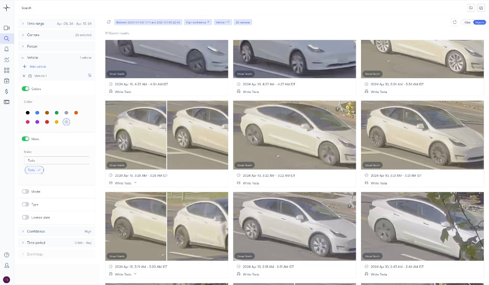
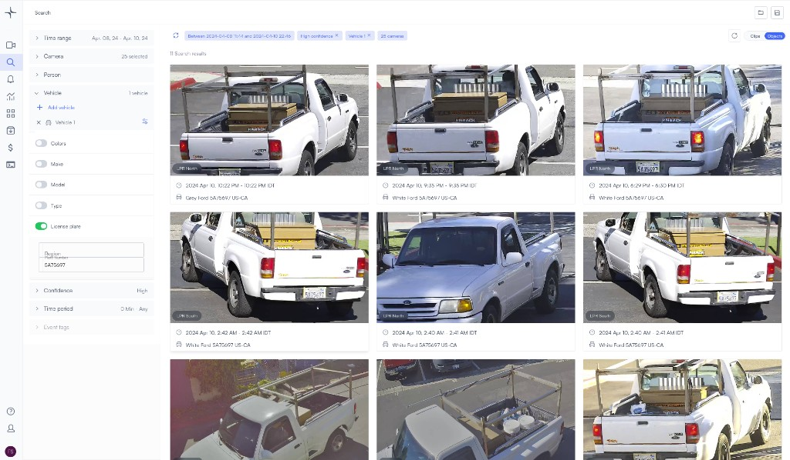
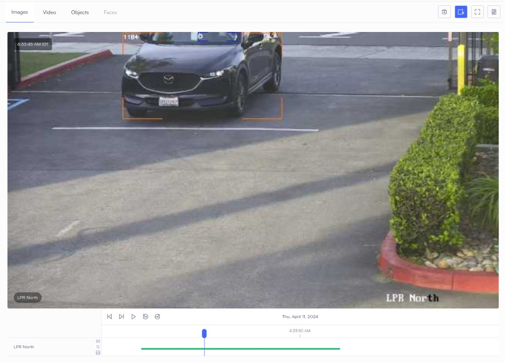
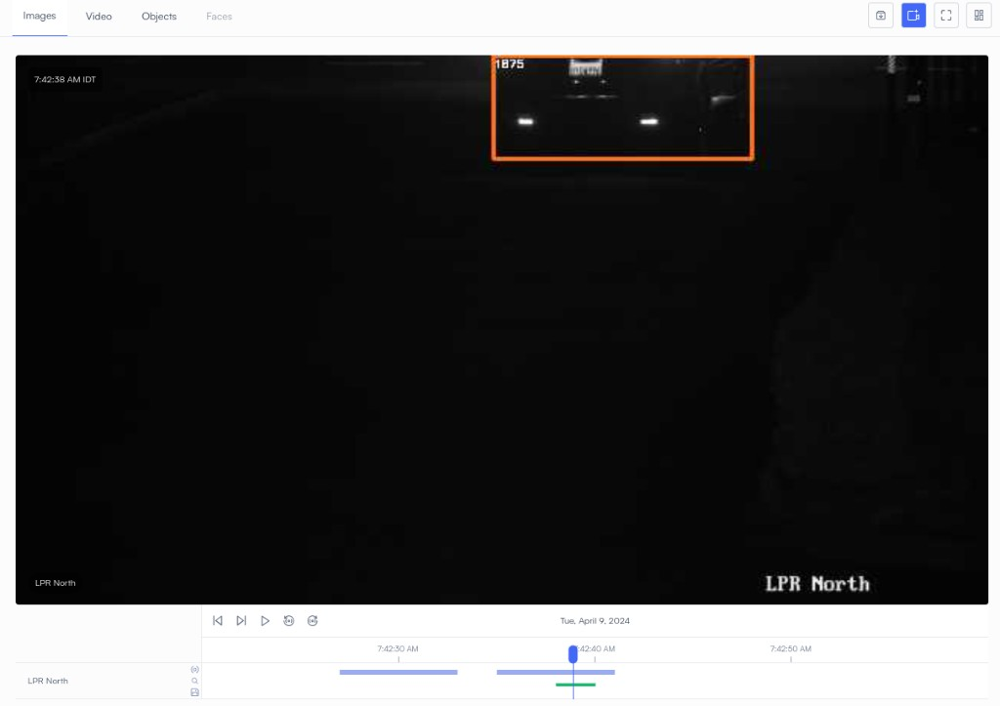
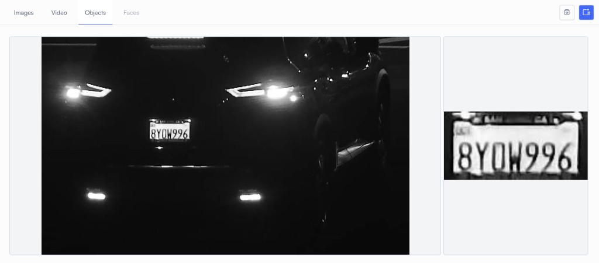

# Tracking vehicles

Lumana combines video management with an AI engine so you can search large archives quickly, get real-time alerts, and automate responses.

**Vehicle analytics** adds detection, attributes, and cross-camera association. It also adds license plate recognition (**LPR**). You can filter, alert, and investigate by plate, make, model, type, and color.

Use the sections below for what each capability does. When you need to relate resolution and distance to detail, use [Pixels per foot (PPF) for camera placement](pixels-per-foot-for-camera-placement.md).

## Before you begin

* Cameras are added in Lumana and streaming reliably.
* You know which sites or lanes need vehicle analytics or **LPR**, and any policies that apply to plate or vehicle data.
* For general mounting and aiming, see the [camera guidelines](https://support.lumana.ai/knowledge/editor/01HEN6TW1P90ZT21YXAJT7FV3X/en-us?brand_id=10899747518610) on the support site.

## Vehicle analytics features

The following capabilities work together in search and alerts. PPF targets for each are in [Vehicle analytics PPF targets](tracking-vehicles.md#vehicle-analytics-ppf-targets).

### Vehicle detection

You get long-range vehicle detection with useful crop resolution. You can review detections across your sites, filter by one or many vehicle traits, and build alerts from those results. That supports patrols, investigations, and operations that depend on knowing which vehicles appeared where.

### Vehicle attributes

You can search and alert on attributes such as color, make, model, and type when the model reports them. That narrows long result lists without manual review of every clip.

### Cross camera tracking

Cross-camera tracking follows a vehicle across views using the plate when it is visible, plus appearance and motion when it is not. That supports lots, perimeters, and multi-entry sites where one camera cannot see the full path. Configure retention and use according to your policies and applicable law.

### License plate recognition

**LPR** identifies and catalogs plates so you can search, filter, and alert on plate text. Teams often use it for access control, parking, and traffic monitoring. Accuracy depends on aim, **PPF**, lighting, and speed (see [License plate recognition deployment](tracking-vehicles.md#license-plate-recognition-deployment)).

## Optimize your camera setup

Position and aim cameras using the [camera guidelines](https://support.lumana.ai/knowledge/editor/01HEN6TW1P90ZT21YXAJT7FV3X/en-us?brand_id=10899747518610) so vehicle analytics and **LPR** get steady coverage.

To compute PPF for a lens and mounting height, use [Pixels per foot (PPF) for camera placement](pixels-per-foot-for-camera-placement.md). Then compare the result to the targets in the next section.

## Vehicle analytics PPF targets

Vehicle detection and **LPR** both depend on resolution and **HFOV** at the lane or region of interest. Derive PPF with the shared reference, then check it against the table below.

### Planning notes

1. **Targets** — Use the **PPF** column for each capability as a planning minimum. Plan above the minimum when lighting is poor, motion is fast, or plates are shallow to the camera.
2. **Environment** — Glare, rain, occlusion, and aim change effective detail. Validate on site after install.
3. **Changes** — If you change resolution, lens, or crop, recalculate **PPF** for the distances you care about.

| Capability                | Requirement (PPF) |
| ------------------------- | ----------------- |
| Vehicle detection         | 7.5 PPF           |
| Vehicle attributes        | 30 PPF            |
| Vehicle tracking          | 40 PPF            |
| License plate recognition | 80 PPF            |

**Approximate maximum distances** on Lumana cameras (assembly height **9 feet**, tilt **25°**, typical US plate **12 inches** wide). Treat these as **typical** planning values; your scene and lighting will change results.

| Camera resolution | Vehicle detection | Vehicle attributes | Vehicle tracking | License plate recognition |
| ----------------- | ----------------- | ------------------ | ---------------- | ------------------------- |
| 5MP               | 120 feet          | 32 feet            | 24 feet          | 12 feet                   |
| 8MP               | 160 feet          | 42 feet            | 32 feet          | 16 feet                   |

## License plate recognition deployment

**LPR** needs stable plate pixels, controlled glare, and shutter times that match vehicle speed. Review each factor below when you spec cameras and tune exposure.

### Camera and optics

#### Camera selection

Dedicated **LPR** cameras often use sensors and shutters that reduce blur at speed. Many designs add **IR** for night plates. Match the vendor profile to your lane width, approach speed, and lighting.

#### Field of view

**FoV** drives how many plate pixels you get at a given distance. Narrower lanes and controlled approaches usually favor a tighter horizontal **FoV**.

| FoV topic               | Why it matters                                                                                                                        |
| ----------------------- | ------------------------------------------------------------------------------------------------------------------------------------- |
| **Narrow FoV**          | A smaller horizontal **FoV** concentrates pixels on the lane. That helps at gates and single-lane choke points.                       |
| **Typical FoV for LPR** | Many installs use about **25° to 40°** horizontal **FoV** so the plate fills enough of the frame without heavy wide-angle distortion. |

### Lighting and exposure

Add controlled **IR** or visible fill when ambient light is low. Aim illuminators so plates are bright enough to read but not blown out.

Use a short exposure time so plates stay sharp at your peak approach speed. Auto exposure can help if it reacts fast enough for your scene.

### Environment checklist

| Lighting                                                 | Obstructions                                  | Camera angle                                             | FoV                                                                |
| -------------------------------------------------------- | --------------------------------------------- | -------------------------------------------------------- | ------------------------------------------------------------------ |
| Balance light so the plate is not under or over exposed. | Keep a clear sight line to the plate surface. | Aim near perpendicular to travel when the layout allows. | Prefer a tighter **FoV** when you need more plate pixels at range. |

No single setting works in every scene. Test reads at night, in rain, and at peak speed before you rely on **LPR** for access or enforcement.

### Example: parking entrance

A garage wants automated entry from plate reads at a single inbound lane. The goal is a reliable read on each vehicle by day and night.

| Topic            | Choice                                                                                                                                     |
| ---------------- | ------------------------------------------------------------------------------------------------------------------------------------------ |
| **Camera**       | Dedicated **LPR** camera with global shutter and built-in **IR**; **4MP** with about **30°** horizontal **FoV** for the approach distance. |
| **Mount**        | About **4 feet** high, pitched slightly down so sedans and SUVs both fill the lane crop. **FoV** covers only the inbound lane.             |
| **Illumination** | **IR** paired with the camera so plates are even and reflections stay low.                                                                 |
| **Exposure**     | Fast shutter to limit blur for approaches up to about **30 mph**, then tune with real traffic.                                             |

In this example layout, teams often reach stable reads to about **60 feet** in good conditions. Your lane geometry, speed, and glare will raise or lower that distance.

**Day view**

**Night view**

## Next steps

* [Pixels per foot (PPF) for camera placement](pixels-per-foot-for-camera-placement.md) — shared **PPF** formulas and charts.
* [Tracking people](tracking-people.md) — people analytics and **PPF** targets for faces and attributes.
* [Search video footage for people or vehicles](search-video-footage-for-people-or-vehicles.md) — query by vehicle, plate, and time.
* [Build a database of people and vehicles](build-a-database-of-people-and-vehicles.md) — organize profiles for search and alerts.
