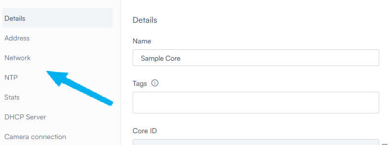
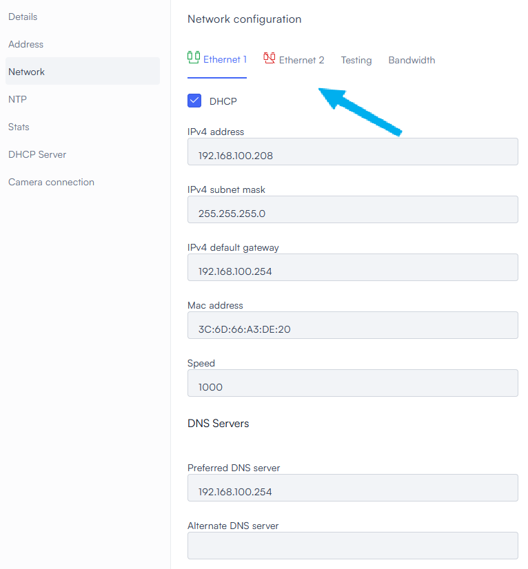
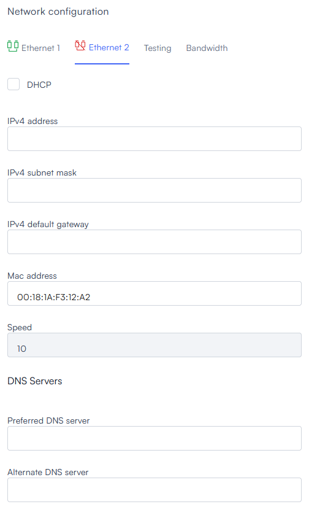
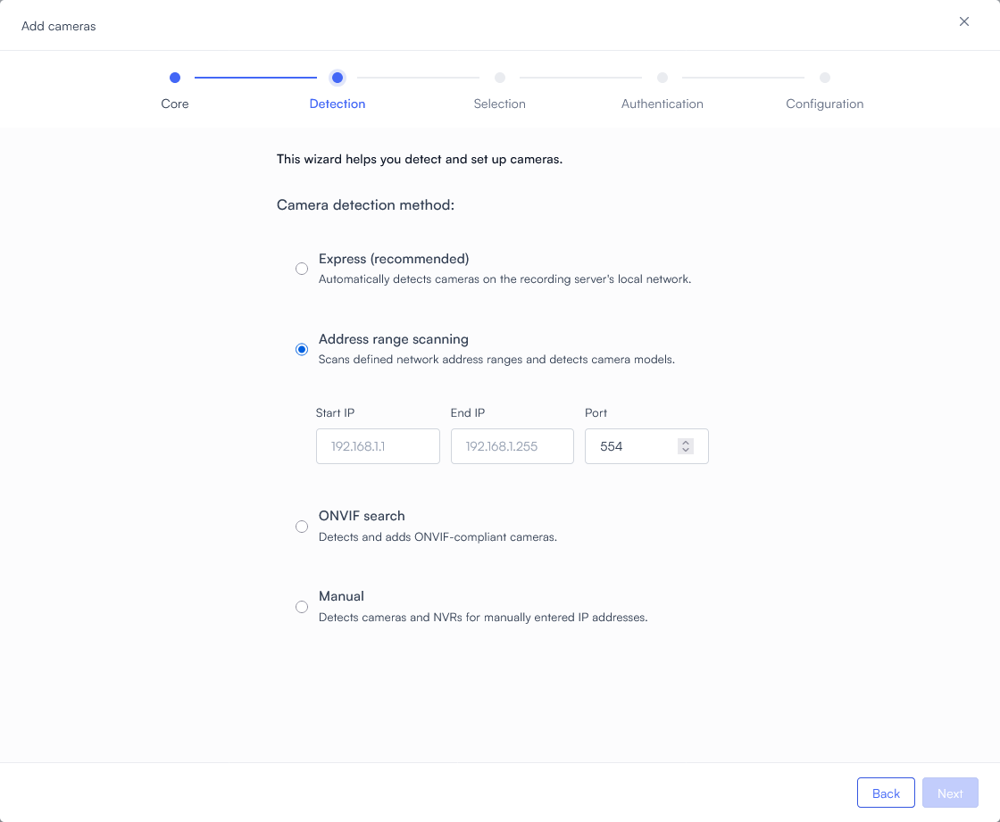
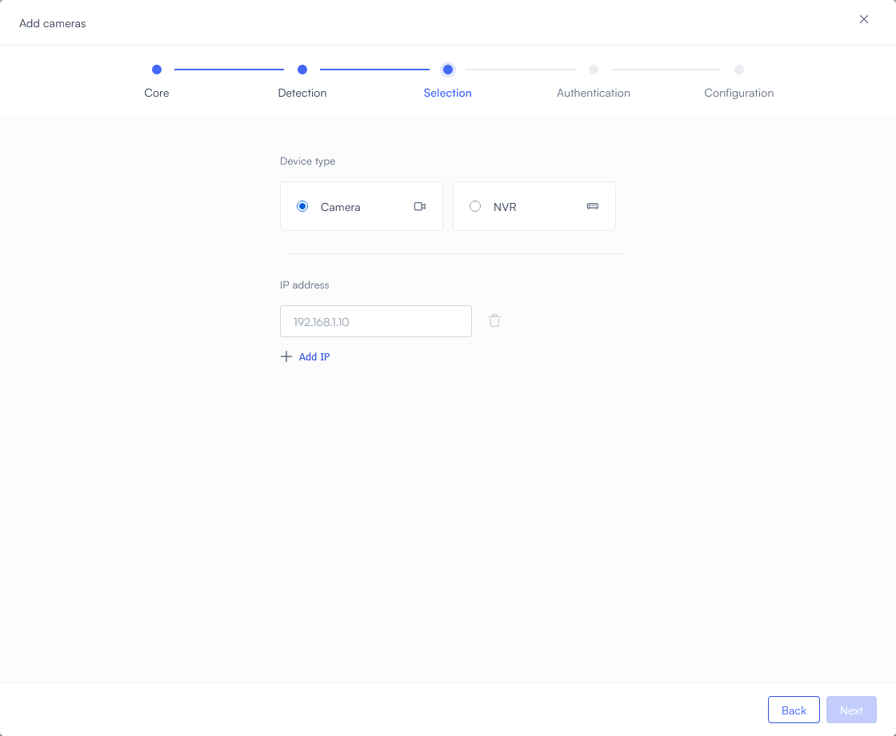

# Part 3: Connect your first cameras

On this page you will connect your cameras to the Lumana Core and begin streaming live video footage.

## Before you begin

Make sure your cameras are powered on and connected to the appropriate network. Make sure you are still on your Core's **Details** screen from the end of [the previous page](connect-lumana-core.md)

## Connect your Core to the camera network

This section explains how to configure your Lumana Core to connect to your camera network. 

* **If your cameras are on the same network connection as your Internet access**: Your Core is already connected to that network. Skip this section and continue with [connecting 
your cameras](#connect-the-core-to-your-cameras) below.

* **If your camera network is not the same one that provides your Internet connection**: Continue with the procedure in this section. If you connected your computer to port 2 of the Core during Part 2, make sure you have disconnected it now.

1. Select **Network** from the menu on the left.
   
   

2. The **Network configuration** screen displays the settings your Core uses to connect to the Internet via Ethernet port 1. To configure port 2 to connect to your camera network, select **Ethernet 2**.
   
   

3. Enter your network configuration. If the Core should expect to be assigned an IP address by a DHCP server, select **DHCP**. Otherwise, enter values in **IPv4 address** and **IPv4 subnet mask**, along with any other settings required by your network architecture.
   
   

4. In the upper right, select **Save**.

5. Plug an Ethernet cable into Port 2 of your Lumana Core, then plug the other end into your camera network.

## Connect the Core to your cameras

1. In the upper left corner, select **Devices**.
   
   

   
2. Select the  (**Add device**) icon in the upper right part of the appropriate location tile. (If this is your first Core, you will have only one location tile).
   
   

   
3. Select **Camera**.
   
   

   
4. From the list, choose which Core will handle the streaming video from the camera(s), then select **Next**.
   
   

   
5. Choose a method for detecting cameras:
   
   

   
   * **Express**: Automatically detects most cameras that are broadcasting on your Core's local network. We recommend you try this method first.
   * **Address range scanning**: Detects cameras broadcasting in a specific range of IP addresses that you define. We recommend you use this if you need to find cameras that are broadcasting from unusual addresses, especially if they are not in the same subnet as the Lumana Core. For example, you should use this method if your Core's IP address is 192.168.1.108 but your cameras are in the 192.168.3.xxx range.
     
     When you select this method, input fields appear. Enter the first and last IP address in the range you want to scan, then enter the port number that the cameras use for streaming.
     
     

     
   * **ONVIF search**: Automatically detects cameras in your network that are broadcasting according to the ONVIF standard. Use this method if you know for certain that your cameras are compatible.
   * **Manual**: Adds a specific camera or cameras to your Core based on their IP addresses. This is useful when you already know a camera's IP address and don't want to waste time doing a search. You can also use it to connect your Core to an NVR (network video recorder), to receive footage from all of cameras being handled by the NVR.
   
   Select **Next**.

6. If you selected Manual, enter the IP address of each camera you want to add, or the IP address of your NVR, then select **Next**.
   
   

7. The system begins scanning the network for camera feeds based on the method you chose, and lists every camera it finds. Use the checkboxes on the left to select the camera feeds you want to monitor, then select **Next**.
   
   

8. Enter the camera's username and password. 

   If you used the ONVIF search method, this is all you need to do; select **Connect**.

   Otherwise you must enter a port number and the path to the camera's RTSP video stream(s). For most cameras, the port number is `554` and the datastreams are located at `/media/video1` (primary stream) and `/media/video2` (substream).
   
   

   
   If you have multiple cameras with different settings, tap **+ Add Credentials** to add a line to the table. There you can provide a different username and password and different connection settings.
   
   
     There is no need to identify which username and password is used for which camera. Lumana will match them automatically.
   
   
   Select **Connect**.

9. Your Lumana Core attempts to connect to each camera using your credentials. After it does, select **Next**.

10. If you want to customize a camera's configuration (such as enabling or disabling audio recording, or changing the maximum amount of footage stored), select the checkbox next to it and then select **Configure selected**.
    
    Otherwise, select **Finish setup**.
    
    

