# Part 2: Set up your Lumana Core

On this page you will connect your Lumana Core to the network that you use for Internet access and make sure it is using the latest software.

1. If your network has a firewall, open the ports that are listed at https://support.lumana.ai/hc/en-us/articles/23402039526034-Lumana-Firewall-Requirements.

2. Plug your Lumana Core into a power outlet using the provided cable and power adapter. Make sure to use the coaxial (circular) DC IN port that is next to the Ethernet ports. 
   
   
   Do not use the square, four-pin Molex-style DC IN port.
   

   The Lumana Core powers on immediately, and a green light appears around the Power button.

3. If your network has a DHCP server, skip to step 4.
   
   

   
 Advanced: If your network does not have a DHCP server, expand this section and follow the instructions.
 

   a. Plug one end of an Ethernet cable into port 2 on the Core, and the other end into a laptop or desktop computer.
   
   b. On that computer, configure a temporary static IP address:
       
      * **IP address**: `192.168.1.235`
      * **Subnet mask**: `255.255.255.0`
      * **Gateway**: `192.168.1.1`
      
      

      
Expand for detailed Windows instructions with screenshots
 

      * Open **Network & Internet** settings.
      * Select **Ethernet**.
        
        
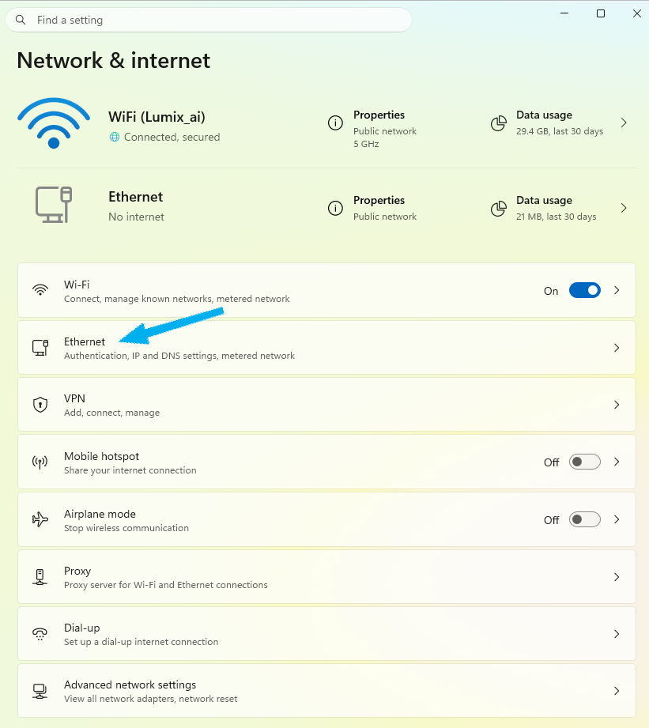

      * Under **IP assignment**, select **Edit**.
        
        
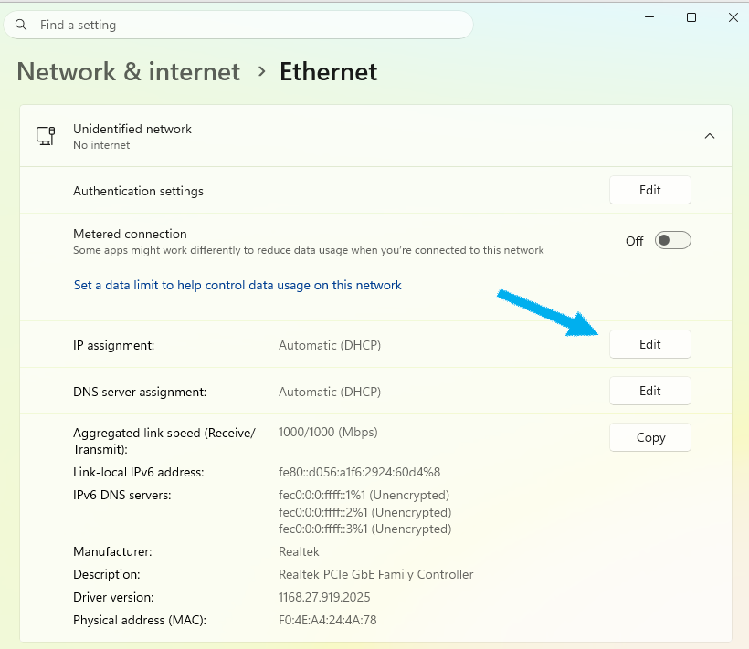

      * Change the IP assignment from **Automatic (DHCP)** to **Manual**.
        
        
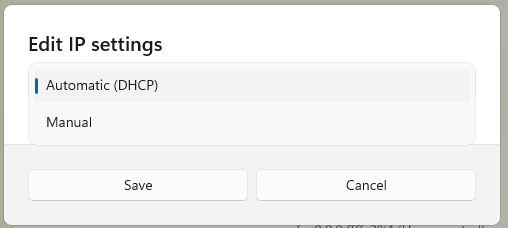

      * Enable **IPv4** and fill in the following
        * **IP address**: `192.168.1.235`
        * **Subnet mask**: `255.255.255.0`
        * **Gateway**: `192.168.1.1`
        * **Preferred DNS**: `8.8.8.8`
        
        
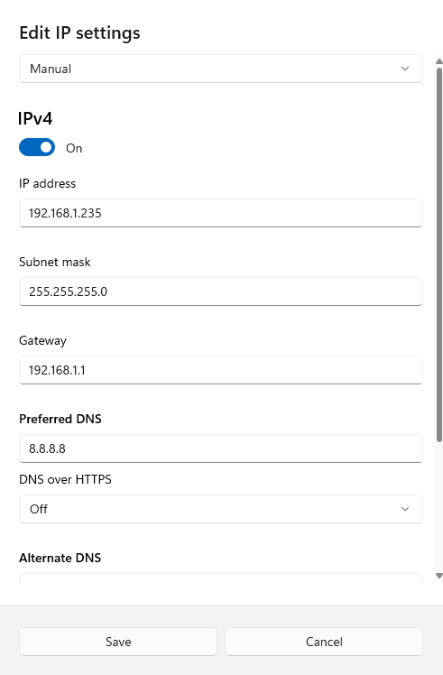

      

   c. Open a web browser and go to `192.168.1.158`. A login page opens.

   d. Enter `admin` for both username and password and select **Login**.
      
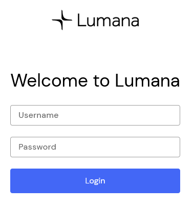

    
   e. You are prompted to select a new password. Choose one that is lengthy, memorable, and unique, then select **Save new password**.

   f. Deselect **DHCP**, then change the IPv4 settings to match the settings that the Core should expect to be assigned by your router. Ensure that these settings are reserved or valid within your network's IP plan.
      
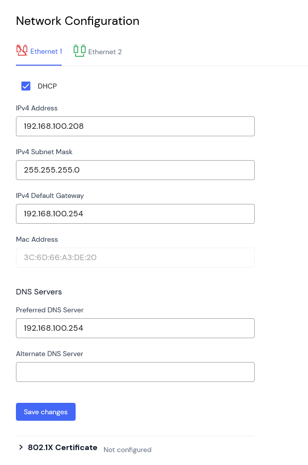

   g. Select **Save changes**.
   

4. Plug one end of an Ethernet cable into port 1 on the Core, and the other end into your router. Green and yellow LEDs on the Ethernet port turn on and begin to blink.

5. Log in to https://app.lumana.ai

6. From the home screen, select **Devices** in the upper right.
   
   
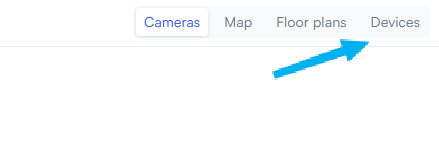


The next few steps involve defining a location and assigning your Core to that location. Our partners or installers may have already done this for you. If the **Devices** screen lists "1 Core", that means your Core has already been provisioned. Skip to step 13. Otherwise, continue with step 7.


7. Select the **0 locations** tile to create a new location.
   
   
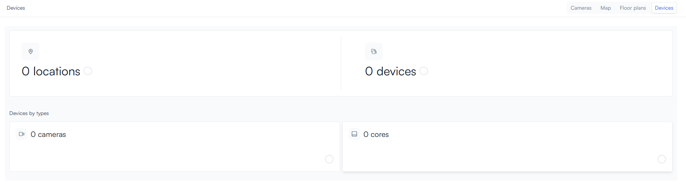

8. Give the location a name, then provide its address, time zone, and other identifying information. When you are done, select **Next** in the bottom right.
   
   
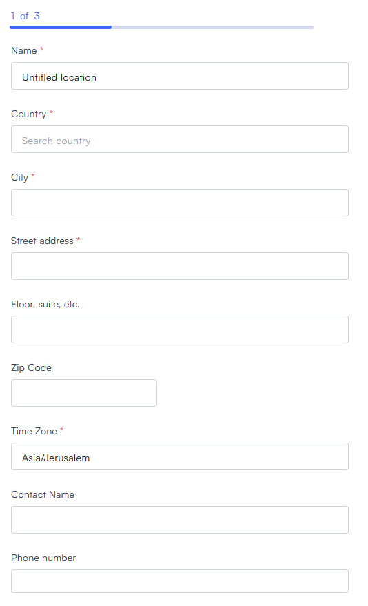

9. To ensure compliance with local law, some features may be unavailable in your area. Choose your jurisdiction from the dropdown; if it is not listed, select **Independent**. Enable or disable the features that you want, then select **Next** in the bottom right.
   
   
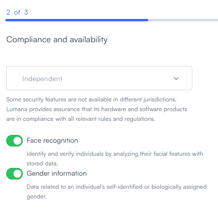

10. Enter a name for the core in the **Name** field, and enter its unique ID in the **Core ID** field. This ID is a 24-character hexadecimal that has been printed on a sticker and attached to the side of the Core.
   
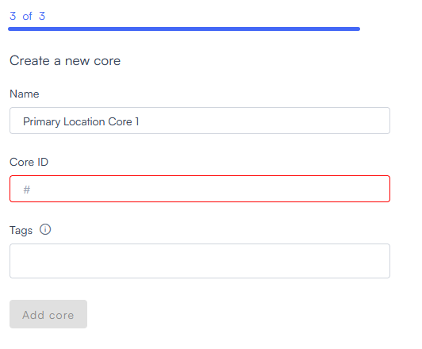

   
   
   You can also find the ID in the Core's **About** screen. Open the "advanced" instructions above and follow steps a-e to connect to the core, then go to **About**->**Edge ID**. This is the same as the Core ID.
   

11. Select **Add Core**. The system thinks for a moment and then brings up a success message:
   
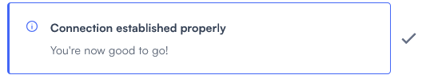

12. Select **Done** in the lower right. You are returned to the **Devices** screen, where you can see that you now have "1 device" and "1 core" listed.
   
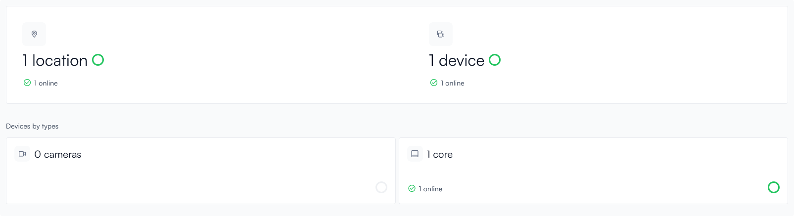

13. Select the **1 core** tile to view the list of Cores.

14. Hover over the Core to reveal the  (**Edit**) icon, and select it.
   
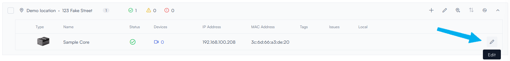

15. If your Core does not have the most recent software update, an **Update to latest version** button appears. Select it.
   
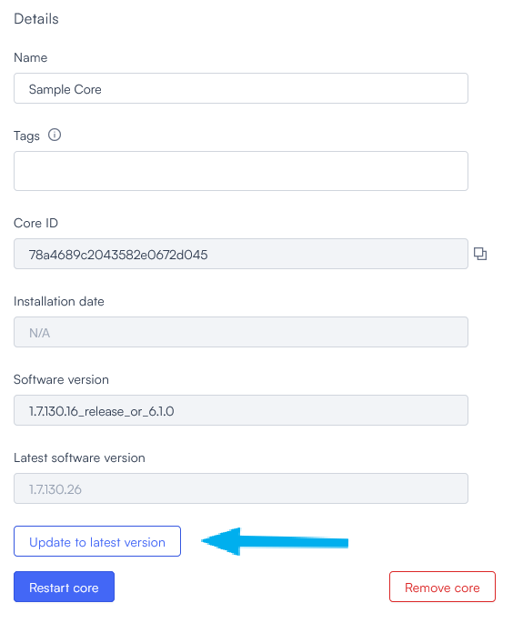

   
   
   Do not close this window just yet; you will need to continue to use it in part 3.
   

The update may take a few minutes. 

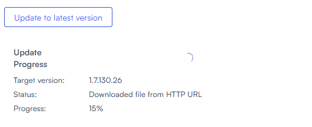

In the meantime, if you connected a computer to port 2 on the Core, disconnect it now.

When the update is complete, proceed to [part 3, where you will connect your cameras to the Core](connect-a-camera.md).