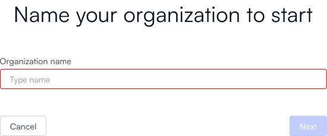
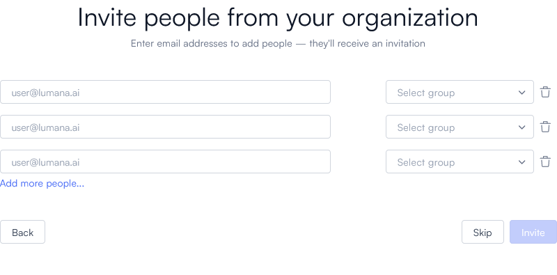
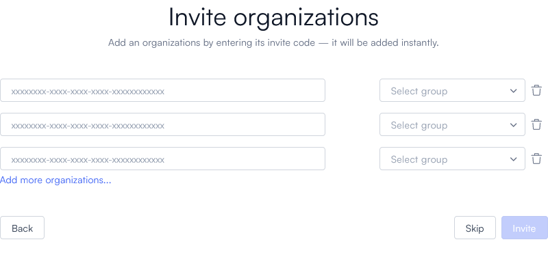

# Part 1: Define your organization in the Lumana system

On this page you will set up your organization in the Lumana system. This includes naming your organization and inviting your employees to open accounts in the Lumana app.

1. Log in to the Lumana web application at https://app.lumana.ai. 

   
   Our partners or installers may have already defined your organization for you. If so, you can proceed immediately to [part 2, where you will connect your Lumana Core to your network](connect-lumana-core.md).
   

2. You are immediately prompted to create an organization. Give it a name, then select **Next**.

   

3. Provide the email addresses for each of the other people who will be using the system. For each one, assign a level of access (such as "Admin" or "User"), then select **Invite**. 
    
   

    
   If you don't want to invite anybody at this time, select **Skip**. You will still be able to invite people later, in the organization settings.

4. If this is not your first organization, you can create a rule that allows every member of another organization to access this one. For each organization, enter its invite code, use the **Select group** dropdown to choose what level of access its members should have (such as **Admin** or **User**), and select **Invite**.
    
   

   
      Inviting an organization removes the need for manually inviting each of its members one at a time. It also automatically grants access to anybody who joins the other organization and revokes access from anybody who leaves it, with no need for you to take additional action.
   

   If you don't want to invite another organization at this time, select **Skip**. You will still be able to invite one later, under your organization's settings.

Once your organization has been set up, proceed to [part 2, where you will connect your Lumana Core to your network](connect-lumana-core.md).