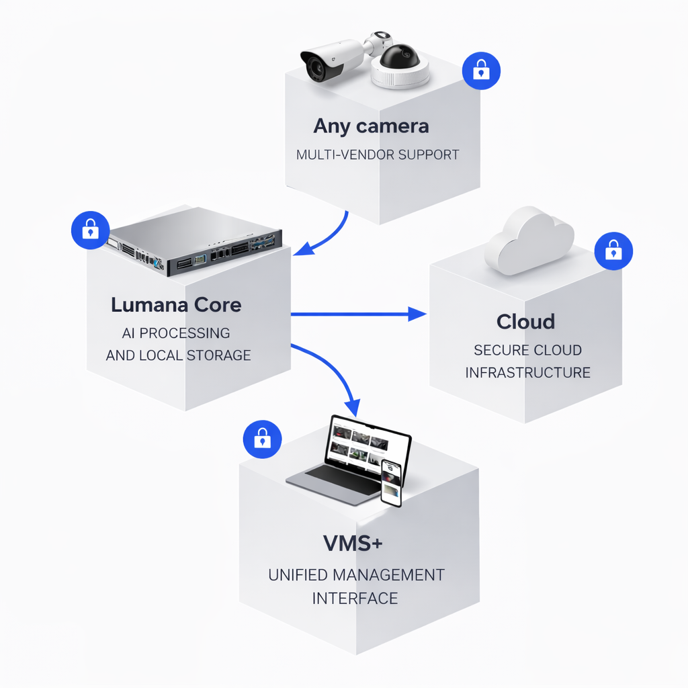

# Before you begin

Lumana is an AI-powered video security platform that turns your existing cameras into intelligent monitoring agents. It detects activity and sends alerts in real time and enables you to search, share, and analyze footage.

## What Lumana consists of

A typical Lumana deployment has four components working together:

* **Any camera**: Lumana works with cameras from multiple vendors, so you can connect your existing hardware without replacing it.
* **Lumana Core**: A hardware device that sits on your local network and handles AI processing and video storage.
* **Cloud**: Lumana's cloud infrastructure enables secure remote access to your Core and your video feeds.
* **VMS+**: The unified management interface, accessible from a browser or the mobile app, for live monitoring, alerts, search, and administration.

## What the setup involves

1. Defining your organization in the Lumana system
2. Connecting the Lumana Core to your network
3. Connecting your cameras to the Lumana Core

## What you'll need

Make sure you have the following before starting:

* Detailed knowledge of your local network setup
* A Lumana box, containing:
  * A Lumana Core
  * Power adapter
  * C13 power cord
  * 10-pin terminal block connector (x2) (not needed for setup)
* At least one IP camera
* A computer with a supported web browser
* An active Lumana account. If you are setting up a trial, Lumana support will provide your login credentials and activation details before you begin. Otherwise, check your email for an invitation from your organization's administrator.

When you have all of the above, choose how to proceed:

* A [quickstart installation](quick-start.md). Choose this if you have the simplest network setup: your cameras and your Internet connection are on the same network, and that network has a DHCP server.

* The [full installation procedure](define-your-organization.md). Choose this if you have a more complex network setup.