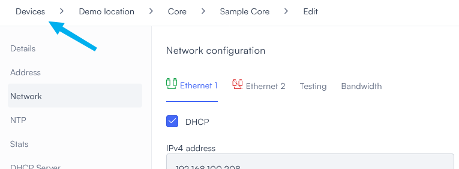
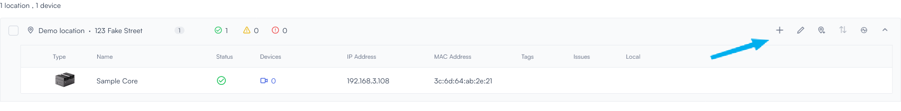
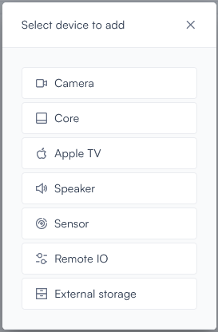
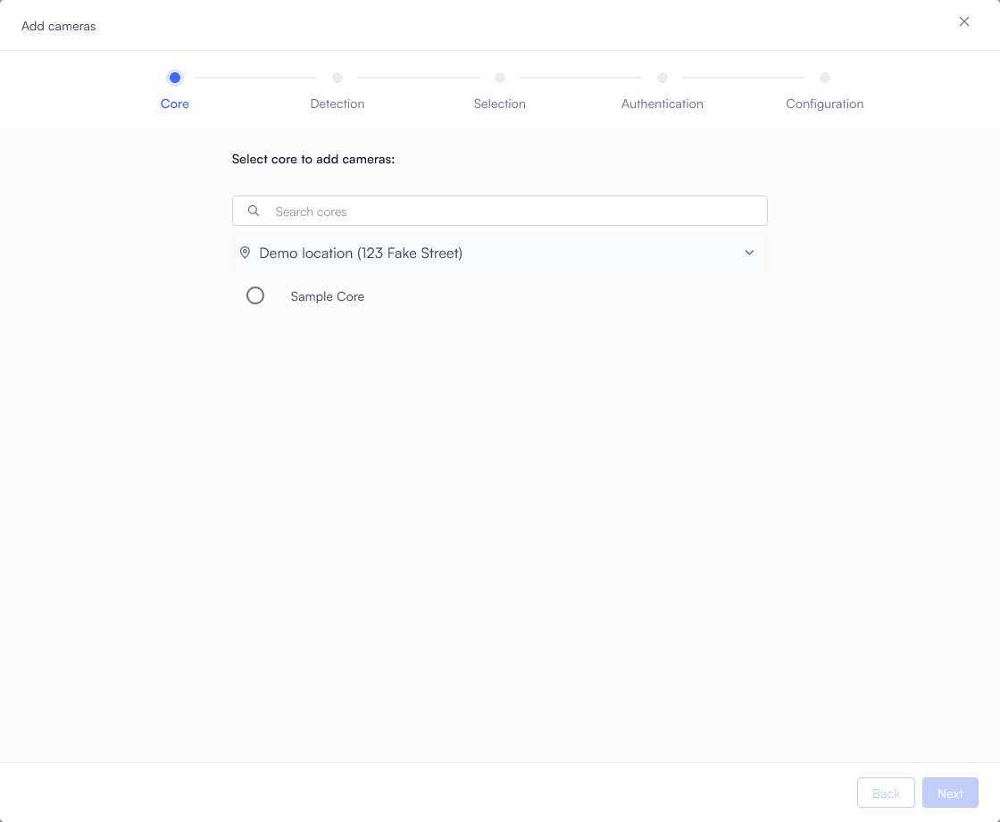
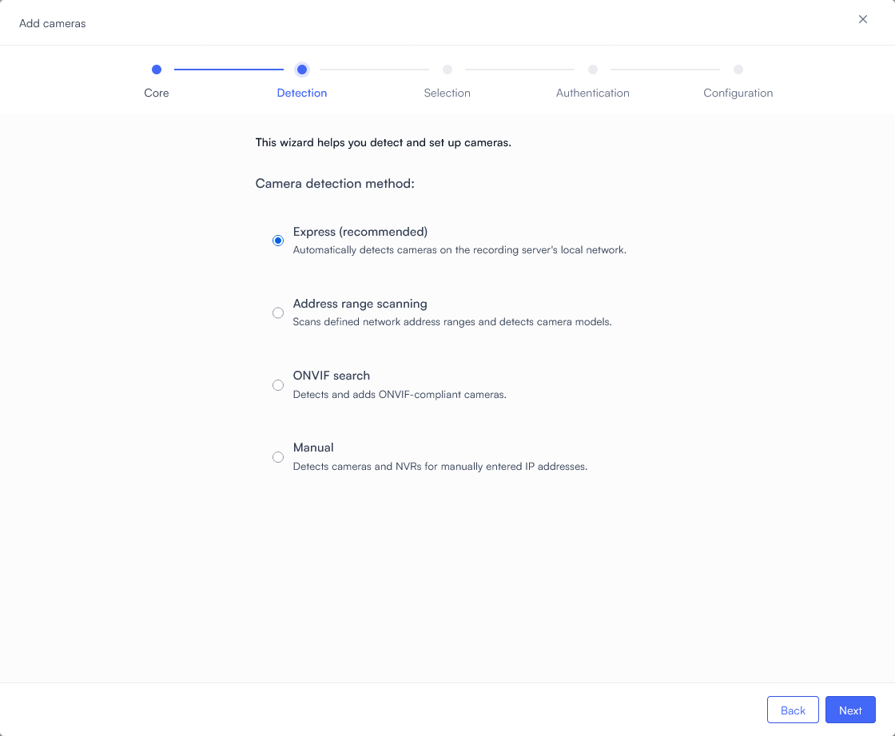
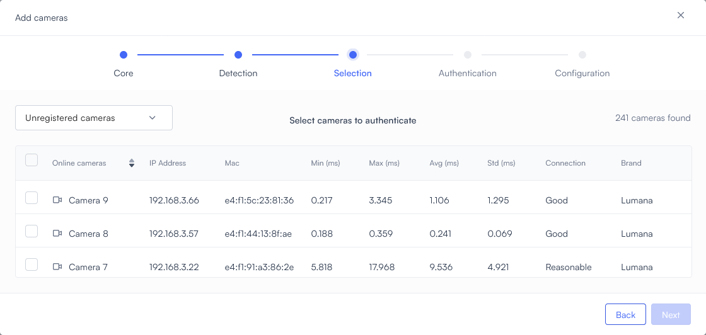
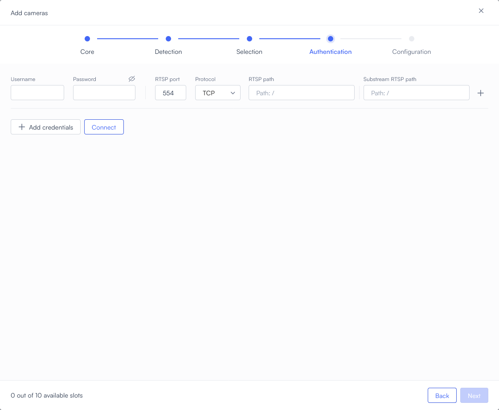
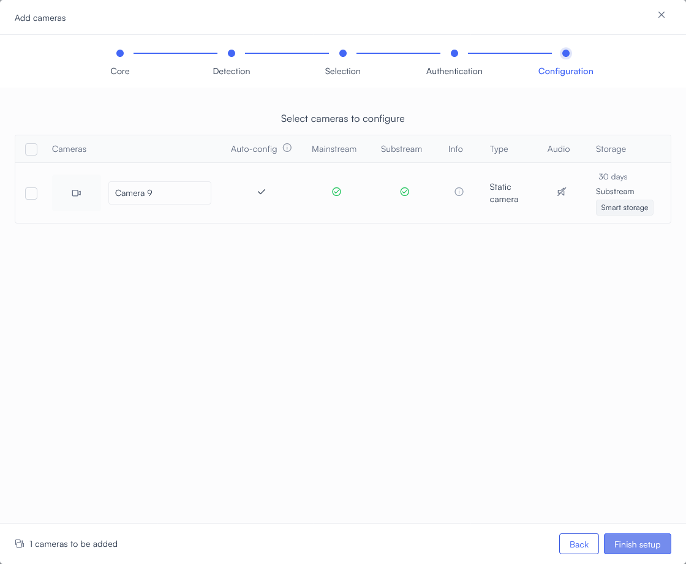

# Quick start

This page provides the fastest method of connecting your Lumana Core to your network and cameras. 

It assumes the following: 
* Our partners or installers have already created your organization in the Lumana system and defined the location of your first Lumana Core.
* You will not be giving additional users access to the Lumana system at this time.
* Your cameras and your Internet connection are on the same local network.
* That network has a DHCP server.
* Your network firewall has been configured with the [open ports required by Lumana](https://support.lumana.ai/hc/en-us/articles/23402039526034-Lumana-Firewall-Requirements).

If any of these are not true, you should [follow the detailed procedure instead](define-your-organization.md).

## What you'll need

Make sure you have the following before starting:

* A Lumana box, containing:
  * A Lumana Core
  * Power adapter
  * C13 power cord
  * 10-pin terminal block connector (x2) (not needed for this procedure)
* At least one IP camera, connected to your network and powered on
* A computer with a supported web browser
* An active Lumana account

## What to do

1. Plug your Lumana Core into a power outlet using the provided cable and power adapter. Make sure to use the coaxial (circular) DC IN port that is next to the Ethernet ports. 
   
   
   Do not use the square, four-pin Molex-style DC IN port.
   

   The Lumana Core powers on immediately, and a green light appears around the Power button.

2. From the home screen of the Lumana web application, select **Devices** in the upper right.
   
   

3. Select the **1 core** tile to view the list of Cores.

4. Hover over the Core to reveal the  (**Edit**) icon, and select it.
   

5. If your Core does not have the most recent software update, an **Update to latest version** button appears. Select it.
   

   
   Wait for the update to complete. It may take a few minutes.
   

6. In the upper left corner, select **Devices**.
   
   

   
7. Select the  (**Add device**) icon in the upper right part of the appropriate location tile. (If this is your first Core, you will have only one location tile.)
   
   

   
8. Select **Camera**.
   
   

   
9. From the list, choose which Core will handle the streaming video from the camera(s), then select **Next**.
   
   

   
10. Select **Express**, then select **Next**.
   
   

11. The system begins scanning the network for camera feeds based on the method you chose, and lists every camera it finds. Use the checkboxes on the left to select the camera feeds you want to monitor, then select **Next**.
   
   

12. Enter the camera's username and password, enter a port number, and enter the path to the camera's RTSP video stream. For most cameras, the port number is `554` and the datastreams are located at `/media/video1` (primary stream) and `/media/video2` (substream).
   
   

   
   If you have multiple cameras with different settings, select **+ Add Credentials** to add a line to the table. There you can provide different connection settings, including different credentials if necessary.
   
   
     There is no need to identify which connection settings are used for which camera. Lumana will match them automatically.
   
   
   Select **Connect**.

13. Your Lumana Core attempts to connect to each camera using your credentials. After it does, select **Next**.

14. Select **Finish setup**.
    
    

