# Use the Lumana mobile app

The Lumana mobile app lets you access your organization's cameras from your phone. You can monitor live feeds, review recorded footage, manage alerts, and view video walls from anywhere.

## Before you begin

You'll need to be an active member of your organization before using the app. You should have received an email invitation and logged in through the Lumana web portal. If you haven't, contact your organization's administrator.

### Install the app

Use one of these links to download the app from the appropriate store:

<table align="center">
<tr>
<td align="center" width="50%"></td>
<td align="center" width="50%"></td>
</tr>
</table>

Alternatively, scan this QR code:

After installation, open the app and log in using your credentials.

## Navigation

The app has four sections in the bottom navigation bar. Each one leads to a different part of the platform.

* [**Devices**](use-the-lumana-mobile-app.md#view-live-cameras): Browse all cameras connected to your organization, grouped by location.
* [**Search**](use-the-lumana-mobile-app.md#search-for-people-or-objects): Search for people or objects across your cameras using filters.
* [**Alerts**](use-the-lumana-mobile-app.md#monitor-alerts): View real-time notifications triggered across your organization.
* [**Walls**](use-the-lumana-mobile-app.md#view-video-walls): Open and monitor multi-camera video walls.

Tap the **menu icon (≡)** in the top left to open the sidebar. The sidebar gives you access to everything in the app from one place.

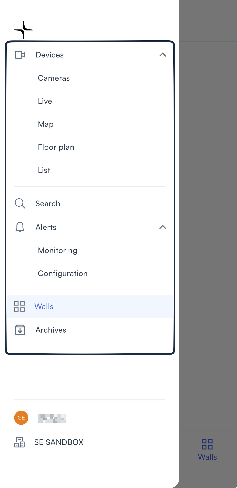

The sidebar links to the following sections, each of which is explained below:

* [**Devices**](use-the-lumana-mobile-app.md#cameras): Expands to show [**Cameras**](use-the-lumana-mobile-app.md#cameras), **Live**, [**Map**](use-the-lumana-mobile-app.md#map), [**Floor plan**](use-the-lumana-mobile-app.md#floor-plan), and [**List**](use-the-lumana-mobile-app.md#list).
* [**Search**](use-the-lumana-mobile-app.md#search-for-people-or-objects): Opens the search screen.
* [**Alerts**](use-the-lumana-mobile-app.md#monitor-alerts): Expands to show **Monitoring** and **Configuration**.
* [**Walls**](use-the-lumana-mobile-app.md#view-video-walls): Opens your organization's video walls.
* **Archives**: Shows all saved archive clips.

## View live camera feeds

Tap **Devices** in the bottom navigation bar or the sidebar to view your camera live feeds. Each view shows the same cameras in a different format.

### Cameras

The **Cameras** view shows your cameras as thumbnails grouped by location. This is the default view when you open the **Devices** tab.

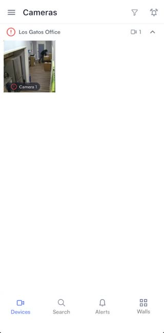

### Map

The **Map** view shows your camera locations on a satellite map powered by Google Maps.

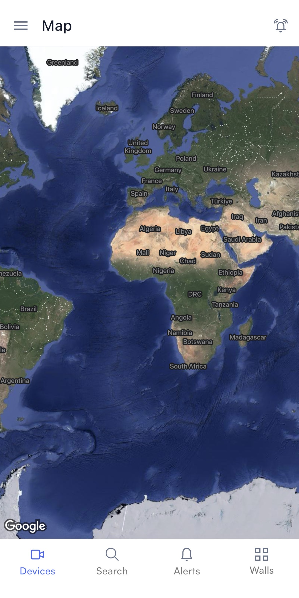

### Floor plan

The **Floor plan** view shows your cameras placed on building floor plans, organized by building and floor.

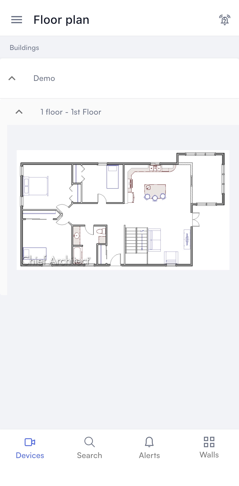

### List

The **List** view shows your cameras in a structured list grouped by Cores and Cameras.

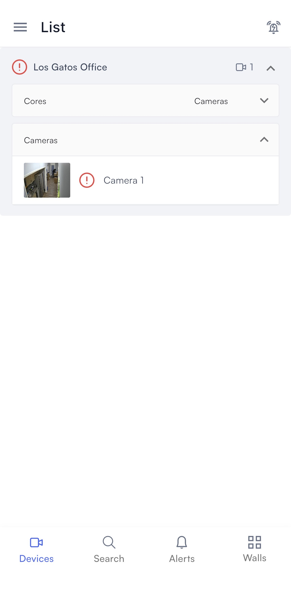

Tap any camera in any of these views to open it. Each camera has four tabs at the top of the screen:

* **Live**: Watch the camera's live feed and access recording controls.
* **Playback**: Review recorded footage using a vertical timeline.
* **Alerts**: See alerts triggered by this camera.
* **Search**: Search for people or objects in this camera's footage.

The **Live** tab has the following controls:

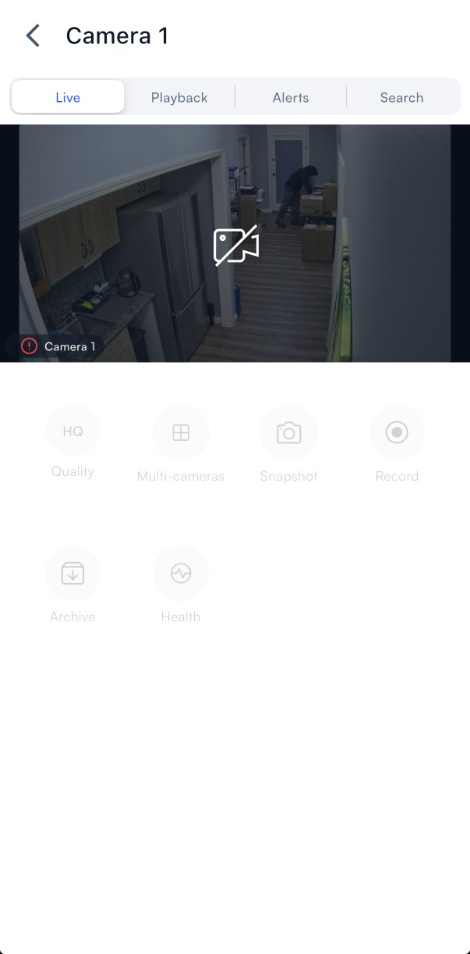

* **Quality**: Switch between video quality settings.
* **Multi-cameras**: View multiple cameras at once.
* **Snapshot**: Take a still image of the current feed.
* **Record**: Start a local recording.
* **Archive**: Download footage to your device.
* **Health**: Check the camera's connection status.

You can switch to recorded footage without leaving the camera view.

## Review playback footage

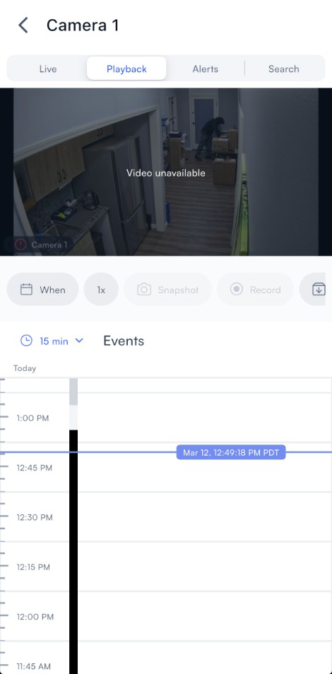

1. Tap on a camera's live feed and select the **Playback** tab.
2. Scroll the timeline to the time and date you want to review.
3. Tap **When** to open the date and time picker. Scroll the wheels to select a date, hour, minute, and AM/PM, then tap **Save** to jump to that point.

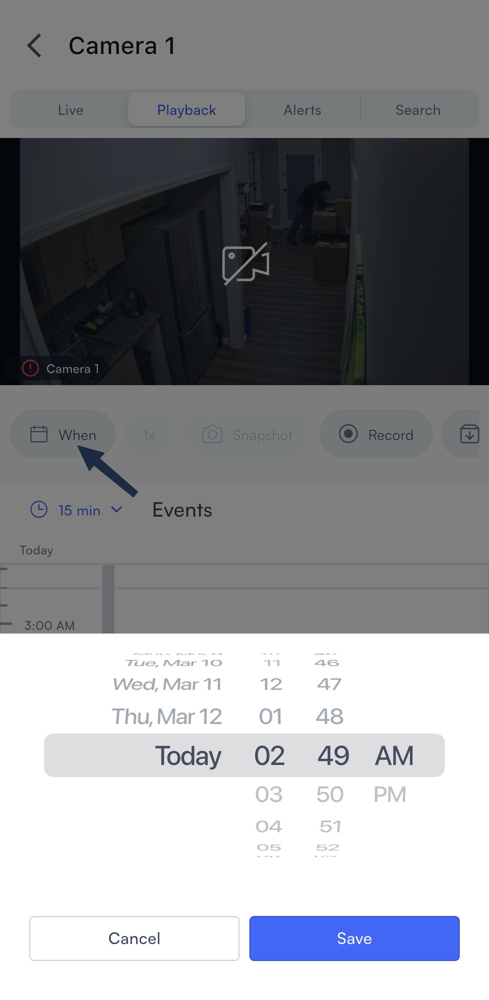

4. Use the **1x** control to adjust playback speed.
5. Scroll down to the **Events** section to see activity detected in that period.

The **Playback** tab also has the following controls:

* **Record**: Start a local recording of the current footage. A timer appears at the top of the feed while recording is active. Tap the red stop button to end the recording.
* **Archive**: Save a specific clip to your archives. Enter a name, set the **From** and **To** times, and tap **Create**.
* **Multi-cameras**: View up to four cameras simultaneously on the same screen.
* **Album**: Browse all archived clips for the camera, filtered by time.

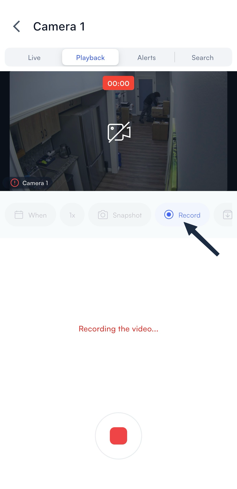 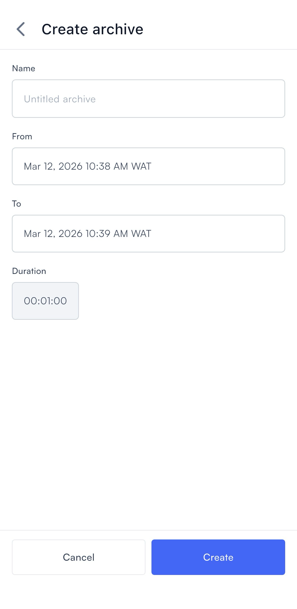

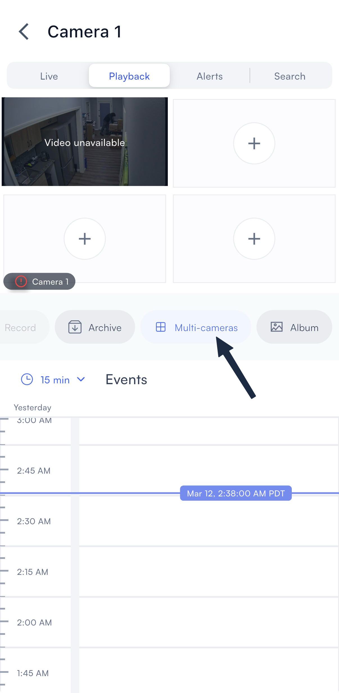 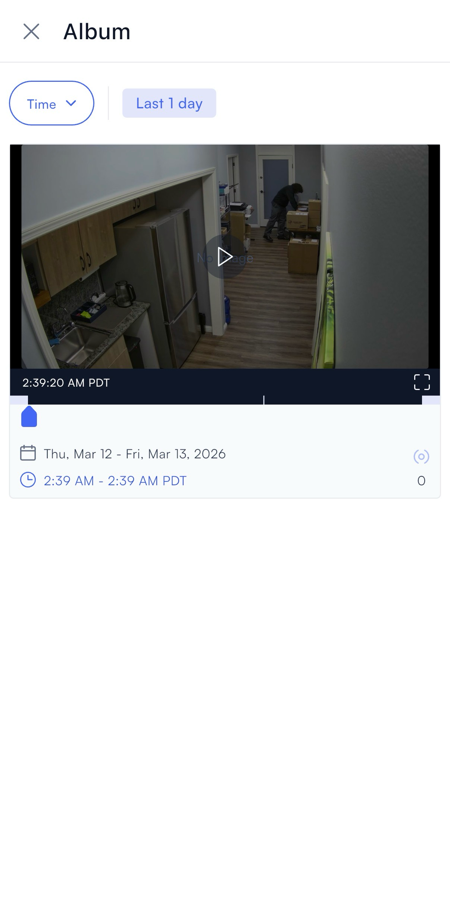

## Monitor alerts

You can review alerts for a single camera or across your entire organization. Both views let you filter results and switch between clips and detected objects.

### From a single camera

The **Alerts** tab inside a camera shows only the alerts triggered by that camera.

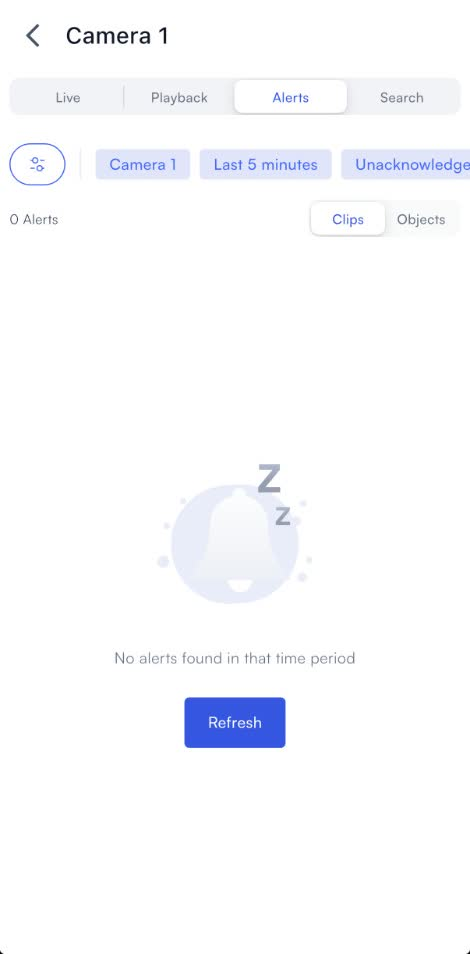

1. Open a camera and select the **Alerts** tab.
2. Use the filter chips to narrow results by camera, time range, or acknowledgement status.
3. Tap **Clips** or **Objects** to switch views.
4. Tap an alert to review the video clip and detected objects.

### From all cameras

The **Alerts** section in the bottom navigation bar shows alerts across your entire organization.

1. Select **Alerts** in the bottom navigation bar.
2. Use the filters to narrow results across your organization.

## Search for people or objects

You can search within a single camera or across your entire organization. Use filters to narrow results by object type, time range, and camera.

### From a single camera

Each camera's **Search** tab lets you search footage from that camera only.

1. Open a camera and select the **Search** tab.
2. Tap the filter icon to set your search criteria: camera, time range, and object type.
3. Tap **Clips** or **Objects** to switch between views.
4. Tap a result to open the clip or object detail.

### From all cameras

The **Search** section in the bottom navigation bar lets you search footage across all cameras at once.

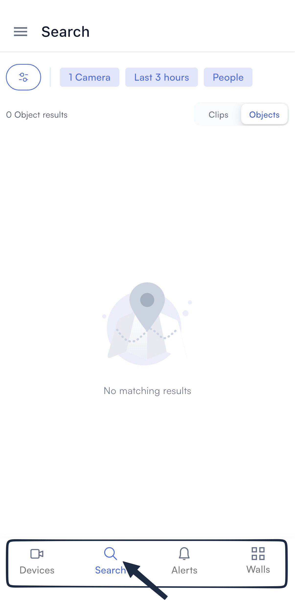

1. Select **Search** in the bottom navigation bar.
2. Tap the filter icon to set your search criteria.
3. Tap **Clips** or **Objects** to switch between views.

## View video walls

The **Walls** tab shows all video walls available in your organization. Tap any wall to open it.

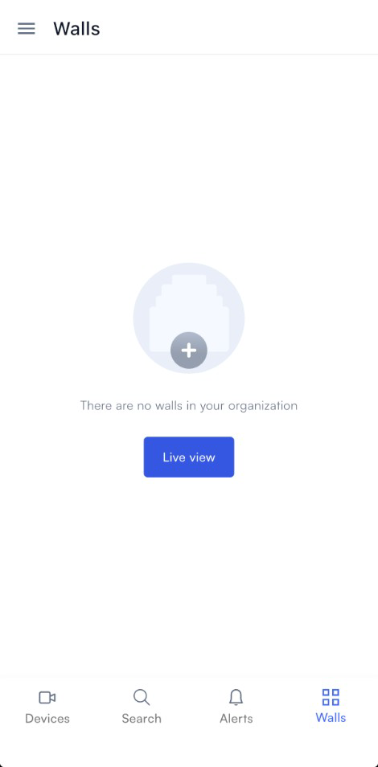

1. Select the **Walls** tab.
2. Tap a wall to open it.

> **Note:** Grayed-out walls are not compatible with the mobile app.

## Set up mobile notifications

To receive alert notifications on your phone, you need to enable them in two places: inside the Lumana app and in your device settings.

### In the Lumana app

The bell icon in the top right controls your in-app notification settings. Tap it to open the notification panel.

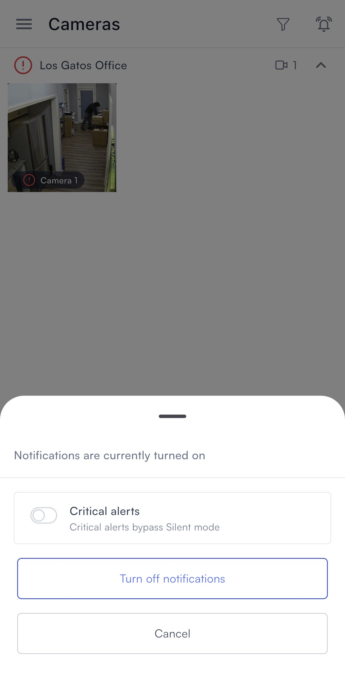 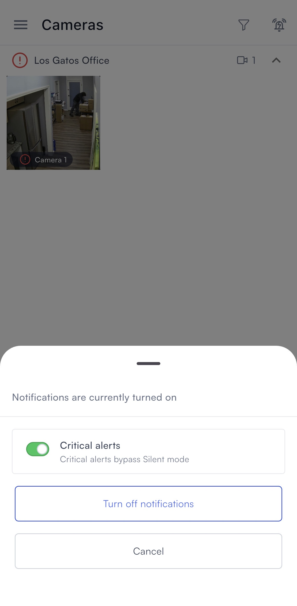

From the notification panel you can:

* Toggle **Critical alerts** on to allow critical notifications to bypass Silent mode on your device.
* Tap **Turn off notifications** to stop receiving notifications from the app.
* Tap **Cancel** to dismiss without making changes.

### On iOS

If notifications aren't already enabled for Lumana, then turn them on in your iPhone or iPad settings.

1. Open **Settings** on your iPhone or iPad.
2. Select **Apps**.
3. Find and select **Lumana**.
4. Select **Notifications**.
5. Toggle **Allow Notifications** on.

### On Android

If notifications aren't already enabled for Lumana, then turn them on in your Android app settings.

1. Open **Settings** on your Android device.
2. Select **Apps and notifications**, then select **Lumana**.
3. Select **Notifications**.
4. Toggle notifications on.

Once notifications are enabled, you'll receive alerts on your phone whenever activity is detected. If you want to update your account details or preferences, the next guide covers that.

## Next steps

* [User settings](../system-administration/user-settings.md) walks you through configuring your account settings in Lumana.
