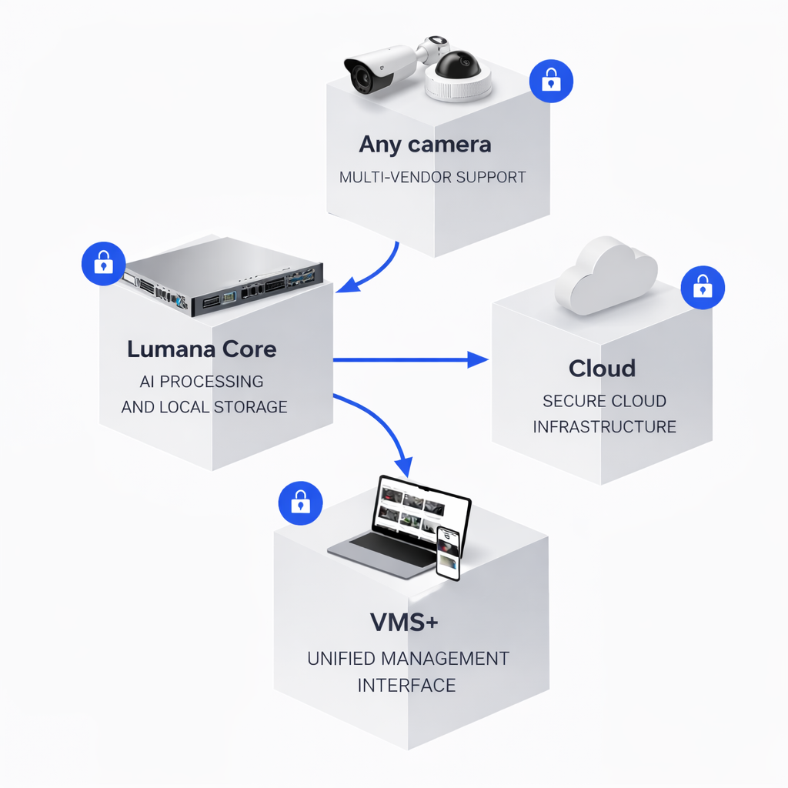

# What to expect

Lumana is an AI-powered video security platform that turns your existing cameras into intelligent monitoring agents. It detects activity in real time, sends alerts, and lets you search, share, and analyze footage from a single system.

## What Lumana consists of

A typical Lumana deployment has four components working together:

* **Any camera**: Lumana works with cameras from multiple vendors, so you can connect your existing hardware without replacing it.
* **Lumana Core**: A hardware device that sits on your local network and handles AI processing and local video storage on-site.
* **Cloud**: Lumana's secure cloud infrastructure connects your Core to the platform and enables remote access.
* **VMS+**: The unified management interface, accessible from a browser or the mobile app, for live monitoring, alerts, search, and administration.

## What the setup involves

The process follows this order:

1. Connect Lumana Core to your network and complete initial configuration.
2. Add your cameras to the system.
3. Install the mobile app and log in.
4. Configure your first alert.

Each step is covered in detail in the pages that follow.

## Before you begin

Make sure you have the following before starting:

* Lumana Core hardware, powered on and connected to your network via Ethernet
* At least one IP camera on the same network as Lumana Core
* A computer with a supported web browser
* An active Lumana account: check your email for an invitation from your organization's administrator

If you are setting up a trial, Lumana support will provide your login credentials and activation details before you begin.
