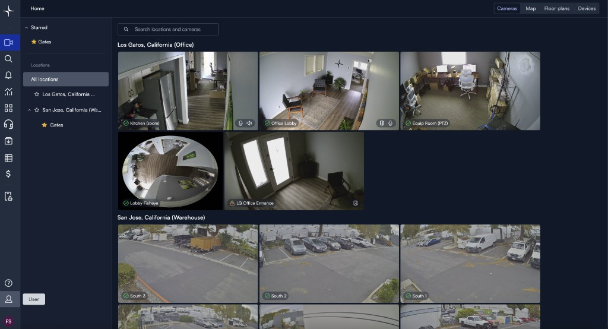
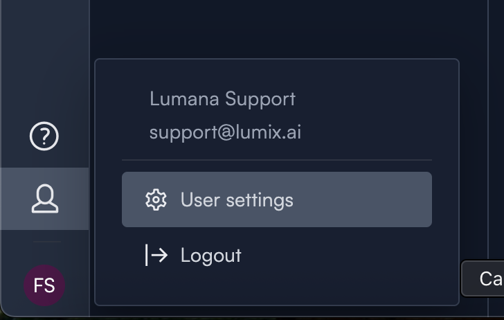
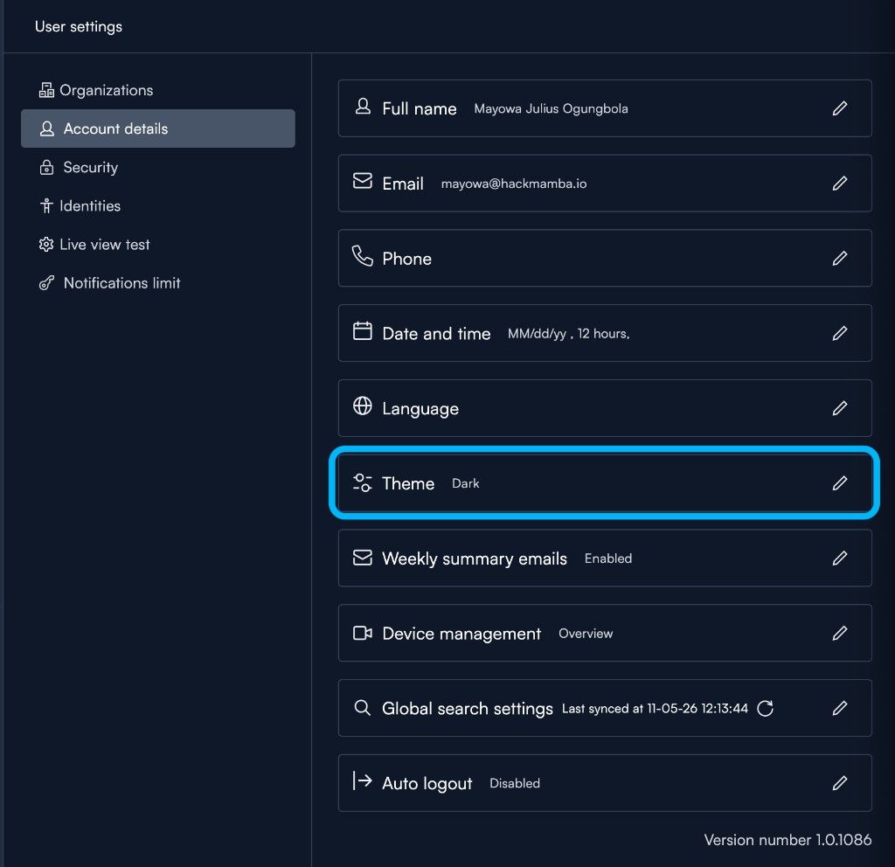
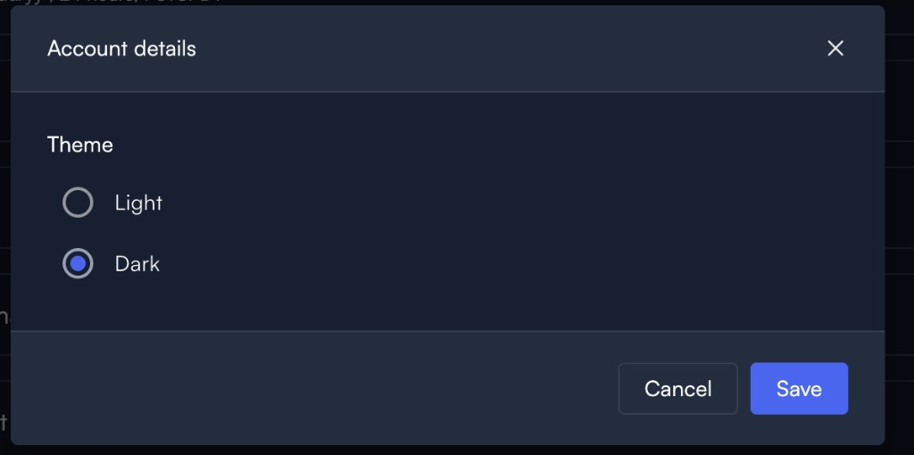

# Change dark mode and light mode

Change the Lumana theme to dark mode or light mode from your account settings. This can make the interface easier to read based on your preference and environment.

## Prerequisites

Make sure you are signed in and can open your account settings.

## Change the theme

Open your user settings, then update the theme from your account details.

1. In the lower-left corner of the page, select the user icon.

   

2. Select **User settings**.

   The user settings menu opens.

   

3. Select **Account details**.

   The account details page opens.

4. Next to **Theme**, select the pencil icon.

   The theme setting becomes editable.

   

5. Select **Dark** or **Light**, then select **Save**.

   The theme updates for your account.

   

## Next steps

After you change the theme, you can return to your usual monitoring or review workflow.

- Use [Live view](live-view.md) to monitor cameras in real time.
- Use [Share video](share-video.md) to share live views or archived footage.
