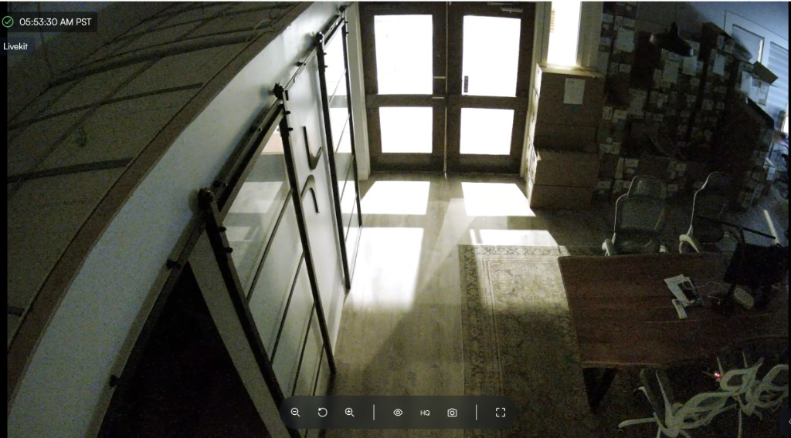
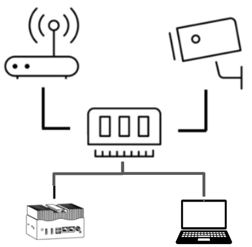
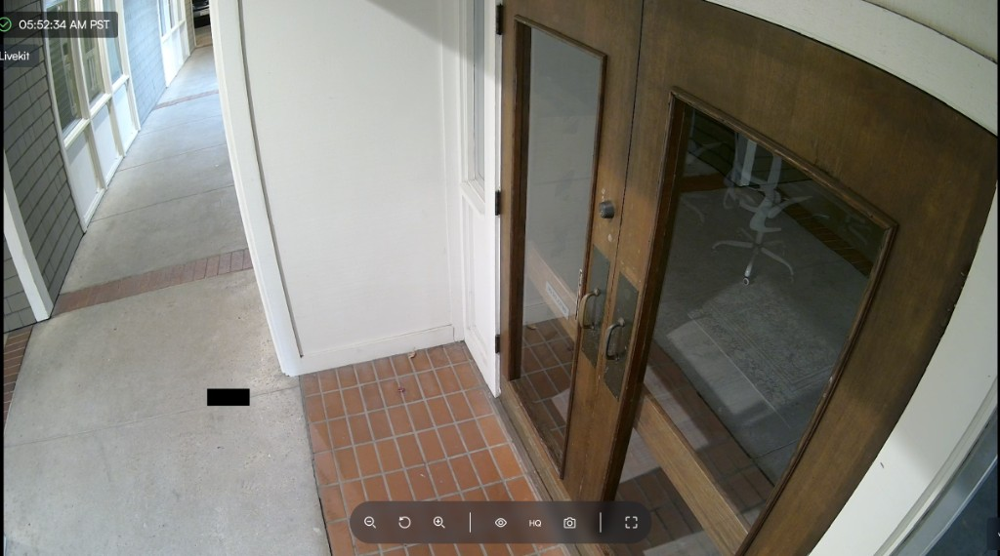
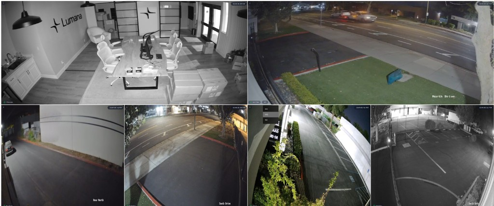

# Live view streaming and quality

This page explains how Lumana delivers live video. Learn when local or cloud streaming applies, and how stream quality adapts to your device, browser, and layout.

## How Live view delivery works

Lumana can deliver live video through a local connection or through Lumana Cloud. The available path depends on your network, device, browser support, and the number of streams you open.

Two factors usually matter most. The viewing device must reach Lumana Core directly on the network. The browser or device must also support the available stream format. Stream layout and bandwidth then affect which quality level Lumana can use.

The live player shows the time, stream status, and controls such as zoom and **HQ** for high quality.

## Local streaming

Local streaming sends video from Lumana Core directly to the viewing device without relying on Lumana Cloud. This reduces internet traffic and can improve live view performance on the local network.

This matters most when you need lower latency and more consistent live view performance on the same local network.

### Requirements for local streaming

Use local streaming when the viewing device can reach Lumana Core directly on the network.

- Direct access to the Lumana Core local IP.
- No proxy between the client and Lumana Core.


If a camera uses H.265 and your browser or device doesn't support H.265, then MQ local streaming might work. HQ local streaming will not.


### Local live view flow

When you open Live view, Lumana first checks whether the viewing device can reach Lumana Core on the local network. If the connection is available, then Lumana starts the stream directly from Lumana Core.

## Cloud streaming

Cloud streaming delivers live video through Lumana Cloud when local streaming is not available. Use this path when the viewing device cannot connect directly to Lumana Core. This lets you keep using Live view remotely or across restricted networks when a direct local connection is not possible.

### Cloud live view flow

If Lumana cannot establish a local connection, then it switches to cloud streaming. Cloud streaming uses WebRTC to deliver the live view to the client. This keeps Live view available when the client cannot reach Lumana Core directly. Latency and compatibility might vary by browser, device, and connection quality.

Cloud streaming also helps distribute live video to multiple viewers without requiring each viewer to connect directly to Lumana Core.

When Lumana falls back to cloud streaming, the path is **Viewing device ↔ Lumana Cloud (WebRTC) ↔ Lumana Core**, so the client still receives live video without a direct LAN route to Core.

## Streaming quality

Lumana can adjust live view quality automatically, and you can also change it manually in the player.

This helps balance video clarity, bandwidth use, and playback performance across different layouts and network conditions.

### How quality selection works

Lumana supports standard quality (SQ), medium quality (MQ), and high quality (HQ) live view modes. In ordinary use Lumana weighs all of the following together:

- **Layout**: More simultaneous streams leave less headroom, so Lumana might lower quality to keep playback smooth.
- **Bandwidth**: Less available throughput favors SQ or MQ over HQ.
- **Codec and browser support**: Unsupported or inefficient codec paths can force a lower rung (for example MQ instead of HQ for some H.265 setups).
- **Player size**: Smaller tiles or picture-in-picture windows can use a lower tier because fine detail is less visible.
- **Manual override**: You can change stream quality from the player controls. In multi-camera layouts you can pick per stream; Lumana might still prioritize smoother playback when many tiles are open.

In the example above, the top cameras use **MQ**, while the lower cameras use **SQ**. Hovering over a stream lets you change the stream quality.

### Reference values

Use the following table as a reference. Values might vary by codec, scene complexity, and camera configuration:

| Native resolution | Quality    | Resolution | Estimated bitrate |
| ----------------- | ---------- | ---------- | ----------------- |
| 3840x2160 (8MP)   | HQ (Local) | 3840x2160  | 5.12 Mbps         |
| 3840x2160 (8MP)   | HQ (Cloud) | 1920x1080  | <3 Mbps           |
| 3840x2160 (8MP)   | MQ         | 960x540    | <0.8 Mbps         |
| 3840x2160 (8MP)   | SQ         | 426x240    | <0.2 Mbps         |
| 2880x1620 (5MP)   | HQ (Local) | 2880x1620  | 3.5 Mbps          |
| 2880x1620 (5MP)   | HQ (Cloud) | 1920x1080  | <3 Mbps           |
| 2880x1620 (5MP)   | MQ         | 960x540    | <0.8 Mbps         |
| 2880x1620 (5MP)   | SQ         | 426x240    | <0.2 Mbps         |
| 2592x1944 (5MP)   | HQ (Local) | 2592x1944  | 3.5 Mbps          |
| 2592x1944 (5MP)   | HQ (Cloud) | 1440x1080  | <3 Mbps           |
| 2592x1944 (5MP)   | MQ         | 720x540    | <0.8 Mbps         |
| 2592x1944 (5MP)   | SQ         | 320x240    | <0.2 Mbps         |
| 2560x1440 (4MP)   | HQ (Local) | 2560x1440  | 3 Mbps            |
| 2560x1440 (4MP)   | HQ (Cloud) | 1920x1080  | <3 Mbps           |
| 2560x1440 (4MP)   | MQ         | 960x540    | <0.8 Mbps         |
| 2560x1440 (4MP)   | SQ         | 426x240    | <0.2 Mbps         |
| 1920x1080 (2MP)   | HQ (Local) | 1920x1080  | 2 Mbps            |
| 1920x1080 (2MP)   | HQ (Cloud) | 1920x1080  | <2 Mbps           |
| 1920x1080 (2MP)   | MQ         | 960x540    | <0.8 Mbps         |
| 1920x1080 (2MP)   | SQ         | 426x240    | <0.2 Mbps         |
| 1280x720 (HD)     | HQ (Local) | 1280x720   | 1.8 Mbps          |
| 1280x720 (HD)     | HQ (Cloud) | 1280x720   | <1.8 Mbps         |
| 1280x720 (HD)     | MQ         | 960x540    | <0.8 Mbps         |
| 1280x720 (HD)     | SQ         | 426x240    | <0.2 Mbps         |

## Next steps

- Use [Use live view](live-view.md) to work with the player, thumbnails, and controls.
- Use [Video walls and shared displays](video-walls-and-shared-displays.md) to monitor multiple cameras in one layout.
- Use [Multi-camera playback](multi-camera-playback.md) to review more than one camera at the same time.
