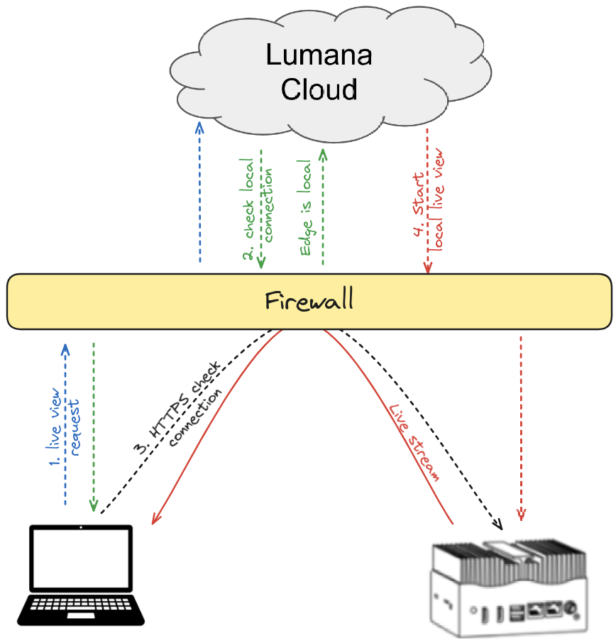

# Live view
Welcome to our guide on how to use the Live View feature. At Lumana, we are camera agnostic, which means our powerful AI can seamlessly integrate with any camera system. You can view real-time footage from your selected camera, regardless of its make or model. Follow these steps to make the most of your live viewing experience:

1. Navigate to the camera view page by clicking on the camera in the navigation bar.
2. Select the camera you wish to view live footage from.

3. Once the camera is selected, click the “Play” button to start streaming live footage.
4. You can also turn the Live view timeline into a playback video scrubbing by scrubbing footage, changing the date/time, and dragging the timeline.

**Other key features in live view settings**

Quality Control: In the bottom left corner of the live view, you can toggle between standard quality and high quality according to your preferences.

Zoom: On the right-hand side of the live view, you will find the zoom controls: a “+” (plus) button to zoom in and a “−” (minus) button to zoom out. Use these buttons to focus on specific areas of interest.

Snapshot: To capture a snapshot of the current view, simply click the camera icon.

Full-Screen Mode: If you wish to immerse yourself completely in the live view, select the option to expand the view to full-screen mode.
These steps and tips should help you make the most of Live View. If you encounter any issues or have questions, please don’t hesitate to contact our support team for assistance.

 

Working with Thumbnails in Live View
Efficiently managing your live stream video is paramount, and Lumana offers thumbnails as a quick and convenient way to navigate Live View. Thumbnails are powerful tools that enhance your ability to access, review, and share critical moments captured by your cameras.

 

On the live footage page, scroll down to access thumbnails.

Notice that you can scrub the footage directly on the thumbnails.
You have the option to set the time frame of the footage you’d like to view.
You can also configure the clip duration and resolution for each thumbnail.
The live stream of the camera will play in the bottom right-hand corner.
 

When you click on a thumbnail, you can perform the following actions:

Easily scrub through the footage.
Add cameras to initiate a Wall View.
Archive the footage for sharing (for more on archiving and sharing go to [Working with Lumana Archives](https://support.lumana.ai/hc/en-us/articles/13735010412306).)

Live streaming is a critical component in today's digital landscape, offering real-time access to video content across various platforms. In the context of Lumana, an advanced hybrid cloud video management system, live streaming plays a pivotal role in ensuring seamless surveillance, remote monitoring, and instant access to critical visual data.

The importance of live streaming on Lumana cannot be overstated, as it enables enterprises to monitor large-scale operations, respond to incidents in real-time, and maintain a continuous flow of information across distributed locations. Whether for security, operational efficiency, or compliance, live streaming provides a powerful tool for decision-making and situational awareness.

## Performance Considerations: Local vs. Cloud Streaming

One of the key factors influencing the performance of live streaming on Lumana is the positioning of the streaming source—whether it is hosted locally on-premises or in the cloud.

- **Local Streaming**: When streaming is managed locally, it primarily benefits from a stable, high-bandwidth network that isn't subject to the fluctuations often seen in broader internet connections. This stability allows for reliable, high-quality video streaming with minimal interruptions.

- **Cloud Streaming**: Cloud-based streaming, in contrast, requires a more elastic solution due to its reliance on external internet connections. While it provides greater scalability and remote accessibility—enabling users to access live streams from virtually anywhere—its performance can be more variable. Factors such as internet bandwidth, latency, and the quality of the cloud service provider can influence the overall streaming experience.

### Controlling the Quality of Live Streaming

Maintaining optimal quality in live streaming is essential to ensure that the footage is clear, smooth, and reliable. Lumana offers several mechanisms to control and enhance the quality of live streams, catering to varying network conditions and operational requirements:

- **Bandwidth Management**: Adaptive bitrate streaming is employed to adjust the quality of the video in real-time based on the available bandwidth. This ensures that viewers receive the best possible quality without buffering or interruptions, even in fluctuating network conditions.

- **Adaptive Resolution Control**: This adaptive approach ensures that the video quality is optimized in real-time, aligning with the allowed bandwidth to prevent buffering or interruptions. While higher resolutions offer better clarity, they also demand more bandwidth. By automatically adjusting the resolution to match the current network conditions, Lumana ensures a smooth and reliable streaming experience, even when bandwidth fluctuates.

- **Latency Optimization**: Low-latency streaming options are available to ensure that there is minimal delay between the live event and its broadcast, which is particularly important in time-sensitive scenarios

## Local Streaming on Lumana

Local streaming on Lumana allows the video feed from cameras to be forwarded directly to the accessing device without relying on the cloud. This method reduces the amount of internet traffic, providing a more high quality streaming experience, especially within a stable, high-bandwidth local network. Local streaming automatically engages when a core detects that it can connect directly to the viewing device, optimizing bandwidth usage and ensuring minimal latency.

### Requirements for Local Streaming
To enable local streaming on Lumana, several requirements must be met:

1. Direct access to the Core local IP

2. No proxy between the Client and Lumana Core

Note: A camera will be able to MQ local stream but not HQ local stream when it is configured for H265 but the end user is using an unsupported H265 browser and/or device.

### Local live view flow

When the Lumana live stream is accessed, the system attempts to switch to local streaming. If the device can reach the Lumana Core's private IP address and the necessary domains are allowed on the network, an HTTPS connection is established directly with the Lumana Core to start the live feed based on the configured quality

### Cloud Streaming on Lumana

Cloud streaming on Lumana enables video feeds from the Lumana Core to be accessed remotely, utilizing the cloud to relay the stream to the viewing device. This method is particularly beneficial for users who need to access live video from multiple locations or when local streaming isn't feasible due to network constraints. Cloud streaming ensures that the video feed is accessible from anywhere with an internet connection, providing flexibility and scalability while maintaining a consistent user experience.

Once live view request get a response that local isnt enable, Lumana initiated using WEBRTC protocol.

### WEBRTC and Its Role in Lumana Cloud Streaming

WEBRTC (Web Real-Time Communication) is a powerful technology designed to facilitate real-time communication directly within web browsers and mobile applications, eliminating the need for additional plugins. It enables high-quality, low-latency audio, video, and data exchange over the internet.

In Lumana cloud streaming, WEBRTC is employed to create an efficient and scalable solution for delivering live video feeds to multiple users simultaneously. When a live view request determines that local streaming isn't possible, Lumana initiates the WEBRTC protocol. Unlike traditional peer-to-peer connections, this implementation supports multiple users by utilizing Lumana cloud.

This approach minimizes the upload bandwidth required from the Lumana Core by distributing the video stream efficiently among all connected users. Each user receives the stream at a bandwidth tailored to their specific needs, ensuring that everyone experiences optimal video quality based on their network conditions and device capabilities. This scalability and adaptability make WEBRTC a novel and effective solution for Lumana’s cloud streaming, allowing for high-quality, real-time access to video feeds from anywhere.

 

### Managing Streaming Quality
Lumana provides flexible streaming options that allow users to choose between three quality levels: Standard Quality (SQ), Medium Quality (MQ), and High Quality (HQ). These options are available in both local and cloud streaming modes, offering users the ability to tailor the video quality to their specific needs and network conditions.

**Quality Selection and Stream Management**

When a live view is initiated, Lumana automatically selects the appropriate quality level based on the size of the viewing window and the number of streams the client is presenting. For example, in a video wall setup where multiple streams are displayed simultaneously, the system may default to SQ or MQ to prevent client-side rendering issues and ensure smooth performance.

Users also have the flexibility to manually adjust the streaming quality using a selector interface. This allows for quick switching between SQ, MQ, and HQ modes, depending on the user’s immediate needs. For instance, if a user needs to closely inspect a particular stream, they can switch to HQ for maximum clarity. Conversely, if network bandwidth is limited, they may opt for SQ to maintain a stable connection.

In the example above, Lumana assigned medium quality to the top cameras, while the lower ones were set to SQ settings. As shown in the top right view, hovering over the stream allows you to change the stream quality.

**Bandwidth and Resolution Specifications for Streaming Modes**

In this chapter, we’ll outline the bandwidth and resolution specifications for each streaming quality mode (SQ, MQ, HQ) based on different Lumana Core resolutions. This information helps users understand the trade-offs between video quality and bandwidth usage, enabling better decision-making when configuring their streaming settings.

 

| Native resolution | Quality    | Resolution | Estimated bitrate |
| ----------------- | ---------- | ---------- | ----------------- |
| 3480x2160 (8MP)   | HQ (Local) | 3480x2160  | 5.12 mbps         |
| 3480x2160 (8MP)   | HQ (Cloud) | 1920x1080  | <3 mbps           |
| 3480x2160 (8MP)   | MQ         | 960x540    | <0.8 mbps         |
| 3480x2160 (8MP)   | SQ         | 426x240    | <0.2 mbps         |
| 2880x1620 (5MP)   | HQ (Local) | 2880x1620  | 3.5 mbps          |
| 2880x1620 (5MP)   | HQ (Cloud) | 1920x1080  | <3 mbps           |
| 2880x1620 (5MP)   | MQ         | 960x540    | <0.8 mbps         |
| 2880x1620 (5MP)   | SQ         | 426x240    | <0.2 mbps         |
| 2592x1944 (5MP)   | HQ (Local) | 2592x1944  | 3.5 mbps          |
| 2592x1944 (5MP)   | HQ (Cloud) | 1440x1080  | <3 mbps           |
| 2592x1944 (5MP)   | MQ         | 720x540    | <0.8 mbps         |
| 2592x1944 (5MP)   | SQ         | 320x240    | <0.2 mbps         |
| 2560x1440 (4MP)   | HQ (Local) | 2560x1440  | 3 mbps            |
| 2560x1440 (4MP)   | HQ (Cloud) | 1920x1080  | <3 mbps           |
| 2560x1440 (4MP)   | MQ         | 960x540    | <0.8 mbps         |
| 2560x1440 (4MP)   | SQ         | 426x240    | <0.2 mbps         |
| 1920x1080 (2MP)   | HQ (Local) | 1920x1080  | 2 mbps            |
| 1920x1080 (2MP)   | HQ (Cloud) | 1920x1080  | <2 mbps           |
| 1920x1080 (2MP)   | MQ         | 960x540    | <0.8 mbps         |
| 1920x1080 (2MP)   | SQ         | 426x240    | <0.2 mbps         |
| 1280x720 (HD)     | HQ (Local) | 1280x720   | 1.8 mbps          |
| 1280x720 (HD)     | HQ (Cloud) | 1280x720   | <1.8 mbps         |
| 1280x720 (HD)     | MQ         | 960x540    | <0.8 mbps         |
| 1280x720 (HD)     | SQ         | 426x240    | <0.2 mbps         |
 

