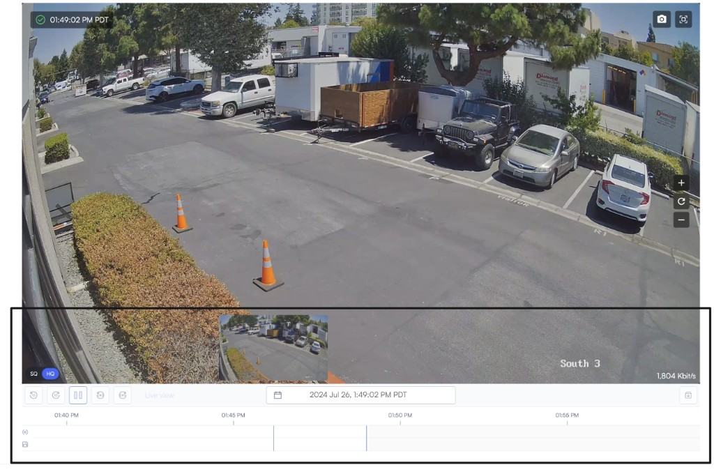

# Use live view

Use Live view to watch a camera in real time, adjust stream quality, capture snapshots, and move into related views such as playback or multi-camera layouts.

## Before you begin

Make sure the camera you want to view is added to Lumana and is online. You should also have access to the location and camera you want to open.

## Open live view

Open Live view when you want to watch a camera in real time and confirm what is happening at a location.

1. Open **Cameras**.
2. Select the location and camera you want to view.
3. Click **Play** to start the live stream.

## Use the timeline and thumbnails

Use the timeline and thumbnails to review recent footage without leaving Live view.

1. Scroll below the player to open the thumbnails section.
2. Scrub the thumbnail or the main timeline to move through recent footage.
3. Change the date, time range, clip duration, or resolution as needed.

## Use live view controls

Use the player controls to change the stream view and capture the footage you need during live monitoring.

* **Quality control:** In the bottom left corner of Live view, you can toggle between available stream qualities.
* **Zoom:** On the right side of Live view, use the plus "**+**" icon to zoom in and the minus "**-**" icon to zoom out.
* **Snapshot:** Click the camera icon to capture a snapshot of the current view.
* **Full-screen mode:** Click the full-screen icon to expand the player.

## Use thumbnail actions

Use thumbnails to navigate Live view and review captured moments more quickly. They help you access footage, scrub through recent activity, and take follow-up actions such as archiving or opening related views.

1. Scroll down on the live footage page to open the thumbnails section.
2.  Click a thumbnail to open the selected clip.

    The selected thumbnail opens with playback controls and available actions.
3. Use the available actions to scrub through the footage, add cameras to a video wall layout, or archive footage to share it later.

## Next steps

If you want to understand how Lumana delivers live video, check out the pages:

* Read [Understand live view streaming and quality](understand-live-view-streaming-and-quality.md) to learn how local and cloud streaming work.
* Use [Multi-camera playback](multi-camera-playback.md) to review more than one camera at the same time.
* Use [Video walls and shared displays](video-walls-and-shared-displays.md) to monitor multiple cameras in one layout.
