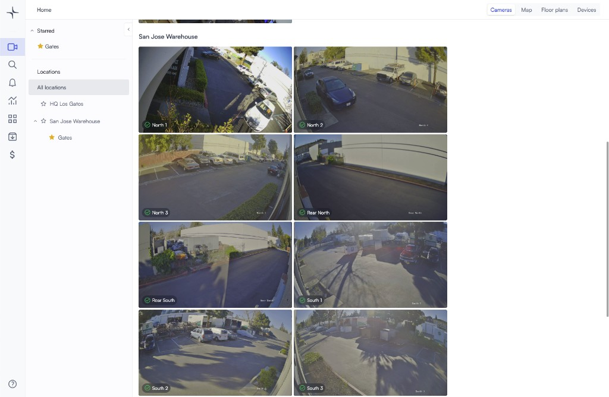
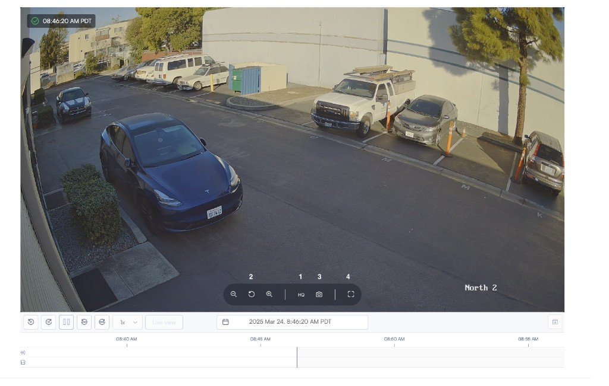

# Use live view

Use Live view to watch a camera in real time, adjust stream quality, capture snapshots, and move into related views such as playback or multi-camera layouts.

## Before you begin

Make sure the camera you want to view is added to Lumana and is online. You should also have access to the location and camera you want to open.

## Open live view

Open Live view when you want to watch a camera in real time and confirm what is happening at a location.

1. Open **Cameras**.
2. Select the location and camera you want to view.
3. Click **Play** to start the live stream.

## Use the timeline and thumbnails

Use the timeline and thumbnails to review recent footage without leaving Live view.

1. Scroll below the player to open the thumbnails section.
2. Scrub the thumbnail or the main timeline to move through recent footage.
3. Change the date, time range, clip duration, or resolution as needed.

## Use live view controls

Use the player controls to adjust the view and capture what you need during live monitoring.

- Use the quality selector to switch between available stream qualities.
- Use the zoom controls to zoom in or out.
- Click the camera icon to capture a snapshot.
- Click the full-screen icon to expand the player.

## Use thumbnail actions

When you open a thumbnail, you can take follow-up actions without leaving the page.

- Scrub through the selected footage.
- Add cameras to start a video wall layout.
- Archive footage to share it later.

## Next steps

If you want to understand how Lumana delivers live video, read [Understand live view streaming and quality](understand-live-view-streaming-and-quality.md). If you need to review more than one camera at the same time, use [Multi-camera playback](multi-camera-playback.md) or [Video walls and shared displays](video-walls-and-shared-displays.md).