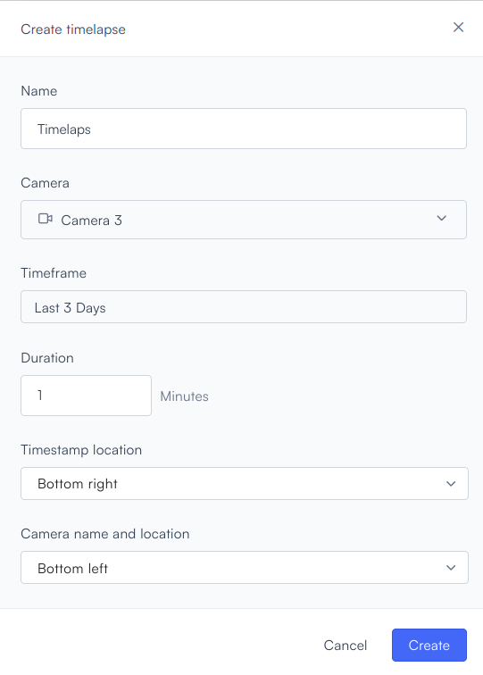
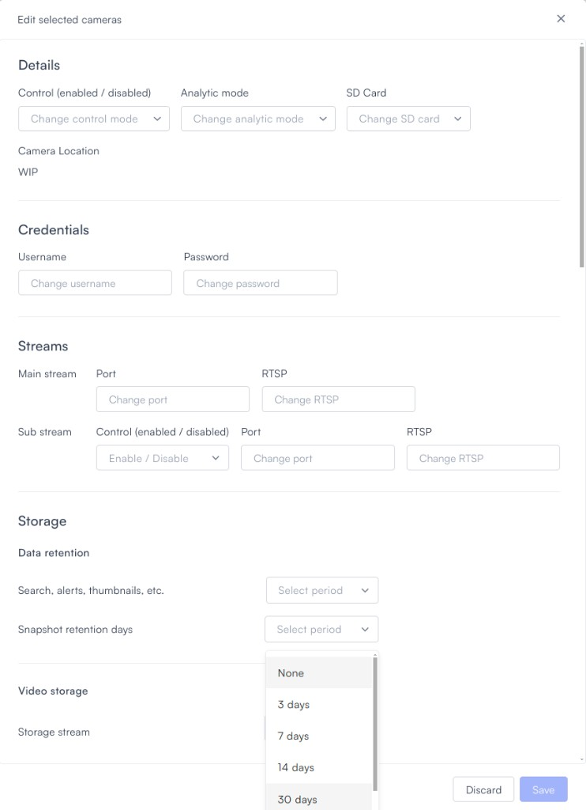

# Use Lumana timelapse

Use Lumana timelapse to review recent activity across a camera without scrubbing through full video manually. By default, timelapse is available for recent snapshots, and you can extend that retention window when you need a longer view.

## Before you begin

Make sure you can open the camera settings for the camera you want to use. You also need permission to change snapshot retention settings.

## Understand timelapse availability

Timelapse is enabled by default and is available for the most recent three days of retained snapshots.

Timelapse snapshots are not generated retroactively. If you increase retention today, then the system starts collecting additional days of timelapse snapshots from that point forward.

## Extend timelapse retention

You can extend timelapse retention up to 30 days when you need a longer review window.

1. Open the camera settings for the camera you want to update.
2. Adjust **Snapshot Retention Period** to the duration you want, up to 30 days.
3.  Save the settings.

    The new retention setting applies going forward.


Once you increase retention, additional snapshots begin collecting from that point. You must wait for time to pass before you can generate longer timelapse videos.


Once you understand the default window and the retention limit, you can decide whether the built-in range is enough for your workflow.

## Need more than 30 days?

If you need timelapse history longer than 30 days, contact Customer Support to discuss extended storage options.

## Next steps

After you review timelapse settings, you can continue with related playback and monitoring tasks.

* Use [Multi-camera playback](multi-camera-playback.md) to review recorded footage across multiple cameras.
* Use [Live view](live-view.md) to monitor cameras in real time.
