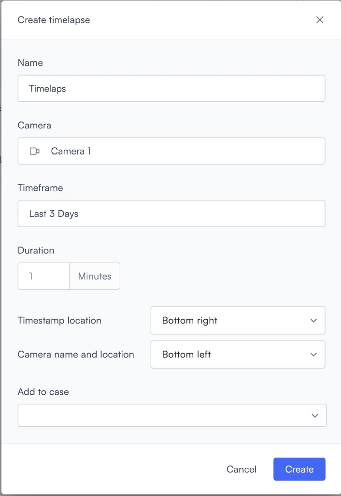
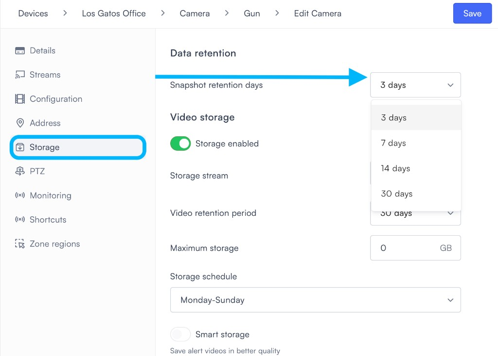

# Use Lumana timelapse

Use Lumana timelapse to review recent activity across a camera without scrubbing through full video manually. By default, timelapse is available for recent snapshots, and you can extend that retention window when you need a longer view.

## Prerequisites

Make sure you can open the camera settings for the camera you want to use. You also need permission to change snapshot retention settings.

## Understand timelapse availability

Timelapse is enabled by default and is available for the most recent three days of retained snapshots.


This is different from Verkada, which defaults to 24 hours.


Timelapse snapshots are not generated retroactively. If you increase retention today, then the system starts collecting additional days of timelapse snapshots from that point forward.

## Extend timelapse retention

You can extend timelapse retention on the camera **Storage** page when you need a longer review window.

1. Open **Devices**, select the camera you want, then open **Edit Camera**.
2. Select **Storage** in the sidebar.
3. Under **Data retention**, open **Snapshot retention days** and choose a period from the list. Options include **3 days**, **7 days**, **14 days**, **30 days**, or **90 days** when available.
4. Select **Save** in the upper right.

   The new retention setting applies going forward.


Once you increase retention, additional snapshots begin collecting from that point. You must wait for time to pass before you can generate longer timelapse videos.


Once you know the default window and the longest **Snapshot retention days** option in your deployment, decide whether the built-in range covers your workflow.

## Need longer history than snapshot retention allows?

If you need timelapse history beyond the maximum **Snapshot retention days** value available in your deployment, contact Customer Support to discuss extended storage options.

## Next steps

After you review timelapse settings, you can continue with related playback and monitoring tasks.

- Use [Multi-camera playback](multi-camera-playback.md) to review recorded footage across multiple cameras.
- Use [Live view](live-view.md) to monitor cameras in real time.