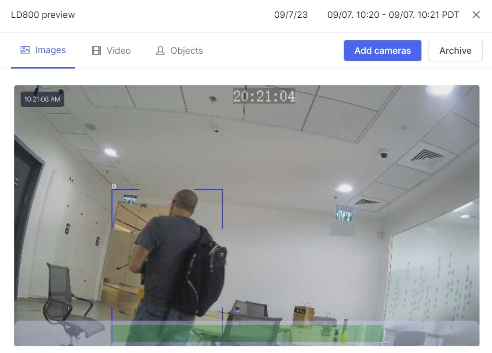
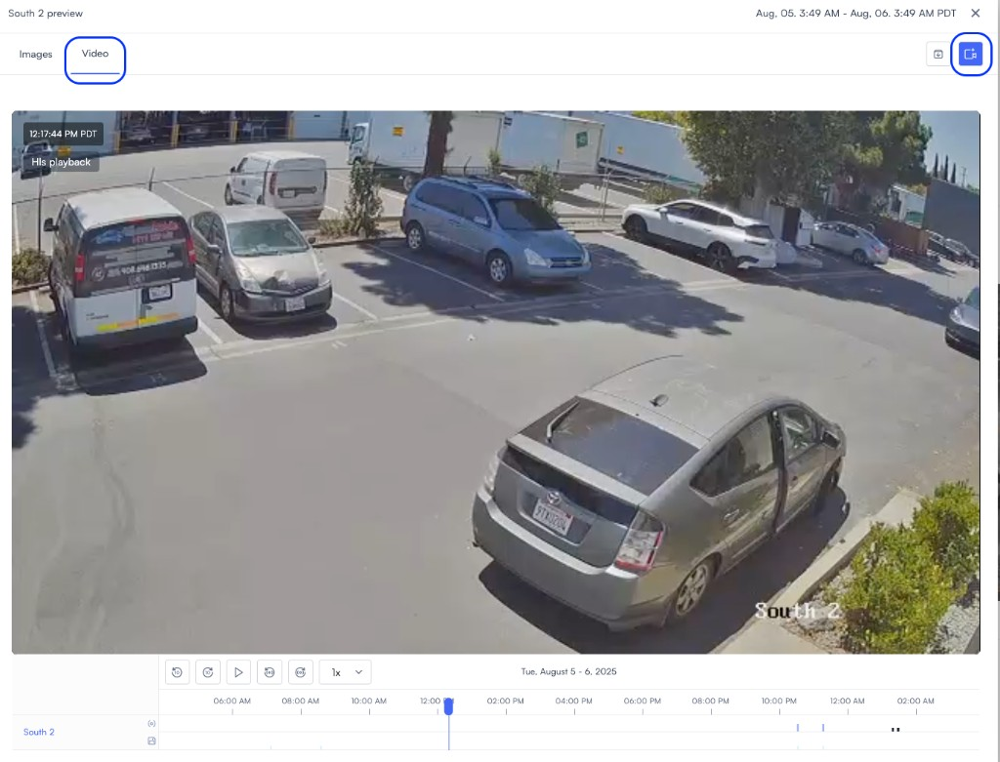
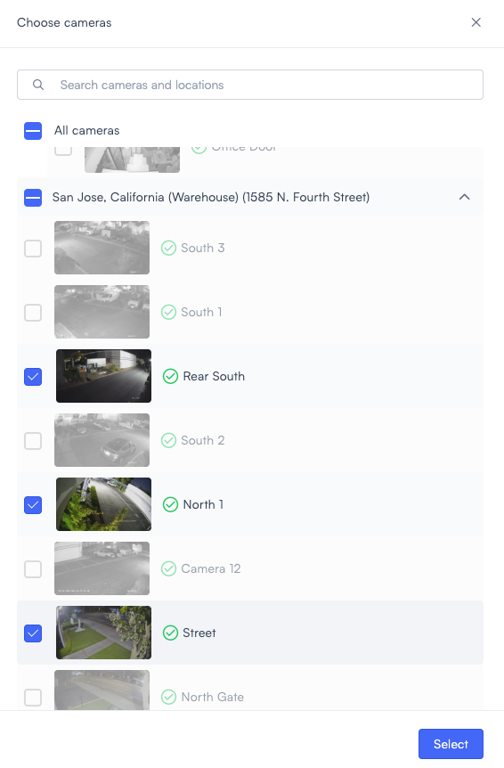
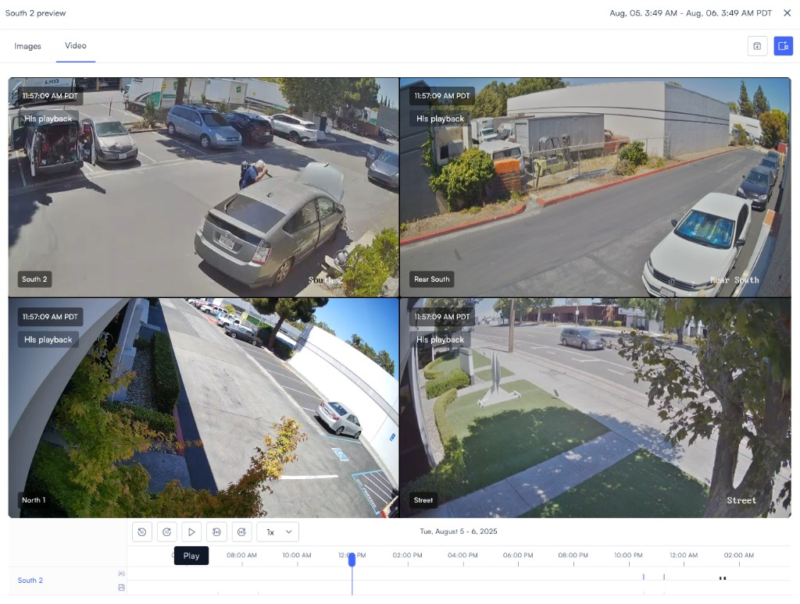
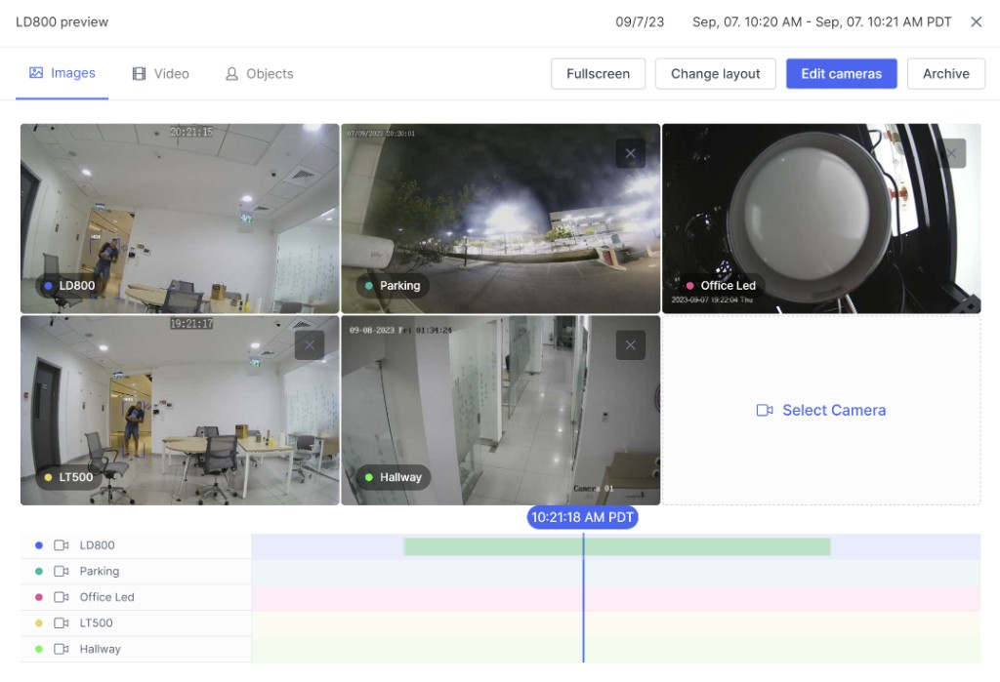

# Use multi-camera playback

Use multi-camera playback to review footage from up to four cameras on one synchronized timeline. This helps you compare activity across nearby cameras, reconstruct incidents, and confirm alerts without scrubbing each feed separately.

## Before you begin

Make sure the cameras you want to review have recorded footage for the time range you need. You also need access to the other cameras and locations you want to add.

You can start multi-camera playback from views that show thumbnails, such as camera feeds, search results, and alerts.

## Use multi-camera playback

Start from a camera preview, then open the video timeline and add more cameras to the same playback session.

1. Open the camera you want to review and select the time range you need.
2. Click **Video**.

   The playback view opens and shows the multi-camera playback icon in the upper-right corner.

   

3. In the upper-right corner of the playback view, click the  **multi-camera playback** icon.

4. Select up to three additional cameras, then click **Select**.

   The chooser lets you search cameras and locations before you add them.

   

5. Review the synchronized playback view.

   All selected cameras stay on one timeline. You can scrub across the incident, change playback speed, and export footage to the archive.

   

   > **Note:** In search-based playback, a green highlight on a camera timeline marks frames where the searched object appears.

   

## Next steps

After you review synchronized footage, you can continue with related live monitoring tasks.

- Use [Live view](live-view.md) to monitor cameras in real time.
- Read [Video walls and shared displays](video-walls-and-shared-displays.md) to build saved or temporary camera layouts.